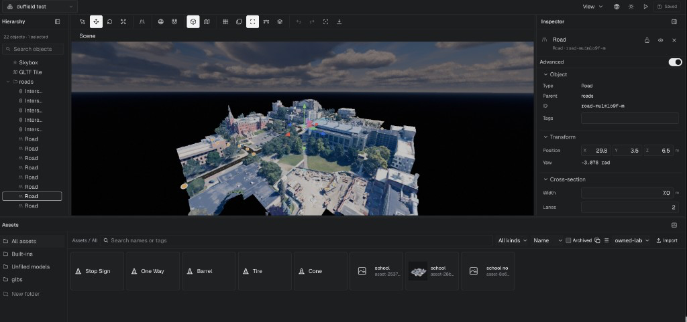
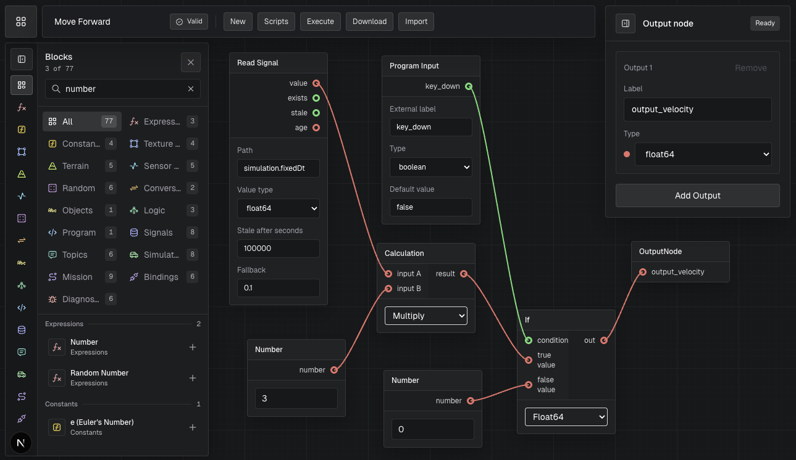
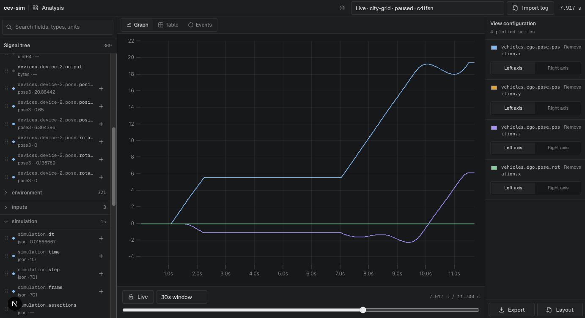
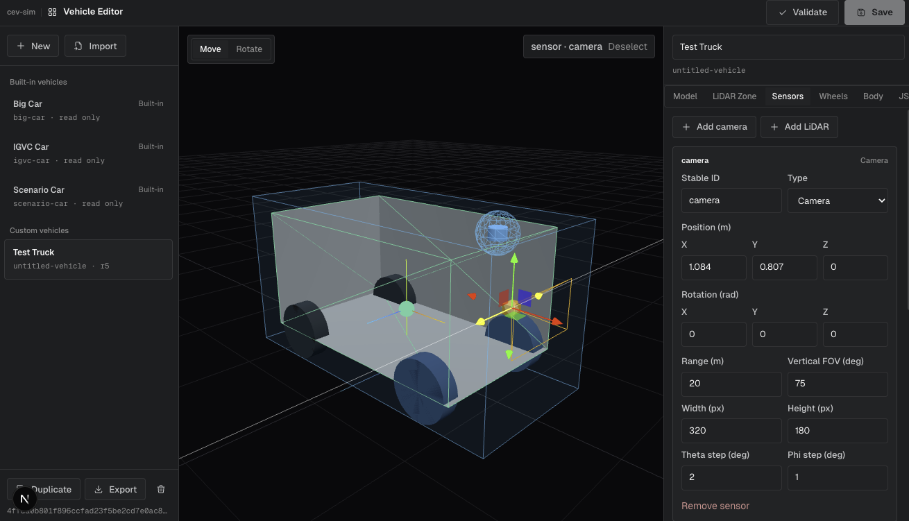

# ev-sim

This is our in-house simulation environment for testing and developing algorithms for autonomous driving. It is built on top of [three.js](https://threejs.org/) and provides a visual scripting interface for creating and running simulations.

## Quick Start

One-liner (clones the repo and installs dependencies):

```bash
curl -fsSL https://raw.githubusercontent.com/cornellev/ev-sim/main/install.sh | bash
```

Then:

```bash
cd ev-sim
npm run dev
```

Or install into a custom directory and start immediately:

```bash
curl -fsSL https://raw.githubusercontent.com/cornellev/ev-sim/main/install.sh | bash -s -- --dir ~/ev-sim --start
```

Already have the repo cloned?

```bash
npm install
npm run dev
```

## Headless simulation artifacts

The deterministic headless CLI/worker and Python Gymnasium adapter are built
as coordinated internal artifacts rather than published to npm or PyPI. Run
`npm run dist:headless` to produce the npm tarball, Python wheel/sdist,
compatibility manifest, and SHA-256 checksums. Teammates can download the
manual `Internal headless candidate` workflow artifact and install it without
the browser application. See [Headless release and CI gates](docs/headless-release.md)
and [Jetson deployment](docs/jetson-headless.md).

The app opens to the simulation workspace by default. Press `Escape` to open the app menu, where you can see options such as:

### Environment Editor



### Visual Scripting ("Canvas")



### Log Analysis and Telemetry



### Vehicle Editor



## Agent plugin (portable skill + MCP)

This repository is an [Agent Plugin](https://cursor.com/docs/plugins.md): root
[`plugin.json`](plugin.json), [`mcp.json`](mcp.json), and
[`skills/cev-sim/`](skills/cev-sim/). Importing it gives agents an auto-invoked
**cev-sim** skill and registers the Streamable HTTP MCP endpoint
`http://localhost:3000/mcp`.

**Import does not start the app.** Run `npm run dev` (or `npm start`) before
MCP discovery. Server id is always **`cev-sim`**.

Ways to load the plugin:

- Git URL / marketplace import of this repo
- Cursor CLI: `agent --plugin-dir /path/to/this/repo`
- Local copy or symlink into `~/.cursor/plugins/local/cev-sim`, then reload the window

Manual MCP-only fallback (without the plugin): see [MCP Server](docs/mcp.md).

Validate the portable bundle:

```bash
node skills/cev-sim/scripts/validate.mjs
```

## Documentation

- [Documentation index](docs/README.md)
- [Getting started](docs/getting-started.md)
- [Architecture](docs/architecture.md)
- [Headless release and CI gates](docs/headless-release.md)
- [Jetson headless deployment](docs/jetson-headless.md)
- [Environment editor](docs/environment-editor.md)
- [Earth import](docs/earth-import.md)
- [Visual layer implementation plan](docs/visual-layer-plan.md)
- [Development workflow](docs/development.md)
- [Visual scripting](docs/scripting/README.md)
- [Simulation](docs/simulation.md)
- [Telemetry, logging, replay, and analysis](docs/telemetry-logging.md)
- [ROS integration](docs/ros-integration.md)
- [MCP Server](docs/mcp.md) (agent tooling)
- [Assets](docs/assets.md)
- [Troubleshooting](docs/troubleshooting.md)

## CommonRoad Scenarios

Download scenarios from `https://gitlab.lrz.de/tum-cps/commonroad-scenarios` and place the `scenarios` folder in `public/`, creating `public/scenarios`.

Example browser path:

```text
/scenarios/DR_CHN_Merging_ZS_1_T_1.xml
```

See [Assets](docs/assets.md) for asset policy and setup details.

## License

The repository, headless npm artifact, and Python distribution are licensed
under the [Apache License 2.0](LICENSE).

## References

[M. Althoff, M. Koschi, and S. Manzinger, "CommonRoad: Composable Benchmarks for Motion Planning on Roads," in Proc. of the IEEE Intelligent Vehicles Symposium, 2017, pp. 719-726.](http://mediatum.ub.tum.de/doc/1379638/776321.pdf)
