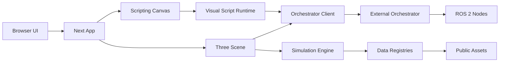

# Architecture

sensor-fusion is a Next.js app with two main user surfaces: a visual scripting canvas and a Three.js simulation scene. The browser app can also connect to an external orchestrator process for ROS-style topics.

## App Entry

`app/page.js` is the top-level browser entry. It starts in `scripting` mode, renders `app/scripting/Scripting.js`, and uses the `Escape` menu to switch to `app/3d/Scene.js`.

`server/App.js` is only used by `npm run start`. It prepares Next and serves all requests through Express.

## Scripting Layer

The scripting layer has two execution modes:

- Editor execution uses `ScriptManager.execute()` and live `UnitBlock` instances.
- Compiled execution uses `app/scripting/runtime/Compiler.js` to produce a versioned JSON artifact and `app/scripting/runtime/Runner.js` to run it without generated JavaScript or `eval`.

Built-in block classes are registered by `app/scripting/registerBuiltInBlocks.js`. The block library inventory lives in `app/scripting/UnitCatalog.js`, and `app/scripting/AddMenu.js` renders it as a searchable categorized sidebar.

## Simulation Layer

`app/3d/Scene.js` creates the Three.js scene, camera, renderer, input managers, and shared `Data` object. `Data` owns registries for vehicles, devices, objects, city data, physics, settings, the orchestrator client, and the simulation engine.

`app/simulation/SimulationEngine.js` owns the simulation loop. It supports play, pause, stop, fixed steps, speed changes, real-time vs fixed advancement, and module toggles for vehicles, sensors, controls, rendering, environment, scripting, and physics.

## External Integration

sensor-fusion does not embed ROS. `app/3d/managers/ClientManager.js` creates a browser client from `app/client/Client.js`, syncs message definitions from the external orchestrator Types API, then connects to the orchestrator WebSocket.

The orchestrator repo is at `/Users/jgrimminck/Coding/py/orchestrator`.

## Assets

Browser-served assets live under `public/`. Current important asset groups are:

- `public/messages/` for fallback `.msg` definitions.
- `public/shell.gltf` for model/optimizer experiments.
- `public/scenarios/` for local CommonRoad scenarios, which should not be committed.
