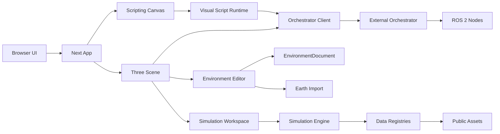

# Architecture

cev-sim is a Next.js app with two main user surfaces: a visual scripting canvas and a Three.js simulation scene. The browser app can also connect to an external orchestrator process for ROS-style topics.

```mermaid
flowchart LR
  userBrowser[Browser UI] --> nextApp[Next App]
  nextApp --> scriptingCanvas[Scripting Canvas]
  nextApp --> threeScene[Three Scene]
  threeScene --> simWorkspace[Simulation Workspace]
  threeScene --> envWorkspace[Environment Editor]
  scriptingCanvas --> scriptRuntime[Visual Script Runtime]
  simWorkspace --> simEngine[Simulation Engine]
  envWorkspace --> envDoc[EnvironmentDocument]
  envWorkspace --> earthImport[Earth Import]
  scriptRuntime --> orchestratorClient[Orchestrator Client]
  threeScene --> orchestratorClient
  orchestratorClient --> externalOrchestrator[External Orchestrator]
  externalOrchestrator --> ros2Nodes[ROS 2 Nodes]
  simEngine --> sceneData[Data Registries]
  sceneData --> assets[Public Assets]
```

## App Entry

`app/page.js` is the top-level browser entry. It renders either `app/scripting/Scripting.js` or `app/3d/Scene.js` depending on the active view. The `Escape` menu switches between scripting, the simulation workspace, and the environment editor.

The 3D scene has two modes (`app/3d/viewState.js`):

- **Simulation** (`THREE_D_MODES.SIMULATION`) — vehicles, sensors, physics, and scenario playback.
- **Environment** (`THREE_D_MODES.ENVIRONMENT`) — authoring static world content. See [Environment Editor](environment-editor.md).

`server/App.js` is used by both `npm run dev` and `npm run start`. It prepares Next, serves all page requests through Express, and mounts the storage API at `/api/storage` (see [development.md](development.md) for the storage backend).

## Scripting Layer

The scripting layer has two execution modes:

- Editor execution uses `ScriptManager.execute()` and live `UnitBlock` instances.
- Compiled execution uses `app/scripting/runtime/Compiler.js` to produce a versioned JSON artifact and `app/scripting/runtime/Runner.js` to run it without generated JavaScript or `eval`.

Built-in block classes are registered by `app/scripting/registerBuiltInBlocks.js`. The block library inventory lives in `app/scripting/UnitCatalog.js`, and `app/scripting/AddMenu.js` renders it as a searchable categorized sidebar.

## Simulation Layer

`app/3d/Scene.js` creates the Three.js scene, camera, renderer, input managers, and shared `Data` object. `Data` owns registries for vehicles, devices, objects, city data, physics, settings, the orchestrator client, the simulation engine, and (in environment mode) earth tile streaming and import controllers.

`app/simulation/SimulationEngine.js` is the browser adapter for the simulation
loop. It owns RAF pacing, rendering, overlays, viewport controls, GPU capture
throttling, and UI subscriptions. Authoritative fixed-step state transitions,
integer clock advancement, queued inputs, lifecycle telemetry, and pure state
snapshots live in `app/simulation/kernel/SimulationKernel.js`. A narrow runtime
context connects the kernel to the current vehicle, device, physics, script,
scenario, control, telemetry, and topic-routing services without exposing the
scene, renderer, DOM, or `Data` object. In environment mode the browser adapter
also drives `EarthTilesManager.update()` while Google 3D Tiles are loaded.

The kernel owns the run-scoped `prepare/reset/step/finalize/dispose`
lifecycle. Resets reconstruct component state and seeded streams, while
finalization returns pure assertion/scenario results and reverse-order
disposal releases run resources without destroying app-lifetime libraries.
Canonical state feeds a bounded SHA-256 trajectory chain. Full
`resolvedHash` identifies portable bundle bytes; the separate
`simulationSemanticHash` excludes logging, resource/artifact policy, wall
pacing, and presentation settings before episode identity is computed.

`app/simulation/world/WorldDescription.js` is the UI-independent world seam.
It normalizes schema-v2 environment documents into canonical
`cev-sim.world-description` v1 JSON with stable road/building/feature IDs,
drivable surfaces, exact obstacle prisms, aggregate bounds, route-network
identity, and a world SHA-256. The browser `EnvironmentLoader` materializes
that description into Three.js; `HeadlessWorldRuntime` retains only the pure
description and deterministic `{ worldHash }` state. Resolved bundles retain
the authored environment resource for integrity but use the world hash for
simulation semantics.

Vehicle motion is owned by the Three.js-free `KinematicVehiclePlant`.
BigCar, IGVCCar, ScenarioCar, and manifest-backed browser vehicles are
presentation adapters over the same numeric state used by
`HeadlessVehicleManager`; GLTF models, wheels, paths, cameras, lane visuals,
and devices remain browser services. `createHeadlessRuntimeContext` composes a
non-global binding runtime, signal store, scenario runtime, world, vehicle
manager, injected physics, state-sensor manager, and null browser services.
The direct sensor-disabled PR 4 kernel path remains supported.

PR 5 adds a Three.js-independent state-sensor seam. Browser devices and
`HeadlessStateSensorManager` share pure geodesy, fixed-step scheduling and
delivery calculations, and the deterministic IMU, GNSS, and wheel-odometry
measurement models. The headless backend capability is
`deterministic-state-sensors` version `1`, backend kind `STATE_SENSOR`; its
configuration hash is
`dc27525458e0f720321213cd0a1abac8842266ae86f3d82172d8cda518924cf5`.
Camera, LiDAR, and unknown enabled sensor types remain explicit unsupported
capabilities, while the sensor-disabled PR 4 kernel path remains valid.

`HeadlessEpisode` is the policy-facing facade over `SimulationKernel`. It
validates immutable episode prerequisites before kernel preparation, owns the
`measured-state` observation and `route-safety` reward profiles, maps the
`normalized-speed-steering` action through `ControlRuntime`, and implements
policy-step limits, action repeat, rewards, and Gym termination/truncation
semantics. Every repeated substep still passes through the authoritative
kernel phase graph, actuator delay/rate limits, state hashing, scenario
metrics, and sensor capture/delivery. This facade is reusable by the later
runner and supervisor milestones; it does not add a CLI, transport, Python
client, or process manager.

Physics pins Rapier `0.19.3` under capability
`rapier3d-swept-prism-v1`. Rapier owns fixed and kinematic bodies, while
authoritative first impact/contact transitions use shared continuous XZ SAT
with a Y-slab test. Feature boxes are oriented prisms, building footprints are
deterministically triangulated extrusions, and roads are drivable surfaces
rather than obstacle colliders.

The dependency-ordered extraction of a UI-independent kernel, CLI and worker
APIs, Python Gymnasium adapter, resource controls, and offscreen sensor
backends is specified in the
[Headless Simulation Implementation Plan](headless-simulation-plan.md).

## Environment Editor

The environment editor authors static world content through an `EnvironmentDocument` (roads, buildings, features, earth metadata). Runtime road/intersection entities retain UI compatibility aliases while their `sourceId` and canonical entity identity derive from document road/node IDs rather than array position. `EditorState` tracks three sub-modes within the editor: scene editing, 2D map authoring, and earth import.

- [Environment Editor](environment-editor.md) — document model, editor modes, baking, and chrome UI.
- [Earth Import](earth-import.md) — Google 3D Tiles preview, OSM road import, and geospatial configuration.

## External Integration

cev-sim does not embed ROS. `app/3d/managers/ClientManager.js` creates a browser client from `app/client/Client.js`, syncs message definitions from the external orchestrator Types API, then connects to the orchestrator WebSocket.

Orchestrator can be found from [this repository](https://github.com/cornellev/orchestrator).

## Assets

Browser-served assets live under `public/`. Current important asset groups are:

- `public/messages/` for fallback `.msg` definitions.
- `public/shell.gltf` for model/optimizer experiments.
- `public/scenarios/` for local CommonRoad scenarios, which should not be committed.
