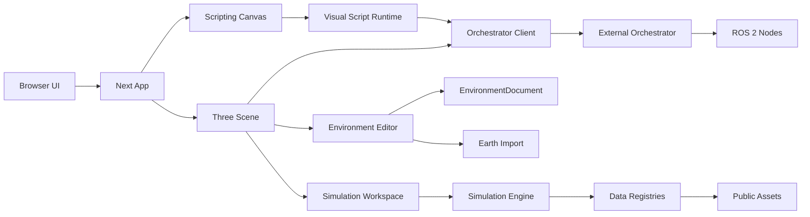

# Architecture

cev-sim is a Next.js app with two main user surfaces: a visual scripting canvas and a Three.js simulation scene. The browser app can also connect to an external orchestrator process for ROS-style topics.

```mermaid
flowchart LR
  userBrowser[Browser UI] --> nextApp[Next App]
  nextApp --> scriptingCanvas[Scripting Canvas]
  nextApp --> threeScene[Three Scene]
  threeScene --> simWorkspace[Simulation Workspace]
  threeScene --> envWorkspace[Environment Editor]
  scriptingCanvas --> scriptRuntime[Visual Script Runtime]
  simWorkspace --> simEngine[Simulation Engine]
  envWorkspace --> envDoc[EnvironmentDocument]
  envWorkspace --> earthImport[Earth Import]
  scriptRuntime --> orchestratorClient[Orchestrator Client]
  threeScene --> orchestratorClient
  orchestratorClient --> externalOrchestrator[External Orchestrator]
  externalOrchestrator --> ros2Nodes[ROS 2 Nodes]
  simEngine --> sceneData[Data Registries]
  sceneData --> assets[Public Assets]
```

## App Entry

`app/page.js` is the top-level browser entry. It renders either `app/scripting/Scripting.js` or `app/3d/Scene.js` depending on the active view. The `Escape` menu switches between scripting, the simulation workspace, and the environment editor.

The 3D scene has two modes (`app/3d/viewState.js`):

- **Simulation** (`THREE_D_MODES.SIMULATION`) — vehicles, sensors, physics, and scenario playback.
- **Environment** (`THREE_D_MODES.ENVIRONMENT`) — authoring static world content. See [Environment Editor](environment-editor.md).

`server/App.js` is used by both `npm run dev` and `npm run start`. It prepares Next, serves all page requests through Express, and mounts the storage API at `/api/storage` (see [development.md](development.md) for the storage backend).

## Scripting Layer

The scripting layer has two execution modes:

- Editor execution uses `ScriptManager.execute()` and live `UnitBlock` instances.
- Compiled execution uses `app/scripting/runtime/Compiler.js` to produce a versioned JSON artifact and `app/scripting/runtime/Runner.js` to run it without generated JavaScript or `eval`.

Built-in block classes are registered by `app/scripting/registerBuiltInBlocks.js`. The block library inventory lives in `app/scripting/UnitCatalog.js`, and `app/scripting/AddMenu.js` renders it as a searchable categorized sidebar.

## Simulation Layer

`app/3d/Scene.js` creates the Three.js scene, camera, renderer, input managers, and shared `Data` object. `Data` owns registries for vehicles, devices, objects, city data, physics, settings, the orchestrator client, the simulation engine, and (in environment mode) earth tile streaming and import controllers.

`app/simulation/SimulationEngine.js` is the browser adapter for the simulation
loop. It owns RAF pacing, rendering, overlays, viewport controls, GPU capture
throttling, and UI subscriptions. Authoritative fixed-step state transitions,
integer clock advancement, queued inputs, lifecycle telemetry, and pure state
snapshots live in `app/simulation/kernel/SimulationKernel.js`. A narrow runtime
context connects the kernel to the current vehicle, device, physics, script,
scenario, control, telemetry, and topic-routing services without exposing the
scene, renderer, DOM, or `Data` object. In environment mode the browser adapter
also drives the environment-owned tile session through
`EnvironmentTileHost.update(camera, viewport)` while Google 3D Tiles are
loaded.

The kernel owns the run-scoped `prepare/reset/step/finalize/dispose`
lifecycle. Resets reconstruct component state and seeded streams, while
finalization returns pure assertion/scenario results and reverse-order
disposal releases run resources without destroying app-lifetime libraries.
Canonical state feeds a bounded SHA-256 trajectory chain. Normalized
`resolvedHash` identifies resolved content; exact `bundleBytesHash` identifies
received serialized bytes; the separate
`simulationSemanticHash` excludes logging, resource/artifact policy, wall
pacing, and presentation settings before episode identity is computed.

`app/simulation/world/WorldDescription.js` is the UI-independent world seam.
It normalizes schema-v2, v3, and v4 environment documents into canonical
`cev-sim.world-description` v1, v2, or v3 JSON with stable source IDs,
drivable surfaces, exact obstacle/proxy geometry, aggregate bounds,
route-network identity, and a world SHA-256. V1 remains the legacy road world;
v2 adds compiled road geometry; v3 is selected only when a v2 asset pin has an
enabled metric product and adds world-space `assetProxies` plus
`metricWorldHash`. Schema v3 adds a server-owned `revision` and optional
`visualLayer` / `evidence` hash references; those fields are excluded from
`worldHash`. Schema v4 adds `document.objects`, the editor's authoring overlay
(names, hierarchy, locks, editor visibility) and optional
`document.assetMetrics@1`. Object presentation stays excluded, while the
metric snapshot is canonical world input. Built-in prop metric geometry comes
from the frozen table in
`app/3d/editor/objects/types/builtinProp.js`, the same table that feeds the
placement catalog, editor collision radii, and LiDAR semantic labels, so the
kernel never depends on runtime object-type registration. `accessHash` is provenance for preview materialization and
also stays out of `worldHash`, `visualLayerHash`, simulation-semantic identity,
and episode identity. The browser `EnvironmentLoader` rebuilds metric geometry
first, then materializes a preview-only visual layer; measured cameras,
registries, collision, and LiDAR skip preview objects. `HeadlessWorldRuntime`
retains only the pure description and deterministic `{ worldHash }` state.
Resolved bundles retain the authored environment resource for integrity but
use the world hash for simulation semantics.

The canonical road domain also owns lane layout and sparse edge-to-edge turn
rules. `app/roads/RoadLaneModel.js` is the DOM/Three-free source shared by
route verification and SVG map rendering; since ED-05 it reads lanes as
implicit (derived from lane count and direction) or explicit (`edge.lanes[]`
with stable ids, per-lane directions and widths, and optional interior
markings), keeping every historical expression for implicit edges so their
hashes never move. `app/roads/RoadJunctionValidation.js` decides movement
feasibility (lane directions plus a lane-to-lane connector inside the compiled
junction) for the editor matrix, turn-rule writes, pruning, and route v7.
Turn rules and route lane anchors are semantic: they change road/world or
waypoint hashes respectively; explicit lane `{ id, direction, width }` is
metric while markings are appearance-only. Raw
waypoint pointer coordinates remain editor state and are excluded from saved
scenario identity. Route algorithm version 5 treats fixed physical lanes as
A* state rather than post-processing preferences, carries incoming edge,
direction, and lane through every waypoint, and freezes road-arm entry/exit
subnodes plus bounded junction connectors in the canonical proof. Editable
version-3/4 proofs require re-verification; immutable bundles use explicit
version-scoped compatibility validation.

Vehicle motion is owned by the Three.js-free `KinematicVehiclePlant`.
BigCar, IGVCCar, ScenarioCar, and manifest-backed browser vehicles are
presentation adapters over the same numeric state used by
`HeadlessVehicleManager`; GLTF models, wheels, paths, cameras, lane visuals,
and devices remain browser services. `createHeadlessRuntimeContext` composes a
non-global binding runtime, signal store, scenario runtime, world, vehicle
manager, injected physics, composite state/LiDAR sensor manager, and null
browser services.
The direct sensor-disabled PR 4 kernel path remains supported.

PR 5 adds a Three.js-independent state-sensor seam. Browser devices and
`HeadlessStateSensorManager` share pure geodesy, fixed-step scheduling and
delivery calculations, and the deterministic IMU, GNSS, and wheel-odometry
measurement models. The headless backend capability is
`deterministic-state-sensors` version `1`, backend kind `STATE_SENSOR`; its
configuration hash is
`dc27525458e0f720321213cd0a1abac8842266ae86f3d82172d8cda518924cf5`.
Camera and unknown enabled sensor types remain explicit unsupported
capabilities, while the sensor-disabled PR 4 kernel path remains valid.

`HeadlessEpisode` is the policy-facing facade over `SimulationKernel`. It
validates immutable episode prerequisites before kernel preparation, owns the
`measured-state` observation and `route-safety` reward profiles, maps the
`normalized-speed-steering` action through `ControlRuntime`, and implements
policy-step limits, action repeat, rewards, and Gym termination/truncation
semantics. Every repeated substep still passes through the authoritative
kernel phase graph, actuator delay/rate limits, state hashing, scenario
metrics, and sensor capture/delivery. This facade is reusable by the later
runner and supervisor milestones; it does not add a CLI, transport, Python
client, or process manager.

PR 6 adds `server/headless/HeadlessRunner.js` as the single-process owner of
portable-bundle verification, episode lifecycle, normalized action streams,
machine results, and guaranteed teardown. The [`cev-sim` CLI](headless-cli.md)
exposes validate, inspect, run, and policy-tape replay without Express, Next,
DOM, or WebGL. It publishes core JSON and native SFLog through an injected
artifact sink and sibling-directory atomic rename. `RecordingController`
retains HTTP as its browser transport and accepts a direct `LogService`
transport for headless execution.

PR 7 extracts that lifecycle into `HeadlessSession`, shared by the direct
runner and one non-detached Node child process per environment. The
[`headless batch supervisor`](headless-supervisor.md) dynamically loads the
authoritative proto, serves unary gRPC over a Unix socket or explicitly
selected insecure TCP, validates and prepares batches atomically, and fans out
reset/step/finalize commands concurrently while retaining stable index order.
The CLI can also use this process-isolated path transiently through
`validate --config` or `run --config`. Validation prepares a GPU bundle without
starting an episode; configured run streams one episode through the
supervisor-owned Chromium pool and publishes artifacts under the supervisor
batch layout.
Worker IPC uses request IDs and advanced serialization with one command in
flight. Operational RSS/heap, actor/sensor, observation, queue, artifact,
watchdog, and restart limits cannot alter simulation hashes. Crashes and
uncertain dispatches replace the process and require a reset; they are never
fabricated as RL transitions.

PR 8 adds the [`cev-sim` Python package](python-headless.md) as a synchronous
client (extended to protocol 1.2 by PR 11); it does not contain simulator logic. `CevSimEnv` maps a
single supervisor environment to Gymnasium, while `CevSimVecEnv` maps one
process-isolated batch to the Stable-Baselines3 `VecEnv` contract. Both use
strict NumPy/Protobuf codecs for measured spaces, preserve
terminal observations, and share deterministic reset-seed rules. A supplied
Unix or insecure TCP endpoint remains externally owned. Explicit local launch
creates a private Unix socket and owns batch, channel, supervisor process
group, descendant cleanup, and startup diagnostics. Generated Python bindings
come from the authoritative v1 proto and are checked for drift in CI.

PR 9 adds one `HeadlessExperimentService` to the Express process. Stateless
MCP server instances share that owner, which runs a durable FIFO queue with
one sequential headless worker at a time. Admission writes immutable
`headless-run-bundles/<resultId>/` sidecars plus a small
`headless-experiment-queue.v1.json` index; the browser Headless Runs workspace
controls the queue through `/api/headless`. The internal managed command is not a
gRPC/Protobuf surface: it drives `SimulationKernel` with resolved reference
controllers and no candidate actions. Managed GPU cases use the supervisor's
existing renderer IPC and unique environment scopes, await asynchronous capture
groups in fixed-step order, and keep tensors inline under the managed IPC limits.
Version-2 sidecar manifests bind exact case bytes and PBR asset/evidence ownership;
the authoring visual-asset store supplies durable result roots, independent active
pins, and closure-scoped readers. Recovery never re-resolves authoring documents
or replays an uncertain case. A Node-safe experiment metric collector
is shared with the browser controller. Final result revisions link immutable
run/semantic/episode/trajectory hashes and retained artifacts; SFLogs are
identity-checked and imported into the shared `LogService`, then linked into the
sidecar-only evidence index (suite/result/case plus final hashes). Browser experiment
execution and `run_manifest_launch` remain the defaults, while persisted
execution ownership routes headless status and cancellation. Manifest v10
candidate-model provenance changes definition/resolved hashes for lineage but is
projected out of simulation-semantic / episode / trajectory identity.

PR 10 adds a portable `cev-sim.lidar-geometry` v1 resource to resolved runs
only when an enabled `lidar3d` sensor exists. Canonical box and triangle twins
cover static world surfaces and actor-local vehicle geometry; the browser GLSL
object database and headless CPU backend share their constructors and stable
semantic/instance registry. The resource hash participates in resolved and
simulation-semantic identity, but the existing world hash and physics contract
do not change. Workers verify portable records and rebuild BVHs locally.

The `deterministic-cpu-bvh-lidar` v1 backend lazily imports Three.js and
`three-mesh-bvh`, keeps one immutable static index and reusable actor-local
indexes, and performs instantaneous fixed-step scans from capture-time poses.
LiDAR products use the existing metric-v2 and PointCloud2 paths and flow to
scripts, telemetry, topics, and SFLog. `MeasuredStateObservationBuilder`
continues to consume only IMU, GNSS, wheel odometry, and task signals.

PR 11 adds one supervisor-owned `PooledGpuRenderer`. It dynamically imports
`playwright-core` only when an operator configures Chromium, probes a
hardware-backed WebGL2/ANGLE stack, owns one browser page and a fixed context
pool, and caches canonical analytic render scenes by resource hash. Workers
remain authoritative for fixed-step capture time, ordering, transforms, RNG,
latency, queues, and sync groups; immutable capture groups cross the renderer
bridge and are published atomically. The async kernel entry point awaits this
sensor phase at the same ordering point while synchronous browser, state-only,
and CPU-LiDAR paths remain intact.

Protocol 1.2 adds the opt-in `measured-perception` profile and local
`grpc+unix+shared-memory-v1` transport. Per-environment private file-backed
arenas carry tensors of at least 64 KiB through validated, three-generation
references; smaller tensors and all protocol 1.1/TCP responses stay inline.
Python maps each arena read-only and copies before returning NumPy arrays.
Camera RGBA and LiDAR range/incidence are measured policy inputs, while depth,
semantic/instance IDs, detections, and other oracle products remain excluded.
GPU crashes, timeouts, context loss, and invalid arena state use the existing
infrastructure-failure and reset-required boundary.

PR 12 adds an operational release layer without changing the kernel or any
versioned simulation contract. `ReleaseReports.js` defines machine-readable
parity, benchmark, soak, and release-manifest records. Cross-platform CI
drives the same resolved state/CPU-LiDAR cases through the browser adapter,
direct session, CLI, UDS supervisor, and Python client. Scheduled lanes own
long reset/memory/process/log soaks, 1/8/16/32-environment benchmarks, and
capability-gated x64 NVIDIA/Jetson hardware checks. A staging builder produces
an installable headless npm tarball and pure-Python wheel/sdist while the
browser application root remains private. See [Headless release and CI gates](headless-release.md).

Physics pins Rapier `0.19.3` under one of two world-derived capabilities.
Legacy worlds retain `rapier3d-swept-prism-v1`: authoritative first impact uses
continuous XZ prism SAT with a Y-slab test. A world with collision asset proxies
selects `rapier3d-swept-compound-v2`, whose shared `SweptConvex` path performs
continuous 3D SAT for a translating vehicle AABB against static convex faces,
edges, and box axes after swept-AABB broad phase. Compound-part hits collapse
to the environment instance id with deterministic earliest-contact ordering.
Rapier still owns fixed and kinematic bodies; roads remain drivable surfaces.

The dependency-ordered extraction of a UI-independent kernel, CLI and worker
APIs, Python Gymnasium adapter, resource controls, and offscreen sensor
backends is specified in the
[Headless Simulation Implementation Plan](headless-simulation-plan.md).

## Environment Editor

The environment editor authors static world content through an `EnvironmentDocument` (road nodes, edges, turn rules, buildings, features, optional geographic frame/source records, and the schema-v4 `objects` overlay). Every edit is a `CommandBus` command or gesture that commits one `ChangeSet`; the `SceneProjector` applies change sets incrementally to runtime meshes, registry entities, chunks, LiDAR truth, and browser tile-source ownership (roads rebuild only their local closure), so a drag never rebuilds the world. Selection is a shared `SelectionStore` of object ids; runtime road/intersection entities are keyed `road:<edgeId>` / `intersection:<nodeId>` (index aliases exist only after a full load). Scene and Map are persistent editor views. Earth import and georegistration are transient drafts, and persisted legacy `earth-import` state normalizes to Scene. Since ED-09 the editor workspace, creation dialog, Earth import, and georegistration chrome are on by default. Schema v4 remains the only writer; world-description and route-proof dispatch are unchanged.

ED-04 dispatches roads by `document.roads.geometryVersion`. Missing means
legacy v1 and retains the existing world-description v1 and route-algorithm v5
identities. Version 2 stores stable knots and relative Bézier handles, then the
kernel-safe `app/roads/` compiler resolves one deterministic indexed plan for
Scene, Map, world-description v2, route algorithm 7, paved-union checks,
browser truth, portable LiDAR, and analytic render primitives. V2 metric roads
contain resolved controls without editor ids/modes; resource validation
recompiles indexed surfaces from those controls. Route v7 (ED-05; v6 before
explicit lanes) measures XZ arc distance while preserving vertex elevation,
binds stable lane ids on anchors and proof steps, and rejects broken explicit
anchors. The first geometry command performs the v1→v2 migration atomically;
ordinary legacy edits do not. Version-aware environment writes declare `[1,
2]`, and storage retains one pre-road-geometry migration copy.

ED-05 lane authoring keeps the road strip and every implicit-lane hash
untouched: explicit `lanes[]` appear on an edge only after its first lane
command, canonicalize back to implicit when they equal the derived default,
and enter the metric record (and therefore `roadNetworkHash`/`worldHash`) only
when present. The inspector's `RoadDisplay` cross-section, the Map lane
dividers/arrows/highlight, scene markings, MCP `environment_edit_road` lane
operations, and route v7 all read the same `roadLanes(edge)` model.

ED-08 adds optional `geoFrame@1` (`wgs84-local-tangent`, east/up/south) and an
independently versioned Earth source v2. `app/geography/GeoFrame.js` is the
graphics-free implementation shared by OSM drafts, bounds, migration, and the
Google tile-root matrix; legacy Mercator remains unchanged until an explicit
Roads-only or Whole-environment migration command commits. Road source records
retain OSM provenance through authoring but metric normalization removes them,
so existing road/world/route identities do not change. Source-aware writers
declare `supportedEditorSourceVersions: [1]`; storage rejects lossy full
replacement and retains the first pre-georegistration manifest.

`RoadImportService` fetches, clips, simplifies, and compiles plain road drafts
without document access. It clips every WGS84 segment before simplification,
connects only genuine shared OSM references, protects grade separation and
boundary identities, and reports unsupported lanes/junctions. `applyRoadImport`
commits Add, Replace, or tiles-only results through one expected-version
command. Creation similarly sends one complete `initialManifest` for Blank,
Google, or GLTF and storage commits revision 1 atomically.

`EnvironmentTileHost` is a browser runtime owned by the loaded environment.
Its provider session transfers from preview on Apply, reconciles only through
the tile-source projector/full loader, uses the current camera and drawing
buffer, and survives ordinary view or workspace changes. `TileAoiPlugin`
prunes disjoint hierarchy branches before loading and cache pressure adjusts
effective screen-space error without changing saved quality. Google trees are
excluded from the environment registry, placement, collision, LiDAR, bake,
measured-camera, asset-assembly, and packaging paths. GLTF Tiles are instead
`tile@2` asset-backed objects and use the centralized asset binding, immutable
revision pins, transforms, metric snapshots, and projectors used by asset
instances.

ED-06 layers a mutable editor catalog over immutable source-bound visual-asset
use records. `EditorAssetStore` owns one revision-guarded
`editor-assets/catalog.json`, immutable revision pointers, recoverable
publication journals, and per-revision model/thumbnail roots. It never copies
the VIS-04 source, digest, media, or dependency graph. Binary import uses the
existing upload and closure-validation APIs; the pure `GltfImportPlan` rewrites
selected local dependencies to digest URIs without network access. Saved
environment references are discovered by scanning schema-v4 documents rather
than maintaining a second index.

Asset instances are object-graph-v1 records whose catalog revision and model
revision are independent: commands pin `{ assetId, revision }`, and only an
explicit guarded update changes existing instances. V1 revisions retain
`asset-instance@1` behavior. ED-07 v2 revisions use `asset-instance@2`; the
same command writes an immutable metric snapshot to `document.assetMetrics@1`.
`SceneProjector` keeps appearance leases under editor-only registry ids and a
separate metric projector registers compiled collision/LiDAR records by
instance id for Simulation. Runtime bounds/status notifications do not dirty
autosave.

Each asset tab owns an isolated definition document, command adapter, history,
selection, asynchronous-generation version, save baseline, and view state.
`AssetCompiler` resolves exact child pins, namespaces flattened descendants,
compiles deterministic indexed metric products, and detects stale generated
output from geometry inputs. Server publication independently recompiles a
VIS-compatible GLB and metric snapshot after validating source/child rights,
then atomically journals all protective roots. It never updates environment
instances. During selected PBR resolution, `AssetVisualLayerCompiler` converts
published v2 appearance pins into ordinary visual-layer v1 records and composes
them with any already selected descriptor after world binding and source locks
pass. Prepared browser/headless runs own this immutable scene and never read a
studio preview.

- [Environment Editor](environment-editor.md) — document model, editor modes, baking, and chrome UI.
- [Earth creation and road import](earth-import.md) — atomic source creation, clipped OSM drafts, georegistration, live Google sessions, and GLTF Tiles.
- [Visual Layer Contracts](visual-layer.md) — frozen visual descriptors, exact-byte integrity, source policy, camera products, and future package admission.
- [Visual Layer Implementation Plan](visual-layer-plan.md) — `VIS-*` photoreal fidelity layer, hashed assets, and optional Google/3DGS tracks.

VIS-01 froze kernel-safe contracts and additive protobuf declarations.
VIS-12a activates run-manifest v11, `world-bound@2` semantic/episode identity
and protocol 1.3 while retaining immutable v10 execution. Full authoring locks
are validated before schema-aware world/scenario projection, including the
default browser profiles. Byte verification is separate from authoring import
and executable capability validation. VIS-02 dispatches exact camera render
provider ID/version. Newly created cameras author `canonical-analytic@1`;
absent `render` blocks remain the legacy analytic alias during resolution.
`canonical-analytic@2` remains unavailable. VIS-12b separates provider
resolution support from runtime availability: `pbr-mesh@1` can resolve to an
immutable render/asset/evidence closure for export and integrity-only
inspection. VIS-14 makes it available to browser simulation through an owned
render-runtime adapter. VIS-15a activates configuration-gated normal-worker
headless execution and backend v2 after target-specific probes. GPU sensor
backend v1 identity is unchanged and remains the analytic default.
VIS-03 stores environment schema v3 with a server revision and optional visual
descriptor/evidence hashes. Those references stay out of `worldHash`. VIS-04
stores validated visual-asset bytes and source-bound use records. VIS-05a
stores `cev-sim.visual-layer-access@1` sidecars and materializes owned preview
geometry in the display scene only. VIS-13a adds authoring-store
`cev-sim.run-package@1` export/import. VIS-13b adds protocol 1.4 same-host
admission with durable roots, batch pins, scoped digest readers, and exact
bundle-byte IPC. VIS-14 activates browser `pbr-mesh@1`: preparation builds
detached immutable PBR appearance and analytic-truth scenes from the resolved
closure, camera updates await aligned readback, and mutable editor/preview state
never enters capture. VIS-15a reuses that runtime in supervisor-owned Chromium,
with immutable prepared handles and explicit appearance/oracle/LiDAR routing.
VIS-05b streams AOI chunks through a renderer-scoped cache and
hashed LOD policy without changing `worldHash`, `visualLayerHash`, simulation
identity, or episode identity. Visual descriptors are appearance resources bound
to `worldHash`; their meshes never enter metric world, collision, LiDAR,
object-registry, or oracle truth.

VIS-06a adds `VisualCapturePipeline.js`, a Three/DOM-free calibration and
capture-input seam shared by browser camera, bake, and headless Chromium
adapters. It owns exact K-to-OpenGL projection, REP-103 optical conversion,
integer-nanosecond pose snapshots, row normalization, strict Brown-Conrady
warping, axial-depth decoding, and generation-stamped capture-scene handles.
Corrected adapters are opt-in as `calibrated-projection@1`; the active
`canonical-analytic@1`, GPU backend v1, legacy FOV/readback/request behavior,
manifests, hashes, and capabilities remain unchanged. VIS-06b adds aligned
`cev-sim.visual-capture-pass-set@1` families and a Three.js proxy-pass adapter.
Visual beauty/G-buffers use descriptor-backed bindings and source-use rights;
analytic depth/labels use a distinct truth scene and explicit truth bindings.
The opt-in corrected path is atomic and exception-safe, while legacy camera
and bake entry points are unchanged. VIS-07 adds an in-memory bake-job catalog,
frozen `bake-snapshot` scenes, deterministic capture plans, and local
`captured-appearance@1` dispatch. VIS-08 persists projected captured-radiance
PNG/GLB assets and atomically promotes environment visual references. VIS-09
authorizes blob reuse with content-addressed `bake-reuse-manifests` and
per-unit dependency keys; `sourceWorldHash` rebinds the layer without entering
those keys. VIS-10a defaults new persistent bakes to hashed `chunk-atlas@1`
construction, per-chunk atlas pages, sparse contribution codecs, and a durable
`bake-reuse` asset root. VIS-10b adds optional `bake-construction@2` intrinsic
fusion over strict supplied/inferred proposal buffers. Proposal provenance is
stored separately and bound through artifact-set v3 and the promotion receipt;
only final runtime textures enter the unchanged visual-layer descriptor.
Per-unit proposal digests extend reuse keys without entering world, semantic,
or episode identity. VIS-11 adds opt-in `intrinsic-material-model@1` and a
transport-only `bake-model-output-set@1`; those hashes stay out of episode
identity. Real inference is disabled until an operator pins model revision,
weights digest, and bounded service configuration. VIS-14 owns browser runtime
provider routing and VIS-15a implements configuration-gated normal-worker
headless routing. VIS-12b adds conditional selected-PBR resolution after every
authoring lock is verified. It rehashes the complete source-bound CAS use graph
under both display and machine-interpretation policy, then binds exact
`visualLayer` and `renderScene` pixel resources while retaining access,
obligations, and unverified correspondence references under separate resolved
evidence. PBR appearance meshes never enter metric world, collision, LiDAR, registry,
or oracle truth. ED-07 asset collision/LiDAR records enter through the separate
published metric snapshot and bind appearance to truth only when that instance
has compiled metric identity. Browser and PBR-enabled normal headless execution
revalidate and materialize the exact closure. CLI and Python can execute it only through a
same-host admitted package and a supervisor that advertises the declared GPU
backend v2 after target-specific probes pass. Bundle v1, manifest
v11, `world-bound@2`, protobuf, and existing analytic identities remain
unchanged. VIS-13a adds deterministic `cev-sim.run-package@1` export, strict
USTAR verification, and journaled authoring-store import. VIS-13b activates
protocol 1.4 package admission for configured Unix supervisors, CLI execution,
and Python while keeping TCP distribution and non-browser PBR execution unavailable.

## External Integration

cev-sim does not embed ROS. `app/3d/managers/ClientManager.js` creates a browser client from `app/client/Client.js`, syncs message definitions from the external orchestrator Types API, then connects to the orchestrator WebSocket.

Orchestrator can be found from [this repository](https://github.com/cornellev/orchestrator).

## Assets

Browser-served assets live under `public/`. Current important asset groups are:

- `public/messages/` for fallback `.msg` definitions.
- `public/shell.gltf` for model/optimizer experiments.
- `public/scenarios/` for local CommonRoad scenarios, which should not be committed.

Validated visual assets are stored under `CEV_SIM_DATA_DIR` (default
`server/data`) as:

- `visual-layer-descriptors/sha256/<hash>.json` — immutable visual-layer descriptors
- `visual-layer-access/sha256/<accessHash>.json` — source-bound access sidecars
- `environment-bake-promotions/<id>.json` — bake generation state and receipts
- `environment-bake-journals/<id>--<generation>.json` — promotion recovery journals
- `bake-reuse-manifests/sha256/<hash>.json` — immutable bake reuse authorization
- `bake-material-proposals/sha256/<hash>.json` — immutable intrinsic proposal provenance
- `visual-assets/sha256/<digest>` — immutable published bytes
- `visual-assets/uses/sha256/<useHash>.json` — source-bound use records
- `visual-assets/validation/sha256/<useHash>.json` — validation evidence
- `visual-assets/staging/`, `visual-assets/roots.json` (visual and `environment:<id>:bake-reuse`), `visual-assets/pins.json`
- `editor-assets/catalog.json` — revision-guarded ED-06 folders, metadata, latest revisions, and thumbnail pointers
- `editor-assets/revisions/<assetId>/<revision>.json` — immutable model-use revision pointers
- `editor-assets/transactions/` — recoverable catalog publication journals
- `visual-source-registry.json` or `CEV_SIM_VISUAL_SOURCE_REGISTRY`
- generated bake output source IDs from `CEV_SIM_BAKE_OUTPUT_SOURCE_IDS`

There is no public digest-only content URL and no published-asset deletion API.
