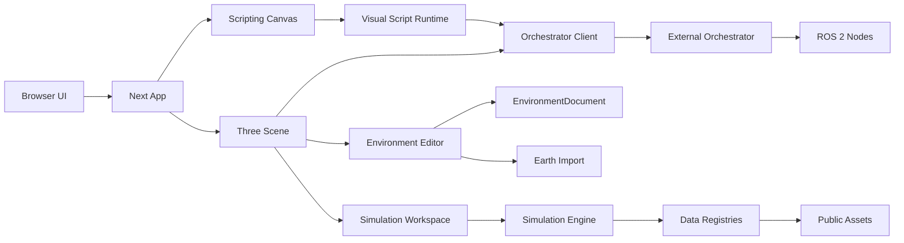

# Architecture

sensor-fusion is a Next.js app with two main user surfaces: a visual scripting canvas and a Three.js simulation scene. The browser app can also connect to an external orchestrator process for ROS-style topics.

```mermaid
flowchart LR
  userBrowser[Browser UI] --> nextApp[Next App]
  nextApp --> scriptingCanvas[Scripting Canvas]
  nextApp --> threeScene[Three Scene]
  threeScene --> simWorkspace[Simulation Workspace]
  threeScene --> envWorkspace[Environment Editor]
  scriptingCanvas --> scriptRuntime[Visual Script Runtime]
  simWorkspace --> simEngine[Simulation Engine]
  envWorkspace --> envDoc[EnvironmentDocument]
  envWorkspace --> earthImport[Earth Import]
  scriptRuntime --> orchestratorClient[Orchestrator Client]
  threeScene --> orchestratorClient
  orchestratorClient --> externalOrchestrator[External Orchestrator]
  externalOrchestrator --> ros2Nodes[ROS 2 Nodes]
  simEngine --> sceneData[Data Registries]
  sceneData --> assets[Public Assets]
```

## App Entry

`app/page.js` is the top-level browser entry. It renders either `app/scripting/Scripting.js` or `app/3d/Scene.js` depending on the active view. The `Escape` menu switches between scripting, the simulation workspace, and the environment editor.

The 3D scene has two modes (`app/3d/viewState.js`):

- **Simulation** (`THREE_D_MODES.SIMULATION`) — vehicles, sensors, physics, and scenario playback.
- **Environment** (`THREE_D_MODES.ENVIRONMENT`) — authoring static world content. See [Environment Editor](environment-editor.md).

`server/App.js` is only used by `npm run start`. It prepares Next and serves all requests through Express.

## Scripting Layer

The scripting layer has two execution modes:

- Editor execution uses `ScriptManager.execute()` and live `UnitBlock` instances.
- Compiled execution uses `app/scripting/runtime/Compiler.js` to produce a versioned JSON artifact and `app/scripting/runtime/Runner.js` to run it without generated JavaScript or `eval`.

Built-in block classes are registered by `app/scripting/registerBuiltInBlocks.js`. The block library inventory lives in `app/scripting/UnitCatalog.js`, and `app/scripting/AddMenu.js` renders it as a searchable categorized sidebar.

## Simulation Layer

`app/3d/Scene.js` creates the Three.js scene, camera, renderer, input managers, and shared `Data` object. `Data` owns registries for vehicles, devices, objects, city data, physics, settings, the orchestrator client, the simulation engine, and (in environment mode) earth tile streaming and import controllers.

`app/simulation/SimulationEngine.js` owns the simulation loop. It supports play, pause, stop, fixed steps, speed changes, real-time vs fixed advancement, and module toggles for vehicles, sensors, controls, rendering, environment, scripting, and physics. In environment mode it also drives `EarthTilesManager.update()` each frame while Google 3D Tiles are loaded.

## Environment Editor

The environment editor authors static world content through an `EnvironmentDocument` (roads, buildings, features, earth metadata). `EditorState` tracks three sub-modes within the editor: scene editing, 2D map authoring, and earth import.

- [Environment Editor](environment-editor.md) — document model, editor modes, baking, and chrome UI.
- [Earth Import](earth-import.md) — Google 3D Tiles preview, OSM road import, and geospatial configuration.

## External Integration

sensor-fusion does not embed ROS. `app/3d/managers/ClientManager.js` creates a browser client from `app/client/Client.js`, syncs message definitions from the external orchestrator Types API, then connects to the orchestrator WebSocket.

The orchestrator repo is at `/Users/jgrimminck/Coding/py/orchestrator`.

## Assets

Browser-served assets live under `public/`. Current important asset groups are:

- `public/messages/` for fallback `.msg` definitions.
- `public/shell.gltf` for model/optimizer experiments.
- `public/scenarios/` for local CommonRoad scenarios, which should not be committed.
