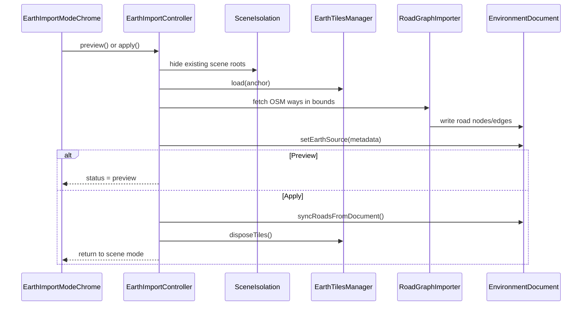

# Earth Import

Earth Import pulls real-world geography into an environment: Google Photorealistic 3D Tiles for visual preview, and OpenStreetMap roads (via Overpass) as editable road graph data in `EnvironmentDocument`.

Tiles are temporary. Roads and earth metadata persist after you Apply.

## Before you start

You need a Google Maps API key with access to the Map Tiles API (Photorealistic 3D Tiles). Add it to your local environment file:

```bash
# .env.local
NEXT_PUBLIC_GOOGLE_MAPS_API_KEY=your_key_here
```

Restart the dev server after changing this value. Next.js only inlines `NEXT_PUBLIC_*` variables when they are read as static property access in code — do not rename the variable.

Road fetching uses the public Overpass API at `overpass-api.de`. No key is required, but the service is rate-limited and best-effort.

## Using Earth Import

1. Open the **Environment Editor** (`Escape` → Environment Editor).
2. Open the editor menu and choose **Earth Import**.
3. Use the **OpenStreetMap** picker to pan/zoom and draw an import rectangle (toggle draw mode with the map icon, then click-drag on the map). You can expand the map for a larger view.
4. Review the selection summary (max edge length must stay within roughly 5 km). Use **Advanced Coordinates** if you need to type bounds manually.
5. Adjust tile quality if needed (screen-space error — lower is sharper, heavier).
6. Click **Preview** to load tiles and fetch roads without committing.
7. Review the 3D tile preview and toggle road visibility. A red vertical boundary marks the exact import bounds while tiles (which may extend beyond the box) are visible.
8. Click **Apply** to write roads into the runtime scene and save earth metadata, or press `Escape` to discard a preview.

The 2D map uses OpenStreetMap tiles for area selection only. **Preview** and **Apply** still load Google Photorealistic 3D Tiles and fetch roads from the public Overpass API inside the selected bounds.

### Map picker notes

- The import **anchor** is computed from the center of the drawn bounds when you preview or apply.
- Draw mode must be active before click-dragging a new rectangle on the map.
- OSM attribution appears on the map control; Google attribution appears after tiles load.
- `Escape` closes the expanded map before canceling preview or exiting the mode.

### Preview vs Apply

| Action | Tiles | Roads in document | Roads in 3D scene | Earth metadata |
|--------|-------|-------------------|---------------------|----------------|
| Preview | Loaded and visible | Staged (replaces existing) | Not synced yet | Written to document |
| Apply | Disposed after import | Committed | Synced via `RoadRuntimeAdapter` | Committed |
| Cancel (`Escape` during preview) | Disposed | Restored from backup | Unchanged | Restored from backup |

Preview takes a document snapshot before importing. If tile loading fails, the snapshot is restored automatically. If the public Overpass road fetch fails, the Google Earth tile side continues and roads are staged as empty.

## What happens under the hood

When you preview or apply, `EarthImportController` runs the same import pipeline. The only difference is what happens afterward.



### Scene isolation

While Earth Import is active, `EarthImportSceneIsolation` hides top-level scene children so you see only:

- The procedural sky (`TakramEnvironmentSky`, tagged `preserveInEarthImportMode`).
- The streamed Google Earth tile group (`GoogleEarthTiles`).
- The red import bounds outline (`EarthImportBoundsOutline`) during preview and tile loading.

Everything else — existing roads, buildings, props — is hidden until you leave the mode. Isolation stays active for the whole session, not just during tile loading.

During preview, `EarthImportBoundsOutline` draws a vertical red grid around the selected bounds in scene-local coordinates. The grid extends 100 m above the highest sampled tile geometry inside the bounds so it stays visible above photorealistic meshes. Google tiles often extend past the selected rectangle; the outline shows the exact area used for road import and metadata.

### Tile streaming

`EarthTilesManager` wraps `3d-tiles-renderer` with Google's `GoogleCloudAuthPlugin`. It:

- Validates the API key through `GoogleEarthTilesService` before loading.
- Positions tiles with `ReorientationPlugin` at the import anchor.
- Tags tile objects with `earthImportLayer`, `skipEnvironmentSelection`, and `bakeIgnore`.
- Collects Google attribution strings for display in the UI.

`SimulationEngine` calls `earthTilesManager.update()` on every render frame while tiles are loaded.

### Road import

1. **OverpassRoadProvider** posts an Overpass QL query for `highway` ways inside the bounds.
2. Ways are normalized to `{ id, tags, points[] }` in WGS84.
3. **RoadGraphImporter** simplifies each polyline (Douglas–Peucker), converts lat/lng to local scene coordinates relative to the anchor, and writes nodes/edges into the document.
4. Lane count and width are inferred from OSM tags where available.

Other road providers (`google`, `mesh`) appear in the UI as placeholders. Only `overpass` is implemented today.

### Coordinate systems

`GeospatialTransform.js` handles the math:

- **Local ground plane** — Web Mercator coordinates relative to the anchor (`latLngToLocal` / `localToLatLng`). This matches the legacy GeoJSON import path.
- **ECEF** — WGS84 earth-centered coordinates for sky and geospatial alignment (`latLngHeightToECEF`, `makeLocalToECEFMatrix`).

## Persisted earth metadata

After a successful import, `EnvironmentDocument.earth` stores:

```js
{
  anchor: { lat, lng },
  bounds: { north, south, east, west },
  tileProvider: "google-photorealistic",
  roadProvider: "overpass",
  importedLayerIds: ["google-earth-tiles", "roads:overpass"],
  importedAt: "2026-06-30T12:00:00.000Z"
}
```

Re-entering Earth Import hydrates the editor form from this record if it exists.

## Configuration

Defaults and limits live in `EarthImportConfig.js`:

| Setting | Default | Notes |
|---------|---------|-------|
| `maxBoundsEdgeMeters` | 5000 | Rejects oversized import areas |
| `boundsOutlineClearanceMeters` | 100 | Preview bounds outline height above tile geometry |
| `maxScreenSpaceError` | 1 | Tile LOD; lower is sharper and heavier |
| `maxTileDepth` | `Infinity` | No artificial tile traversal cap |
| `roadSimplifyToleranceMeters` | 2 | Douglas–Peucker tolerance for road centerlines |
| `defaultAnchor` | 42.443, -76.502 | Ithaca, NY — near existing IGVC content |
| `defaultBoundsDeltaDegrees` | 0.005 | ~1 km square around the anchor |
| `overpassEndpoint` | `https://overpass-api.de/api/interpreter` | Public OSM query endpoint |
| `googleTilesRootUrl` | `https://tile.googleapis.com/v1/3dtiles/root.json` | 3D Tiles root |

Status values progress through `idle` → `loading-tiles` → `loading-roads` → `preview` or `applied` (or `error` on failure).

## Troubleshooting

**"Google Maps API key is required"** — Set `NEXT_PUBLIC_GOOGLE_MAPS_API_KEY` in `.env.local` and restart the dev server. Placeholder values like `YOUR_API_KEY` are treated as missing.

**Tiles never appear** — Check the browser console for Map Tiles API errors. Confirm the key has the Map Tiles API enabled in Google Cloud Console.

**Overpass timeout or empty roads** — The public Overpass instance can be slow or overloaded. Import continues without roads when Overpass times out, so the tile render can still be inspected. Try a smaller bounds box or retry later if you need editable roads.

**Preview looks right but roads are missing in scene mode** — You previewed without applying. Preview stages roads in the document but does not call `syncRoadsFromDocument`. Click Apply to commit.

**Existing environment disappeared** — Expected during Earth Import. Scene isolation hides non-preserved objects. Leave the mode or cancel preview to restore visibility.

## Tests

`tests/earth-import-mode.test.js` covers:

- Editor mode transitions and earth-import state patching
- Document snapshot rollback for roads and earth metadata
- Bounds validation and config normalization
- Geospatial round-trips and polyline simplification
- Overpass response normalization (mocked fetch)
- Road graph import into the document
- Google tile service error handling
- Scene isolation preserve/hide behavior

`tests/geo-bounds-selection.test.js` covers map-picker bounds helpers (corner normalization, Leaflet bounds conversion, anchor patching, and validation summaries).

`tests/geo-bounds-outline.test.js` covers preview bounds outline geometry (local corner placement, height estimation, and preserved metadata tags).

`app/util/Fetch.js` provides `defaultFetch` so network code works in both browser and Node tests without `fetch` binding issues.

End-to-end controller flows, live tile streaming, and UI interactions are not yet covered by automated tests. Verify those manually in the environment editor.

## Source layout

```
app/3d/earth/
  EarthImportConfig.js          Defaults, validation, API key helper
  EarthImportController.js      Preview/apply/cancel orchestration
  EarthImportSceneIsolation.js  Hide/show scene roots
  EarthTilesManager.js          3D Tiles streaming
  GoogleEarthTilesService.js    API key and session validation
  GeospatialTransform.js        Coordinate math
  map/
    GeoBoundsSelection.js       Bounds normalization and editor patches
    GeoBoundsOutlineGeometry.js Preview bounds grid geometry
  roads/
    RoadNetworkProvider.js      Shared types and bounds helpers
    OverpassRoadProvider.js     OSM Overpass queries
    RoadGraphImporter.js        Ways → document roads

app/3d/overlay/earth/
  EarthImportModeChrome.js      UI panel and toolbar
  EarthImportMapPicker.js       OSM map picker UI
  EarthImportBoundsOutline.js   Red preview bounds outline in 3D
  useLeafletBoundsPicker.js     Leaflet lifecycle and drag-to-draw
```
