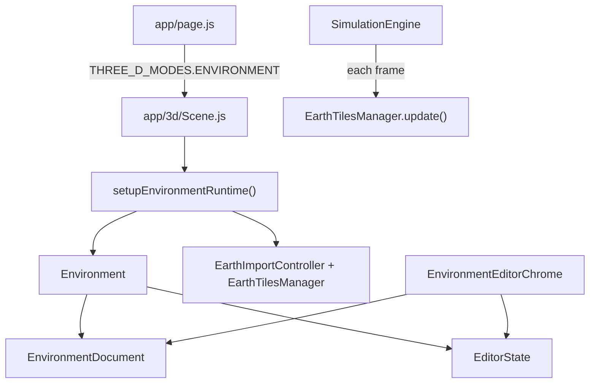

# Environment Editor

The environment editor is where you author the static world that simulations run in: roads, buildings, props, sky, and imported geography. It is a separate workspace from the simulation view, though both use the same Three.js scene stack.

Open it from the app menu (`Escape` → **Environment Editor**). The simulation workspace is the other 3D option in that same menu. 3D road node, knot, and Bézier-handle widgets are unlit halo markers, editor-only, and stay hidden in Simulation; tangent handles follow the selected knot unless the Road handles overlay is on.

Since ED-03 the editor is one workspace: a top bar, a resizable hierarchy pane on the left, the scene (or map) view with its toolbar in the middle, a resizable inspector on the right, and an asset pane along the bottom. ED-09 keeps that workspace, the creation dialog, Earth import, and georegistration chrome on by default. Pane sizes and collapsed states are editor preferences; the canvas and camera projection follow the scene pane, and pointer picking uses the canvas bounds.

## What you can do here

- Place and transform buildings, props, and other static objects in the 3D scene.
- Draw roads and intersections on a 2D map overlay.
- Snap selected road and intersection control points to a GLB surface (tile or catalog instance) directly above or below them, with a session elevation offset.
- Conform a selected intersection to its attached roads so the compiled junction surface sits flush with those road mouths.
- Import real-world terrain preview and road networks from geographic data.
- Bake environment visuals (lighting, splats, and related outputs) for runtime use.

Changes live in an `EnvironmentDocument`. Every edit is a `CommandBus` command or gesture (one undoable step each); the `SceneProjector` applies the resulting change set to the 3D runtime immediately, and autosave persists committed changes.

## Views and modes

Scene and Map are two views of the same document, selection, and toolset in the center pane; the hierarchy and inspector stay visible in both. Earth import is workspace-local dialog state and does not change `editorMode`. Persisted legacy `earth-import` state normalizes to Scene when loaded, so opening an environment never resumes a stale draft.

| Mode | ID | Purpose |
|------|----|---------|
| Scene view | `scene` | 3D editing: select, move, rotate, scale, and place objects. |
| Map view | `map` | Top-down 2D authoring for roads, intersections, buildings, and features, in the same center pane. |
| Earth Import draft | workspace-local dialog | Preview Google Photorealistic 3D Tiles and a detached OSM road draft while all editor panes remain mounted. |

Switch between Scene and Map with the toolbar's view toggle; open Earth Import or georegistration correction from the top bar. `Escape` closes the current creation/import/correction draft before editor shortcuts, then cancels a gesture, map draft, active tool, or selection; when nothing is left to cancel it falls through to the global workspace switcher.

On Map, the Select tool click-selects; a drag (node, prop, asset, road, or knot/handle) starts only after the pointer moves 4px, and the gesture delta is measured from the pointer-down world point so a click on a large GLB footprint does not jump the origin to the cursor. Empty space and lane picks use the same 4px pending-pan gate. Asset and GLTF Tile footprints stay drawn (and pickable) in overview while their longest screen edge is at least 2% of the shorter map-pane side, so a campus-scale tile does not vanish at the 0.55 detail-zoom cutoff; smaller instances still follow that cutoff, and a selected footprint always remains. While Map is showing, Google tiles stay hidden and `SimulationEngine.sceneRenderEnabled` is false so the covered WebGL scene (including a loaded GLB) is not drawn every frame. The optional Satellite overlay (`EditorState.map.satelliteVisible`, off by default, persisted with the map viewport) takes an idle, shadowless orthographic snapshot of that scene into an offscreen bitmap, then composites it under the SVG tools in the same user space as `worldToScreen` (the capture target keeps its own pixel viewport so `devicePixelRatio` cannot crop it). Pan and zoom slide that bitmap until the next recapture, picking stays on the SVG, and transient road gestures do not recapture. Pan/zoom and road-pen cursor updates do not re-render the toolbar or side panes.

Scenario route and zone maps, and Replay's spatial map, consume the same `MapCanvas` + `MapSurfaceLayers` drawing stack and the same `mapDocumentFrom` / `mapViewport` helpers, so compiled v2 roads, lanes, and pan/zoom math match this Map view. Those hosts keep their own overlays (waypoints, zones, trails) and still read the saved environment manifest rather than the live unsaved editor session. Satellite, road-pen, and other CommandBus map tools stay editor-only.

## Document model

`EnvironmentDocument` is the canonical source of truth for authored content. It holds:

- **Roads** — nodes and edges (centerlines, optional elevation `y`, width, shoulders, lane count, bidirectional / one-way travel) plus sparse `turnRules`. Absence of `roads.geometryVersion` is legacy v1. Version 2 stores one `polyline` or piecewise `cubic-bezier` geometry record per edge with stable interior knot ids, automatic/aligned/free handles, and endpoint positions supplied only by shared topology nodes. Nodes are metric `{ x, y, z }` with missing `y` treated as `0`. The deterministic v1 geometry policy samples curves to 1 cm chord deviation and 1 m spacing, then compiles the road strip, shoulders, lanes, junction mouths, indexed surfaces, and bounds once for every consumer. Scenario routing remains planar (XZ distance and yaw). The bicycle plant still integrates in XZ, then samples paved-surface elevation and pitch so pose Y follows the road; elevation also remains in world, mesh, LiDAR, and persisted route geometry. Physical lane index `0` is the rightmost lane for edge start→end travel. Lanes are implicit or explicit (ED-05). Implicit edges derive lanes from `laneCount`/`width`/`bidirectional`/`direction`: even-lane two-way roads split lanes equally by direction, one-way roads use every lane in the configured direction, a one-lane two-way road is shared, and odd two-way counts greater than one are invalid. Explicit edges store `lanes[]` ordered rightmost first, each `{ id, direction: 1 | -1 | 0, width, markingLeft? }` with a stable per-edge id; two-forward/one-backward and any one-way count are legal, same-direction lanes must be adjacent, `0` (shared) is legal only for a single lane, and `width`/`laneCount`/`bidirectional`/`direction` are derived from the records (`edge.width` equals the sum of lane widths). The first lane command materializes lanes on that edge only; an explicit array equal to the derived default canonicalizes back to implicit, so untouched roads never change hash. Lane `{ id, direction, width }` is metric identity (it enters the road-network and world hashes); `markingLeft` and the road borders are appearance-only. Editing the Width option of an explicit-lane road scales its lanes proportionally; the lane count and travel directions are edited only through the lane diagram or lane commands. Scene and Map share one stroke/sub-drag controller and the same compiled boundaries.

The inspector's **Lanes** section (`RoadDisplay`) draws the cross-section looking start→end with the rightmost lane on the right and one editing row per lane (direction, width, interior marking, insert left/right, remove). Every control dispatches an ordinary road command (`road.set-lane`, `road.insert-lane`, `road.remove-lane`, `road.set-lanes`, `road.set-marking`) through the CommandBus, so validation, undo, autosave, and persistence match numeric field edits. Clicking a lane in the diagram, its row, or (once the road is selected) the Map selects a `road-lane` sub-object; Delete removes that lane and Mod+D duplicates it beside itself. The Map draws lane dividers with the authored or automatic marking style and one travel arrow per lane for one-way, explicit-lane, or selected roads. Intersection movements are still edge-to-edge; the matrix disables movements that no lane can make (with the reason) and shows the lane connector a feasible movement would use. `road.set-turn-rule` refuses infeasible movements with structured issues, lane edits prune overrides whose movement disappeared, and an allowed movement without a lane connector inside its junction is a validation warning, never a blocking error. Roads, intersections, endpoints, knots, and handles are editable; a connected node moves once for every incident road. Legacy arms are recomputed only for v1. **Snap to GLB** (`road.drape-to-glb`) walks the selected road or intersection — or the connected network when Include connected is on — and sets each topology node and interior knot `y` to the closest GLB hit on a vertical ray, plus a session offset (`EditorState.roadGlbSnapOffset`). Bézier handles stay relative. Google tiles, bake preview meshes, and road surfaces are not sampled. Node `y` is metric, so a drape changes `worldHash`. **Conform to roads** is a per-intersection inspector toggle (`node.conformToRoads`, omitted when false). Off, the compiled junction is a flat hull at the node elevation. On, each mouth keeps the attached road's sampled Y and the hull vertices follow those mouths so the patch is flush; `node.y` stays the authored pivot. Geometry-v2 compile, LiDAR, and bicycle drape all see that surface. Move, knot, and handle drags still use the existing flat strip preview; the surface re-conforms on commit. Enabling the option changes `roadNetworkHash` and `worldHash`; existing environments stay unchanged until it is turned on.

Waypoint placement and dragging snap immediately to the nearest physical lane center without initiating map pan. A road anchor records `laneMode: "fixed"` plus `laneIndex` and, on geometry-v2 roads, the stable `laneId`; its snapped longitudinal position and lane are semantic route input, while the raw pointer position is editor-only and removed by scenario normalization. Verification never moves a fixed waypoint across the divider: the lane participates in staged A* and therefore causes a legal detour or a lane-unreachable failure. V1 roads use route algorithm 5. V2 roads use algorithm 7 (ED-05; algorithm 6 proofs are stale and need one re-verification), normalized XZ arc fractions, the frozen geometry-policy identity, the compiled lane mouths/connectors, and lane ids on every anchor, traversal step, and subnode. Scenario Verify/Validate compile that proof from the canonical world description (six-decimal metric roads), not the authoring envelope's full-precision Bézier handles, so a refresh of Verify matches resolution. A lane id wins over the positional index when both are present, and the waypoint hash binds the id, so inserting or removing neighbouring lanes never silently re-lanes a waypoint: a removed lane fails with `route.waypoint.lane-missing`, and a reversed lane forces a legal rebuild. Missing or invalid explicit anchors return `route.waypoint.anchor-missing` or `route.waypoint.anchor-invalid`; verification does not move them to a nearby road. Intersection matrix changes store only non-default `{ nodeId, fromEdgeId, toEdgeId, allowed }` overrides, and changes to those overrides intentionally invalidate road/world hashes and route proofs.
- **Buildings** — footprint records used by the bake pipeline.
- **Features** — placed props (traffic lights, signs, etc.).
- **Earth metadata and geographic frame** — legacy unversioned Earth records retain their anchor. ED-08 sources use Earth v2 for provider, bounds, quality, road filters, imported layers, and timestamp, plus optional `geoFrame@1` as the sole origin with east/up/south axes. Missing `geoFrame` preserves historical coordinates. Road nodes and edges may carry OSM provenance that is authoring data and excluded from metric normalization.
- **Objects (schema v4)** — the authoring overlay `document.objects`, one record per authored thing: `{ id, typeId, typeVersion, name, parentId, order, components }`. Records share ids with the legacy records they describe (`feature.id`, `buildingId`, edge `id`, junction node `id`); `group`, the single `skybox`, the single Tile across Google `tile@1` and GLTF `tile@2`, and `asset-instance` records exist without a legacy counterpart. Geometry never lives here — roads, buildings, features, and earth stay canonical, so the overlay is excluded from `worldHash` by construction. `components` holds `tags`, `locked`, and `editorHidden`; groups additionally hold `transform`, a world pivot frame `{ position, rotationY, scale }`. Asset instances and GLTF Tiles hold `asset: { assetId, revision, position: { x, y, z }, rotationY, scale: { x, y, z }, overrides: {} }`. The positive integer revision is pinned and is independent of the object type version; catalog changes never update it implicitly. Transforms must be finite, scales positive, and overrides remain empty. Asset-instance version 2 is required when the pin targets a published asset revision v2; `tile@2.components.tile.assetTypeVersion` records the equivalent Tile pin contract. A group gesture bakes its world delta into every descendant's legacy record once, composes it into descendant group frames once, and applies the exact `T × Ry × S` result to asset-backed records once. `order` is sibling-relative and dense. Unknown component keys are preserved verbatim on records whose `typeId` is not registered, and such records are reported as `object.type.unsupported` rather than substituted. Object ids are the editor's selection identity and a different namespace from runtime registry ids (`road:<edgeId>`, `intersection:<nodeId>`, `building:<buildingId>`, `fusion:<featureId>`, `asset:<objectId>`), which `app/3d/editor/selection/selectionIds.js` derives and never stores.
- **Asset metrics (optional v1 domain)** — `document.assetMetrics` stores one immutable `{ assetId, revision, metricHash, collision, lidar }` definition for every distinct v2 pin. Placement and explicit revision updates commit the pin/type version and snapshot in one command; duplicate/delete/undo reconcile the exact dependency set. Loading never derives this domain from the catalog, and guarded writes reject missing, changed, or unsupported snapshots. The first adopted write retains a write-once pre-asset-metrics copy.

Object types live in the kernel-safe registry under `app/3d/editor/objects/` (`ObjectTypeRegistry`, `ObjectOptions`, `objectGraph`). A type supplies `options` (`getDefaults` / `getFields` / `normalize` / `validate` with `{ path, code, message, severity }` issues), capability flags, a transform binding (`read` the world placement, `plan(delta, context)` the document steps for a world-space delta or return `transform.*` issues), dependencies, `compileMetric`, and `migrate`. Props accept yaw and planar translation, buildings accept yaw, translation, and scale (height follows the Y scale), roads and intersections translate their nodes, groups compose the delta into their frame, and asset instances accept translation/yaw/positive local per-axis scale when transformed alone (group or multi-selection scale stays uniform). Built-ins are `group`, `skybox`, `tile`, `road`, `intersection`, `building`, `builtin-prop` (the five props as one type with an `assetId` option), and `asset-instance`. Asset and revision fields are read-only generic options; explicit revision changes use the asset update command. `deriveObjectGraph` builds the overlay for a v2/v3 document, `reconcileObjectGraph` merges it with stored records (adds uncovered legacy entities, drops orphans, keeps groups, asset instances, and unknown types), and `validateObjectGraph` reports structured issues without mutating anything.

The document supports `snapshot()` / `restoreSnapshot()` for command rollback and exact undo/redo. ED-08 previews use detached documents and never mutate the active document. `snapshot()` emits `objectGraphVersion` and `objects` only when the overlay is non-empty and emits `roads.geometryVersion` only when explicitly authored, so untouched legacy snapshots remain byte-identical. Road gesture captures include edge geometry, provenance, `roadsAuthored`, and the nested version scalar.

### Commands, gestures, and history (ED-02)

`app/3d/editor/commands/` is the single mutation path. `CommandBus.execute(command)` runs a command inside one document transaction, keeps the in-session object overlay live (`reconcileLiveOverlay`: created legacy entities gain records, removed or demoted ones lose them), validates the object graph and road compiler, and either commits exactly one `ChangeSet` to history or restores the document byte-identically with structured issues. `createObject({ typeId, input })` creates a registered overlay type from `definition.create()`; a missing type fails with `object.type.unsupported` and is never substituted. Overlay-only types (`legacy: null`) may `compileMetric` into editor-only `overlay-metric:` registry entities via `overlayMetricsProjector`; those records never enter `createWorldDescription`. Duplicate copies overlay-only deletable non-singleton records through the same command as built-ins. `roadCommands.js` supplies create, convert, insert/remove/set knot, split, detach, and connect. Its first geometry operation upgrades all legacy roads to explicit polylines in the same transaction; ordinary legacy edits do not upgrade. ED-08 `applyRoadImport` and `migrateGeoregistration` validate a detached plan and expected document version, then commit the full result as one history entry. `undo()` / `redo()` apply the recorded before/after records wholesale (`document/ChangeSet.js`), which is total and idempotent. History is bounded at 200 entries and resets only on a full environment load.

Gestures are the drag path: `beginGesture({ objectIds, sub })` captures the pristine records of the transform closure (selected records, group descendants, object-backed asset leaves, and road nodes and incident edges); every `updateGesture(cumulativeDelta)` restores that capture and re-applies the delta, so frames are idempotent whatever the pointer does; frames notify with `transient: true` and skip `planRoadNetworkGeometry` (overlap scans and junction connectors). Map mode RAF-coalesces those snapshots and draws straight width-strips instead of compiled curves while the pointer is held; Scene applies the cumulative delta to existing road meshes when the transform is uniform, or hides them behind a straight strip for node/knot/handle drags. Commit and cancel compile and rematerialize the local closure once (a no-op drag never enters history); `cancelGesture` (Escape, pointer cancel) restores the capture and never enters history. Map Select waits 4px (`PAN_DRAG_THRESHOLD` / `pending-object`) before `beginGesture`, and object-drag `start` is the pointer-down world point (the same grab-offset rule as road drags). On geometry-v2 Map, dropping a free road end (or finishing a road-pen stroke) on an intersection cancels the move and runs `road.connect-endpoint` (or `road.create` with that node id); a 250ms hover dwell highlights the diamond. GLTF Tile footprints paint and pick under roads, intersections, and buildings, and disappear when the tile is `editorHidden`. One gesture is active at a time; executing a command cancels it. Shared road nodes and grouped asset leaves reached through several selected objects move exactly once. Locked objects, non-transformable types, non-uniform scale on groups or multi-selections, and scale on props reject the whole frame before anything moves.

`EnvironmentDocument` carries a monotonic `version`; every notification delivers `(snapshot, event)` with `{ version, transient, changeSet, source }`. Autosave ignores transient frames and cancels, and marks dirty only when committed document changes or the persisted editor state (layers, hidden ids, mode, map viewport) change; selection never dirties the environment.

Hierarchy, scene, map, and inspector share one `SelectionStore` (`app/3d/editor/selection/`): ordered object ids, a primary id, and an optional sub-object. Road sub-objects are `{ kind: "road-node", id }`, `{ kind: "road-knot", edgeId, knotId }`, and `{ kind: "road-handle", edgeId, knotId, side }`. Shift/Cmd/Ctrl toggle, Shift-click in the hierarchy selects a range, and mode switches keep the selection.

`app/3d/editor/projection/SceneProjector.js` is the only path from a document change to runtime meshes, registry entities, chunks, LiDAR truth triangles, and live tile-source reconciliation; `EnvironmentLoader.apply` performs the load-time full synchronization. A full load awaits projected GLTF Tiles and, in the editor, catalog instances before the scene is shown. Import Apply has no direct road sync or history reset. Props move in place. Buildings follow the cumulative delta on their existing mesh during a gesture and regenerate once on commit, undo, redo, or cancel with LiDAR triangles replaced only for that building. Road gestures do the same for a uniform affine (whole-road / group translate): the existing mesh moves in place and LiDAR triangles stay put. Node, knot, and handle drags hide the compiled surfaces and show a straight width-strip from live records. Any non-transient change rebuilds the local closure only: the changed edges, the intersections at their endpoints, and those intersections' other incident edges (`computeRoadClosure`), keyed by id with untouched intersections relinked to replaced road objects and `replaceTriangles` scoped by source id. The appearance asset projector generation-guards async model leases, updates transforms in place, replaces a lease only when its pinned revision changes, and projects both asset instances and GLTF Tiles. `AssetModelLoader.acquireRevision` loads `revision.modelUseHash` and, for v2 pins, applies `revision.appearance` with source-bound textures onto that compiled mesh; the compiled GLB itself stays geometry plus named materials. Failed glTF image decodes fail the lease instead of leaving an untextured mesh. The separate ED-07 metric projector registers compiled collision/LiDAR records by environment instance id, replaces/removes them with the corresponding document record, and survives the switch into Simulation. Google tile roots remain outside every metric and package consumer. Runtime load status and bounds notify with `affectsPersistence: false`; only document commands cause asset-backed autosave. Browser-only helpers (placement catalog, building generator, asset repository/model loader/studio resources, and `EnvironmentTileHost`) are injected by `browserProjectorRuntime.js` so `Environment` remains browser-independent.

### Option edits and the sky scalar (ED-03)

Editing a field writes back through one command. `setObjectOptions({ objectId, patch })` (or `setObjectsOptions` for several records, atomic) reads the record's projected option value, applies the patch (`[{ path, value }]` entries or a plain object; unknown paths and `readOnly` fields are rejected with `options.unknown-path` / `options.read-only`), validates it against the descriptors and the type's `validate()`, and asks the type's `planOptions(record, value, context)` for plain plan steps (`set-edge-options`, `set-building-record`, `set-feature-record`, `set-earth-source`, `set-sky`, `move-node`, or `set-node-record`) or a world `delta` that routes through the transform planner (groups). Nothing mutates on a rejected edit and issues keep their field `path`. The environment sky is a document scalar (`document.sky`, mirrored into `EnvironmentSkyState` by the sky projector and kept current when legacy callers write the state directly), so Skybox edits are ordinary undoable commands; `snapshot()` carries `sky` only once seeded and `toManifest()` strips it, so the persisted location stays `manifest.sky` and `manifest.document` is unchanged. Sky is not part of `createWorldDescription`, so `worldHash` is untouched.

`EditorPresentationRegistry` (`app/3d/editor/presentation/`) maps a `typeId` to an icon, menu options, inspector sections, and an optional preview; hierarchy and inspector consume it exclusively, and unregistered types fall back to a capability-derived default that shows the record and an unsupported notice. Registering a presentation is all a new type needs to appear in both panels (`tests/editor-presentation.test.js` proves it with a test-only type). The hierarchy tree model (`hierarchyModel.js`: sibling order, inherited hidden state, search, drag-and-drop planning) is pure and tested without React.

## Persistence (server-side)

Environment edits are saved to the backend, not the browser. Loading and saving are deliberately separate:

- **`EnvironmentLoader`** fetches the selected manifest and applies it to the one runtime shared by Simulation and Environment Editor. IGVC starts from its native template meshes; legacy hydrated road data does not replace those roads. Roads are rebuilt only after a map/Earth Import edit marks them as authored. Schema v3 `revision`, `visualLayer`, and `evidence` fields are copied onto environment state. Metric geometry is rebuilt and registered first. Preview materialization then loads `{ descriptorHash, accessHash }` into a detached preview group using VIS-05b AOI/LOD residency. Visual failures do not fail metric load; the 3D chrome shows `idle/loading/ready/error` preview status with retry, including `VISUAL_PREVIEW_BUDGET_EXCEEDED`. Preview meshes are marked non-selectable and are excluded from object-registry membership, collision geometry, LiDAR truth, perception scans, and measured cameras. `worldHash` is unchanged. Legacy descriptor-only references stay non-materializable until an access hash is attached.
- **`EnvironmentPersistence`** watches committed document changes (never transient gesture frames or cancels), the registry, the persisted subset of editor state, and sky; selection never marks the environment dirty. It tracks edit generations separately from requests, retains the last acknowledged server revision, allows one `PUT` in flight, and builds queued saves from the latest `Environment.toManifest()` at send time. An edit made during a request stays dirty until its own captured draft is acknowledged. Geometry-aware writes include request-only `supportedRoadGeometryVersions: [1, 2]`; the server rejects a full replacement over v2 from an unaware writer, malformed versions, and v2 records tagged as v1. The first v2 write retains one `pre-road-geometry-v2` migration record. The first geoFrame/source write retains one `pre-editor-source-v1` copy, and the first `assetMetrics` write retains one `pre-asset-metrics-v1` copy; later saves never replace those files. Explicit server `null` visual/evidence references are applied. Older revisions, other-environment responses, and stale promotion receipts are ignored. External MCP updates call `prepareExternalApply`: a dirty or in-flight CommandBus draft exposes `ENVIRONMENT_REVISION_CONFLICT` and keeps the local edits; a clean session adopts the remote revision.
- **On page unload / tab hide** it flushes through the same queue with `keepalive`. Autosave suspension blocks every save entry point, cancels timers and queued work, drains the current request, preserves unsaved edits, and explicitly saves them after resume. A strict promotion flush joining an autosave observes the shared failure.

The storage contract is environment schema v4 (schema v2, v3, and v4 all read; the ED-02 env-var opt-out was retired in ED-03, and only the test-only `StorageService` option `environmentSchemaVersion: 3` still exercises the v3 writer). v2 files load as revision `0` with implied null visual/evidence references; the first guarded save writes v3 revision `1`. Full replacement is `PUT /api/storage/environments/<id>` with `{ manifest, expectedRevision }`. Rename, duplicate, ID change, and delete require the same revision. Missing or stale revisions return HTTP `409` with `ENVIRONMENT_REVISION_CONFLICT` and `currentRevision`. Unguarded legacy bodies are rejected with `ENVIRONMENT_UNGUARDED_WRITE`. Catalog entries include `revision`. `clientRevision` is not a concurrency authority and is not written into v3 documents.

ED-08 extends `POST /api/storage/environments` with optional
`initialManifest` while preserving `{ id, name, templateId }`. The server
validates the complete source document and commits revision 1 under the normal
environment lock; creation never writes a temporary Blank revision. New source
contracts require request-only `supportedEditorSourceVersions: [1]` from
browser persistence and MCP saves. A full-document writer that cannot preserve
`geoFrame`, Earth v2, road provenance, or GLTF `tile@2` receives HTTP 409
`ENVIRONMENT_SOURCE_DOWNGRADE`. The first frame/source adoption retains one
write-once pre-georegistration migration copy.

Schema v4 (ED-01) adds `document.objects` and `document.objectGraphVersion: 1`. Reads accept v2, v3, and v4; v2/v3 read views never inject a graph (`presentEnvironmentObjectGraph` derives one in memory). The writer emits v4 (`StorageService` option `environmentSchemaVersion` defaults to `4`; the test-only value `3` strips `objects`). Stripping is lossy once names, groups, locks, or hidden flags have been authored, which is why ED-02 flipped the default. A v4 write reconciles the incoming graph against the legacy domains, validates it, and rejects error-severity issues atomically with HTTP `400` `ENVIRONMENT_OBJECT_GRAPH_INVALID` and an `issues` array. The first v4 save over a v2/v3 file stores a write-once copy at `server/data/environment-migrations/<id>.pre-v4.json` (`cev-sim.environment-pre-migration` v1); recovery is a manual restore of `manifest`. Once a file is v4 it stays v4 even under the opt-out. A write whose `document` lacks an `objects` array over a stored v4 graph is an old client: when the stored graph carries authored data (groups, renames, parents, tags, locks, hidden flags, unknown types) it is rejected with HTTP `409` `ENVIRONMENT_SCHEMA_DOWNGRADE` instead of dropping the graph; when the graph is purely derived it is re-derived from the new geometry and the write passes (ED-02). Writes that omit `document` (rename) and graph-aware clients that still declare `schemaVersion: 3` pass. MCP `environment_add_object` rejects unregistered types with `ENVIRONMENT_OBJECT_TYPE_UNSUPPORTED`.

Display-name rename keeps visual and evidence references when `worldHash` is unchanged, including both descriptor and access hashes. Duplicating an environment, changing its ID, or importing onto a conflicting ID rebinds the descriptor to the destination world, creates a corresponding access sidecar with the same use selections, reuses compatible asset digests, and clears correspondence evidence. Missing or incompatible descriptors fail before the environment mutation. An older client that writes the same descriptor without `accessHash` preserves the existing sidecar; replacing the descriptor without a matching access hash is rejected.

The environment picker in the editor top bar inspects, creates, duplicates, renames, and deletes environments using the acknowledged revision. A single click selects a world in the picker without loading it; a native double-click or **Open environment** loads it. **New** opens the three-source creation dialog and switches only after atomic creation succeeds. Catalog summaries include a derived `sourceKind` (`blank`, `google`, or `gltf`) for picker icons; it is not stored on the manifest. Selection is shared between Simulation and Editor and stored in server settings. The saved payload is `Environment.toManifest()` at `server/data/environments/<id>.json`. See [development.md](development.md) for the storage backend.

Validated visual-asset bytes live in the VIS-04 CAS under `server/data/visual-assets/`. Browser access is `VisualAssetClient` at `/api/storage/visual-assets` and `VisualLayerClient` at `/api/storage/visual-layers`. Public asset identities are source-bound use hashes, not filesystem paths or digest-only content URLs. Every content/closure/materialization path requires current version-2 validation; old or missing evidence is refreshed from immutable bytes without changing asset/use identity. Embedded and digest-backed glTF images, extension use, graph bounds, and decoded memory are checked before loaders. Published assets cannot be deleted; only abandoned staging and expired reservations are cleaned. Uploads fail closed unless an operator configures owned-source grants in `visual-source-registry.json` (or `CEV_SIM_VISUAL_SOURCE_REGISTRY`). Generated bake outputs additionally require `CEV_SIM_BAKE_OUTPUT_SOURCE_IDS`. Spark and splat construction are initialized only when an explicitly started legacy bake selects the splat path. VIS-12b can resolve an enabled `pbr-mesh@1` run from these local immutable records for export and inspection; VIS-13a can transfer those bytes as a verified `cev-sim.run-package@1` archive, and VIS-13b can admit it to a same-host Unix supervisor. VIS-14 browser simulation materializes the exact resolved records into a separate run-owned appearance scene and rechecks measured-capture rights on every lease. It never reuses the live editor scene or preview metadata as truth. Headless PBR rendering and automatic published-asset GC remain later work.

The local bake HTTP service binds to `127.0.0.1` and requires
`CEV_SIM_BAKE_TOKEN`. Direct browser bake requests use the same value from the
current tab's session storage; a local development session may bootstrap it
with `NEXT_PUBLIC_CEV_SIM_BAKE_TOKEN`. Non-loopback binding additionally
requires `CEV_SIM_BAKE_ALLOW_REMOTE=1`, an explicit
`CEV_SIM_BAKE_ALLOWED_HOSTS` list, and an allowed browser origin. Bake host,
sky-image, and vehicle-model URLs are rejected unless they are same-origin,
loopback bake origins, or explicitly admitted by their public origin lists.

ED-06 adds an authoring catalog under `server/data/editor-assets/` without
changing the VIS-04 CAS. `catalog.json` is
`cev-sim.editor-asset-catalog@1`; immutable
`revisions/<assetId>/<revision>.json` records point to one source-bound
`modelUseHash`; recoverable publication journals live in `transactions/`.
Every catalog/folder/metadata/revision/thumbnail mutation requires the shared
catalog revision and returns `EDITOR_ASSET_REVISION_CONFLICT` with the current
token on HTTP 409. The `/api/storage/editor-assets` API supplies catalog,
capability, immutable revision, folder, thumbnail, and saved-environment
reference operations. Model and dependency bytes continue through the visual
asset upload/validation endpoints. Folder and archive metadata never enter
environment history. Archive hides an item from ordinary catalog results but
does not release roots or invalidate existing instance pins.

GLTF/GLB import is package-local. The browser requires one explicit entry file
when several models are selected, resolves external buffers/images only from
the selected files, rejects missing, ambiguous, absolute, network, and
traversing paths, and rewrites those URIs plus packed `bufferView` / `data:`
images to `sha256:` identities. The GLB BIN chunk is not compacted. Import
uploads dependencies before the model, then validates the full closure. Cancellation
aborts fetches and abandons unfinished staging. Available source choices and
limits come from the server capabilities response; import never creates a
source grant. Catalog items imported before packed-image unpack need reimport
before ED-07 Save can bind source-bound textures.

ED-07 asset definitions retain imported node topology as persisted parts with
parent-local transforms; selection uses part ids, never Three.js UUIDs or node
names. A root normalization applies `R(orientation) × S(metersPerUnit) ×
T(-pivot)` once after hierarchy composition. Reference parts pin exact child
revisions. Materials use the VIS descriptor allowlist, source-bound texture
uses, and OPAQUE/MASK alpha policy. LiDAR mesh/box/sphere/cylinder and collision
box/convex records have stable ids and independent enabled flags. Generated
records store included parts, generator v1 parameters, child provenance, input
geometry hash, and canonical indexed output; an enabled stale record blocks
publication.

`cev-sim.editor-asset-revision@2` contains the editable definition, compiled
appearance GLB use, flattened material descriptors, immutable `metric@1`, and
its metric/geometry hashes. Publication checks both catalog and asset revision
tokens, recompiles on the server, verifies exact source/child derivative rights
and texture mappings, and journals every compiled/source/texture root before
the immutable write. Save advances the baseline captured at request start;
concurrent edits remain dirty. Conflicts retain the draft and expose Reload
latest and Save as new asset. Publication never updates environment pins. The
completed authoring capability is enabled by default; operators can disable v2
publication explicitly with `CEV_SIM_ASSET_STUDIO=0`.

Run-manifest `renderRecipe` authoring is intentionally independent of editor
preview sky, light, visibility, and bake state. The optional
`cev-sim.pbr-render-recipe@1` field freezes selected measured appearance,
including background/IBL, lighting/color/rasterization policy, actor visual
overrides, and asset-use references. An older client update that omits the
field preserves an existing recipe; explicit `null` resets it. JSON bundle
import never installs visual bytes. Rename/duplicate/conflicting-import rebinds
retain the established descriptor rules, invalidate correspondence evidence,
and fail explicitly if the destination lacks required descriptor, access, use,
or CAS dependencies. VIS-13a package import can install those visual bytes after
strict archive verification. VIS-13b package admission and VIS-15 headless PBR
execution are operational on admitted renderer targets. ED-07 composes pinned
published asset appearance into the same package closure for browser and
headless measured cameras.

Gizmo drags are gestures: the document holds the draft during the drag and one change set is committed on release, so building footprints, heights, prop positions, and headings persist exactly what the mesh shows. Reload therefore reconstructs the edited location rather than the original runtime mesh.

## UI chrome (ED-03 workspace)

`EnvironmentEditorChrome` mounts `EditorWorkspace` (`app/3d/overlay/workspace/`) plus the Three-side overlays (selection handles and group union boxes, chunk outlines, the editor working grid, Earth bounds) and the workspace shortcuts.

- **Layout** — a CSS grid inside `#overlay`: top bar (40 px), hierarchy pane (232 px), scene pane, inspector pane (304 px), asset pane (208 px). `paneLayout.js` (pure) clamps sizes so the scene pane never drops below 480 × 240 px (the inspector shrinks first, then the hierarchy, then the asset pane; each collapses to a 28 px rail when minimums are not enough), and the layout persists under `cev-sim.ui.environmentEditor.paneLayout`. Splitters are `role="separator"` controls (drag, Arrow ±8 px, Shift ±32 px, Home/End, Enter toggles, double-click resets). The scene pane publishes its rectangle to `TotalScene`, which sizes the renderer, camera, and sky manager from it (`viewportRect.js`); the canvas sits beneath the `pointer-events: none` center cell so picking and gizmos keep receiving pointer events with canvas-relative coordinates.
- **Top bar** — environment picker (inspect on click, load on double-click or Open environment), View menu (pane visibility), Earth import, explicit georegistration correction when a legacy Earth anchor exists, Atmosphere (selects the Skybox), bake start/stop, and the save status (`EnvironmentPersistence.subscribe()` → saved / unsaved / saving / conflict).
- **Toolbar** — `toolbarModel.js` (pure) builds the groups for the current view; the React toolbar renders `IconButton`s (tooltip, `aria-label`, `aria-pressed`) with roving Arrow-key focus. Scene view: Select/Move/Rotate/Scale/Road Pen, world/local axes, snap, Scene/Map view, grid/chunks/bounds overlays, layers, undo/redo/frame. Map view: select/pan/intersection/road pen/building rectangle, map snap, grid, Satellite. `G` toggles the editor working grid (`EditorGridOverlay`): `EditorState.sceneGridVisible` in Scene and `EditorState.map.gridVisible` in Map. Scene and Map road pens feed `RoadAuthoringController`; Enter, double-click, or an existing-node connection commits the whole stroke as one road and Escape drops the session-only `EditorState.roadDraft`. View options (`transformSpace`, `transformSnap`, `sceneGridVisible`, `selectionBoundsVisible`, `chunkOutlinesVisible`) are session state remembered under `cev-sim.ui.environmentEditor.viewOptions`, never in the manifest. Collision and LiDAR overlays exist on asset-studio scenes; the environment toolbar does not add those overlays.
- **Hierarchy** — a windowed tree (`virtualWindow.js`: only the visible rows plus overscan render, so thousands of objects stay responsive) with `aria-level`/`aria-posinset`/`aria-setsize`, roving focus (`aria-activedescendant`), Arrow/Home/End navigation, Left/Right collapse and expand, Enter renames, Space toggles selection, Shift-range and Cmd/Ctrl-toggle selection, search, inline rename, hide/lock, drag-and-drop reparenting, and the presentation registry's context menu. Collapsed groups persist under `cev-sim.ui.environmentEditor.hierarchyExpanded`.
- **Inspector** — sections from `EditorPresentationRegistry.getInspectorSections`; option fields render from `ObjectOptions.getFields()` through the generic controls in `app/3d/overlay/fields/` (`NumberField` with typed drafts, Arrow stepping, and label scrubbing; `Vector3Field`; `EnumField`, `ToggleField`, `TextField`, `ColorField`, `AssetReferenceField`; collapsible `PropertySection`s remembered per section). Every edit is `setObjectOptions` (or `setObjectsOptions` for a multi-selection of one type, which shows mixed values and applies one patch atomically); rejected edits keep the draft and show the issue inline at its field path without touching the document. Built-in extra sections come from `builtinSections.js`: intersection turn rules, road endpoint and geometry controls, the Skybox preview, and asset revision status. The asset section shows pinned/latest revision and load status, opens the catalog asset, and prepares one guarded update for selected matching instances or all matching instances in the current document. A catalog refresh only changes the update indicator.
- **Asset pane** — one server-backed library with folder CRUD and breadcrumbs, name/tag search, name/updated sorting, built-in/model and archive filters, grid/list view, import/reimport, metadata, archive/unarchive, and thumbnail retry. The catalog is windowed by visual rows (`computeItemWindow`): list rows use a 64 px pitch, while grid rows use their item height, gap, and measured column count to map visible rows back to item slices. Large catalogs therefore mount only the visible items plus overscan in either view. Built-ins remain single-click placement actions and retain their placement ids and legacy feature commands. Model cards select on a single click, open a replaceable studio tab on native double-click (Enter is the keyboard equivalent), and expose Place / Move to / Reimport / Edit metadata / Archive / Retry thumbnail from a context menu; pinning stays on the workspace tab's double-click. Drag a model card or a real folder onto **Unfiled models** or another real folder to refile it through the existing catalog `folderId` / `parentId` writes; **All assets**, **Built-ins**, **New folder**, and the catalog grid are not catalog drop targets. Canvas and studio drops still read only the placement MIME. **New folder** creates `Untitled folder`, then `Untitled folder 2`, and so on under the current real folder (or at top level from All / Unfiled / Built-ins) without a prompt or immediate rename. Clicking an already-current real folder name starts inline rename; real folders also have a Rename / Move to / Delete context menu. Edit metadata prompts for name and tags only. **Import** needs an active owned grant in `$CEV_SIM_DATA_DIR/visual-source-registry.json` (or `CEV_SIM_VISUAL_SOURCE_REGISTRY`) that includes `persistent-cache`, `machine-interpretation`, and `retention`; a missing registry fails closed and the pane explains that instead of looking clickable. Imported models arm a pinned catalog placement used by Scene clicks, Map clicks, and HTML drops. The shared controller owns snapping and a nonselectable ghost; cancellation/view/environment changes release it without a document edit. Map rendering consumes transient projected bounds (or a position marker before load), and Map drag commits one asset move gesture while preserving Y.
- **Asset studio tabs** — `EditorState.workspace` is session-only: `activeTabId` plus `{ id, assetId, revision, pinned }` tabs never enter `persistedSnapshot()`. Each tab retains an isolated `AssetStudioSession` with its own `AssetDocument`, `CommandBus`, selection, undo/redo history, saved baseline, pending generation, camera, overlays, and expanded rows. Only the active tab owns viewport leases. Document changes reach the preview exclusively through `SceneProjector` and `classifyAssetStudioChangeSet`: orbit, zoom, selection, overlay visibility, normalization, and transform-only edits do not rebuild GLB meshes. Collision and LiDAR overlays are separate groups whose view flags toggle `.visible` only. Numeric inspector fields keep local drafts until Enter/blur. The parts hierarchy owns its own scrolling and uses the environment-hierarchy selected treatment (`aria-selected`, `aria-current`, `data-selected`) plus `scrollIntoView({ block: "nearest" })` when the primary part changes from picking or the tree. Its scene supports orbit, picking, transform controls, material replacement, pinned catalog drops, and collision/LiDAR overlays; its hierarchy and inspector replace both environment side panes. First mutation pins a replaceable tab. Dirty close offers Save/Discard/Cancel, and switching tabs disposes preview resources without discarding the session.
- **Creation and import drafts** — `EnvironmentCreationDialog` creates Blank, Google Earth, or GLTF Tile environments from one prepared revision-one manifest. `EarthImportModeChrome` stages Add/Replace road imports without unmounting the panes. `GeoregistrationDialog` previews Roads-only or Whole-environment correction. Each draft owns its cancellation and restores focus before workspace shortcuts resume.

Keyboard: `Q`/`W`/`E`/`R` select tools (scene view); `G` toggles the Scene or Map working grid and is disabled in asset tabs, simulation, dialogs, menus, and editable fields; `Escape` cancels an active gesture, placement ghost, then a shared road draft, then leaves the tool, then clears the selection, then falls through to the workspace switcher; `Enter` finishes a road-pen draft; `Mod+Z` / `Shift+Mod+Z` (or `Ctrl+Y`) undo and redo; `Mod+D` duplicates; `Delete`/`Backspace` removes a selected interior knot or deletes the selected road/object; `Mod+G` / `Shift+Mod+G` group and ungroup; `F` frames the selection. `EditorCommandShortcuts` routes undo/redo/duplicate/delete to the active asset session and routes environment commands only to Scene. Shortcuts never fire inside editable fields and consume the event only when something happened. `Mod` is Cmd on macOS and Ctrl elsewhere; bare letters never fire while Cmd/Ctrl/Alt is held.

## Chunks

Large environments are indexed in a chunk grid (`ChunkIndex`, `ChunkManager`). Objects are assigned to one or more chunks based on footprint bounds. Spatial radius/bounds queries support bake planning and visual residency. Semantic dirtiness is a typed mutation log (`insert`, `delete`, `move`, `material`, `visibility`, `entity-id`) with `semanticGeneration`; `loaded` / `prefetch` / `eviction` are operational only and never authorize bake reuse. Diagnostic `dirty` flags are not dependency keys. Building records used by bake planning are replaced from the canonical document (`syncBakeBuildingsFromDocument`), not appended. Chunk outlines can be toggled in scene mode to see how content is partitioned for baking and streaming.

Default chunk size is 20 meters. It is stored on the document and can differ per environment.

## Baking

The bake harness (`BakeProgressOverlay`, modules under `app/3d/environment/visualization/`) renders environment visuals into textures and related outputs. Baking runs as a simulation module while active.

VIS-06a adds an explicit `calibrated-projection@1` bake adapter. It requires
an owned `bake-snapshot` scene, snapshots its generation, camera pose,
calibration, and integer-nanosecond capture time, applies the shared asymmetric
K projection, and normalizes corrected readbacks to top-left rows. The default
`legacy-fov@1` bake path and existing vector/buffer conventions remain
unchanged. VIS-06b adds the opt-in asynchronous `captureAlignedProducts()`
path. It requires the owned `bake-snapshot`, explicit descriptor bindings,
source-use hashes, and an abort signal. Beauty and every visual G-buffer see
the same visible surfaces and OPAQUE/MASK alpha tests; no target visibility
filter, forced hidden-object visibility, or road-material boost is applied.
Target/building/tag masks are derived from the frontmost object-ID product so
other surfaces remain occluders. Oracle products require a separate
`analytic-truth` handle and explicit truth bindings. VIS-07 adds an in-memory
bake-job catalog: serializable `BakeRunConfig`, frozen `bake-snapshot` scenes,
UTF-8-stable planning, VIS-06b aligned capture, and local
`captured-appearance@1` with no model network. Version-1 jobs use
`BakeHarness.runVersion1Job()`. Press `b` runs the VIS-08/VIS-09 atomic no-model
path: flush acknowledged autosaves (`detachStaleVisual: true`), reserve a bake
generation, reuse unchanged capture units from a trusted bake-reuse manifest,
capture only invalidated aligned beauty/world-position/geometric-normal/
confidence/validity products, write deterministic per-chunk atlas PNG/GLB pages
(or explicit projected captured-radiance), commit the descriptor/access closure
(or a revision-free no-op), replace the durable bake-reuse root, and
rematerialize preview without rebuilding metric
truth. `createLegacyCompatibleBakeRunConfig` and
`?legacyBake=1` still reach `BakeHarness.start()`, which may health-check the
bake server; that path cannot promote through VIS-08. `capturePasses()` and
`captureFrame()` remain legacy defaults. VIS-10b owns optional material
estimation; VIS-17b owns the evidence catalog UI.

VIS-10b intrinsic construction is API/config opt-in only; the editor has no new
controls. A caller selects `cev-sim.bake-construction@2` and supplies a complete
job-bound `cev-sim.bake-material-proposal-set@1` plus typed proposal buffers.
Each of base color, normal, roughness, metalness, emissive, and occlusion may
override its ordered `sourcePriority`; the normalized default is `supplied`,
then `inferred`. Missing, stale, malformed, over-budget, or incomplete evidence
fails the bake before upload rather than reverting to captured beauty. Selecting
`intrinsic-material-model@1` is API/config opt-in only and requires pinned model,
algorithm, and weights identity plus construction v2 `intrinsic-pbr-proposed`.
The editor has no new model controls. The default persistent bake remains
model-free `captured-appearance@1`. Successful promotion records
the proposal hash in artifact-set v3 and the durable receipt while leaving the
environment schema, correspondence evidence, and runtime capability adverts
unchanged.

Promotion, recovery, reads, and later environment mutations share one
environment transaction lane. Exact target revision plus the complete manifest
proves publication; ambiguous/corrupt journals retain protective roots and
fail. Cancellation that loses to commit adopts the receipt. A failed preview
reload keeps the committed receipt and reports a reload error for
materialization-only retry. Legacy model uploads cannot emit completion or
success unless every request returns `true`.

Press `b` in the environment editor to start or stop a bake run when a harness is configured. See the bake tests under `tests/bake-*.test.js` for expected behavior around determinism, splats, and render bundles.

## How it connects to the rest of the app



- `app/page.js` passes `mode={THREE_D_MODES.ENVIRONMENT}` to `TotalScene`.
- `setupEnvironmentRuntime()` creates the `Environment`, wires `EditorToolController`, and registers earth-import services on `Data`.
- `SimulationEngine` calls `earthTilesManager.update()` each frame so streamed tiles stay in sync with the camera (only while tiles are loaded).

## Tests

| File | What it covers |
|------|----------------|
| `tests/editor-core.test.js` | Chunks, typed mutations vs residency, editor state, environment registry |
| `tests/editor-map-mode.test.js` | Map mode transitions, road pen, document hydration, GLTF footprint pick order |
| `tests/map-road-connect.test.js` | Map connect-on-drop to an intersection, pen snap vs grid, hover dwell |
| `tests/map-shared.test.js` | Shared map document snapshot, compiled v2 plan (null while a gesture preview is live), pan/zoom/fit kernel used by editor and scenario maps |
| `tests/document-changeset.test.js` | ED-02 change sets (diff/apply/merge/invert), document transactions and versioning, `translateRoadNodes`, uniform `notify:false` |
| `tests/command-bus.test.js` | ED-02 CommandBus execute/undo/redo, atomic failures, transactions, gesture lifecycle, SelectionStore, id mapping, commands/ import safety, transient frames skip `planRoadNetworkGeometry` |
| `tests/command-groups.test.js` | ED-02 group transforms (shared nodes moved once, nested frames), reparent, ungroup, duplicate, delete cascade, atomic rejection of unsupported transforms |
| `tests/scene-projector.test.js` | ED-02 incremental projection: props in place, building gestures, road local closure, road-drag mesh identity and preview strips, rematerialize on commit, removals, hidden/locked, error isolation |
| `tests/editor-interactions.test.js` | ED-02 select, gizmo drag, Escape cancel, undo/redo, sub-object and group drags, duplicate/reparent/reload, map gestures and road pen |
| `tests/editor-presentation.test.js` | ED-02 presentation registry, hierarchy tree model, drop planning, the test-only-type extension demonstration, and the ED-03 built-in section providers |
| `tests/command-options.test.js` | ED-03 `setObjectOptions` / `setObjectsOptions` for every built-in type, `planOptions`, atomic rejection with field paths, the `sky` scalar and its runtime mirror, feature re-placement on asset/facing changes, intersection `conformToRoads` |
| `tests/pane-layout.test.js` | ED-03 pane layout model (defaults, clamping, resize/step/toggle, persistence) and the render viewport resolver |
| `tests/editor-workspace.test.js` | ED-03 toolbar model per view, toolbar actions, editor view options, Grid `(G)` tooltip, Snap to GLB |
| `tests/road-drape.test.js` | Snap road/intersection control points to sampled GLB elevation with offset, connected expansion, and undo |
| `tests/sample-glb-elevation.test.js` | Vertical GLB elevation sampling ignores roads/previews and picks the closest hit |
| `tests/asset-studio-projection.test.js` | Incremental Asset Studio change-set classification |
| `tests/asset-catalog-drop.test.js` | Catalog drop destinations and folder/asset move acceptance |
| `tests/field-model.test.js` | ED-03 field formatting/parsing/stepping/scrubbing, grouping, mixed values, issue mapping |
| `tests/virtual-window.test.js` | ED-03 hierarchy windowing and tree keyboard navigation; ED-09 list/grid catalog row and column windowing |
| `tests/editor-extension.test.js` | ED-09 overlay `createObject`, generic inspector fields, overlay-only duplicate/delete/undo, and a test-only `test.marker` type that never appears in production |
| `tests/environment-migration-copies.test.js` | ED-09 write-once pre-editor-source and pre-asset-metrics copies and manual restore of `envelope.manifest` |
| `tests/environment-persistence.test.js` | Autosave queue, revision conflicts, failed flushes, and CommandBus-backed MCP `prepareExternalApply` dirty/clean apply |
| `tests/ui/environment-editor.spec.js` | ED-03 Playwright: panes, canvas tracking the scene pane, splitters, shortcut scoping, map view, inspector edits with undo and inline validation, autosave persistence, mixed values, large hierarchy windowing, asset pane, axe scan |
| `tests/ui/environment-acceptance.spec.js` | ED-09 Playwright: Blank creation, Cone placement, group/rename/undo/redo/duplicate, reload, large list/grid catalog windowing, and axe at 1280 × 720 |
| `tests/road-geometry.test.js` / `tests/road-network-geometry.test.js` | ED-04 record resolution, exact curve operations, sampling limits, surfaces, junctions, connectors, conflicts, cache reuse, and junction `conformToRoads` flush |
| `tests/road-commands.test.js` / `tests/environment-road-geometry.test.js` | ED-04 migration, topology commands, guarded gestures/history, versioned snapshots and storage/MCP admission |
| `tests/road-routing-v6.test.js` / `tests/road-geometry-integration.test.js` | ED-04 XZ route v6, anchors/off-road union, and indexed world/browser/LiDAR agreement |
| `tests/ui/environment-road-geometry.spec.js` | ED-04 Scene/Map stroke, inspector, shortcuts, undo/redo, reload persistence, and axe scan at 1280 × 720 |
| `tests/road-lanes.test.js` | ED-05 lane record contract: derived-vs-explicit parity, canonicalization, every validation code, metric projection, hash and world-resource invariants |
| `tests/road-lane-commands.test.js` / `tests/road-turn-validation.test.js` | ED-05 lane commands (materialize, insert/remove/set, markings, Width scaling, read-only derived fields, split/duplicate/locks) and asymmetric-aware turn-rule feasibility, pruning, and structured issues |
| `tests/road-routing-v7.test.js` / `tests/route-proof-invalidation.test.js` | ED-05 route algorithm 7 (lane ids, v6 staleness, v5 byte-identity), lane-missing / direction-flip / insert invalidation, scenario anchor normalization |
| `tests/road-lane-selection.test.js` / `tests/road-lane-rendering.test.js` / `tests/road-lane-mcp.test.js` | ED-05 `road-display` descriptor, `road-lane` sub-selection and map lane picking, scene markings and runtime lane records, MCP lane/marking/turn-rule operations and validation |
| `tests/ui/environment-road-lanes.spec.js` | ED-05 Playwright: lane diagram insert/reverse/width edits with validation, Map dividers and arrows, undo/redo, Delete on a lane, reload persistence, and axe scan with a lane selected |
| `tests/editor-asset-contract.test.js` / `tests/editor-asset-store.test.js` / `tests/editor-asset-api.test.js` | ED-06 pure records and raw validation; catalog concurrency, folder rules, `folderId` relocation, publication retry/crash recovery, archive roots, HTTP routing, capabilities, and saved-environment references |
| `tests/editor-asset-import.test.js` / `tests/editor-asset-loader.test.js` | ED-06 dependent GLTF/GLB planning, packed `bufferView`/`data:` unpack, URI rewriting, cancellation/source denial, exact-byte decode, shared leases, failures, and disposal |
| `tests/editor-asset-commands.test.js` / `tests/editor-asset-placement.test.js` | ED-06 object-backed gestures, exact cancel/undo/redo, duplication, atomic revision updates, shared Scene/Map placement, snapping, selection ids, and one-entry drags |
| `tests/editor-asset-projection.test.js` / `tests/editor-asset-persistence.test.js` | ED-06 async generation races, editor-only registry isolation, no phantom autosave, pin admission, and world/road/LiDAR/measured-render/episode identity invariants |
| `tests/editor-asset-workspace.test.js` / `tests/ui/environment-assets.spec.js` | ED-06 session tab replacement/pinning/shortcut isolation and the browser import, preview, place, transform, reload, revision update, archive, Simulation isolation, catalog Move to / drag-and-drop, keyboard, and axe workflow |
| `tests/ed07-asset-studio.test.js` / `tests/ui/environment-asset-studio.spec.js` | ED-07 raw definition/revision validation, deterministic assembly and staleness, isolated history/generation, atomic publication/recovery, metric snapshots, world v3/route v8, swept convex collision, LiDAR, measured PBR, two-tab browser workflow, explicit instance update, reload, conflicts, dirty close, and axe coverage |
| `tests/object-registry.test.js` | ED-01 object-type registry, `ObjectOptions` contracts, field descriptors, built-in prop table consolidation, kernel-safety of `app/3d/editor/objects/` |
| `tests/object-graph.test.js` | ED-01 overlay derivation, reconciliation, transform bindings, the `object-graph-cases.v1.json` validation matrix, `worldHash` invariance |
| `tests/environment-v4.test.js` | ED-01 compatibility baseline, v2/v3/v4 read and write policy, flagged v4 upgrade and pre-migration copy, downgrade rejection, MCP round-trip |
| `tests/earth-import-mode.test.js` | Earth import config, geospatial math, providers, isolation |
| `tests/bake-*.test.js` | Bake pipeline, incremental reuse, and promotion |

Run everything with `npm test`.

## Related docs

- [Environment Editor Implementation Plan](environment-editor-plan.md) — the `ED-*` program: object registry, schema-v4 overlay, unified workspace, roads, assets, and imports.
- [Visual Layer Implementation Plan](visual-layer-plan.md) — truth-first photoreal baking, hashed visual assets, and optional Google/3DGS tracks.
- [Earth Import](earth-import.md) — geographic preview, road import, API keys, and troubleshooting.
- [Simulation](simulation.md) — how the simulation workspace differs from environment authoring.
- [Assets](assets.md) — external data policy (scenarios, models, API keys).

## Source layout

```
app/3d/editor/              EditorState, tools, chunks, document model (+ ChangeSet)
app/editor-assets/          Catalog/instance contracts, asset definitions, deterministic compilers, metric snapshots
app/roads/                  Pure versioned road records, policy, curve/surface compiler, junction planning
app/3d/editor/objects/      Kernel-safe object-type registry, options, object graph, transform deltas (schema v4)
app/3d/editor/commands/     CommandBus, gestures, transform planning, object and legacy commands, headless service (MCP)
app/3d/editor/selection/    SelectionStore and object-id ↔ registry-id mapping
app/3d/editor/assets/       Catalog repository, model resources, placement preparation, isolated studio sessions
app/3d/editor/projection/   SceneProjector and domain projectors (roads, buildings, features, assets, objects)
app/3d/editor/presentation/ EditorPresentationRegistry, hierarchy tree model, field model, windowing, built-in sections
app/3d/editor/workspace/    Pane layout and toolbar models (pure)
app/3d/environment/         Environment container and visualization
app/3d/overlay/             React chrome (workspace panes, toolbar, inspector, fields, map/earth modes)
app/3d/overlay/workspace/   EditorWorkspace, panes, splitter, toolbar, top bar, asset pane, working grid
app/3d/overlay/fields/      Generic field controls rendered from ObjectOptions.getFields()
app/3d/overlay/inspector/   Built-in inspector sections (turn rules, road endpoints, GLB snap, sky preview)
app/3d/earth/               Earth Import implementation
app/3d/skybox/              Procedural sky (preserved during earth import)
```
