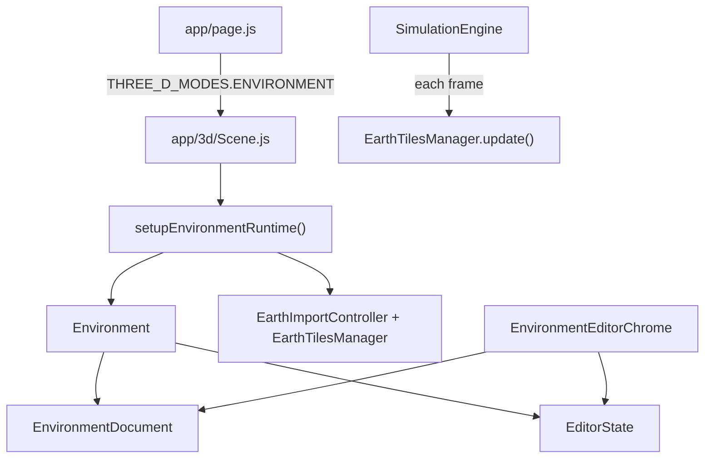

# Environment Editor

The environment editor is where you author the static world that simulations run in: roads, buildings, props, sky, and imported geography. It is a separate workspace from the simulation view, though both use the same Three.js scene stack.

Open it from the app menu (`Escape` → **Environment Editor**). The simulation workspace is the other 3D option in that same menu.

## What you can do here

- Place and transform buildings, props, and other static objects in the 3D scene.
- Draw roads and intersections on a 2D map overlay.
- Import real-world terrain preview and road networks from geographic data.
- Bake environment visuals (lighting, splats, and related outputs) for runtime use.

Changes live in an `EnvironmentDocument` until you bake or sync them into the runtime scene.

## Editor modes

Within the environment editor, `EditorState` tracks three modes. Only one is active at a time.

| Mode | ID | Purpose |
|------|----|---------|
| Scene | `scene` | Default 3D editing: select, move, rotate, scale, and place objects. |
| Map | `map` | Top-down 2D authoring for roads, intersections, buildings, and features. |
| Earth Import | `earth-import` | Preview Google Photorealistic 3D Tiles and import OSM roads for a geographic area. |

Enter **Map** or **Earth Import** from the environment editor menu. Both swap in dedicated chrome and hide the standard scene-editing panels (hierarchy, inspector, chunk outlines).

Press `Escape` to leave overlay modes. Earth Import also uses `Escape` to cancel an active preview.

## Document model

`EnvironmentDocument` is the canonical source of truth for authored content. It holds:

- **Roads** — nodes and edges (centerlines, width, lane count).
- **Buildings** — footprint records used by the bake pipeline.
- **Features** — placed props (traffic lights, signs, etc.).
- **Earth metadata** — anchor, bounds, provider IDs, and import timestamps after a geographic import.

The document supports `snapshot()` / `restoreSnapshot()` so preview flows (especially Earth Import) can stage changes and roll back safely.

Runtime meshes are rebuilt from the document through adapters such as `RoadRuntimeAdapter.syncRoadsFromDocument()`. Editing the document does not automatically update every 3D mesh; sync happens on explicit actions like Apply in Earth Import or hydration when entering map mode.

## Persistence (server-side)

Environment edits are saved to the backend, not the browser. Loading and saving are deliberately separate:

- **`EnvironmentLoader`** fetches the selected manifest and applies it to the one runtime shared by Simulation and Environment Editor. IGVC starts from its native template meshes; legacy hydrated road data does not replace those roads. Roads are rebuilt only after a map/Earth Import edit marks them as authored. Schema v3 `revision`, `visualLayer`, and `evidence` fields are copied onto environment state. Metric geometry is rebuilt and registered first. Preview materialization then loads `{ descriptorHash, accessHash }` into a detached preview group using VIS-05b AOI/LOD residency. Visual failures do not fail metric load; the 3D chrome shows `idle/loading/ready/error` preview status with retry, including `VISUAL_PREVIEW_BUDGET_EXCEEDED`. Preview meshes are marked non-selectable and are excluded from object-registry membership, collision geometry, LiDAR truth, perception scans, and measured cameras. `worldHash` is unchanged. Legacy descriptor-only references stay non-materializable until an access hash is attached.
- **`EnvironmentPersistence`** watches the document, registry, editor, and sky. It tracks only the last acknowledged server revision, allows one `PUT` in flight, and builds queued saves from the latest `Environment.toManifest()` at send time. Revision advances only from a successful response. External MCP updates over a dirty or in-flight draft expose a conflict and keep the local edits; they never report success or adopt an unacknowledged revision.
- **On page unload / tab hide** it flushes through the same queue with `keepalive`. It never issues a parallel speculative write. Autosave suspension is an asynchronous barrier: it cancels timers, invalidates queued generations, waits for the in-flight request to settle, and then lets the caller apply a clean remote document or keep a conflicted draft.

The storage contract is environment schema v3. v2 files load as revision `0` with implied null visual/evidence references; the first guarded save writes v3 revision `1`. Full replacement is `PUT /api/storage/environments/<id>` with `{ manifest, expectedRevision }`. Rename, duplicate, ID change, and delete require the same revision. Missing or stale revisions return HTTP `409` with `ENVIRONMENT_REVISION_CONFLICT` and `currentRevision`. Unguarded legacy bodies are rejected with `ENVIRONMENT_UNGUARDED_WRITE`. Catalog entries include `revision`. `clientRevision` is not a concurrency authority and is not written into v3 documents.

Display-name rename keeps visual and evidence references when `worldHash` is unchanged, including both descriptor and access hashes. Duplicating an environment, changing its ID, or importing onto a conflicting ID rebinds the descriptor to the destination world, creates a corresponding access sidecar with the same use selections, reuses compatible asset digests, and clears correspondence evidence. Missing or incompatible descriptors fail before the environment mutation. An older client that writes the same descriptor without `accessHash` preserves the existing sidecar; replacing the descriptor without a matching access hash is rejected.

The environment switcher in both 3D workspaces selects, creates, duplicates, renames, and deletes environments using the acknowledged revision. Selection is shared between Simulation and Editor and stored in server settings. The saved payload is `Environment.toManifest()` at `server/data/environments/<id>.json`. See [development.md](development.md) for the storage backend.

Validated visual-asset bytes live in the VIS-04 CAS under `server/data/visual-assets/`. Browser access is `VisualAssetClient` at `/api/storage/visual-assets` and `VisualLayerClient` at `/api/storage/visual-layers`. Public asset identities are source-bound use hashes, not filesystem paths or digest-only content URLs. Published assets cannot be deleted; only abandoned staging and expired reservations are cleaned. Uploads fail closed unless an operator configures owned-source grants in `visual-source-registry.json` (or `CEV_SIM_VISUAL_SOURCE_REGISTRY`). Generated bake outputs additionally require `CEV_SIM_BAKE_OUTPUT_SOURCE_IDS`. Spark and splat construction are initialized only when an explicitly started legacy bake selects the splat path. `pbr-mesh@1`, package admission, and automatic GC remain later work.

Building transforms update their authoritative footprint/height records as the gizmo moves; prop transforms update position and heading. Reload therefore reconstructs the edited location rather than the original runtime mesh.

## UI chrome

`EnvironmentEditorChrome` mounts the editor overlay stack:

- **Scene mode** — `EnvironmentEditorMenu`, hierarchy, inspector, selection handles, chunk outlines, bake progress, and a non-blocking visual-preview diagnostic for missing descriptor/access/assets, denied rights, material mismatch, and decoder failures.
- **Map mode** — `MapModeChrome` with `MapSurface`, road pen, building rect, and feature placement tools.
- **Earth Import mode** — `EarthImportModeChrome` with anchor/bounds fields, preview/apply controls, and layer toggles.

`EditorToolController` disables standard scene tools while map or earth-import modes are active.

## Chunks

Large environments are indexed in a chunk grid (`ChunkIndex`, `ChunkManager`). Objects are assigned to one or more chunks based on footprint bounds. Spatial radius/bounds queries support bake planning and visual residency. Semantic dirtiness is a typed mutation log (`insert`, `delete`, `move`, `material`, `visibility`, `entity-id`) with `semanticGeneration`; `loaded` / `prefetch` / `eviction` are operational only and never authorize bake reuse. Diagnostic `dirty` flags are not dependency keys. Building records used by bake planning are replaced from the canonical document (`syncBakeBuildingsFromDocument`), not appended. Chunk outlines can be toggled in scene mode to see how content is partitioned for baking and streaming.

Default chunk size is 20 meters. It is stored on the document and can differ per environment.

## Baking

The bake harness (`BakeProgressOverlay`, modules under `app/3d/environment/visualization/`) renders environment visuals into textures and related outputs. Baking runs as a simulation module while active.

VIS-06a adds an explicit `calibrated-projection@1` bake adapter. It requires
an owned `bake-snapshot` scene, snapshots its generation, camera pose,
calibration, and integer-nanosecond capture time, applies the shared asymmetric
K projection, and normalizes corrected readbacks to top-left rows. The default
`legacy-fov@1` bake path and existing vector/buffer conventions remain
unchanged. VIS-06b adds the opt-in asynchronous `captureAlignedProducts()`
path. It requires the owned `bake-snapshot`, explicit descriptor bindings,
source-use hashes, and an abort signal. Beauty and every visual G-buffer see
the same visible surfaces and OPAQUE/MASK alpha tests; no target visibility
filter, forced hidden-object visibility, or road-material boost is applied.
Target/building/tag masks are derived from the frontmost object-ID product so
other surfaces remain occluders. Oracle products require a separate
`analytic-truth` handle and explicit truth bindings. VIS-07 adds an in-memory
bake-job catalog: serializable `BakeRunConfig`, frozen `bake-snapshot` scenes,
UTF-8-stable planning, VIS-06b aligned capture, and local
`captured-appearance@1` with no model network. Version-1 jobs use
`BakeHarness.runVersion1Job()`. Press `b` runs the VIS-08/VIS-09 atomic no-model
path: flush acknowledged autosaves (`detachStaleVisual: true`), reserve a bake
generation, reuse unchanged capture units from a trusted bake-reuse manifest,
capture only invalidated aligned beauty/world-position/geometric-normal/
confidence/validity products, write deterministic per-chunk atlas PNG/GLB pages
(or explicit projected captured-radiance), commit the descriptor/access closure
(or a revision-free no-op), replace the durable bake-reuse root, and
rematerialize preview without rebuilding metric
truth. `createLegacyCompatibleBakeRunConfig` and
`?legacyBake=1` still reach `BakeHarness.start()`, which may health-check the
bake server; that path cannot promote through VIS-08. `capturePasses()` and
`captureFrame()` remain legacy defaults. VIS-10b owns optional material
estimation; VIS-17b owns the evidence catalog UI.

Press `b` in the environment editor to start or stop a bake run when a harness is configured. See the bake tests under `tests/bake-*.test.js` for expected behavior around determinism, splats, and render bundles.

## How it connects to the rest of the app



- `app/page.js` passes `mode={THREE_D_MODES.ENVIRONMENT}` to `TotalScene`.
- `setupEnvironmentRuntime()` creates the `Environment`, wires `EditorToolController`, and registers earth-import services on `Data`.
- `SimulationEngine` calls `earthTilesManager.update()` each frame so streamed tiles stay in sync with the camera (only while tiles are loaded).

## Tests

| File | What it covers |
|------|----------------|
| `tests/editor-core.test.js` | Chunks, typed mutations vs residency, editor state, selection, environment registry |
| `tests/editor-map-mode.test.js` | Map mode transitions, road pen, document hydration |
| `tests/earth-import-mode.test.js` | Earth import config, geospatial math, providers, isolation |
| `tests/bake-*.test.js` | Bake pipeline, incremental reuse, and promotion |

Run everything with `npm test`.

## Related docs

- [Visual Layer Implementation Plan](visual-layer-plan.md) — truth-first photoreal baking, hashed visual assets, and optional Google/3DGS tracks.
- [Earth Import](earth-import.md) — geographic preview, road import, API keys, and troubleshooting.
- [Simulation](simulation.md) — how the simulation workspace differs from environment authoring.
- [Assets](assets.md) — external data policy (scenarios, models, API keys).

## Source layout

```
app/3d/editor/              EditorState, tools, chunks, document model
app/3d/environment/         Environment container and visualization
app/3d/overlay/             React chrome (menus, inspectors, map/earth modes)
app/3d/earth/               Earth Import implementation
app/3d/skybox/              Procedural sky (preserved during earth import)
```
