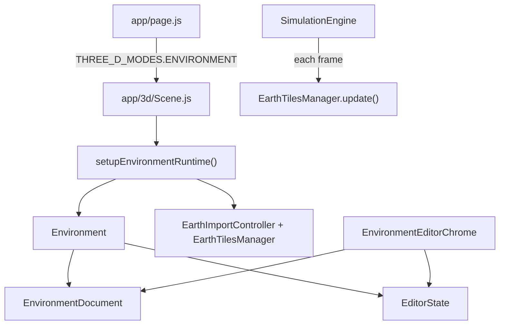

# Environment Editor

The environment editor is where you author the static world that simulations run in: roads, buildings, props, sky, and imported geography. It is a separate workspace from the simulation view, though both use the same Three.js scene stack.

Open it from the app menu (`Escape` → **Environment Editor**). The simulation workspace is the other 3D option in that same menu.

## What you can do here

- Place and transform buildings, props, and other static objects in the 3D scene.
- Draw roads and intersections on a 2D map overlay.
- Import real-world terrain preview and road networks from geographic data.
- Bake environment visuals (lighting, splats, and related outputs) for runtime use.

Changes live in an `EnvironmentDocument` until you bake or sync them into the runtime scene.

## Editor modes

Within the environment editor, `EditorState` tracks three modes. Only one is active at a time.

| Mode | ID | Purpose |
|------|----|---------|
| Scene | `scene` | Default 3D editing: select, move, rotate, scale, and place objects. |
| Map | `map` | Top-down 2D authoring for roads, intersections, buildings, and features. |
| Earth Import | `earth-import` | Preview Google Photorealistic 3D Tiles and import OSM roads for a geographic area. |

Enter **Map** or **Earth Import** from the environment editor menu. Both swap in dedicated chrome and hide the standard scene-editing panels (hierarchy, inspector, chunk outlines).

Press `Escape` to leave overlay modes. Earth Import also uses `Escape` to cancel an active preview.

## Document model

`EnvironmentDocument` is the canonical source of truth for authored content. It holds:

- **Roads** — nodes and edges (centerlines, width, lane count).
- **Buildings** — footprint records used by the bake pipeline.
- **Features** — placed props (traffic lights, signs, etc.).
- **Earth metadata** — anchor, bounds, provider IDs, and import timestamps after a geographic import.

The document supports `snapshot()` / `restoreSnapshot()` so preview flows (especially Earth Import) can stage changes and roll back safely.

Runtime meshes are rebuilt from the document through adapters such as `RoadRuntimeAdapter.syncRoadsFromDocument()`. Editing the document does not automatically update every 3D mesh; sync happens on explicit actions like Apply in Earth Import or hydration when entering map mode.

## Persistence (server-side)

Environment edits are saved to the backend, not the browser. Loading and saving are deliberately separate:

- **`EnvironmentLoader`** fetches the selected manifest and applies it to the one runtime shared by Simulation and Environment Editor. IGVC starts from its native template meshes; legacy hydrated road data does not replace those roads. Roads are rebuilt only after a map/Earth Import edit marks them as authored.
- **`EnvironmentPersistence`** watches the document, registry, editor, and sky. Changes trigger a debounced `PUT /api/storage/environments/<id>` (about 1.5s after the last edit, with an 8s cap so long drag sessions still save).
- **On page unload / tab hide** it flushes a final save with a `keepalive` request.

Building transforms update their authoritative footprint/height records as the gizmo moves; prop transforms update position and heading. Reload therefore reconstructs the edited location rather than the original runtime mesh.

The environment switcher in both 3D workspaces selects, creates, duplicates, renames, and deletes environments. Selection is shared between Simulation and Editor and stored in server settings. The saved payload is `Environment.toManifest()` at `server/data/environments/<id>.json`. See [development.md](development.md) for the storage backend.

## UI chrome

`EnvironmentEditorChrome` mounts the editor overlay stack:

- **Scene mode** — `EnvironmentEditorMenu`, hierarchy, inspector, selection handles, chunk outlines, bake progress.
- **Map mode** — `MapModeChrome` with `MapSurface`, road pen, building rect, and feature placement tools.
- **Earth Import mode** — `EarthImportModeChrome` with anchor/bounds fields, preview/apply controls, and layer toggles.

`EditorToolController` disables standard scene tools while map or earth-import modes are active.

## Chunks

Large environments are indexed in a chunk grid (`ChunkIndex`, `ChunkManager`). Objects are assigned to one or more chunks based on footprint bounds. Chunk outlines can be toggled in scene mode to see how content is partitioned for baking and streaming.

Default chunk size is 20 meters. It is stored on the document and can differ per environment.

## Baking

The bake harness (`BakeProgressOverlay`, modules under `app/3d/environment/visualization/`) renders environment visuals into textures and related outputs. Baking runs as a simulation module while active.

Press `b` in the environment editor to start or stop a bake run when a harness is configured. See the bake tests under `tests/bake-*.test.js` for expected behavior around determinism, splats, and render bundles.

## How it connects to the rest of the app



- `app/page.js` passes `mode={THREE_D_MODES.ENVIRONMENT}` to `TotalScene`.
- `setupEnvironmentRuntime()` creates the `Environment`, wires `EditorToolController`, and registers earth-import services on `Data`.
- `SimulationEngine` calls `earthTilesManager.update()` each frame so streamed tiles stay in sync with the camera (only while tiles are loaded).

## Tests

| File | What it covers |
|------|----------------|
| `tests/editor-core.test.js` | Chunks, editor state, selection, environment registry |
| `tests/editor-map-mode.test.js` | Map mode transitions, road pen, document hydration |
| `tests/earth-import-mode.test.js` | Earth import config, geospatial math, providers, isolation |
| `tests/bake-*.test.js` | Bake pipeline behavior |

Run everything with `npm test`.

## Related docs

- [Visual Layer Implementation Plan](visual-layer-plan.md) — truth-first photoreal baking, hashed visual assets, and optional Google/3DGS tracks.
- [Earth Import](earth-import.md) — geographic preview, road import, API keys, and troubleshooting.
- [Simulation](simulation.md) — how the simulation workspace differs from environment authoring.
- [Assets](assets.md) — external data policy (scenarios, models, API keys).

## Source layout

```
app/3d/editor/              EditorState, tools, chunks, document model
app/3d/environment/         Environment container and visualization
app/3d/overlay/             React chrome (menus, inspectors, map/earth modes)
app/3d/earth/               Earth Import implementation
app/3d/skybox/              Procedural sky (preserved during earth import)
```
