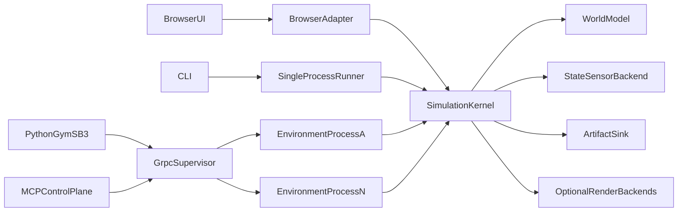

# Headless Simulation Implementation Plan

This document is the shared implementation handoff for humans, Cursor, and
Codex. It is the authority for scope, order, and acceptance gates. The
language-neutral API authority is
[`proto/cev_sim/headless/v1/headless.proto`](../proto/cev_sim/headless/v1/headless.proto).

## Status

- Current milestone: **PR 12 — implementation complete; external hardware acceptance pending**
- Next planned milestone: **None — the numbered headless implementation roadmap is complete**
- Default implementation/review reasoning level: **Extra High**
- Last updated: **2026-08-31** (browser play-loop canonical-state v2)

Progress:

- [x] PR 1 — Contracts, plan, and characterization fixtures
- [x] PR 2 — UI-independent simulation kernel
- [x] PR 3 — Deterministic reset, timers, hashing, and teardown
- [x] PR 4 — Shared world description and headless vehicle plant
- [x] PR 5 — State sensors and episode semantics
- [x] PR 6 — Single-process runner, CLI, and artifacts
- [x] PR 7 — Process-isolated batch supervisor and gRPC
- [x] PR 8 — Python Gymnasium and Stable-Baselines3 package
- [x] PR 9 — MCP, experiment, result, and logging integration
- [x] PR 10 — Deterministic CPU/BVH LiDAR
- [x] PR 11 — Pooled offscreen GPU sensors and large-payload transport
- [x] PR 12 — CI, parity, performance, distribution, and release gates

## Locked decisions

- Keep one authoritative JavaScript kernel. Python owns RL integration and
  tensors, not simulator semantics.
- Target exact replay for the same build, platform, backend, reset seed, and
  action tape. Use tolerance-tested semantic parity across macOS and
  Linux/Jetson; do not promise cross-GPU pixel equality.
- Workers accept immutable resolved `cev-sim.run-bundle` inputs. Existing
  MCP/REST services remain the authoring, validation, resolution, and storage
  control plane.
- Ship measured IMU, GNSS, wheel odometry, and task signals first. Oracle
  values may support internal scoring but cannot appear in the policy
  observation.
- An external policy supplies one synchronous action per policy step.
  Configurable action repeat advances a fixed number of simulation steps.
- Reward and termination are simulator-owned, versioned contracts. The first
  profile combines route progress with collision, off-road, wrong-way,
  completion, and optional smoothness terms.
- Use one OS process per environment. Initially support 8–32 environments per
  workstation while keeping the transport and spaces suitable for later
  vectorized backends.
- Use full SFLog for CI/evaluation and compact summaries plus sampled/failure
  SFLogs for training.
- Defer a multi-user scheduler, a Python-native simulation kernel, and a
  native WebGPU dependency. Unsupported backends fail capability validation
  rather than degrading silently.

## Architecture



The current extraction seam is the fixed phase graph in
[`app/simulation/SimulationEngine.js`](../app/simulation/SimulationEngine.js).
The browser adapter will retain RAF pacing, Three.js rendering, overlays,
controls, and UI subscriptions. The kernel will own authoritative state
transitions only.

## Protobuf v1 contract

The v1 schema defines:

- `GetCapabilities`
- `CreateBatch`
- `ResetBatch`
- `StepBatch`
- `FinalizeBatch`
- `CloseBatch`
- `Health`

### Immutable episode identity

Each accepted `EpisodeSpec` is immutable. A reset with a different seed sends
a new spec. The eventual `episodeHash` is the SHA-256 of canonical,
version-tagged simulation-semantic data:

```text
protocol major
simulation-semantic bundle hash
reset seed
action repeat
maximum episode steps
observation profile id, version, and config hash
reward profile id, version, and config hash
sorted backend kind, capability id, version, and config hash selections
```

`ResourceLimits` and `ArtifactPolicy` are deliberately separate and excluded
from `episodeHash`. If a resource limit fires, the outcome is an
infrastructure error. It is not a simulator transition and must not be
reported as a Gymnasium truncation.

`trajectoryHash` will combine `episodeHash` with canonical accepted actions
and authoritative per-step state. Wall time, renderer diagnostics, logging
policy, output paths, and artifact bytes are excluded.

### Batch and tensor rules

- Environment indexes are unique, zero-based, contiguous, and returned in
  ascending order.
- Batched reset/action entries are sorted by environment index and contain no
  duplicates.
- Dict-space and tensor-map entries are sorted by UTF-8 key/name bytes.
- Tensor payload length must exactly match dtype and shape.
- State observations begin as packed Protobuf bytes. Shared-memory descriptors
  are reserved in v1 for later dense LiDAR/camera payloads.
- RPC-level `ErrorStatus` describes malformed/batch-wide failure. Per-result
  status describes one environment and must never be hidden by a successful
  batch envelope.
- `terminated` means the simulated task reached success or failure.
  `truncated` means a normal semantic episode bound such as max steps was
  reached. Crash, OOM, watchdog, and artifact failure are errors.

### Compatibility policy

- Preserve existing field numbers.
- Make additive v1 changes only.
- Negotiate protocol major/minor before batch creation.
- Reject an unsupported major version.
- Keep generated JavaScript/Python bindings reproducible and isolated; never
  hand-edit them.

## Characterization baseline

PR 1 adds:

- [`tests/fixtures/headless/action-tape.v1.json`](../tests/fixtures/headless/action-tape.v1.json)
- [`tests/fixtures/headless/characterization.v1.json`](../tests/fixtures/headless/characterization.v1.json)
- [`scripts/generate-headless-fixtures.mjs`](../scripts/generate-headless-fixtures.mjs)
- [`tests/headless-contract.test.js`](../tests/headless-contract.test.js)

The fixture drives the production `SimulationEngine` through queued control
topics and records:

- Integer time and step progression
- Authoritative fixed-step phase order
- Input application ordering
- Vehicle position, velocity, and steering
- Selected/applied/achieved control state
- Assertion state
- Aggregate deterministic metrics
- Action-tape and trajectory hashes
- In-place reset replay and fresh-runtime equivalence

Regenerate with:

```bash
npm run fixtures:headless
```

A fixture delta is a contract review event. Do not regenerate merely to make
a failing test pass.

## Staged implementation

### PR 1 — Contracts, plan, and characterization fixtures

Deliver:

- Root [`AGENTS.md`](../AGENTS.md) with Codex/Cursor instructions.
- This discoverable repository plan and links from architecture/gap docs.
- Protobuf v1 lifecycle, capability, typed-space, tensor, error, episode,
  resource, artifact, and health contracts.
- Canonical current-runtime action tape and deterministic regeneration/check.

Gate:

- No production runtime behavior changes.
- Focused contract/fixture tests, full tests, and lint pass.
- Re-running fixture generation produces no diff.

### PR 2 — Extract the UI-independent simulation kernel

Deliver:

- Add `app/simulation/kernel/SimulationKernel.js` and a narrow runtime-context
  contract for vehicles, devices, physics, scripts, scenarios, controls,
  telemetry, and topic routing.
- Move fixed-step phases, integer clock advancement, queued input handling,
  pure state snapshots, and lifecycle events out of `SimulationEngine`.
- Keep `SimulationEngine` as browser adapter for RAF, rendering, overlays,
  viewport controls, and UI subscriptions.
- Move candidate and scenario visualization updates outside authoritative
  transitions while preserving telemetry/state behavior.

Gate:

- Kernel imports and steps in Node with browser and graphics globals absent.
- Existing browser/runtime tests and committed characterization remain equal.
- Phase names/order do not change.

### PR 3 — Deterministic reset, timers, hashing, and teardown

Deliver:

- Explicit `prepare/reset/step/finalize/dispose` lifecycle contracts for every
  mutable runtime component.
- Reset vehicle internals, physics/contact state, scripts and RNGs, binding
  timers, sensor schedules/queues, controls, transforms, scenarios,
  assertions, telemetry, and inputs.
- Replace managed-run wall-clock timers in
  [`app/scripting/bindings/BindingRuntime.js`](../app/scripting/bindings/BindingRuntime.js)
  with integer simulation-clock scheduling.
- Add canonical state, episode, and trajectory hashing.

Gate:

- Hundreds of reset/replay cycles equal fresh-process runs and retain bounded
  memory.
- Seed/action changes alter trajectory hash; logging policy does not.

### PR 4 — Shared world description and headless vehicle plant

Status: **Complete (2026-08-30).** `cev-sim.world-description` v1 is the
browser/Node world contract. Resolved runs embed its SHA-256 identity and the
sorted `rapier3d-swept-prism-v1` physics selection. `npm run test:headless`
is the focused PR 4 gate.

Deliver:

- Extract environment normalization into a UI-independent world description
  used by browser and Node materializers.
- Cover built-in IGVC and authored roads, buildings, and features with stable
  IDs, transforms, bounds, route semantics, and collision geometry.
- Add a headless runtime context/data facade.
- Separate vehicle state/kinematics from GLTF/Three.js presentation. Support
  built-in and manifest vehicles through one headless kinematic plant without
  loading render assets.
- Keep Rapier injected, pin/record backend identity, and defer a deterministic
  package swap until differential tests establish compatibility.

Gate:

- Real resolved IGVC/authored bundles construct and step in Node without
  DOM/WebGL.
- Browser/headless vehicle, route, and contact snapshots meet declared
  tolerances.

### PR 5 — State sensors and episode semantics

Status: **Complete (2026-08-30).** The Node-safe backend capability is
`deterministic-state-sensors` version `1`; `HeadlessEpisode` owns the
`measured-state` v1 and `route-safety` v1 contracts without changing
Protobuf v1 or run-manifest v9. `npm run test:headless` is the focused PR 5
gate.

Deliver:

- Add a sensor-backend registry separate from the Three.js runtime registry.
- Port/reuse deterministic measured IMU, GNSS, and wheel-odometry models.
- Define fixed observations with value, validity, sequence, `is_new`, and
  `age_steps`; expose task signals without oracle leakage.
- Apply normalized speed/steering actions through existing control limits.
- Implement configurable action repeat and a versioned route/safety reward,
  returning all reward terms in `info`.

Gate:

- Compatible spaces pool; incompatible spaces fail at creation.
- Sensor, observation, reward, termination, and truncation goldens pass.
- Camera/LiDAR requests fail at capability validation until supported.

### PR 6 — Single-process runner, CLI, and artifacts

Status: **Complete (2026-08-31).** The direct `HeadlessRunner` accepts only
verified portable bundles, the `cev-sim` CLI exposes validate/inspect/run/replay,
and atomic core artifacts plus policy-controlled native SFLog require no web
server or browser. The focused, fixture, macOS CLI/SFLog, full-suite, lint, and
Ubuntu CI gates pass.

Deliver:

- Add `server/headless/HeadlessRunner.js` and `bin/cev-sim.js`.
- Implement `run`, `validate`, `inspect`, and action-tape replay commands.
- Consume resolved bundles only; keep resolution a separate operation.
- Emit JSON/JSONL on stdout, diagnostics on stderr, stable exit codes, and
  atomic output directories.
- Reuse SFLog and logging services through an injected artifact sink.
- Produce `run-results.json`, resolved bundle/provenance attachments, hashes,
  and profile-controlled SFLog.

Gate:

- Real bundles run without server/browser on macOS and Ubuntu.
- Assertion failure produces documented nonzero exit.
- Existing replay inspection reads emitted SFLogs.

### PR 7 — Process-isolated supervisor, gRPC, and limits

Status: **Complete (2026-08-31).** The
Node 22 supervisor owns one non-detached child per environment, dynamically
serves protocol 1.1 over Unix sockets or explicit insecure TCP, enforces
resource/watchdog/restart policy, and preserves direct-runner hashes and
packed observations. The focused 1/8/16/32-process, parity, failure, limit,
cancellation, shutdown, backpressure, orphan, full-suite, and Ubuntu CI gates
pass.

Deliver:

- Add a supervisor, one `child_process` environment entrypoint, and gRPC over
  Unix-domain sockets with opt-in TCP.
- Fan out batched resets/steps concurrently and aggregate stable order.
- Enforce worker count, heap/RSS, actor/sensor, observation/queue/artifact
  bytes, wall watchdogs, episode bounds, and restart budgets.
- Document Linux cgroups/container hard limits and macOS best-effort limits.
- Keep initial state arrays in Protobuf; do not activate shared memory yet.

Gate:

- 1/8/16/32-process tests pass.
- Crash, timeout, limit, backpressure, shutdown, and orphan-process tests pass.
- Infrastructure failure is never returned as an RL transition.

### PR 8 — Python Gymnasium and Stable-Baselines3 package

Deliver:

- Add `python/pyproject.toml`, generated stubs, NumPy codecs, connection and
  process lifecycle, `CevSimEnv`, and an SB3 `VecEnv` adapter.
- Support `reset(seed=N)`, synchronous steps, final observations, close, and
  clear protocol/CLI compatibility errors.
- Connect to a supplied local/remote supervisor or launch an installed
  configured worker; never invoke network-dependent `npx` implicitly.

Gate:

- Gymnasium and SB3 environment checkers pass.
- A short PPO smoke test trains against eight environments.
- Seeded Python, CLI, and direct worker trajectories match.
- Python cleanup terminates launched processes.

### PR 9 — MCP, experiment, result, and logging integration

Deliver:

- Preserve current storage/authoring APIs.
- Add headless start/status/cancel/result operations while retaining browser
  launch defaults.
- Route results through experiment-result, baseline, LogService, and
  `fusion://` resource surfaces.

Gate:

- MCP runs an experiment without a browser tab.
- Cancellation cleans all workers.
- Existing result/log inspection reads outputs.

### PR 10 — Deterministic CPU/BVH LiDAR

Deliver:

- Add shared analytic collision/perception geometry and a
  `three-mesh-bvh` CPU LiDAR backend.
- Preserve coordinate frames, scan timing, seeded noise/dropout,
  synchronization, point layout, and queue limits.
- Declare backend/fidelity identity and differential tolerances.

Gate:

- CPU-only macOS/Linux runs produce deterministic point clouds.
- Simple-scene results meet declared GPU-fixture tolerances.

Completed 2026-08-31. Resolved LiDAR bundles now persist portable canonical
geometry twins and conditionally include their dependency hash. Backend kind 3
is `deterministic-cpu-bvh-lidar` version `1`, with configuration hash
`488de17bbf8ecf635c18841cd64a9638e011a94a8d9fbb93e4a53943f38bd96d`.
The migration intentionally changes resolved, simulation-semantic, episode,
and trajectory hashes for newly resolved LiDAR runs; world hashes, non-LiDAR
bundle hashes, physics, manifest v9, run-bundle v1, protocol 1.1, and the
measured-state observation contract remain unchanged.

### PR 11 — Pooled offscreen GPU sensors and large payloads

Status: **Complete (2026-08-31).** Protocol 1.2 adds measured-perception,
hardware-probed pooled Chromium/WebGL2 sensors, conditional canonical analytic
render scenes, local shared-memory tensor references, and GPU/shared-memory
resource limits while retaining inline protocol 1.1 compatibility.

Deliver:

- Add a pooled renderer sidecar rather than one browser per environment.
  Prefer headless Chromium/WebGL2 first; keep native Node WebGPU experimental.
- Move camera/GPU LiDAR behind sensor capabilities while preserving capture
  stamps, async latency, sync groups, queues, and provenance.
- Activate named mmap/shared-memory rings with generation, sequence, offset,
  length, dtype, and shape descriptors.
- Record renderer/GPU/driver/backend versions and provide Jetson preflight.

Gate:

- Multi-environment camera/LiDAR runs retain bounded GPU memory.
- Stale shared-memory frames are rejected.
- State-only workers do not depend on Chromium/GPU packages.

Completed gate evidence: the 1/8/16-environment fake-pool soak retains one
browser launch, one configured context, a plateaued scene cache, bounded
tracked allocation, and zero environment allocation after close. Hardware
Chrome 152 on ANGLE Metal/Apple M1 Max passes camera/LiDAR readback, CPU/GPU
LiDAR comparison, and real process-isolated UDS shared-memory integration.
Malformed/stale shared references and torn/truncated regions are rejected;
the unconfigured dependency-isolation path does not load the renderer adapter.
The complete Node suite reports 588 passes and two expected hardware skips,
the hardware-enabled GPU suite passes all seven tests, the Python suite passes
all 42 tests, generated bindings are current, lint has no errors, and the
characterization fixture has no delta.

### PR 12 — CI, parity, performance, distribution, and release

Status: **Implementation complete (2026-08-31); candidate acceptance awaits
the dedicated x64 NVIDIA and Jetson ARM64 reports.** Hosted CPU and
cross-platform workflows, semantic parity aggregation, scheduled soak and
benchmark gates, capability-gated hardware workflows, and the manual internal
candidate workflow are defined. The release builder emits one dependency-
closed Apache-2.0 npm tarball plus a licensed pure-Python wheel and sdist,
compatibility manifest, and checksums without publishing to a registry.

Deliver:

- Linux/macOS headless smoke and parity CI, Python/protocol checks, reset and
  memory soak, and separately scheduled rendered-sensor tests.
- Repeatable 1/8/16/32-environment benchmarks for steps/s, policy latency,
  RSS, CPU, artifact throughput, and reset time.
- Jetson validation/deployment documentation and scripts.
- Coordinated npm CLI/worker and PyPI adapter versions with a compatibility
  matrix.
- Update README, architecture, run-manifest, SFLog, MCP, and decision docs.

Release gate:

- Deterministic same-platform replay and browser/headless semantic parity.
- Verified in-place reset and bounded memory/process/log behavior.
- 8–32 state environments and SB3 PPO smoke.
- Machine-readable results and sampled/full SFLogs.
- Explicit unsupported-backend failures.
- CPU LiDAR and capability-gated pooled rendered sensors.

## Verification required in every PR

Always run:

```bash
npm run lint
npm test
```

Add and run focused headless, parity, protocol, CLI, soak, and Python commands
as their milestones introduce them. Any change to kernel, world, vehicle,
sensor, control, script, scenario, reward, or physics behavior must be
compared with the committed characterization.

## Codex/Sol reasoning guidance

- **Extra High is the default** for contract, lifecycle, sensor/reward, CLI,
  Python, MCP, CPU LiDAR, CI, implementation, and review work.
- **Ultra when available** for PR 2 kernel extraction, PR 4 world/vehicle
  separation, PR 7 process/protocol failure semantics, PR 11 GPU/shared
  memory, and final cross-cutting parity review. If unavailable, use Extra
  High and split the milestone into smaller sessions.
- **High only for bounded mechanical tasks** after design is locked:
  generated bindings, documentation, isolated option plumbing, fixture
  migration, and straightforward test additions.
- Use a fresh context for each PR and provide the exact milestone and gate.
  Request implementation plus tests, not a redesign of the roadmap.

## External design references

- [Gymnasium environment API](https://gymnasium.farama.org/api/env/)
- [Gymnasium vector environments](https://gymnasium.farama.org/api/vector/)
- [Stable-Baselines3 custom environments](https://stable-baselines3.readthedocs.io/en/master/guide/custom_env.html)
- [CARLA synchronous mode and fixed time-step](https://carla.readthedocs.io/en/latest/adv_synchrony_timestep/)
- [Rapier JavaScript builds and determinism](https://github.com/dimforge/rapier.js)
- [Node child processes](https://nodejs.org/api/child_process.html)
- [Node worker resource limits](https://nodejs.org/api/worker_threads.html)
- [Chrome headless GPU testing](https://developer.chrome.com/blog/supercharge-web-ai-testing)
- [Isaac Lab reinforcement-learning architecture](https://docs.nvidia.com/learning/physical-ai/getting-started-with-isaac-lab/latest/train-your-first-robot-with-isaac-lab/02-how-isaac-lab-accelerates-reinforcement-learning.html)

## Decision log

### 2026-09-01 — Headless Runs workspace (operational follow-on)

Add a browser Headless Runs workspace backed by a durable FIFO queue for saved
experiment suites only. This is not PR 13: it does not change run-bundle,
episode-hash, or trajectory-hash contracts. Queue admission freezes immutable
bundle sidecars, executes exactly one isolated case at a time, and exposes
same-origin `/api/headless` plus throttled `headless-runtime` events. Remote
visual streaming, parallel scheduling, distributed queues, and pause/resume
remain deferred.

### 2026-08-30 — Runtime and language boundary

Use the existing JavaScript runtime as the reference kernel and expose a
native-looking Python Gymnasium/SB3 adapter over a language-neutral protocol.
This avoids duplicate simulator semantics while preserving Python RL tooling.

### 2026-08-30 — Initial fidelity and scaling

Prioritize state sensors and route/safety rewards. Use one process per
environment for 8–32 environments. Treat vectorized/GPU-native simulation as
a future backend, not a rewrite prerequisite.

### 2026-08-30 — PR 1 contract baseline

Define Protobuf before transport implementation, separate semantic episode
identity from operational policy, reserve shared-memory descriptors, and
characterize the current production `SimulationEngine` without changing its
runtime behavior.

### 2026-08-30 — PR 2 kernel extraction

Extract authoritative fixed-step state, phase execution, queued input handling,
telemetry, and lifecycle events into a Node-importable `SimulationKernel`
behind a narrow runtime-context facade. Keep `SimulationEngine` as the browser
adapter for RAF pacing, rendering, viewport controls, baking, and overlays.
The legacy `candidate-viz` phase name remains part of the characterization,
but graphics updates now run after authoritative transitions. No Protobuf,
manifest, characterization fixture, or hash contract changed.

### 2026-08-30 — PR 3 deterministic lifecycle and episode identity

Keep `resolvedHash` as the full portable-bundle integrity hash and add
`simulationSemanticHash` for authoritative simulation content. Logging,
artifact/resource policy, wall pacing, and presentation-only settings do not
change `episodeHash`; seed, episode bounds, profile refs, and sorted backend
selections do. The shared kernel now owns explicit
`prepare/reset/step/finalize/dispose` orchestration, a bounded per-step
trajectory hash chain, simulation-clock managed timers, complete run-state
reset, and reverse-order teardown. Fresh-process and 500-cycle in-place reset
soaks produce the same trajectory hash with bounded heap and component counts.

### 2026-08-30 — PR 4 world, plant, and collision identity

Normalize environment schema-v2 documents into a versioned, canonical
`cev-sim.world-description` v1 before either browser or Node materializes
them. Explicitly authored domains, including empty arrays, override persisted
hydrated template data; persisted data overrides deterministic template
defaults. The pure IGVC default now owns roads, signs, barrels, and seeded
buildings, so browser-only IGVC bootstrap geometry is no longer authoritative.
Existing road IDs and `hashEnvironmentRoadNetwork` values remain unchanged.

Resolved runs retain their original environment manifest/hash for portable
bundle integrity and add `world`, `dependencyHashes.world`, and sorted backend
selections. Simulation-semantic environment identity is the world hash, so PR
4 intentionally changes resolved, simulation-semantic, episode, and trajectory
hashes without changing Protobuf or manifest schema versions. Old v1 bundles
are verified in their original form and acquire the new derived fields when
re-resolved.

Pin Dimforge Rapier at `0.19.3`; Node loads the matching
`@dimforge/rapier3d-compat` distribution because the non-compat package's
entry is bundler-only. The physics selection capability is
`rapier3d-swept-prism-v1`; its config hash covers gravity, vehicle AABB
semantics, continuous XZ SAT plus Y-slab contact version, impact backoff, and
ordered transitions. Rapier owns fixed/kinematic bodies, while the shared
swept-prism solver is authoritative for first impact. Buildings are exact
deterministically triangulated extrusions, features are oriented box prisms,
and roads are non-colliding drivable surfaces. Vehicle/browser numeric parity
tolerance is `1e-9`; IDs, road/world hashes, and contact arrays are exact.

`KinematicVehiclePlant` defines local-`+X` bicycle integration with world
heading `(cos(yaw), 0, -sin(yaw))`, explicit Euler ordering, and manifest
wheelbase/steering limits. BigCar, IGVCCar, and manifest vehicles use it;
ScenarioCar retains keyframe/static semantics and unmanaged PhysicalVehicle
retains linear motion. The headless context composes isolated bindings,
signals, scenarios, vehicles, world, and injected physics without GLTF, DOM,
WebGL, or asset decoding. Enabled sensor requests fail explicitly until PR 5.

### 2026-08-30 — PR 5 measured-state and episode contracts

Add backend kind `STATE_SENSOR` capability `deterministic-state-sensors`
version `1`, with config hash
`dc27525458e0f720321213cd0a1abac8842266ae86f3d82172d8cda518924cf5`.
Browser and headless runtimes share pure WGS84 geodesy, fixed-step scheduling
and delivery, seeded streams, and IMU/GNSS/wheel-odometry measurement models.
GNSS dropout retains the last delivery; outage delivers a new invalid zero
fix. Custom manifest kinematics now feed both measurements and route metrics.

Select local immutable presets through existing `ProfileRef` fields. The
single `measured-state` v1 config hash is
`5c81866540bbdf0031f6c700554d65c7becc6fe76b5abaa5e81a20f14aa99e6d`.
`route-safety` v1 registers all 16 termination/smoothness combinations; its
default config hash is
`29dd55136f4207d78b8c3e9d4202f33849f12d9b415c7ed17fff641ee876b1f4`.
The `normalized-speed-steering` v1 action-space hash is
`283885ba2896078f0272a8d50c65bf01ee7ccf3787ec3bb4e1f10e42efa7a652`.
Observation-space hashes are dynamic over the complete sorted sensor ID/type
layout, deliberately excluding declaration order and calibration.

`max_episode_steps` counts accepted external actions; `action_repeat` counts
fixed kernel substeps. The action is recorded once in the transition hash and
resubmitted through candidate `ControlRuntime` authority every substep. Safety
is observed on every substep and charged once per policy transition. Stable
reward ordering, configurable safety stops, explicit scenario/assertion
behavior, failure precedence, success mapping, and policy/simulation bound
truncations are implemented in `HeadlessEpisode`. Camera/LiDAR/unknown enabled
requests fail before preparation; sensor-disabled direct kernel use remains
compatible. Protobuf field numbers, manifest version, resolved hashes, and the
PR 1 characterization fixture are unchanged.

### 2026-08-30 — PR 6 direct runner, CLI, and artifacts

Wrap `HeadlessEpisode` in a single-environment, same-process `HeadlessRunner`
with guaranteed teardown. Accept only verified `cev-sim.run-bundle` v1
envelopes; validation never resolves or imports authoring data. Extract the
existing full resolved-run hash implementation for shared storage/runner use
without changing its canonicalization or any committed hash contract.

The `cev-sim` CLI defines validate, inspect, streaming run, and policy-tape
replay commands. Machine records use stdout, diagnostics use stderr, and exit
codes distinguish semantic, usage, input/capability, artifact, runtime, and
interrupt outcomes. Policy tapes use the new
`cev-sim.headless.policy-action-tape` v1 kind; the PR 1 topic tape is
unchanged. The runner establishes simulation-time telemetry at reset so first
step trajectory hashing and SFLog checkpoints are independent of wall time.

Core JSON artifacts publish through a sibling staging directory and atomic
rename. Evaluation retains full SFLog, training deterministically samples or
failure-promotes it, and disabled omits it. A transport-injected
`RecordingController` writes directly through `LogService`, preserving SFLog
v1 and existing Replay/Analysis readers. Protobuf v1, run-manifest v9,
run-bundle v1, simulator ordering, profile identities, the characterization
fixture, and episode/trajectory hash algorithms are unchanged.

### 2026-08-31 — PR 7 process-isolated supervisor and gRPC

Advertise protocol 1.1 and add only `EnvironmentHealth.batch_id`,
`restart_count`, and `requires_reset` to Protobuf v1. Load that schema at
runtime with pinned grpc-js/proto-loader versions and keep JavaScript bindings
ungenerated. Unix sockets are the local default; insecure TCP is explicit and
non-loopback binding requires a second opt-in.

Share bundle verification, episode lifecycle, artifacts, results, and teardown
through `HeadlessSession`. The supervisor owns one advanced-serialization IPC
child per environment, one request in flight per child, stable concurrent
batch aggregation, and an all-or-nothing create boundary. A crash, timeout,
uncertain backpressure dispatch, memory breach, or operational resource breach
kills that process, consumes a restart, and requires reset without replaying
the action or manufacturing a transition. Safety and permissive presets bound
workers, RPC payloads, memory, actors, sensors, observations, aggregate queues,
artifacts, wall time, and restarts. These policies and artifact paths remain
outside all simulation-semantic hashes. Initial observations remain inline
packed Protobuf bytes; shared memory, Python, MCP, rendered sensors, and
distributed scheduling remain deferred.

### 2026-08-31 — PR 8 Python Gymnasium and Stable-Baselines3 package

Add the Python 3.10–3.13 `cev-sim` package as a synchronous protocol 1.1
client. `CevSimEnv` owns a one-environment batch and follows Gymnasium reset,
step, seed, terminal-observation, and close semantics. The optional
`CevSimVecEnv` owns one process-isolated batch, follows the SB3 `VecEnv`
autoreset contract, retains terminal observations and finalization JSON, and
fails closed if a vector step is only partially successful.

Use RFC 8785 canonical JSON and generated Protobuf 7/gRPC stubs to preserve
JavaScript bundle bytes. Limit PR 8 to inline, little-endian measured-state
tensor dictionaries and the normalized float32 action box; shared memory,
rendered sensors, TLS, heterogeneous bundles, and Gymnasium `VectorEnv` remain
deferred. Explicit local launch owns a private Unix socket and the complete
supervisor process group; external endpoints are never terminated. Capability
negotiation, Gymnasium/SB3 checkers, Python/CLI/direct-worker byte and hash
parity, partial/RPC failure cleanup, and an eight-environment PPO smoke test
pass. Protocol 1.1, Protobuf fields, run-manifest and run-bundle versions,
profile/backend hashes, episode/trajectory hash algorithms, and the committed
characterization fixture are unchanged.

### 2026-08-31 — PR 9 MCP, experiment, result, and logging integration

Add one Express-owned `HeadlessExperimentService` and inject it into every
stateless MCP server instance. `experiment_run_start` now accepts `execution`;
browser remains the default, while headless execution atomically resolves and
validates the complete deterministic case expansion before it creates a
result. One global queue runs cases sequentially in isolated worker processes.
Pause/resume stay browser-only, and status/cancel route by persisted result
ownership.

Managed workers run `SimulationKernel` directly under reference authority with
route-follower, script, or script-with-route controllers. They accept only no
sensors or deterministic state sensors and require a positive manifest bound,
max-duration, or finite time/step finish trigger. Candidate control, external
ROS, camera, LiDAR, and unknown backends fail preflight. Managed episode
identity uses reset seed, action repeat one, sorted backend selections, and the
authored bound; no policy action is injected or recorded. Protobuf v1,
run-manifest v9, run-bundle v1, `HeadlessEpisode`, and Gym/SB3 semantics are
unchanged.

Extract browser metric streaming and reset seeding into a Node-safe shared
collector. Experiment-result v1 gains additive execution ownership and case
run/hash/artifact fields; immutable baselines copy the run and hash identities
without depending on artifact retention. Worker SFLogs publish atomically
under the storage data root, then import through the shared `LogService` after
run/resolved identity verification. Required import failure is an error;
optional failure retains the artifact reference and warning. Cancellation
aborts uncertain dispatch, waits for worker exit, removes staging directories,
and cancels remaining cases. Startup reconciliation interrupts only stale
headless-owned results. Existing result, baseline, log, replay-inspect, and
replay-series surfaces consume the outputs.

### 2026-08-31 — PR 10 deterministic CPU/BVH LiDAR

Add `cev-sim.lidar-geometry` version 1 as a conditional resolved-run resource.
It contains canonical UTF-8-ordered box and triangle twins for buildings,
features, road corridors, 64-segment intersections, and actor-local vehicle
geometry. Instance IDs are collision checked in the exact Float32-safe range.
The browser object database and GLSL primitives use the same twin constructors
and update registry. Workers verify the resource and dependency hash, then
rebuild static and reusable actor-local `three-mesh-bvh` indexes rather than
serializing implementation-specific BVH data.

Backend kind 3 is `deterministic-cpu-bvh-lidar` version 1 with configuration
hash `488de17bbf8ecf635c18841cd64a9638e011a94a8d9fbb93e4a53943f38bd96d`.
It performs double-sided, elevation-major scans with capture-time poses,
deterministic hit ties, parent exclusion, measured-only noise/dropout, and the
existing metric-v2 PointCloud2 products and fixed-step publisher delivery.
The composite headless sensor manager routes LiDAR to scripts, telemetry,
topics, and SFLog while measured-state Gym observations remain state-only.

CLI, supervisor, Python, and managed MCP defaults select the locked backend
only when enabled `lidar3d` sensors are present. Capability validation rejects
missing, duplicate, mismatched, unused, and unavailable selections, including
legacy LiDAR bundles without persisted twins. `GetCapabilities` advertises the
backend without a Protobuf revision. Cameras and unknown sensors remain
unsupported until PR 11. Newly resolved LiDAR runs intentionally receive new
resolved, simulation-semantic, episode, and trajectory hashes; world hashes,
physics, non-LiDAR compatibility, manifest v9, run-bundle v1, protocol 1.1,
reward and observation profiles, and PointCloud2 schemas do not change.

### 2026-08-31 — PR 11 pooled GPU sensors and shared-memory transport

Advance the service contract additively to protocol 1.2. `ResourceLimits`
fields 11 and 12 bound per-environment shared-memory and renderer-accounted GPU
allocation; capability-response field 11 carries canonical operational probe
diagnostics. None of these operational fields enters `episodeHash`.
Protocol 1.1 and TCP responses remain inline. Protocol 1.2 local Unix sockets
advertise `grpc+unix+shared-memory-v1` and externalize tensors at least 64 KiB.

Register backend kind 4 as `chromium-webgl2-rendered-sensors` version `1`,
configuration hash
`cdbfea7d5698356687ca5820a6d54c932a815f199eb8a2b405b94fbe8183a5c1`.
It requires a successful hardware WebGL2 probe and rejects software renderers
for production. One supervisor-owned browser/page and fixed context pool serve
process-isolated workers; workers retain authoritative fixed-step capture
ordering, integer-nanosecond stamps, transforms, RNG, latency, queues, and sync
groups. Same-stack replay scope includes the cev-sim/Chromium/ANGLE/GPU/driver
stack and the scene resource. Cross-environment renderer scheduling is
operational.

Add `measured-perception` version 1 with configuration hash
`e9f6ed5a2eb045c655b3955dec34e20e416e2439077e0c9497c30bcaf5c3ba12`
and schema hash
`303ad1c62c107a5e306e28d0a2f58e00efc7fda49a82838b720682ea77f71af1`.
It preserves measured-state/task tensors and adds measured RGBA plus LiDAR
range/incidence with existing delivery metadata. Depth, semantic/instance IDs,
detections, and other oracle products remain excluded. CPU and GPU LiDAR share
the logical tensor; cameras require GPU.

Resolve `cev-sim.render-scene` version 1 only for camera bundles through the
provider-neutral `RenderSceneProvider`; `canonical-analytic@1` supplies the
initial stable materials, geometry, semantic/instance IDs, and dynamic-node
bindings. Only bundles receiving the new resource change resolved and semantic
hashes. Existing state-only and CPU-LiDAR bundles, the action-tape
characterization, manifest v9, and run-bundle v1 remain unchanged.

Use private `0700` directories and randomized `0600` regular files for
three-generation arenas. Headers authenticate the environment token,
generation, response sequence, payload length, tensor-spec hash, and content
digest. Python opens regions read-only, maps the whole arena, validates before
and after copying, returns owning NumPy arrays, and rejects stale or malformed
references. Renderer failure, context loss, or invalid shared memory is an
infrastructure failure requiring reset, never an RL transition.

Final gate evidence: `npm run test:gpu-sensors` passes all seven cases against
Chrome 152.0.7977.65 / ANGLE Metal / Apple M1 Max; preflight reports production
hardware WebGL2, sandbox enabled, 16384 maximum dimensions, float targets,
asynchronous readback, stale-generation rejection, and cleanup. `npm test`
reports 588 passed and two hardware-gated skips; `python/.venv/bin/pytest
python/tests` reports 42 passed. Focused shared-memory, LiDAR, CLI, supervisor,
protocol-generation, and Python lint checks pass. `npm run lint` has no errors
(two pre-existing warnings), and `npm run fixtures:headless` produces no
characterization delta.

### 2026-08-31 — PR 12 release gates and internal distribution

Keep PR 12 operational: protocol 1.2, Protobuf v1, run-manifest v9,
run-bundle v1, SFLog v1, all backend/profile identities, and semantic hash
algorithms remain unchanged. Add version-1 parity, benchmark, soak, host, and
release-manifest evidence; private worker IPC gains cumulative CPU counters,
while public `HealthResponse` remains unchanged. Cross-platform reports apply
exact discrete/hash comparisons, Float64/Float32 tolerances, the CPU-LiDAR
`max(1e-4, 1e-5 × distance)` range rule, and exact ray/semantic/instance IDs.

Local final evidence on macOS ARM64 with Node 22.14.0 is: `npm test` 592
passed with two expected hardware-only skips; the production build succeeded;
Python 3.12 reported 42 passed; lint reported zero errors and two pre-existing
warnings; generated Python Protobuf checks passed; and the PR 1 fixture
regenerated with no delta. All five parity paths matched exactly for both
state-only and CPU-LiDAR cases. The full 1/8/16/32 soak passed 5 warm-up plus
25 measured cycles with zero queues, bounded final-window RSS, readable
sampled/full artifacts, no staging/shared-memory residue, and all workers
exited. The full 1/8/16/32 benchmark passed 32 warm-up plus 256 measured steps
across five repetitions; machine-specific output remains uncommitted.

The coordinated 0.1.0 artifacts clean-installed from the npm tarball, wheel,
and sdist. The final local npm tarball was 379,989 bytes, below the 10 MiB
ceiling; both Python archives included Protobuf stubs, `py.typed`, and the
Apache-2.0 license, and `twine check` passed. The hosted macOS/Linux aggregate
and dedicated `cev-sim-gpu-x64` / `cev-sim-jetson-arm64` reports are not
claimed by this local run; they remain mandatory candidate evidence from the
new workflows. No simulator contract, characterization byte, or semantic hash
changed.

### 2026-08-31 — Browser play-loop canonical-state v2

`trajectoryHash` still updates every authoritative kernel step, but
`cev-sim.canonical-state` advances to **version 2** so the hash input is a
compact plant digest instead of sensor message bytes and the full non-heavy
signal catalog. `SensorPublisher.getDeterministicState()` retains queue
metadata and per-message digests only; `BindingRuntime.getDeterministicState()`
drops the telemetry `signals` dump; transform history is summarized to length
plus latest sample. Episode/semantic hash algorithms, proto field numbers, and
per-step hashing cadence are unchanged. Browser RAF notifications use a shallow
HUD snapshot and no longer `structuredClone` the resolved run bundle every
frame.
