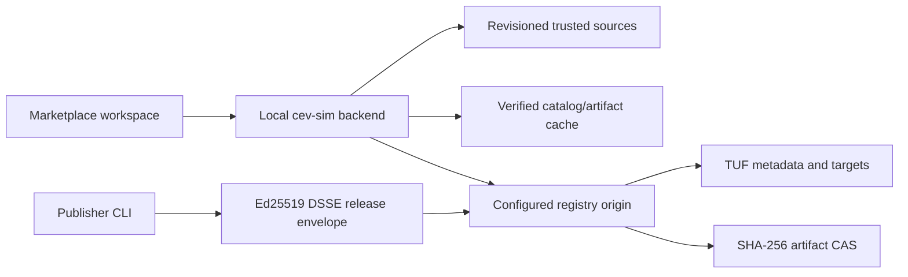

# Integrated Marketplace and Private LAN Registry Roadmap

This document is the implementation authority for the `MKT-*` program. The
program adds an integrated Marketplace workspace to cev-sim and a separately
hosted private-LAN registry. It is not headless PR 13 and does not extend the
`PLG-*`, `ED-*`, or `VIS-*` milestone sequences.

## Status

| Milestone | Implementation | Verification | Merge status |
| --- | --- | --- | --- |
| MKT-01: contracts and runtime baseline | Complete | Local acceptance passed; hosted CI pending | Unmerged |
| MKT-02: shared artifact/archive verification | Complete | Local acceptance passed; hosted CI pending | Unmerged |
| MKT-03: registry CAS and atomic storage | Complete | Local acceptance passed; hosted CI pending | Unmerged |
| MKT-04: TUF repository and read API | Complete | Local acceptance passed; hosted CI pending | Unmerged |
| MKT-05: simulator trust client and cache | Complete | Local acceptance passed; hosted CI pending | Unmerged |
| MKT-06: read-only Marketplace workspace | Implemented; acceptance pending | MKT-focused gates pass; repository-wide UI/a11y has unrelated failures | Unmerged |
| MKT-07: plans, jobs, transactions, receipts | Complete; acceptance pending | Core local gates pass; repository-wide UI/a11y has unrelated failures | Unmerged |
| MKT-08: plugin lifecycle | Not started | Not run | Unmerged |
| MKT-09: vehicle and run lifecycle | Not started | Not run | Unmerged |
| MKT-10: environment/asset export contracts | Not started | Not run | Unmerged |
| MKT-11: environment/asset import lifecycle | Not started | Not run | Unmerged |
| MKT-12: collections | Not started | Not run | Unmerged |
| MKT-13: publishers, authentication, secure LAN | Not started | Not run | Unmerged |
| MKT-14: LAN discovery, updates, advisories | Not started | Not run | Unmerged |
| MKT-15: scale, recovery, and operations | Not started | Not run | Unmerged |
| MKT-16: candidate acceptance and release | Not started | Not run | Unmerged |

Only a merged change may be marked merged. Verification records actual commands
and evidence; implementation status alone does not satisfy a milestone gate.

## Locked decisions

- The registry is a standalone JavaScript/ESM service. The simulator remains a
  local service and browser code never connects directly to a registry.
- Initial operation is private-LAN with verified offline-cache support.
- SHA-256 identifies immutable artifact bytes. TUF protects catalog metadata,
  release visibility, rollbacks, and key rotation. Publisher releases use
  Ed25519 DSSE envelopes in addition to TUF distribution.
- Development and CI pin Node 22.22.2. The supported repository and staged
  runtime range is `>=22.22.2 <23`. `tuf-js` is pinned to 6.0.0.
- Installation and updates are explicit. Installation never executes plugins,
  grants capabilities, changes a run, or activates content.
- Existing plugin, vehicle, run-bundle, and run-package formats remain
  authoritative. Marketplace is catalog, delivery, and provenance over them.
- Managed runs continue rejecting plugins until their versioned execution
  contract explicitly admits them.
- Marketplace metadata, sources, installed membership, and receipts are
  nonsemantic. They never enter `worldHash`, package hashes, `resolvedHash`,
  `simulationSemanticHash`, `episodeHash`, `trajectoryHash`, or run-package
  identity.
- Releases are immutable `(itemId, releaseVersion)` tuples. SemVer has no
  leading `v` or build metadata. Stable and beta tracks point to exact versions
  and never enter receipts or artifact identity.
- Dependencies are exact release references and exact artifact digests.
  Compatibility is the only place ranges are allowed, and dependencies are
  same-registry only in v1.
- The registry is filesystem-backed and single-writer. Distributed scheduling,
  public accounts, payments, ratings, arbitrary install hooks, OCI, public
  federation, and automatic activation/update are out of scope.

## Architecture and trust boundary

There are three separate decisions:

1. **Schema validity** means bytes parse under the strict marketplace contract.
2. **Verified authenticity** means the correct TUF trust chain and, for a
   release, publisher signature bind those exact bytes.
3. **Permission to install or execute** is a later local policy decision after
   compatibility, rights, capabilities, advisories, and current state are
   evaluated.

Passing an earlier decision never implies a later one. A registry cannot grant
local rights, activate a plugin, or make itself trusted through content it
serves.

Default TUF expirations are 48 hours for timestamp, 14 days for snapshot, 90
days for delegated targets, and 365 days for root. Previously verified cached
releases remain usable offline. Expired metadata cannot resolve or install a
release that was not previously verified.

## Threat model

| Threat | Contract response | Owning milestone |
| --- | --- | --- |
| Malicious registry or compromised publisher | Explicit root fingerprint trust, publisher DSSE, strict schemas, exact digests | MKT-01, MKT-04, MKT-05, MKT-13 |
| Rollback, freeze, or metadata mix-and-match | Monotonic catalog revision and TUF root/timestamp/snapshot/delegation verification | MKT-04, MKT-05 |
| Tampered or substituted artifact | Signed release descriptor plus exact byte size and SHA-256 | MKT-01, MKT-02, MKT-03 |
| Hostile archive | Frozen USTAR profile, streaming limits, traversal/link/header rejection | MKT-02, MKT-10 |
| Backend used as SSRF proxy | Configured-origin allowlist, fixed paths, no cross-origin redirects | MKT-05 |
| Credential disclosure | Separate owner-only store, write-only requests, redacted errors/logs/snapshots | MKT-05, MKT-13, MKT-15 |
| Unsafe preview or description | Bounded raster media only; CommonMark without raw HTML | MKT-03, MKT-06 |
| Crash during admission/install | Staging, atomic rename, journals, idempotent recovery, late receipts | MKT-03, MKT-07 |
| Marketplace provenance changes simulation identity | Separate stores and compatibility vectors over existing hash authorities | MKT-01 and every lifecycle milestone |

## Content and contract model

| Content kind | Artifact contract | Marketplace media type |
| --- | --- | --- |
| `plugin` | `cev-sim.plugin-package@1` | `application/vnd.cev-sim.plugin-package+json` |
| `vehicle` | `cev-sim.vehicle-bundle@1` | `application/vnd.cev-sim.vehicle-bundle+json` |
| `run-template` | `cev-sim.run-bundle@1` | `application/vnd.cev-sim.run-bundle+json` |
| `run-package` | `cev-sim.run-package@1` | `application/vnd.cev-sim.run-package+tar` |
| `environment` | `cev-sim.environment-package@1` | `application/vnd.cev-sim.environment-package+tar` |
| `asset-pack` | `cev-sim.asset-package@1` | `application/vnd.cev-sim.asset-package+tar` |
| `collection` | `cev-sim.marketplace-collection@1` | `application/vnd.cev-sim.marketplace-collection+json` |

Scripts, scenarios, sensors, and behaviors remain inside plugins or run
bundles in v1. They are not standalone marketplace content.

MKT-01 publishes draft-2020-12 schemas and executable strict readers for:

- `cev-sim.marketplace-item@1`
- `cev-sim.marketplace-release@1`
- `cev-sim.marketplace-catalog@1`
- `cev-sim.marketplace-advisory@1`
- `cev-sim.marketplace-collection@1`
- `cev-sim.marketplace-sources@1` (local only)
- `cev-sim.marketplace-installed@1` (local only)
- `cev-sim.marketplace-install-receipt@1` (local only)

Every contract uses `kind` plus numeric `version`. Release SemVer is stored as
`releaseVersion`. Canonical marketplace JSON uses RFC 8785/JCS, UTF-8 without a
BOM or trailing newline. Readers reject duplicate decoded keys, prohibited
prototype keys, malformed UTF-8, unknown fields/enums, unsupported versions,
noncanonical identifiers, malformed hashes, invalid sizes, and excessive
nesting.

The schemas publish these custom string formats: `marketplace-id`,
`release-version`, `sha256`, `uuid-lower`, `canonical-timestamp`,
`target-path`, `source-url`, `absolute-url`, `spdx-expression`,
`plugin-capability`, and `semver-range`. Runtime semantic validation additionally
enforces media/content-kind agreement, unique identities and references,
catalog referential integrity, stable-track release policy, same-registry exact
references, ordered sources, and globally unique receipt references. Schema
validity alone cannot detect duplicate raw JSON keys, verify signatures,
resolve dependency eligibility, or grant permission to install or execute.

The DSSE payload type is
`application/vnd.cev-sim.marketplace-release+json`; its payload is the exact
canonical release bytes. TUF uses its own serialization. Artifact digests hash
delivered artifact bytes and are not aliases for existing semantic/package
hashes.

## Portable archive limits

MKT-02 generalizes the existing strict run-package USTAR implementation;
MKT-10 will activate environment and asset packages. Existing run-package
limits and bytes remain unchanged. `server/artifacts/DeterministicArchive.js`
owns transport-only canonical USTAR framing and verification, while each
content profile continues to own entry order, semantic validation, and its
narrower limits.

The future environment/asset profile uses a 50 GiB archive ceiling, 100,000
entries, an 8 MiB manifest ceiling, and an individual-entry ceiling of
8,589,934,591 bytes. The earlier 10 GiB entry proposal cannot be represented by
the frozen USTAR 11-digit octal size field and is replaced by that exact USTAR
ceiling. No base-256 or PAX extension is admitted.

## MKT-01 work packages

- [x] WP-01: record roadmap, architecture boundary, threat model, and baseline
  compatibility vectors.
- [x] WP-02: pin runtime/dependencies and align development, CI, installer, and
  staged distribution metadata.
- [x] WP-03: define vocabulary, limits, errors, and primitive validators.
- [x] WP-04: publish nine local schemas and executable validators for eight
  documents.
- [x] WP-05: implement strict byte readers, canonical serialization, hashes,
  and reviewed fixtures.
- [x] WP-06: add the default-off `CEV_SIM_MARKETPLACE_ENABLED` startup seam.
- [x] WP-07: complete local focused/full verification and record the final
  evidence. Hosted CI and merge evidence remain pending on an MKT-01 commit.

The feature flag accepts empty/`0`/`false` as disabled and `1`/`true` as
enabled. Invalid values fail startup. It requires a restart and remains false
by default through MKT-15. In MKT-01 neither state mounts routes, performs
network access, creates marketplace storage, or changes browser workspaces.

## MKT-02 work packages

- [x] WP-01: freeze exact run-package bytes in the golden fixture and retain
  every MKT-01 compatibility identity.
- [x] WP-02: add bounded hashing, exclusive staging, path validation, deadline,
  cancellation, fsync, cleanup, and abandoned-operation recovery primitives.
- [x] WP-03: extract the deterministic streaming USTAR reader/writer with
  canonical-header, hostile-input, limit, and bounded-memory enforcement.
- [x] WP-04: rebase run-package encode, stream, verify, admission staging, and
  recovery paths without changing bytes, result shapes, or public errors.
- [x] WP-05: extract pure vehicle-bundle hash and verification before any CAS
  or authoring write.
- [x] WP-06: register read-only plugin, vehicle, run-template, and run-package
  artifact adapters; mutation operations remain deterministically unsupported.
- [x] WP-07: add hostile archive, stream/staging fault, adapter, regression, and
  greater-than-2-GiB lazy-stream coverage.
- [x] WP-08: document the transport and adapter boundaries and record local
  source/build/distribution evidence. Hosted CI and merge evidence remain
  pending on an MKT-02 commit.

## MKT-03 work packages

- [x] WP-00: begin from the clean MKT-02 commit and confirm marketplace schemas,
  package identities, simulation hashes, and the dormant feature flag remain
  outside the registry change.
- [x] WP-01: add normalized registry paths, strict internal documents, canonical
  catalog projections, UTF-8 ordering, and revision-1 empty initialization.
- [x] WP-02: add atomic sibling-directory initialization, owner-only modes,
  hostile-node checks, exclusive writer ownership, guarded stale-owner
  recovery, and token-checked release.
- [x] WP-03: add operation-owned staging, adapter-backed artifact admission,
  immutable CAS/blob records, deterministic concurrent deduplication, and
  exact PNG/JPEG/WebP validation.
- [x] WP-04: add durable catalog journals, immutable target/revision
  publication, one atomic current-catalog visibility point, forward recovery,
  and fault hooks at every boundary.
- [x] WP-05: add presentation-only item updates, preview binding, exact
  dependency checks, stored-inspection validation, immutable release tuples,
  idempotent retries, and transactional track moves.
- [x] WP-06: add deterministic listing, full registry verification, expired
  staging recovery, and planning-only rooted GC with no CAS deletion.
- [x] WP-07: add the shared `cev-sim-marketplace`, `cev-mkt`, and `cev-sim mkt`
  CLI, signal cleanup, structured results/errors, distribution files,
  dependencies, bins, and installed-tarball parity checks.
- [x] WP-08: add storage, ownership, CAS, recovery, preview, immutability,
  verification, GC, CLI parity, distribution, and no-listener tests plus
  operator and architecture documentation. Final command evidence is recorded
  below after acceptance completes.

## MKT-04 work packages

- [x] WP-00: preserve the clean MKT-03 contract and 37-test marketplace
  baseline; keep the simulator feature flag dormant and `server/App.js`
  outside the listener graph.
- [x] WP-01: pin `@tufjs/models@5.0.0` and
  `@tufjs/canonical-json@2.0.0`, retain `tuf-js@6.0.0`, package all three in
  the headless distribution, add TUF layout helpers, Ed25519 key primitives,
  and strict discovery/journal documents.
- [x] WP-02: add external offline-key enforcement, owner-only online keys,
  atomic TUF bootstrap/upgrade, TUF 1.0.31 root extension, terminating
  delegations, consistent targets, and the empty advisory role.
- [x] WP-03: add target projection, delegated-role versioning, exact signed-byte
  TUF journals, timestamp-last publication, catalog/TUF serialized commits,
  and forward recovery at every durable boundary.
- [x] WP-04: verify continuous root history, old/new root signatures,
  expirations, registry binding, all role signatures and metadata descriptors,
  canonical delegated targets, exact target sets, and referenced CAS bytes;
  refresh increments all online roles.
- [x] WP-05: add journaled two-root overlap rotation, new-key top-level targets,
  final new-only root publication, retained numbered roots, and automatic
  completion after faults before or after the timestamp switch.
- [x] WP-06: add the lock-free `MarketplaceRegistryReader`, timestamp-chain
  alias resolution, stable verification retries, referenced file-handle reads,
  strict metadata/target visibility, and reconciliation-aware readiness.
- [x] WP-07: add the standalone loopback-only `node:http` server with strict raw
  paths, exact MIME/length/ETag/nosniff/cache headers, no CORS, conditionals,
  bounded single ranges, streaming, timeouts, and stable JSON errors.
- [x] WP-08: extend all CLI aliases with init key custody, refresh, rotation,
  serve, one-record startup, clean signals, and installed-distribution TUF and
  loopback smoke verification.
- [x] WP-09: add key/bootstrap/upgrade, publication and rotation recovery,
  expiry/signature/tamper, `tuf-js`, conditional/range/path/header, loopback
  binding, lifecycle, and concurrent timestamp-visibility tests.
- [x] WP-10: document layout, key custody, backup exclusions, publication,
  recovery, loopback operation, internal/public visibility, milestone
  boundaries, and acceptance evidence.

## MKT-05 work packages

- [x] WP-00: begin from clean MKT-04 commit `a1a6c64`; record the 47/47
  marketplace baseline; preserve canonical marketplace fixtures,
  plugin/vehicle/run-package hashes, and headless characterization; keep UI,
  previews, artifacts, installation, receipts, DSSE, advisory policy, and
  secure LAN hosting outside MKT-05.
- [x] WP-01: export the pure canonical metadata, role/meta, root-contract, and
  delegation-contract verifiers from `TufMetadata.js`; retain MKT-04 behavior;
  add client limits, health states, local-document validators, and public
  source error codes without changing `sources.schema.json`.
- [x] WP-02: add the revisioned serialized `MarketplaceSourceStore`, immutable
  owner-only `MarketplaceCredentialStore`, bootstrap trust storage, optimistic
  revisions, deterministic ordering, duplicate origin/registry rejection, and
  fail-closed orphan/hostile-node recovery.
- [x] WP-03: add `MarketplaceFixedOriginFetcher` and trust preview with strict
  canonical discovery, exact bootstrap-root fingerprinting, self-signature and
  registry binding, manual redirects, origin/path confinement, write-only
  bearer handling, and repeated add-time confirmation.
- [x] WP-04: add online `tuf-js@6.0.0` refresh, continuous root capture,
  complete role verification, exact catalog/item/release/advisory target sets,
  eager canonical target download, full summary cross-checks, immutable
  snapshots, and atomic current-pointer publication.
- [x] WP-05: add one-time-per-operation expiry evaluation, deterministic health
  precedence, sanitized refresh outcomes, reverified cached reads, exact
  offline reads with `fresh: false`, and `requireFresh` expiry enforcement.
- [x] WP-06: add per-source serialization and shutdown cancellation in
  `MarketplaceService`; mount the 32 KiB no-store, redacted source API only in
  the enabled `server/App.js` branch; preserve fully inert disabled startup.
- [x] WP-07: add focused source-store, trust-client, cache, and API suites over
  the real `MarketplaceRegistryHttpServer`, including concurrency, modes,
  confirmation, fixed origins, redirects, root rotation, eager/offline/expired
  reads, publication faults, request immutability, and credential redaction.
- [x] WP-08: finish operator/client and architecture documentation, stage the
  client modules and document in the headless distribution, run complete local
  acceptance, record immutable fixture checks, and retain hosted CI as the
  final pre-merge evidence requirement.

## MKT-06 work packages

- [x] WP-00: begin from clean MKT-05 commit `810ad70`; record the 55/55
  marketplace baseline; preserve canonical marketplace fixtures,
  `sources.schema.json`, plugin/vehicle/run-package identities, and headless
  characterization; keep installation, compatibility eligibility,
  plans/jobs/receipts, installed state, DSSE, advisories, and automatic
  refresh outside MKT-06.
- [x] WP-01: add the pure deterministic `MarketplaceReadModel` with strict
  queries, signed-track selection, source-specific projections, exact filters,
  searchable fields, facets, stable ordering, and bounded pagination.
- [x] WP-02: expose ephemeral TUF distribution verification from reverified
  snapshots without changing the cache-manifest schema; add search, detail,
  and referenced-preview reads to `MarketplaceService`; preserve offline and
  expired snapshots while failing closed on corrupt trust/cache state.
- [x] WP-03: add enabled-only read routes, strict query/path handling,
  digest-addressed fixed-origin preview fetching, exact byte/media/digest
  checks, raster reinspection, redacted stable errors, immutable private
  headers, and ETag conditionals.
- [x] WP-04: add the abortable browser API client, structured marketplace
  errors, pinned safe CommonMark rendering, and content-specific disabled
  action labels.
- [x] WP-05: add `APP_VIEWS.MARKETPLACE`, enabled status probing, conditional
  workspace navigation, and disabled-startup coverage.
- [x] WP-06: implement the 1280x720 Discover/result/details workspace with
  verified previews, exact release data, declared compatibility requirements,
  truthful registry-signer terminology, and disabled installation controls.
- [x] WP-07: implement revisioned Sources, complete typed-fingerprint trust,
  explicit refresh, rename/enable/priority/credential/update/removal flows,
  conflict review, focus restoration, and transient bearer handling.
- [x] WP-08: add the honest Installed scaffold and conditional Plugin Library
  link without changing existing local plugin behavior or inferring installed
  membership.
- [x] WP-09: add read-model, API, real-registry Playwright, keyboard, viewport,
  redaction, offline retention, preview, and Axe coverage; enable the feature
  only in the Playwright server environment.
- [x] WP-10: document read semantics, signer terminology, preview confinement,
  offline behavior, browser/backend/registry boundaries, milestone decisions,
  and factual acceptance evidence.

## MKT-07 work packages

- [x] WP-00: begin from clean MKT-06 commit `61d8205`; record the 60/60
  marketplace baseline and freeze `installed.schema.json`
  (`274e7b72f65a1df6b220eb1508fac635935765834254455cc1eb33cc2e765e10`),
  `install-receipt.schema.json`
  (`af1a8db03f31b1ea21d858235f872e0480c39c8a7c4bb39fb348bdfcf3056557`),
  the MKT-01 compatibility fixture
  (`6904056555062d7267bc0cf749081558e0e1ca5724401e7f0c9bfaeb813c4ae7`),
  and headless characterization
  (`60dc0bd2b02a9ec768f833070ce4d8d2047f5383838f09ea3f130dd31552dd6f`).
- [x] WP-01: add private installation layout, exact canonical local-document
  validators, owner-only modes, hostile-node checks, and pinned-snapshot reads.
- [x] WP-02: add normalized host profiles, deterministic compatibility issues,
  exact same-snapshot dependency resolution, yanked warnings, and injectable
  pre-download policy blocking.
- [x] WP-03: persist timestamp-free, content-addressed metadata preflights and
  deterministic finalized lifecycle plans with installed and host preconditions.
- [x] WP-04: add confined streaming blob downloads, verified artifact CAS
  reuse, concurrent immutable publication, mismatch quarantine, cancellation,
  and deletion of incomplete streams.
- [x] WP-05: make the adapter lifecycle contract explicit while leaving all
  four production adapters read-only; exercise planning, commit, and receipts
  only through an injected test adapter that never executes plugin source.
- [x] WP-06: add revisioned installed membership and immutable canonical
  receipts with exact dependency locks, mappings, reinstall history, and
  content-preserving removal.
- [x] WP-07: add serialized journaled install/removal transactions, adapter
  idempotency by transaction ID, installed-ledger-last visibility, startup
  roll-forward, and fail-closed ambiguous-state handling.
- [x] WP-08: add durable revisioned jobs, precommit cancellation, restart
  resumption, final confirmation, revisioned SSE, terminal close, and shutdown
  behavior that never cancels a durable commit.
- [x] WP-09: compose recovery after headless supervisor initialization, expose
  the coordinator API, derive eligibility from the live host profile, and map
  precondition, conflict, and recovery errors without internal disclosure.
- [x] WP-10: add the two-stage browser dialog and exact Installed view while
  retaining disabled production actions until MKT-08/09 lifecycle adapters.
- [ ] WP-11: complete and record the full local acceptance matrix and hosted
  CI evidence. Focused dependency, compatibility, artifact, installed-store,
  job, API/SSE, transaction-boundary, adapter, offline-reuse, removal, and
  restart-recovery tests pass locally.

## Milestones and gates

### MKT-01 — Program contract and runtime baseline

Freeze schemas, identifiers, media types, compatibility, errors,
canonicalization, nonsemantic provenance, Node 22.22.2 development/CI, the
supported Node 22 range, TUF dependency, and the dormant feature flag.

Gate: positive/negative schema vectors pass under Node 22.22.2; the complete
existing suite passes; existing simulator/world/episode/plugin/vehicle/run
hashes do not change.

### MKT-02 — Shared artifact and archive verification

Generalize the deterministic USTAR reader/writer and bounded staging/hash/path
utilities without changing existing run-package bytes. Add read-only adapters
for plugin packages, vehicles, run bundles, and exact run packages.

Gate: golden run packages remain byte-identical; hostile archives and
multi-gigabyte bounded-memory streams pass focused and full checks.

### MKT-03 — Registry CAS and atomic storage

Add the standalone service/CLI, immutable filesystem CAS, staging,
single-writer locking, revisioned catalog, journal recovery, admission,
verification, and dry-run GC. Bind no listener beyond loopback.

Gate: deterministic concurrent deduplication, crash recovery at every commit
boundary, and immutable release tuples.

### MKT-04 — TUF repository and read API

Initialize offline root plus online delegated/snapshot/timestamp keys; support
root rotation and publish catalog, item, release, and advisory targets. Add
well-known, catalog, item, release, blob, health, and TUF reads with bounded
ranges and strict headers.

Gate: rollback/freeze/mix-and-match/expiry/delegation/registry-ID/key-rotation
tests pass; ranges reconstruct exact blobs; LAN binding remains rejected.

### MKT-05 — Simulator trust client, source store, and cache

Add revisioned sources, separate credentials, server-side TUF verification,
root-fingerprint confirmation, verified caches, fixed-origin requests, offline
policy, and source health.

Gate: credentials never leave the server; arbitrary proxying and changed trust
roots/registry IDs fail; offline and clock-skew behavior is deterministic.

### MKT-06 — Read-only Marketplace workspace

Add Discover, Installed, and Sources to the explicit view-state system with
search/filter/details/trust flow, safe preview proxying, source health, and a
Plugin Library link. Installation controls remain disabled.

Gate: Playwright navigation/trust/search/offline/malformed tests and a11y pass
at the 1280×720 minimum viewport.

### MKT-07 — Installation plans, jobs, transactions, and receipts

Add exact dependency resolution, compatibility evaluation, deterministic
plans, asynchronous jobs/SSE, journaled transactions, installed state,
immutable receipts, quarantine, recovery, cancellation-before-commit, and
content-preserving removal.

Gate: no partial visibility under crash injection; recovery/replay is
idempotent; stale plans, cycles, and blocked dependencies fail before commit.

### MKT-08 — Plugin marketplace lifecycle

Install through the existing plugin CAS/library, cross-check manifest
capabilities/compatibility, show additions, retain runtime grants, support
coexisting versions, and remove membership without eager CAS deletion.

Gate: install never executes source or grants capabilities; existing
browser/headless loading remains unchanged; managed runs still reject plugins.

### MKT-09 — Vehicle, run-template, and exact-run lifecycle

Wire existing vehicle/run-bundle/run-package importers. Embedded vehicle
plugins enter CAS without library membership. Templates become editable local
configs; exact packages remain immutable.

Gate: artifact hashes and exact reproduction remain stable; collision mappings
are deterministic; unsupported backends fail rather than substitute.

### MKT-10 — Environment and asset export contracts

Implement environment/asset package formats, closure traversal, deterministic
streaming export, rights preflight, validators, and publisher inspection.

Gate: unchanged exports are byte-identical; missing dependencies/rights fail
before creation; credentials, local paths, and source authority cannot enter.

### MKT-11 — Environment and asset import lifecycle

Plan and commit deterministic ID reuse/remapping, rewrite transitive refs,
recompute through canonical paths, rebind visual descriptors, invalidate stale
correspondence, enforce local rights, and recover transactions.

Gate: round trips render and remain editable through `CommandBus` and
`SceneProjector`; carried rights cannot grant authority; world identity changes
only with canonical world content.

### MKT-12 — Collections and multi-release plans

Validate/publish/discover collections, expand exact members/dependencies,
deduplicate artifacts, present per-member requirements, commit membership only
after all imports, and preserve independent installs on removal.

Gate: cycles, missing releases, digest mismatch, and cross-registry refs fail;
partial failure installs no collection; reinstalls are idempotent.

### MKT-13 — Publisher identity, authenticated publishing, and secure LAN

Add Ed25519 key generation/DSSE signing, publisher registration/revocation,
hashed scoped tokens, authenticated upload/finalization, TLS and optional mTLS.
Permit non-loopback only with TLS and read authentication; retain an explicit
unsafe-development override.

Gate: signatures bind exact release/artifact bytes; revoked publishers and
wrong scopes fail; tokens are constant-time checked and never logged.

### MKT-14 — LAN discovery, updates, yanks, and advisories

Advertise `_cev-market._tcp`, show discoveries only as untrusted candidates,
detect signed stable/beta updates, install new exact releases, and enforce
signed yanks/advisories/blocks without automatic update or activation.

Gate: discovery never grants trust; advisory state is rollback protected;
updates preserve old receipts and local content.

### MKT-15 — Scale, recovery, observability, and operations

Add resumable ranges, quotas/LRU, staging cleanup, rooted registry GC, audit
logs, redacted diagnostics/metrics, coherent backup/restore, conditional
catalog sharding, and crash/soak tests.

Gate: 10 GiB transfers resume with bounded memory; 10,000-release search stays
responsive; 24-hour soak and restore preserve registry UUID, trust, releases,
and digests without secret/path leakage.

### MKT-16 — Candidate acceptance and release

Enable the workspace by default while retaining the kill switch; publish
operator/creator documentation, production container/deployment example,
end-to-end fixtures, platform/browser matrix, and final evidence.

Gate: a fresh simulator can trust, authenticate, browse, install, restart, and
use every content kind; tampering fails; verified cached content works offline;
rights/remapping and plugin nonexecution remain intact; all legacy identities
and fixed-step behavior remain unchanged.

## MKT-01 evidence ledger

Baseline captured before implementation at `7a463e7` on macOS arm64, Node
22.14.0 and npm 11.4.1:

- Existing focused package/canonicalization/simulation-hash/characterization
  selection passed 37/37.
- Plugin package hash:
  `f9e2255bed1adcdadbe7a3fa9cb75ee6644fc791c07acd9734bd4d43f8ea52d9`.
- Plugin-enabled resolved hash:
  `bec3cb24c73ec6fae65d2377611ad78f0152e83f23543e59fa6a4a7e419a07b8`.
- Plugin-enabled simulation-semantic hash:
  `8fa5b9fa937fa1a6dfc342237e9320ffe84097df3cdfdaea069ad79153ad793c`.
- Plugin-enabled default episode hash:
  `b14dfdfee0b493e4119110f6f172b45959378544a3a10f0cf55fbc25fc9f40bc`.
- Fixed vehicle-bundle hash:
  `e44e29973a958058b1726855fca84c06c444033222dbb29238a72ae9d1a60c7a`.
- Existing run-package golden archive hash:
  `04e463b71fdf65034bb56af55fec58240c4236141a679085609e68ffe5877c7d`.

Final local evidence ran on 2026-09-26 from an uncommitted working tree based
on `7a463e746bcfdb0fc5803eea004ce3767c7d49cf`, macOS 15.6 arm64, Node
22.22.2, npm 10.9.7, and Python 3.12.10:

- Official Node archive checksum verification and `npm ci`: passed; 586
  packages installed and zero vulnerabilities reported by the install audit.
- `npm run test:marketplace`: 18/18 passed.
- `npm run lint`: passed with zero errors and the existing `MapSurface.js`
  `assetEpoch` hook warning.
- `npm test`: 1,731 tests; 1,725 passed, six declared browser/hardware/shared
  memory skips, zero failures.
- `npm run build`: passed.
- `npm run test:parity`: passed for browser, direct headless, CLI, gRPC UDS,
  and Python sources with matching hashes.
- `npm run release:check`: passed for source and staged distribution metadata.
- `npm audit --omit=dev --audit-level=high`: zero vulnerabilities.
- `npm run fixtures:headless`: regenerated
  `characterization.v1.json` with no diff.
- `npm run proto:python` and `npm run lint:python`: passed.
- `python -m pytest -m 'not integration' python/tests`: 82 passed, 15
  deselected; `python -m pytest -m integration python/tests`: 15 passed, 82
  deselected.
- `npm run test:bake-python`: 19/19 passed.
- `npm run dist:headless -- --output artifacts/mkt-01-dist`,
  `npm run release:check -- --dist artifacts/mkt-01-dist`, and
  `npm run dist:verify -- --dist artifacts/mkt-01-dist`: passed. Final package
  hashes were npm `63c1214f8982d8d58bf732e25c515d8480f97512ffa183d49668028cbbdac1a2`,
  wheel `3528279caf381ccd92e73e54b6feb9160f921844fb6e2ea64cdcd3a20a956991`,
  and source distribution
  `d4fa28825790a0ccdc17d9328638c20dfd7970296d502975435b24fca1092e7b`.

Hosted CI has no run or link because this implementation is not committed or
pushed. It remains the verification item required before merge. The hosted,
soak, x64 NVIDIA, and Jetson ARM64 obligations already outstanding from
headless PR 12 remain outstanding and are not MKT-01 completion claims.

## MKT-02 evidence ledger

The pre-refactor focused baseline was 46/46 passing with the frozen 4,096-byte
run-package archive hash
`04e463b71fdf65034bb56af55fec58240c4236141a679085609e68ffe5877c7d`.
Final local evidence ran on 2026-09-26 from an uncommitted working tree based
on `5afe17e521c8b2bf8ff5884513fe1c15342d4679`, macOS 15.6 arm64. Source
tests used the host Node 22.14.0/npm 11.4.1; distribution acceptance used the
pinned Node 22.22.2/npm 10.9.7 runtime:

- `tests/artifact-verification.test.js`,
  `tests/deterministic-archive.test.js`, and
  `tests/marketplace-artifact-adapters.test.js`: 15/15 passed. The lazy
  2,147,483,649-byte entry stayed below the test ceilings of 256 MiB RSS growth
  and 128 MiB array-buffer growth.
- The focused run-package, admission, plugin store, plugin sensor, vehicle,
  run-manifest, marketplace compatibility, artifact, archive, and adapter
  selection passed after preserving the existing short-write error mapping.
- `npm run test:marketplace`: 23/23 passed.
- `npm run lint`: passed with zero errors and the existing `MapSurface.js`
  `assetEpoch` hook warning.
- `npm test`: 1,746 tests; 1,740 passed, six declared skips, zero failures.
- `npm run build`: passed.
- `npm run release:check`: passed for source metadata.
- Under Node 22.22.2, `npm run dist:headless -- --output <temporary>`,
  `npm run release:check -- --dist <temporary>`, and
  `npm run dist:verify -- --dist <temporary>` passed. The staged npm archive
  contains `ArtifactVerification.js`, `DeterministicArchive.js`, and
  `VehicleBundle.js` under `server/artifacts/`.
- Final staged artifact hashes were npm
  `aed4d3a75890ce5154819051671bb539a6cd20fce1c5ca04a7c4d0159ce56791`,
  wheel `ab9b4fd091e702168b50b7b25ea6cda88d96c820b57620acca5d26d49ae8b2c6`,
  and source distribution
  `02518e1a6b9c707779887ff11ba3b64060a1bd1b847fd30a00b7e34fdea7cc56`.
- Plugin, vehicle-bundle, resolved-run, simulation-semantic, episode, world,
  package-manifest, and archive compatibility vectors remain unchanged. The
  exact 4,096 archive bytes are now stored in the golden fixture as base64.

Hosted CI has no run or link because this implementation is not committed or
pushed. MKT-02 remains unmerged until that evidence exists. No PLG, ED, VIS, or
headless contract or acceptance evidence changed, so no other roadmap was
updated.

## MKT-03 evidence ledger

Implementation began on 2026-09-27 from clean commit `5996a0f` after the
separate MKT-02 commit `471cdc5`. The host is macOS arm64 with Node 22.14.0 and
npm 11.4.1; final release/distribution acceptance must also run under the
pinned Node 22.22.2 runtime. Before implementation, the MKT-02 artifact,
archive, and adapter selection passed 15/15.

Final local evidence on 2026-09-27:

- The MKT-02 artifact/archive/adapter suites plus all
  `marketplace-registry-*` suites passed 29/29. Coverage includes concurrent
  deduplication, every journal boundary, stale/live ownership, hostile nodes,
  immutable releases, exact dependencies, CAS corruption, preview formats,
  historical verification, dry-run GC, signal cleanup, CLI parity, plugin
  nonexecution, and the no-listener import graph.
- `npm run test:marketplace`: 37/37 passed.
- `npm run lint`: passed with zero errors and the existing `MapSurface.js`
  `assetEpoch` hook warning.
- `npm test`: 1,775 tests; 1,769 passed, six declared skips, zero failures.
- `npm run build` and source `npm run release:check`: passed.
- `npm run fixtures:headless` regenerated the characterization fixture with no
  diff; no simulator or package identity authority changed.
- Under checksum-verified Node 22.22.2/npm 10.9.7,
  `npm run dist:headless -- --output <temporary>`,
  `npm run release:check -- --dist <temporary>`, and
  `npm run dist:verify -- --dist <temporary>` passed. Clean-install smoke tests
  exercised identical `cev-sim-marketplace`, `cev-mkt`, and `cev-sim mkt`
  behavior from the npm archive.
- Final staged artifact hashes were npm
  `f22f19909081f9b341ab3f69d0a3f709cc2de07cd55b908f5b53ad05df60c142`,
  wheel `6d5835bd8fdbbb7f0d0744dcba850fdd1a3763c97c479a65e890d19bab6a4cb6`,
  and source distribution
  `99ff3a9bacb2fa9eb13a57e28d414135b8e78221d25aeb7eb331fac520ab752f`.
- `git diff --check`: passed.

Hosted CI has no run or link because the implementation is not committed or
pushed. MKT-03 remains unmerged until that evidence exists. No PLG, ED, VIS,
headless, or run-manifest contract or acceptance evidence changed, so no other
roadmap was updated.

## MKT-04 evidence ledger

Implementation began on 2026-09-27 from clean MKT-03 commit `d4e2970`. The
pre-change `npm run test:marketplace` baseline passed 37/37. MKT-04 did not
change `server/App.js`, the dormant marketplace feature flag, marketplace
canonical vectors, plugin/vehicle/run-package identities, or headless
characterization inputs.

Final local evidence on 2026-09-27:

- `npm run test:marketplace`: 47/47 passed. Coverage includes external-key
  custody and modes, populated MKT-03 upgrade, TUF bootstrap/refresh, signed
  rollback and expiry rejection, exact target/CAS verification, publication
  and root-rotation fault recovery, `tuf-js` root update/refresh/download,
  strict paths and headers, byte ranges and conditionals, loopback bind
  rejection, process signals, and concurrent old/new timestamp visibility.
- `npm run lint`: passed with zero errors.
- `npm test`: 1,785 tests; 1,779 passed, six declared skips, zero failures.
- `npm run build`: passed after a clean `.next` production build.
- `npm run fixtures:headless`: passed with no characterization diff.
- Source `npm run release:check`: passed.
- Under checksum-verified Node 22.22.2/npm 10.9.7,
  `npm run dist:headless -- --output <temporary>`,
  `npm run release:check -- --dist <temporary>`, and
  `npm run dist:verify -- --dist <temporary>` passed. Clean-install
  verification initialized and refreshed TUF, verified the repository, started
  the installed loopback server on an ephemeral port, fetched discovery,
  catalog, and bootstrap root, and terminated it cleanly.
- Final staged artifact hashes were npm
  `b002642620bcdfed7bac1b4e150fd23b32c1660175841d7d352e6245979b9628`,
  wheel `6d4294e8bb89a13438084056bf923aa0c441d0e8bfe05502feb659a58b1cd34d`,
  and source distribution
  `bf186fb300b6ef0189356ba19141d2d84417a75abfa210a9c09566269213640b`.
- `git diff --check`: passed.

Hosted CI has no run or link because the implementation is not committed or
pushed. MKT-04 remains unmerged until that evidence exists. MKT-04 intentionally
keeps publisher DSSE in MKT-13 and advisory policy in MKT-14. No PLG, ED, VIS,
headless, or run-manifest contract or acceptance evidence changed, so no other
roadmap was updated.

## MKT-05 evidence ledger

Implementation began on 2026-09-27 from clean MKT-04 commit `a1a6c64`. The
pre-change `npm run test:marketplace` baseline passed 47/47. Canonical
marketplace fixtures, `sources.schema.json`, plugin/vehicle/run-package
identities, and the headless characterization fixture were unchanged.

Final local evidence on 2026-09-27 used the checksum-verified Node 22.22.2
runtime on macOS arm64:

- `npm run test:marketplace`: 55/55 passed. The eight MKT-05 tests cover
  revision races, deterministic ordering, mode-0700/0600 storage, immutable
  credentials, hostile nodes, exact trust confirmation, fixed-origin and
  redirect rejection, bearer confinement, eager populated caching, offline
  reads, expiry boundaries, health precedence, publication faults, root v1 to
  v3 rotation, strict API fields, optimistic conflicts, and response/log/cache
  credential redaction.
- `npm run lint`: passed with zero errors and the pre-existing `MapSurface.js`
  `assetEpoch` hook warning.
- `npm test`: 1,793 tests; 1,787 passed, six declared skips, zero failures.
- `npm run build`: passed.
- `npm run fixtures:headless`: passed and regenerated no characterization
  diff. Marketplace fixtures and `sources.schema.json` also have no diff.
- Source and staged `npm run release:check` passed.
- `npm run dist:headless -- --output <temporary>` and
  `npm run dist:verify -- --dist <temporary>` passed. Clean-install
  verification imported `cev-sim/marketplace/client` and retained the MKT-04
  installed registry smoke test.
- Final staged artifact hashes were npm
  `2f0a4bdb6ad553da0302f067f49cdaabb7a5b8bf1ecf013d6b929bc351e922eb`,
  wheel `d6cbd24d1f81d257121ba08e57f102577069aebf9cfb133ace6eea9bfec25542`,
  and source distribution
  `14fc78b89d39e2b8772efb35b3f79bfdd0d876a19f38b5a639b4650ab850fd9b`.
- `git diff --check`: passed.

Hosted CI has no run or link because the implementation is not committed or
pushed. MKT-05 remains unmerged until that evidence exists. MKT-05 adds no UI,
preview proxy, artifact download, installation, receipt, publisher DSSE,
advisory policy, or secure LAN hosting. No PLG, ED, VIS, headless, or
run-manifest contract or acceptance evidence changed, so no other roadmap was
updated.

## MKT-06 evidence ledger

Implementation began on 2026-09-27 from clean MKT-05 commit `810ad70`. The
pre-change `npm run test:marketplace` baseline passed 55/55. Canonical
marketplace fixtures, `sources.schema.json`, plugin/vehicle/run-package
identities, and the headless characterization fixture remain unchanged.

Local evidence on 2026-09-27 used checksum-verified Node 22.22.2 on macOS
arm64:

- Focused read-model and view-state tests passed 8/8; the focused marketplace
  API suite also passed.
- `npx playwright test tests/ui/marketplace.spec.js --workers=1` passed 2/2.
  It covers the real registry trust/refresh/source lifecycle, discovery,
  filters, safe previews, offline cache retention, malformed refresh
  retention, disabled installation, keyboard navigation, focus restoration,
  1280x720 containment, and Axe.
- The directly affected Marketplace, Plugin Library, and workspace navigation
  suites passed 7/7 serially.
- `npm run lint` passed with zero errors and the pre-existing `MapSurface.js`
  `assetEpoch` hook warning.
- `npm run test:marketplace` passed 60/60.
- `npm test` ran 1,798 tests: 1,792 passed, six declared skips, and zero
  failures.
- `npm run build` passed.
- `npm run fixtures:headless` passed with no characterization diff. Canonical
  marketplace fixtures and `sources.schema.json` also have no diff.
- Source and staged `npm run release:check` passed.
- `npm run dist:headless -- --output <temporary>` and
  `npm run dist:verify -- --dist <temporary>` passed. Final staged artifact
  hashes were npm
  `5cd9efcc34389f82e648b5d3d37cabbfd34706830a2ec0eccedab31a74aab636`,
  wheel `55b40782e8a5f5a24820cc743bd0bd9c2cbd9d3775bbce04d07c34a547f76c0b`,
  and source distribution
  `c2325f6ee04cf1d210f3d0f4bfff747f49e40d2ba181377b766dc7199a642a95`.
- `git diff --check` passed.

Repository-wide browser acceptance is not marked passed. The five-worker
`npm run test:ui` attempt encountered unrelated 3D loading-overlay timeouts and
was stopped after five failures, four passes, and 66 tests not run; the
directly affected suites then passed serially. `npm run test:a11y` completed
8/12: the Marketplace test passed, three Environment Editor tests timed out
under concurrent WebGL load, and the all-workspaces sweep found serious Axe
violations only in Replay (`aria-prohibited-attr`) and Logs
(`color-contrast`). Those failures are outside the MKT-06 files and contract,
so they are recorded rather than repaired as Marketplace scope. MKT-06 remains
acceptance-pending until the repository-wide gates are green.

Hosted CI has no run or link because the implementation is not committed or
pushed. MKT-06 remains unmerged. It adds no install, import, activation,
receipt, installed-state, publisher DSSE, advisory, or automatic-refresh
behavior. No PLG, ED, VIS, headless, or run-manifest contract or acceptance
evidence changed, so no other roadmap was updated.

## MKT-07 evidence ledger

Implementation began on 2026-09-28 from clean MKT-06 commit `61d8205`. The
pre-change `npm run test:marketplace` baseline passed 60/60. The frozen public
installed and receipt schemas, MKT-01 compatibility fixture, and headless
characterization fixture retain the hashes recorded in WP-00 and have no diff.

Local evidence on 2026-09-28 on macOS arm64:

- `npm run test:marketplace`: 78/78 passed. Coverage includes exact dependency
  resolution and compatibility, blocked-before-download policy, verified CAS
  reuse and quarantine, immutable receipts, reinstall history, source/job
  conflicts, rights denial, SSE revision ordering and reconnect, concurrent
  commits, journal fault injection, and repeated startup recovery.
- `npx playwright test tests/ui/marketplace.spec.js --workers=1`: 2/2 passed,
  including the Marketplace keyboard/Axe case and 1280x720 containment.
- `npm run lint`: passed with zero errors and the pre-existing `MapSurface.js`
  `assetEpoch` hook warning.
- `npm test`: 1,816 tests; 1,810 passed, six declared skips, zero failures.
- `npm run build`, `npm run fixtures:headless`, and source
  `npm run release:check`: passed. Fixture regeneration produced no frozen
  contract or characterization diff.
- `npm run dist:headless -- --output <temporary>` passed. Under Node 22.22.2,
  `npm run dist:verify -- --dist <temporary>` passed against the staged output.
  Final staged artifact hashes were npm
  `8dee236ff9826ffbc338c5d36274da5e1ada95d7f885bf4fce857d5ed14a3f96`,
  wheel `c9d13dac98dd088130aa6a741fdb9fdf60dccff21b52bca9b1c4211ef99359b6`,
  and source distribution
  `6917828591b434f055c4e22ccdbc8899e9c980c1d5a3b953a7e8e2bff6cc3367`.
- `git diff --check` passed.

Repository-wide browser acceptance is not marked passed. The five-worker
`npm run test:ui` run encountered nine failures in Control Commands, Candidate
Outputs, Environment Editor, Environment Assets, Environment Creation, and
road authoring. It was stopped after 11 minutes with five passes, four
interrupted tests, and 57 tests not run. The failures were workspace-opening,
3D-loading, or existing editor assertions outside the MKT-07 files; the
Marketplace suite passed serially.

`npm run test:a11y` completed 8/12. The Marketplace case timed out while
opening the workspace under five-worker contention but passed in the required
single-worker Marketplace run. Two Environment Editor cases timed out during
workspace startup, and the all-workspaces sweep reported existing serious Axe
violations in Replay (`aria-prohibited-attr`) and Logs (`color-contrast`).

Hosted CI has no run or link because the implementation is not committed or
pushed. MKT-07 remains unmerged and acceptance-pending until the repository-wide
browser gates and hosted evidence are green. No PLG, ED, VIS, headless, or
run-manifest contract or acceptance evidence changed, so no other roadmap was
updated.

## Decision log

### 2026-09-28 — Separate verified preparation from explicit local commit

MKT-07 uses two immutable decisions. A metadata preflight pins one verified
source snapshot, its exact dependency DAG, compatibility verdicts, artifact
bytes, installed revision, and host-profile hash without a timestamp in the
hashed document. A cancellable job then obtains and inspects exact artifacts
and persists a finalized plan. No adapter or installed-state mutation occurs
until the caller confirms that exact final-plan hash and job revision.

The durable transaction journal is written only after the source, release
hashes, policy, host profile, installed revision, and adapter plan are checked
again. Receipts and idempotent dependency-first adapter commits publish before
the atomic `installed.json` replacement. The job's `complete` snapshot is
durable before journal cleanup. Startup rolls a journal forward when the
installed ledger matches its recorded base or target and otherwise returns
`RECOVERY_REQUIRED` without fabricating cancellation or failure.

MKT-07 supplies coordinator infrastructure only. Plugin, vehicle,
run-template, and run-package production adapters still expose no lifecycle
operations; MKT-08/09 own them. Installed membership, plans, jobs, receipts,
artifact records, and quarantine remain operational and do not enter any
simulator, environment, package, run, or episode hash. Publisher DSSE remains
MKT-13, advisory ingestion remains MKT-14, and resumable downloads, quotas,
and garbage collection remain MKT-15.

### 2026-09-27 — Keep MKT-06 reads reverified, read-only, and source-specific

Discover and details are projections of the current immutable verified cache,
not a second catalog database. Stable and beta select exact signed track
pointers, duplicate item IDs remain distinct by source, and every snapshot is
reverified before projection. Missing snapshots remain visible through source
health; corrupt trust or local cache state fails the complete read. Offline or
expired verified entries remain browseable but are explicitly non-fresh.

Preview proxying begins only after a digest is found in the verified item and
permits one exact fixed-origin CAS path. Returned raster bytes must match the
signed digest, size, and media type and pass the preview inspector again. The
browser never receives registry credentials or contacts registry origins.
Preview bytes are not cached locally in MKT-06.

The workspace presents compatibility as declared requirements and TUF role
keys as registry distribution verification. It labels `publisherId` as the
declared publisher because publisher DSSE remains MKT-13. Installed state,
eligibility, plans, jobs, receipts, installation/import/activation/removal,
advisory policy, and automatic refresh remain outside MKT-06. No simulation,
package, environment, plugin, vehicle, run-manifest, or headless identity
contract changes.

### 2026-09-27 — Commit trust before refresh and cache the complete signed catalog

Source creation repeats discovery and exact bootstrap-root verification, then
commits the immutable trust root and revisioned source without network refresh.
The originally confirmed root fingerprint remains pinned through valid TUF
root rotation. Origin and trust identity are immutable; changing either
requires source removal and re-addition.

Each explicit refresh downloads and verifies the catalog plus every signed
item and release document before replacing `current.json`. A partial refresh
never becomes visible. Exact documents already in a verified snapshot remain
readable offline after signed metadata expiry with `fresh: false`, while fresh
resolution fails with `METADATA_EXPIRED`. Credentials, source/health state,
cache manifests, and signed marketplace documents remain operational and do
not enter simulator or package identity.

### 2026-09-27 — Keep MKT-04 distribution distinct from publisher and advisory policy

MKT-04 signs and distributes the existing canonical release JSON bytes as TUF
targets. It does not introduce a partial publisher envelope: Ed25519 DSSE,
publisher authorization, authentication, and secure LAN hosting remain one
coherent MKT-13 boundary. The terminating advisory delegation is initialized,
signed, and verifiable but empty; advisory admission, yank/block policy, and
client enforcement remain MKT-14.

`catalog/current.json` remains the internal authoring switch established by
MKT-03. Public readers resolve only through the atomic TUF `timestamp.json`
switch. Marketplace registry and TUF state remain nonsemantic and do not enter
world, resolved-run, simulation, episode, trajectory, plugin, vehicle,
run-bundle, or run-package identity.

### 2026-09-27 — Keep MKT-03 offline with one catalog visibility point

MKT-03 introduces no listener. `cev-sim-marketplace`, `cev-mkt`, and
`cev-sim mkt` are equivalent administrative entry points over one parser and
implementation. The registry owns one exclusive writer for the complete
command lifetime and fails closed on ambiguous cross-host or malformed owner
records.

CAS bytes, blob records, and canonical item/release targets are immutable.
Catalog revision snapshots are append-only, while the atomic replacement of
`catalog/current.json` is the only MKT-03 internal visibility point. MKT-04
later adds the distinct public `timestamp.json` switch. Recovery completes a
durable transaction forward only when current bytes match its base; it cleans
an already completed transaction only when current bytes match its target.
All other states retain evidence and return `RECOVERY_REQUIRED`. GC is
planning-only until MKT-15. Registry records and catalog revisions remain
nonsemantic and do not change simulator or package identities.

### 2026-09-26 — Separate archive transport verification from artifact semantics

`server/artifacts` is a Node-only transport layer. It owns bounded streaming,
operation-owned staging, path safety, canonical USTAR bytes, and structural
archive rejection. Run-package entry order, manifest closure, and narrower
manifest/bundle/asset ceilings remain owned by the run-package profile.
Vehicle-bundle verification is pure and completes before existing CAS or
authoring commits.

Artifact adapters inspect existing authoritative formats without establishing
authenticity, rights, compatibility, dependency eligibility, or permission to
install. Their `plan`, `commit`, and `createReceipt` methods fail before any
mutation; MKT-07 owns their future transactional implementation. Marketplace
metadata and inspections remain outside every simulation and package hash.

### 2026-09-26 — Record MKT-01 contracts and runtime baseline

MKT-01 uses JSON Schema draft 2020-12 plus strict ESM validators. Schema files
are the structural authority; semantic checks cover cross-record uniqueness,
catalog references, stable tracks, media/content-kind agreement, and local
ordering. Exact marketplace serialization uses the existing JCS implementation
without changing any legacy serializer. Development/CI pin Node 22.22.2 while
the supported range permits later Node 22 patch releases only. The marketplace
startup flag remains dormant and defaults off.

### 2026-09-26 — Correct future USTAR per-entry limit

The future environment/asset package per-entry limit is 8,589,934,591 bytes,
the maximum canonical 11-octal-digit USTAR size. The total 50 GiB archive limit
is unchanged. This decision does not alter existing run-package limits or
bytes; implementation belongs to MKT-02 and MKT-10.
