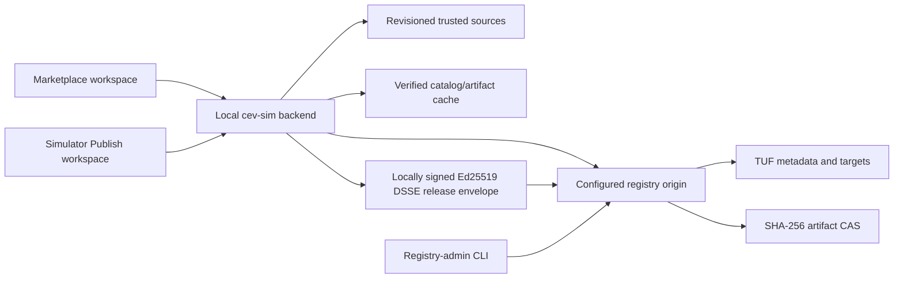

# Integrated Marketplace and Private LAN Registry Roadmap

This document is the implementation authority for the `MKT-*` program. The
program adds an integrated Marketplace workspace to cev-sim and a separately
hosted private-LAN registry. It is not headless PR 13 and does not extend the
`PLG-*`, `ED-*`, or `VIS-*` milestone sequences.

## Status

| Milestone | Implementation | Verification | Merge status |
| --- | --- | --- | --- |
| MKT-01: contracts and runtime baseline | Complete | Local acceptance passed; hosted CI pending | Unmerged |
| MKT-02: shared artifact/archive verification | Complete | Local acceptance passed; hosted CI pending | Unmerged |
| MKT-03: registry CAS and atomic storage | Complete | Local acceptance passed; hosted CI pending | Unmerged |
| MKT-04: TUF repository and read API | Complete | Local acceptance passed; hosted CI pending | Unmerged |
| MKT-05: simulator trust client and cache | Complete | Local acceptance passed; hosted CI pending | Unmerged |
| MKT-06: read-only Marketplace workspace | Implemented; acceptance pending | MKT-focused gates pass; repository-wide UI/a11y has unrelated failures | Unmerged |
| MKT-07: plans, jobs, transactions, receipts | Complete; acceptance pending | Core local gates pass; repository-wide UI/a11y has unrelated failures | Unmerged |
| MKT-08: plugin lifecycle | Complete; acceptance pending | Core local and serial Marketplace gates pass; repository-wide UI/a11y has unrelated failures | Unmerged |
| MKT-09: asset-package export, import, and revision mapping | Complete; acceptance pending | Core local gates pass; repository-wide a11y has unrelated workspace timeouts; hosted CI pending | Unmerged |
| MKT-10: portable environments | Implemented; acceptance pending | Core local gates pass; browser remainder waived for this run; supported-Node and hosted CI evidence pending | Unmerged |
| MKT-11: complete editable run templates | Implemented; acceptance pending | Full local and serial Marketplace gates pass; supported-Node and hosted CI evidence pending | Unmerged |
| MKT-12: collections | Implemented; acceptance pending | Focused contract, graph, ownership, registry, integration, API, job, and recovery suites pass; full gates pending | Unmerged |
| MKT-13: updates, tracks, yanks, and advisory UX | Implemented; acceptance pending | Local focused, full repository, fixtures, release, and serial UI/a11y gates pass; supported-Node build/distribution and hosted CI pending | Unmerged |
| MKT-14: simulator publisher workspace | Implemented; acceptance pending | Focused publisher/UI gates and full Marketplace/repository tests pass; supported-Node build, repository-wide browser, hosted CI evidence pending | Unmerged |
| MKT-15: scale, recovery, and operations | Not started | Not run | Unmerged |
| MKT-16: candidate acceptance and release | Zero-setup prerequisite implemented; candidate acceptance not started | Focused and full Marketplace/repository tests, lint, fixtures, and release check pass; browser/build and hosted candidate evidence pending | Unmerged |

Only a merged change may be marked merged. Verification records actual commands
and evidence; implementation status alone does not satisfy a milestone gate.

## Locked decisions

- The registry is a standalone JavaScript/ESM service. The simulator remains a
  local service and browser code never connects directly to a registry.
- Source onboarding is URL-only. An HTTPS origin enrolls on first connect
  when the registry serves `POST /v1/enroll`: the simulator pins the fetched
  bootstrap root, writes an owner-only connection bundle, and later connections
  must match that pin. HTTP origins, and HTTPS registries that do not offer
  enrollment, still require a preinstalled connection bundle.
- Publishing identities are provisioned and reconciled by the backend. Browser
  state contains only friendly identity names and readiness; tokens, private
  keys, secret references, and filesystem paths never cross the local API.
- Install, update, and publish preparation may perform downloads and local
  verification automatically, but exactly one final confirmation remains the
  boundary before local commit or remote publication writes.
- Initial operation is private-LAN with verified offline-cache support.
- SHA-256 identifies immutable artifact bytes. TUF protects catalog metadata,
  release visibility, rollbacks, and key rotation. Publisher releases use
  Ed25519 DSSE envelopes in addition to TUF distribution.
- Development and CI pin Node 22.22.2. The supported repository and staged
  runtime range is `>=22.22.2 <23`. `tuf-js` is pinned to 6.0.0.
- Installation and updates are explicit. Installation never executes plugins,
  grants capabilities, changes a run, or activates content.
- Existing plugin, vehicle, run-bundle, and run-package formats remain
  authoritative. Editable templates use the separate
  `cev-sim.run-template-package@1` authoring-closure contract; the exact
  run-bundle and run-package workflows and identities are unchanged.
- Correctly resolved managed runs continue executing admitted plugin selections
  under the existing versioned plugin contract. Marketplace installation alone
  never selects a plugin, grants capabilities, changes a run, or activates it.
- Marketplace metadata, sources, installed membership, and receipts are
  nonsemantic. They never enter `worldHash`, package hashes, `resolvedHash`,
  `simulationSemanticHash`, `episodeHash`, `trajectoryHash`, or run-package
  identity.
- Releases are immutable `(itemId, releaseVersion)` tuples. SemVer has no
  leading `v` or build metadata. Stable and beta tracks point to exact versions
  and never enter receipts or artifact identity.
- Dependencies are exact release references and exact artifact digests.
  Compatibility is the only place ranges are allowed, and dependencies are
  same-registry only in v1.
- The registry is filesystem-backed and single-writer. Distributed scheduling,
  public accounts, payments, ratings, arbitrary install hooks, OCI, public
  federation, and automatic activation/update are out of scope.

## Architecture and trust boundary

There are three separate decisions:

1. **Schema validity** means bytes parse under the strict marketplace contract.
2. **Verified authenticity** means the correct TUF trust chain and, for a
   release, publisher signature bind those exact bytes.
3. **Permission to install or execute** is a later local policy decision after
   compatibility, rights, capabilities, advisories, and current state are
   evaluated.

Passing an earlier decision never implies a later one. A registry cannot grant
local rights, activate a plugin, or make itself trusted through content it
serves.

Default TUF expirations are 48 hours for timestamp, 14 days for snapshot, 90
days for delegated targets, and 365 days for root. Previously verified cached
releases remain usable offline. Expired metadata cannot resolve or install a
release that was not previously verified.

## Threat model

| Threat | Contract response | Owning milestone |
| --- | --- | --- |
| Malicious registry or compromised publisher | Explicit root fingerprint trust, publisher DSSE, strict schemas, exact digests | MKT-01, MKT-04, MKT-05, MKT-13 |
| Rollback, freeze, or metadata mix-and-match | Monotonic catalog revision and TUF root/timestamp/snapshot/delegation verification | MKT-04, MKT-05 |
| Tampered or substituted artifact | Signed release descriptor plus exact byte size and SHA-256 | MKT-01, MKT-02, MKT-03 |
| Hostile archive | Frozen USTAR profile, streaming limits, traversal/link/header rejection | MKT-02, MKT-09 |
| Backend used as SSRF proxy | Configured-origin allowlist, fixed paths, no cross-origin redirects | MKT-05 |
| Credential disclosure | Separate owner-only store, write-only requests, redacted errors/logs/snapshots | MKT-05, MKT-13, MKT-15 |
| Unsafe preview or description | Bounded raster media only; CommonMark without raw HTML | MKT-03, MKT-06 |
| Crash during admission/install | Staging, atomic rename, journals, idempotent recovery, late receipts | MKT-03, MKT-07 |
| Marketplace provenance changes simulation identity | Separate stores and compatibility vectors over existing hash authorities | MKT-01 and every lifecycle milestone |

## Content and contract model

| Content kind | Artifact contract | Marketplace media type |
| --- | --- | --- |
| `plugin` | `cev-sim.plugin-package@1` | `application/vnd.cev-sim.plugin-package+json` |
| `vehicle` | `cev-sim.vehicle-bundle@1` | `application/vnd.cev-sim.vehicle-bundle+json` |
| `run-template` | `cev-sim.run-template-package@1` | `application/vnd.cev-sim.run-template-package+tar` |
| `run-package` | `cev-sim.run-package@1` | `application/vnd.cev-sim.run-package+tar` |
| `environment` | `cev-sim.environment-package@1` | `application/vnd.cev-sim.environment-package+tar` |
| `asset-pack` | `cev-sim.asset-package@1` | `application/vnd.cev-sim.asset-package+tar` |
| `collection` | `cev-sim.marketplace-collection@1` | `application/vnd.cev-sim.marketplace-collection+json` |

Scripts, scenarios, sensors, and behaviors remain inside plugins, exact run
artifacts, or the reachable closure of an editable run-template package. They
are not standalone marketplace content.

MKT-01 publishes draft-2020-12 schemas and executable strict readers for:

- `cev-sim.marketplace-item@1`
- `cev-sim.marketplace-release@1`
- `cev-sim.marketplace-catalog@1`
- `cev-sim.marketplace-advisory@1`
- `cev-sim.marketplace-collection@1`
- `cev-sim.marketplace-sources@1` (local only)
- `cev-sim.marketplace-installed@1` (local only)
- `cev-sim.marketplace-install-receipt@1` (local only)

Every contract uses `kind` plus numeric `version`. Release SemVer is stored as
`releaseVersion`. Canonical marketplace JSON uses RFC 8785/JCS, UTF-8 without a
BOM or trailing newline. Readers reject duplicate decoded keys, prohibited
prototype keys, malformed UTF-8, unknown fields/enums, unsupported versions,
noncanonical identifiers, malformed hashes, invalid sizes, and excessive
nesting.

The schemas publish these custom string formats: `marketplace-id`,
`release-version`, `sha256`, `uuid-lower`, `canonical-timestamp`,
`target-path`, `source-url`, `absolute-url`, `spdx-expression`,
`plugin-capability`, and `semver-range`. Runtime semantic validation additionally
enforces media/content-kind agreement, unique identities and references,
catalog referential integrity, stable-track release policy, same-registry exact
references, ordered sources, and globally unique receipt references. Schema
validity alone cannot detect duplicate raw JSON keys, verify signatures,
resolve dependency eligibility, or grant permission to install or execute.

The DSSE payload type is
`application/vnd.cev-sim.marketplace-release+json`; its payload is the exact
canonical release bytes. TUF uses its own serialization. Artifact digests hash
delivered artifact bytes and are not aliases for existing semantic/package
hashes.

## Portable archive limits

MKT-02 generalizes the existing strict run-package USTAR implementation;
MKT-09 activates asset packages and MKT-10 activates environment packages.
Existing run-package limits and bytes remain unchanged.
`server/artifacts/DeterministicArchive.js`
owns transport-only canonical USTAR framing and verification, while each
content profile continues to own entry order, semantic validation, and its
narrower limits.

Asset and environment packages share an 8 GiB archive ceiling, a 1 GiB
binary-blob ceiling, a 32 MiB authoring-record ceiling, a 4 MiB manifest
ceiling, 16,384 payload entries, and dependency depth 64. No base-256 or PAX
extension is admitted.

## MKT-01 work packages

- [x] WP-01: record roadmap, architecture boundary, threat model, and baseline
  compatibility vectors.
- [x] WP-02: pin runtime/dependencies and align development, CI, installer, and
  staged distribution metadata.
- [x] WP-03: define vocabulary, limits, errors, and primitive validators.
- [x] WP-04: publish nine local schemas and executable validators for eight
  documents.
- [x] WP-05: implement strict byte readers, canonical serialization, hashes,
  and reviewed fixtures.
- [x] WP-06: add the default-off `CEV_SIM_MARKETPLACE_ENABLED` startup seam.
- [x] WP-07: complete local focused/full verification and record the final
  evidence. Hosted CI and merge evidence remain pending on an MKT-01 commit.

The feature flag accepts empty/`0`/`false` as disabled and `1`/`true` as
enabled. Invalid values fail startup. It requires a restart and remains false
by default through MKT-15. In MKT-01 neither state mounts routes, performs
network access, creates marketplace storage, or changes browser workspaces.

## MKT-02 work packages

- [x] WP-01: freeze exact run-package bytes in the golden fixture and retain
  every MKT-01 compatibility identity.
- [x] WP-02: add bounded hashing, exclusive staging, path validation, deadline,
  cancellation, fsync, cleanup, and abandoned-operation recovery primitives.
- [x] WP-03: extract the deterministic streaming USTAR reader/writer with
  canonical-header, hostile-input, limit, and bounded-memory enforcement.
- [x] WP-04: rebase run-package encode, stream, verify, admission staging, and
  recovery paths without changing bytes, result shapes, or public errors.
- [x] WP-05: extract pure vehicle-bundle hash and verification before any CAS
  or authoring write.
- [x] WP-06: register read-only plugin, vehicle, run-template, and run-package
  artifact adapters; mutation operations remain deterministically unsupported.
- [x] WP-07: add hostile archive, stream/staging fault, adapter, regression, and
  greater-than-2-GiB lazy-stream coverage.
- [x] WP-08: document the transport and adapter boundaries and record local
  source/build/distribution evidence. Hosted CI and merge evidence remain
  pending on an MKT-02 commit.

## MKT-03 work packages

- [x] WP-00: begin from the clean MKT-02 commit and confirm marketplace schemas,
  package identities, simulation hashes, and the dormant feature flag remain
  outside the registry change.
- [x] WP-01: add normalized registry paths, strict internal documents, canonical
  catalog projections, UTF-8 ordering, and revision-1 empty initialization.
- [x] WP-02: add atomic sibling-directory initialization, owner-only modes,
  hostile-node checks, exclusive writer ownership, guarded stale-owner
  recovery, and token-checked release.
- [x] WP-03: add operation-owned staging, adapter-backed artifact admission,
  immutable CAS/blob records, deterministic concurrent deduplication, and
  exact PNG/JPEG/WebP validation.
- [x] WP-04: add durable catalog journals, immutable target/revision
  publication, one atomic current-catalog visibility point, forward recovery,
  and fault hooks at every boundary.
- [x] WP-05: add presentation-only item updates, preview binding, exact
  dependency checks, stored-inspection validation, immutable release tuples,
  idempotent retries, and transactional track moves.
- [x] WP-06: add deterministic listing, full registry verification, expired
  staging recovery, and planning-only rooted GC with no CAS deletion.
- [x] WP-07: add the shared `cev-sim-marketplace`, `cev-mkt`, and `cev-sim mkt`
  CLI, signal cleanup, structured results/errors, distribution files,
  dependencies, bins, and installed-tarball parity checks.
- [x] WP-08: add storage, ownership, CAS, recovery, preview, immutability,
  verification, GC, CLI parity, distribution, and no-listener tests plus
  operator and architecture documentation. Final command evidence is recorded
  below after acceptance completes.

## MKT-04 work packages

- [x] WP-00: preserve the clean MKT-03 contract and 37-test marketplace
  baseline; keep the simulator feature flag dormant and `server/App.js`
  outside the listener graph.
- [x] WP-01: pin `@tufjs/models@5.0.0` and
  `@tufjs/canonical-json@2.0.0`, retain `tuf-js@6.0.0`, package all three in
  the headless distribution, add TUF layout helpers, Ed25519 key primitives,
  and strict discovery/journal documents.
- [x] WP-02: add external offline-key enforcement, owner-only online keys,
  atomic TUF bootstrap/upgrade, TUF 1.0.31 root extension, terminating
  delegations, consistent targets, and the empty advisory role.
- [x] WP-03: add target projection, delegated-role versioning, exact signed-byte
  TUF journals, timestamp-last publication, catalog/TUF serialized commits,
  and forward recovery at every durable boundary.
- [x] WP-04: verify continuous root history, old/new root signatures,
  expirations, registry binding, all role signatures and metadata descriptors,
  canonical delegated targets, exact target sets, and referenced CAS bytes;
  refresh increments all online roles.
- [x] WP-05: add journaled two-root overlap rotation, new-key top-level targets,
  final new-only root publication, retained numbered roots, and automatic
  completion after faults before or after the timestamp switch.
- [x] WP-06: add the lock-free `MarketplaceRegistryReader`, timestamp-chain
  alias resolution, stable verification retries, referenced file-handle reads,
  strict metadata/target visibility, and reconciliation-aware readiness.
- [x] WP-07: add the standalone loopback-only `node:http` server with strict raw
  paths, exact MIME/length/ETag/nosniff/cache headers, no CORS, conditionals,
  bounded single ranges, streaming, timeouts, and stable JSON errors.
- [x] WP-08: extend all CLI aliases with init key custody, refresh, rotation,
  serve, one-record startup, clean signals, and installed-distribution TUF and
  loopback smoke verification.
- [x] WP-09: add key/bootstrap/upgrade, publication and rotation recovery,
  expiry/signature/tamper, `tuf-js`, conditional/range/path/header, loopback
  binding, lifecycle, and concurrent timestamp-visibility tests.
- [x] WP-10: document layout, key custody, backup exclusions, publication,
  recovery, loopback operation, internal/public visibility, milestone
  boundaries, and acceptance evidence.

## MKT-05 work packages

- [x] WP-00: begin from clean MKT-04 commit `a1a6c64`; record the 47/47
  marketplace baseline; preserve canonical marketplace fixtures,
  plugin/vehicle/run-package hashes, and headless characterization; keep UI,
  previews, artifacts, installation, receipts, DSSE, advisory policy, and
  secure LAN hosting outside MKT-05.
- [x] WP-01: export the pure canonical metadata, role/meta, root-contract, and
  delegation-contract verifiers from `TufMetadata.js`; retain MKT-04 behavior;
  add client limits, health states, local-document validators, and public
  source error codes without changing `sources.schema.json`.
- [x] WP-02: add the revisioned serialized `MarketplaceSourceStore`, immutable
  owner-only `MarketplaceCredentialStore`, bootstrap trust storage, optimistic
  revisions, deterministic ordering, duplicate origin/registry rejection, and
  fail-closed orphan/hostile-node recovery.
- [x] WP-03: add `MarketplaceFixedOriginFetcher` and trust preview with strict
  canonical discovery, exact bootstrap-root fingerprinting, self-signature and
  registry binding, manual redirects, origin/path confinement, write-only
  bearer handling, and repeated add-time confirmation.
- [x] WP-04: add online `tuf-js@6.0.0` refresh, continuous root capture,
  complete role verification, exact catalog/item/release/advisory target sets,
  eager canonical target download, full summary cross-checks, immutable
  snapshots, and atomic current-pointer publication.
- [x] WP-05: add one-time-per-operation expiry evaluation, deterministic health
  precedence, sanitized refresh outcomes, reverified cached reads, exact
  offline reads with `fresh: false`, and `requireFresh` expiry enforcement.
- [x] WP-06: add per-source serialization and shutdown cancellation in
  `MarketplaceService`; mount the 32 KiB no-store, redacted source API only in
  the enabled `server/App.js` branch; preserve fully inert disabled startup.
- [x] WP-07: add focused source-store, trust-client, cache, and API suites over
  the real `MarketplaceRegistryHttpServer`, including concurrency, modes,
  confirmation, fixed origins, redirects, root rotation, eager/offline/expired
  reads, publication faults, request immutability, and credential redaction.
- [x] WP-08: finish operator/client and architecture documentation, stage the
  client modules and document in the headless distribution, run complete local
  acceptance, record immutable fixture checks, and retain hosted CI as the
  final pre-merge evidence requirement.

## MKT-06 work packages

- [x] WP-00: begin from clean MKT-05 commit `810ad70`; record the 55/55
  marketplace baseline; preserve canonical marketplace fixtures,
  `sources.schema.json`, plugin/vehicle/run-package identities, and headless
  characterization; keep installation, compatibility eligibility,
  plans/jobs/receipts, installed state, DSSE, advisories, and automatic
  refresh outside MKT-06.
- [x] WP-01: add the pure deterministic `MarketplaceReadModel` with strict
  queries, signed-track selection, source-specific projections, exact filters,
  searchable fields, facets, stable ordering, and bounded pagination.
- [x] WP-02: expose ephemeral TUF distribution verification from reverified
  snapshots without changing the cache-manifest schema; add search, detail,
  and referenced-preview reads to `MarketplaceService`; preserve offline and
  expired snapshots while failing closed on corrupt trust/cache state.
- [x] WP-03: add enabled-only read routes, strict query/path handling,
  digest-addressed fixed-origin preview fetching, exact byte/media/digest
  checks, raster reinspection, redacted stable errors, immutable private
  headers, and ETag conditionals.
- [x] WP-04: add the abortable browser API client, structured marketplace
  errors, pinned safe CommonMark rendering, and content-specific disabled
  action labels.
- [x] WP-05: add `APP_VIEWS.MARKETPLACE`, enabled status probing, conditional
  workspace navigation, and disabled-startup coverage.
- [x] WP-06: implement the 1280x720 Discover/result/details workspace with
  verified previews, exact release data, declared compatibility requirements,
  truthful registry-signer terminology, and disabled installation controls.
- [x] WP-07: implement revisioned Sources, complete typed-fingerprint trust,
  explicit refresh, rename/enable/priority/credential/update/removal flows,
  conflict review, focus restoration, and transient bearer handling.
- [x] WP-08: add the honest Installed scaffold and conditional Plugin Library
  link without changing existing local plugin behavior or inferring installed
  membership.
- [x] WP-09: add read-model, API, real-registry Playwright, keyboard, viewport,
  redaction, offline retention, preview, and Axe coverage; enable the feature
  only in the Playwright server environment.
- [x] WP-10: document read semantics, signer terminology, preview confinement,
  offline behavior, browser/backend/registry boundaries, milestone decisions,
  and factual acceptance evidence.

## MKT-07 work packages

- [x] WP-00: begin from clean MKT-06 commit `61d8205`; record the 60/60
  marketplace baseline and freeze `installed.schema.json`
  (`274e7b72f65a1df6b220eb1508fac635935765834254455cc1eb33cc2e765e10`),
  `install-receipt.schema.json`
  (`af1a8db03f31b1ea21d858235f872e0480c39c8a7c4bb39fb348bdfcf3056557`),
  the MKT-01 compatibility fixture
  (`6904056555062d7267bc0cf749081558e0e1ca5724401e7f0c9bfaeb813c4ae7`),
  and headless characterization
  (`60dc0bd2b02a9ec768f833070ce4d8d2047f5383838f09ea3f130dd31552dd6f`).
- [x] WP-01: add private installation layout, exact canonical local-document
  validators, owner-only modes, hostile-node checks, and pinned-snapshot reads.
- [x] WP-02: add normalized host profiles, deterministic compatibility issues,
  exact same-snapshot dependency resolution, yanked warnings, and injectable
  pre-download policy blocking.
- [x] WP-03: persist timestamp-free, content-addressed metadata preflights and
  deterministic finalized lifecycle plans with installed and host preconditions.
- [x] WP-04: add confined streaming blob downloads, verified artifact CAS
  reuse, concurrent immutable publication, mismatch quarantine, cancellation,
  and deletion of incomplete streams.
- [x] WP-05: make the adapter lifecycle contract explicit while leaving all
  four production adapters read-only; exercise planning, commit, and receipts
  only through an injected test adapter that never executes plugin source.
- [x] WP-06: add revisioned installed membership and immutable canonical
  receipts with exact dependency locks, mappings, reinstall history, and
  content-preserving removal.
- [x] WP-07: add serialized journaled install/removal transactions, adapter
  idempotency by transaction ID, installed-ledger-last visibility, startup
  roll-forward, and fail-closed ambiguous-state handling.
- [x] WP-08: add durable revisioned jobs, precommit cancellation, restart
  resumption, final confirmation, revisioned SSE, terminal close, and shutdown
  behavior that never cancels a durable commit.
- [x] WP-09: compose recovery after headless supervisor initialization, expose
  the coordinator API, derive eligibility from the live host profile, and map
  precondition, conflict, and recovery errors without internal disclosure.
- [x] WP-10: add the two-stage browser dialog and exact Installed view while
  retaining disabled production actions until MKT-08/09 lifecycle adapters.
- [ ] WP-11: complete and record the full local acceptance matrix and hosted
  CI evidence. Focused dependency, compatibility, artifact, installed-store,
  job, API/SSE, transaction-boundary, adapter, offline-reuse, removal, and
  restart-recovery tests pass locally.

## MKT-08 work packages

- [x] WP-00: begin from clean MKT-07 commit `e5ea070`; record the frozen
  installed schema, receipt schema, compatibility fixture, and headless
  characterization hashes without changing those bytes.
- [x] WP-01: bind signed plugin releases to the inspected `plugin.json` ID,
  version, exact capabilities, engine-range subset, and plugin-package v1
  contract at both registry admission and finalized client planning.
- [x] WP-02: migrate the private plugin library to version 2 with atomic,
  canonical manual and Marketplace ownership while preserving the public
  `listInstalled()` shape and immutable CAS/runtime content.
- [x] WP-03: add the production plugin lifecycle adapter with deterministic
  owner-aware planning, exact receipt mappings, verified commit, no source
  evaluation, no runtime grants, and visible-membership-only storage events.
- [x] WP-04: compose the production plugin adapter with the remaining read-only
  vehicle/run adapters, share `StorageService.plugins`, and migrate ownership before
  Marketplace transaction recovery.
- [x] WP-05: journal immutable adapter-removal plans, publish installed-ledger
  removal first, remove only the exact Marketplace owner, and replay both new
  durability boundaries idempotently.
- [x] WP-06: replace raw plugin-plan and receipt JSON with named Plugin Library
  changes, hashes, capability requirements, explicit zero-grant messaging,
  exact completion identity, and ownership/CAS retention removal copy.
- [x] WP-07: align generated integration releases to the verified fixture
  manifest without editing canonical Marketplace fixtures; cover static
  disagreement and owner-aware store behavior.
- [x] WP-08: exercise the real adapter for precommit immutability, throwing
  source, offline reuse, manual reuse, stale library revisions, owner removal,
  source/cache-independent removal, and crash recovery.
- [x] WP-09: update API and browser expectations so plugin releases are
  installable while all other content adapters remain lifecycle-disabled, and
  retain existing plugin execution paths and grant semantics.
- [x] WP-10: update Marketplace, plugin, and architecture documentation and
  record factual verification evidence without changing ED, VIS, headless, or
  run-manifest contracts.

## Milestones and gates

### MKT-01 — Program contract and runtime baseline

Freeze schemas, identifiers, media types, compatibility, errors,
canonicalization, nonsemantic provenance, Node 22.22.2 development/CI, the
supported Node 22 range, TUF dependency, and the dormant feature flag.

Gate: positive/negative schema vectors pass under Node 22.22.2; the complete
existing suite passes; existing simulator/world/episode/plugin/vehicle/run
hashes do not change.

### MKT-02 — Shared artifact and archive verification

Generalize the deterministic USTAR reader/writer and bounded staging/hash/path
utilities without changing existing run-package bytes. Add read-only adapters
for plugin packages, vehicles, run bundles, and exact run packages.

Gate: golden run packages remain byte-identical; hostile archives and
multi-gigabyte bounded-memory streams pass focused and full checks.

### MKT-03 — Registry CAS and atomic storage

Add the standalone service/CLI, immutable filesystem CAS, staging,
single-writer locking, revisioned catalog, journal recovery, admission,
verification, and dry-run GC. Bind no listener beyond loopback.

Gate: deterministic concurrent deduplication, crash recovery at every commit
boundary, and immutable release tuples.

### MKT-04 — TUF repository and read API

Initialize offline root plus online delegated/snapshot/timestamp keys; support
root rotation and publish catalog, item, release, and advisory targets. Add
well-known, catalog, item, release, blob, health, and TUF reads with bounded
ranges and strict headers.

Gate: rollback/freeze/mix-and-match/expiry/delegation/registry-ID/key-rotation
tests pass; ranges reconstruct exact blobs; LAN binding remains rejected.

### MKT-05 — Simulator trust client, source store, and cache

Add revisioned sources, separate credentials, server-side TUF verification,
root-fingerprint confirmation, verified caches, fixed-origin requests, offline
policy, and source health.

Gate: credentials never leave the server; arbitrary proxying and changed trust
roots/registry IDs fail; offline and clock-skew behavior is deterministic.

### MKT-06 — Read-only Marketplace workspace

Add Discover, Installed, and Sources to the explicit view-state system with
search/filter/details/trust flow, safe preview proxying, source health, and a
Plugin Library link. Installation controls remain disabled.

Gate: Playwright navigation/trust/search/offline/malformed tests and a11y pass
at the 1280×720 minimum viewport.

### MKT-07 — Installation plans, jobs, transactions, and receipts

Add exact dependency resolution, compatibility evaluation, deterministic
plans, asynchronous jobs/SSE, journaled transactions, installed state,
immutable receipts, quarantine, recovery, cancellation-before-commit, and
content-preserving removal.

Gate: no partial visibility under crash injection; recovery/replay is
idempotent; stale plans, cycles, and blocked dependencies fail before commit.

### MKT-08 — Plugin marketplace lifecycle

Install through the existing plugin CAS/library, cross-check manifest
capabilities/compatibility, show additions, retain runtime grants, support
coexisting versions, and remove membership without eager CAS deletion.

Gate: install never executes source or grants capabilities; existing
browser, direct-headless, and correctly resolved managed plugin execution
remain unchanged.

### MKT-09 — Asset-package export, import, and revision mapping

Implement `cev-sim.asset-package@1` as deterministic uncompressed USTAR over
editor-asset revision records and their exact visual-use/blob closure. Export
uses one serialized editor-store snapshot and export-right validation. Import
performs strict inspection, source-only closure hashing, deterministic local ID
allocation, contiguous local revision mapping, child-first v2 recompilation,
upload/derivative-right validation, durable prepared output, and one journaled
authoring operation per use and revision.

The archive order is `manifest.json`, digest-sorted `records/sha256/<digest>`,
then digest-sorted `blobs/sha256/<digest>`. Manifest and record bytes are exact
JCS with no trailing newline. Installed membership and provenance removal never
delete imported uses, editor revisions, or their durable roots.

Gate: repeated exports are byte-identical; missing, extra, corrupt, cyclic, or
over-depth closure data fails before authoring; identical initial stores produce
identical plans; geometry and metric behavior survive remapping; post-commit
failure pauses in `needs-attention` and resumes operation-by-operation without
rollback or overwrite.

### MKT-10 — Portable environments

Implement `cev-sim.environment-package@1` as a deterministic, resumable
authoring lifecycle over a canonical schema-v4 environment, the MKT-09 asset
closure, and the complete visual descriptor/access closure. Import rewrites
asset pins and metric snapshots, deterministically allocates the local
environment ID, rebinds visual truth only when the world changes, and publishes
uses, revisions, visual records, then the environment through the existing
guarded storage lanes.

The package does not carry correspondence evidence, bake-reuse state, source
policy, or Marketplace provenance into authoring identity. Marketplace opens a
completed import through the normal Environment Editor selection path; it does
not invoke document mutations or projection directly.

Gate: repeated exports are byte-identical; all archive and graph failures are
rejected before authoring; operation-level resume never overwrites or rolls
back user edits; round trips remain editable through `CommandBus` and
`SceneProjector`; carried rights cannot grant authority; world identity changes
only with canonical world content.

### MKT-11 — Complete editable run templates

Implement `cev-sim.run-template-package@1` as a deterministic USTAR package
containing the saved run manifest and its complete reachable authoring closure:
schema-v4 environment data and assets, custom vehicles and model files,
scenarios, editable script graphs and their current compiled artifacts, frozen
bindings, exact plugin packages, and explicit built-in references. The signed
release carries an exact `embeddedPlugins` inventory tied to already-admitted
same-registry plugin releases.

Import is static and destination-independent. It never imports plugin modules,
adds Plugin Library membership or grants, or resolves/launches the run. It
deterministically maps authoring IDs, rewrites typed references and authoring
locks, publishes CAS-only plugin prerequisites, environment content, vehicle
assets and manifests, scripts, scenarios, and finally the run manifest through
guarded replayable operations. Imported manifests set
`scripts.bindingSource: "embedded"`, clear `bindingIds`, and freeze even an
empty binding set.

Standalone vehicle installation and exact-run retention/execution remain
unmet prerequisites from the earlier MKT-08 lifecycle scope. They are not
silently absorbed into MKT-11.

Gate: repeated exports are byte-identical; archive inspection proves an exact
nonexecuting closure; collision and prior-receipt mappings are deterministic;
crash recovery never overwrites user edits; the run manifest publishes last;
an imported template can be opened, edited, explicitly validated, resolved,
and run while existing run-bundle/run-package bytes and semantic identities
remain unchanged.

## MKT-11 work packages

- [x] WP-00–02: reconcile roadmap authority, introduce the package contract and
  signed plugin inventory, and freeze destination-independent binding behavior.
- [x] WP-03–04: capture and recheck the reachable authoring closure and perform
  strict manifest-first static verification without runtime plugin loading.
- [x] WP-05–07: plan deterministic mappings and typed rewrites, add guarded
  authoring persistence, and journal the package lifecycle with final run
  publication last.
- [x] WP-08–10: enforce registry plugin-reference admission, expose the export
  API and Config controls, and surface imported run-manifest mappings for
  Marketplace navigation.
- [ ] WP-11–12: complete the hostile/collision/crash matrix, serial Marketplace
  browser acceptance, supported Node 22.22.2 and hosted CI evidence.

Local evidence on 2026-09-29:

- `npm run test:marketplace` passed 102 tests with zero failures, including
  deterministic template export, exact static closure verification, built-in
  descriptors, custom vehicle assets, signed plugin-release admission,
  collision allocation, every typed script-reference rewrite, empty frozen
  bindings, final run-manifest publication, and exact lifecycle replay.
- `npm test` passed 1,839 tests with six declared skips and zero failures
  (1,845 total). Existing run-bundle/run-package identity tests remained green.
- `npm run lint` completed with zero errors and the pre-existing
  `MapSurface.js` `assetEpoch` hook warning. `npm run build` and
  `npm run release:check` passed.
- `npm run fixtures:headless` and `npm run fixtures:environment-editor` passed
  without changing either frozen fixture. `git diff --check` passed.
- `npx playwright test tests/ui/marketplace.spec.js --workers=1` passed 4/4,
  including the serial keyboard/Axe case at the configured desktop viewport.
- This host uses Node `v22.14.0`/npm `11.4.1`, below the locked Node `22.22.2`
  patch baseline. The remaining hostile/crash matrix, dedicated imported-run
  browser flow, supported-Node run, hosted CI, and merge evidence keep
  WP-11–12 and milestone acceptance open.

### MKT-12 — Collections and multi-release plans

Validate/publish/discover collections, expand exact members/dependencies,
deduplicate artifacts, present per-member requirements, commit membership only
after all imports, and preserve independent installs on removal.

Gate: cycles, missing releases, digest mismatch, and cross-registry refs fail;
partial failure installs no collection; reinstalls are idempotent.

## MKT-12 work packages

- [x] WP-00: freeze commit `1c08065`, the 102-test Marketplace baseline,
  Node 22.22.2 acceptance runtime, and public schema/fixture identities.
- [x] WP-01: add bounded canonical collection inspection, exact signed-member
  validation, and the verification-only collection lifecycle adapter.
- [x] WP-02: apply exact admitted-member and stored-inspection invariants during
  registry admission and verification.
- [x] WP-03: add deterministic multi-root intent resolution with requested,
  collection, and artifact-only dispositions and deduplicated descriptors.
- [x] WP-04: add the private revisioned `ownership.json` ledger, legacy direct
  migration, strict invariants, and idempotent multi-owner acquisition.
- [x] WP-05: stage installed and ownership targets in one journal, commit
  dependency-first release groups, publish ownership before installed visibility,
  and retain backward recovery for older journals.
- [x] WP-06: make removal direct-owner-specific and cascade a collection only
  when its final owner disappears, preserving other owners and retained bytes.
- [x] WP-07: add collection detail, installed ownership, and enriched durable
  operation projections without exposing registry or staging internals.
- [x] WP-08: add collection member/review/progress and owner-aware Installed UI.
- [x] WP-09: add focused collection inspection, graph, ownership, publication,
  installation, reinstall, removal, and durable-boundary recovery coverage.
- [ ] WP-10: finish the complete repository, browser, accessibility,
  distribution, supported-Node, hosted-CI, and merge evidence matrix.

MKT-12 began on 2026-09-29 from clean commit `1c08065`. The pre-change
Marketplace baseline was 102 tests. This host uses Node `v22.14.0`, below the
required Node `22.22.2` acceptance runtime. Frozen baseline hashes are:

- installed schema: `274e7b72f65a1df6b220eb1508fac635935765834254455cc1eb33cc2e765e10`
- receipt schema: `af1a8db03f31b1ea21d858235f872e0480c39c8a7c4bb39fb348bdfcf3056557`
- compatibility fixture: `6904056555062d7267bc0cf749081558e0e1ca5724401e7f0c9bfaeb813c4ae7`
- headless characterization: `60dc0bd2b02a9ec768f833070ce4d8d2047f5383838f09ea3f130dd31552dd6f`
- collection-bearing document fixture: `f98ed99c53a446f046a1857356b4c1876e388a4f345ed07d1cb37ce6360b5287`
- canonical Marketplace fixture: `333579f7dd4f9905137c754a0419ecf2ba6911054794d8cc8ee074309987a301`

Local evidence on 2026-09-29 used the checksum-verified Node 22.22.2 runtime.
`npm run test:marketplace` passed 114/114. The focused MKT-12 coverage includes
the 8 MiB JSON ceiling, canonical collection inspection, exact signed members,
nested intent expansion, ownership migration and cascade, real registry/client
installation, and injected failure recovery after member operation/receipt,
collection verification/receipt, ownership publication, and installed
publication. `npm test` passed 1,851 tests with six declared skips and zero
failures (1,857 total).

The serial Marketplace Playwright suite passed 5/5 at the configured desktop
viewport, covering collection discovery, exact member details, grouped review,
commit, Installed ownership, collection removal, keyboard operation, and Axe.
`npm run lint` passed with only the pre-existing `MapSurface.js` hook warning;
`npm run build`, both fixture generators, `npm run release:check`, and
`git diff --check` passed. Headless distribution and installed-tarball
verification passed under Node 22.22.2; the npm artifact was 1,281,302 bytes
with SHA-256
`ab7ba07dd8e5e6c06f82c6592dcf3ae6f763780d93b3226f2042376a06ada120`.
The parallel full accessibility command remains open after unrelated
Environment Editor/workspace timeout failures and a Marketplace timeout under
contention; the serial Marketplace keyboard/Axe case passes. Hosted CI and
merge evidence also remain open, so MKT-12 is not marked verified or merged.

### MKT-13 — Updates, tracks, yanks, and advisory UX

The attached roadmap supersedes the former split between MKT-13 publisher/LAN
prerequisites and MKT-14 update policy. MKT-13 now closes the missing publisher,
authentication, TLS, and execution-policy prerequisites and implements manual,
side-by-side updates. Selection identity is always
`sourceId + registryId + itemId + exact release`; no registry or source can
redirect an installed item to a different identity.

Unsigned pre-MKT-13 catalogs have no `releaseAuthority` marker and fail with
`UPGRADE_REQUIRED`. Operators provision a new registry UUID, publisher, and
trust root and republish signed envelopes. Existing installed ledgers,
receipts, authoring records, manual plugin ownership, and CAS bytes are not
deleted or rewritten. `development-unsigned` exists only as an explicit
in-process fixture option and is not exposed by the production CLI.

## MKT-13 work packages

- [x] WP-00: freeze commit `8f43c02`, the 114-test Marketplace baseline,
  existing fixture/hash authorities, and the feature-flag boundary.
- [x] WP-01: add publisher/bootstrap schemas, Ed25519 key identity, canonical
  DSSE PAE/sign/parse/verify, signed direct-plugin identity, advisory
  `packageHash`/`clear`/`supersedes`, and publisher catalog targets.
- [x] WP-02: add digest-only bearer storage, constant-time verification,
  exact scopes/namespaces/revocation, HTTPS/mTLS listener support, private CA
  and client-certificate transport, and secure non-loopback bind rules.
- [x] WP-03: add publisher/key/token administration, authenticated blob/item/
  envelope admission, immutable envelope targets, publisher TUF delegation,
  and key/sign/token CLI operations.
- [x] WP-04: add atomic track moves, immutable yanks, advisory admission,
  publisher compromise response, affected executable package enumeration, and
  timestamp-last TUF publication.
- [x] WP-05: verify publisher and advisory target sets client-side; persist
  rollback floors, immutable advisories, yanks, approvals, and overrides before
  cache visibility; retain policy after source removal.
- [x] WP-06: persist canonical package provenance before installed visibility,
  evaluate release/package policy, project installed status at read time, and
  keep overrides local and nonsemantic.
- [x] WP-07: authorize after package verification and before module import;
  enforce again in Node/browser module sources, browser file delivery,
  authoring, run resolution, and direct headless option plumbing; active
  sessions retain admission and refuse reset after a policy revision until
  explicit revalidation.
- [x] WP-08: discover updates only within exact source/registry/item identity;
  pin installed receipts/revisions and candidate track/snapshot; reopen the old
  artifact; compare capabilities, executable identities, compatibility,
  rights, and mappings; hash the comparison into the final plan.
- [x] WP-09: install updates through the existing journal as a new exact direct
  owner, preserve the old release and every receipt/mapping/session, hash
  `allowYanked`, and revalidate source, policy, installed revision, plan, and
  host profile before commit.
- [x] WP-10: add Updates and Security tabs, update comparison, publisher/key
  status, yanked acknowledgement, blocked-release suppression, retained
  advisories, approvals, overrides, and installed `yanked|blocked` projection.
- [x] WP-11: reject unmarked unsigned state and add focused hostile coverage
  for DSSE mutation, scopes/namespaces/revocation, retired keys, rollback,
  offline block retention, exact update identity, and pre-import denial.
- [ ] WP-12: complete supported-Node build/distribution, hosted-CI, and merge
  evidence. Local focused, full repository, fixture, release, and serial
  browser/a11y evidence is below.

Gate: signatures bind exact canonical release and artifact identities; inactive
keys cannot admit new releases while historical verification remains possible;
rollback-protected package blocks survive restart/offline/source removal;
updates are manual and result in either only the old exact release or both old
and new exact releases.

### MKT-13 local evidence

Implementation began on 2026-09-29 from commit `8f43c02`. The pre-change
Marketplace gate passed 114/114. The baseline installed/receipt schemas,
canonical Marketplace fixture, compatibility fixture, and headless
characterization remain the MKT-12 frozen values recorded above. The feature
continues to be constructed and mounted only behind
`CEV_SIM_MARKETPLACE_ENABLED`.

This host is macOS arm64 with Node `v22.14.0` and npm `11.4.1`, below the
required Node `22.22.2` acceptance patch. Current local evidence:

- `tests/marketplace-mkt13.test.js`: 7/7 passed, covering DSSE tampering,
  digest-only scoped tokens, signed admission/retirement/yank, offline policy,
  authorized clear, rollback, exact update identity, and comparison hashing.
- focused registry, TUF, trust-client, source-store, contract, and plugin-loader
  suites passed; authorization failure occurs before runtime import.
- `npm run test:marketplace`: 122/122 passed.
- `npm test`: 1,860 passed, 6 skipped, and zero failed out of 1,866 tests.
- `npm run lint`: zero errors and the pre-existing `MapSurface.js`
  `assetEpoch` hook warning.
- `npm run fixtures:headless` and `npm run fixtures:environment-editor`
  passed without a committed fixture delta. The headless characterization SHA-256
  remains `60dc0bd2b02a9ec768f833070ce4d8d2047f5383838f09ea3f130dd31552dd6f`.
- `npm run release:check` and `npm run dist:headless` passed. The staged npm,
  wheel, and sdist SHA-256 values were respectively
  `8892ccd574a5e4541aa3e087849eab8f75c23cc2f0ee137cc639e2e6344237f5`,
  `706e91522bf6a47debec9aee80181bce49720086df25a15269fc7eaaf42a235a`,
  and `59cffac85dd01b0395b3a50c087bb5a1668bf21dd697c12f04b71712b20b541e`.
- `npx playwright test tests/ui/marketplace.spec.js --workers=1` passed 6/6;
  a final focused MKT-13 plus Axe/reload-banner run passed 2/2.
- `git diff --check` passed.

`npm run build` remains unverified because this host's sandbox denies the
Turbopack worker process/port operation. `npm run dist:verify` fails closed at
the clean npm install with `EBADENGINE`: the package requires Node
`>=22.22.2 <23`, while this host supplies Node `22.14.0`. Supported-Node build
and distribution verification, hosted CI, and merge evidence remain open; the
milestone is implemented but not accepted or merged.

### MKT-14 — Simulator publisher workspace

Add a `Publish` tab to the existing Marketplace workspace. The browser talks
only to the local backend. The backend catalogs authored plugins, vehicles,
editable run templates, saved environments, and editor assets; exact run
packages remain CLI-only. Durable drafts can create a new item or a new
immutable SemVer release of an owned item, optionally advance `stable` or
`beta`, attach inspected listing images, and compose ordered collections from
local drafts plus exact releases in the same verified registry.

Publisher profiles bind one configured source/registry, publisher ID, active
Ed25519 key ID, and owner-only secret reference. Write tokens and PKCS#8 private
keys live only under `marketplace/publisher/secrets/`, use mode `0600`, and are
never projected into browser responses, plans, jobs, journals, SSE, or logs.
Registry-admin publisher/key registration remains a CLI operation.

Preparation is a local-only boundary. It pins draft, profile, source snapshot,
and authoring revisions; exports through the existing domain exporters;
inspects exact staged bytes through `artifactAdapterRegistry`; resolves exact
same-registry plugin and collection dependencies; and writes a canonical
`planHash` plus dependency-first operation list. No remote mutation occurs
until a job in `awaiting-confirmation` receives both its current revision and
exact final plan hash.

Committed jobs journal each successful artifact, preview, item, and signed
release write before advancing. They resume idempotently after restart or
network interruption, expose revisioned SSE progress, reject cancellation
after the first remote write, and report partial completion truthfully. Local
Ed25519 signing uses `signMarketplaceRelease()`. Collections publish member
releases first and their collection artifact/release last; the release
dependency list must exactly equal the ordered artifact members.

Implementation work packages:

1. **WP-01 — private persistence:** publisher layout, executable local-document
   validators, atomic revision stores, mode checks, recovery, and redaction.
2. **WP-02 — identity and transport:** Ed25519 import/key derivation, verified
   publisher authority, fixed-origin write client, and scoped remote preview
   admission.
3. **WP-03 — local catalog:** deterministic filtering/sorting/pagination over
   the authoritative authoring stores, excluding exact run packages.
4. **WP-04 — artifact projection:** durable exporter output, shared adapter
   inspection, server-derived immutable fields, compatibility, plugin bindings,
   and bounded preview staging.
5. **WP-05 — collections:** duplicate/self/cycle/cross-profile rejection,
   topological preparation, mixed exact members, and collection-last writes.
6. **WP-06 — plans/jobs:** canonical plans, explicit confirmation, durable
   journals, SSE, cancellation, resume/replan, idempotent replay, and refresh.
7. **WP-07 — Publish UI:** searchable local catalog, durable draft queue,
   metadata inspector, asset-pack basket, collection composer, profile import,
   exact-plan review, and accessible progress/recovery controls.
8. **WP-08 — documentation/evidence:** client, registry, architecture, roadmap,
   focused automation, and candidate gate records.

Gate: every supported content kind can be prepared and explicitly published
without direct browser-to-registry traffic; secrets never leave the backend;
reviewed descriptors equal admitted bytes; release DSSE verifies under the
configured active key; mixed collections publish dependency-first; interrupted
jobs recover without fabricated rollback; public Marketplace schemas and all
simulator hash authorities remain unchanged.

Authenticated DNS-SD discovery, if retained, is deferred beyond MKT-14. It may
only produce untrusted candidates and can never add a source or grant trust.

### MKT-14 local evidence

Implementation ran on 2026-09-29 from commit `d4f64ab` on macOS arm64 with
Node `v22.14.0` and npm `11.4.1`, below the required Node `22.22.2` acceptance
patch. The implementation remains behind `CEV_SIM_MARKETPLACE_ENABLED` and
creates no publisher storage while Marketplace is disabled. Current evidence:

- `tests/marketplace-publisher.test.js`: 3/3 passed for owner-only revisioned
  persistence, Ed25519 validation, cycle/cross-profile rejection, deterministic
  catalog projection, exact run-package exclusion, fixed-origin writes, and
  redirect rejection.
- `tests/marketplace-publisher-http.test.js`: 2/2 passed for scoped preview
  admission and the explicit-confirmation publication boundary. The end-to-end
  case covers signed new items/releases, stable/beta updates, a mixed
  local/existing collection, collection-last dependency ordering, vehicle-to-
  local-plugin dependency planning, interruption, restart/resume, idempotent
  replay, and secret redaction.
- `npm run test:marketplace`: 127/127 passed. `npm test`: 1,865 passed, six
  skipped, and zero failed out of 1,871 tests.
- `npm run lint`: zero errors and the pre-existing `MapSurface.js`
  `assetEpoch` hook warning. A final focused lint of every new publisher,
  route, UI, and test module also passed after the recovery-race fix.
- `npm run release:check` passed. `git diff --check` passed.
- The focused MKT-14 Publish workspace smoke test and the existing Marketplace
  keyboard/Axe test each passed at 1280 by 720.

`npm run build` remains unverified because this sandbox denies the Turbopack
helper's local process/port operation with `EPERM`, including after an approved
unsandboxed retry. A webpack fallback additionally cannot fetch the repository's
Google fonts and reaches the pre-existing Spark asset-generator incompatibility.
The repository-wide `npm run test:ui` run was stopped after 24 minutes with four
passes, seven unrelated control/autonomy/environment-editor timeouts, and 69
tests not run; the subsequent all-workspace a11y run did not launch its 12 tests
against a usable server. The focused Marketplace UI and Axe evidence above is
green. Supported-Node build/browser verification, hosted CI, and merge evidence
remain open, so MKT-14 is implemented but not accepted or merged. No PLG, ED,
VIS, headless, public Marketplace schema, or simulator semantic-hash contract
changed.

### MKT-15 — Scale, recovery, observability, and operations

Add resumable ranges, quotas/LRU, staging cleanup, rooted registry GC, audit
logs, redacted diagnostics/metrics, coherent backup/restore, conditional
catalog sharding, and crash/soak tests.

Gate: 10 GiB transfers resume with bounded memory; 10,000-release search stays
responsive; 24-hour soak and restore preserve registry UUID, trust, releases,
and digests without secret/path leakage.

### MKT-16 — Candidate acceptance and release

Enable the workspace by default while retaining the kill switch; publish
operator/creator documentation, production container/deployment example,
end-to-end fixtures, platform/browser matrix, and final evidence.

Gate: a fresh simulator can trust, authenticate, browse, install, restart, and
use every content kind; tampering fails; verified cached content works offline;
rights/remapping and plugin nonexecution remain intact; all legacy identities
and fixed-step behavior remain unchanged.

Zero-setup onboarding and publishing is an MKT-16 prerequisite, not a new
milestone. Its implementation packages are:

1. **Connection policy and provisioning:** strict
   `cev-sim.marketplace-connection@1` bundles, default-enabled startup with an
   explicit kill switch, and one atomic `publisher provision` CLI command.
2. **URL-only source connection:** configured-origin lookup, pinned bootstrap
   verification, credential import, idempotent source creation, and immediate
   verified refresh.
3. **Backend publishing identities:** configured key/token reconciliation,
   verified active-key readiness, and allowlisted publisher approval.
4. **Resolved publication identity:** private nonsemantic bindings, automatic
   item lifecycle/version/default selection, verified release choices, and
   exact dependency resolution.
5. **One-confirm publication:** autosave, combined plan/job preparation, exact
   final-plan confirmation, and existing journal/recovery semantics.
6. **Task-led workspace:** Discover, Library, and Publish as primary
   destinations; Sources and Security under Settings; technical data behind
   disclosures.
7. **One-confirm install/update:** automatic noncommitting preparation and one
   exact final commit confirmation.
8. **Documentation and migration:** bundle operations, readiness, private
   bindings, legacy adoption, backup, rotation, and recovery.

All eight packages are implemented as additive local/private contracts. Local
evidence on 2026-09-30 includes 133/133 Marketplace tests, 1,869 passing full
repository tests with six hardware/environment skips and no failures, clean
lint aside from one pre-existing `MapSurface.js` hook warning, an exact
headless and environment-editor fixture regeneration, and a passing release
check. The production browser/build gate remains blocked locally by the
existing Next/Turbopack worker sandbox failure; the development-server fallback
does not hydrate this application's client event handlers and therefore is not
accepted as substitute UI or accessibility evidence. Production UI,
accessibility, build, hosted, soak, x64 NVIDIA, and Jetson ARM64 evidence
remains required before MKT-16 acceptance.

## MKT-01 evidence ledger

Baseline captured before implementation at `7a463e7` on macOS arm64, Node
22.14.0 and npm 11.4.1:

- Existing focused package/canonicalization/simulation-hash/characterization
  selection passed 37/37.
- Plugin package hash (current after 0.2.0 engine-range migration):
  `5fb8ec8f4ac2176629414beaa938a48cfbe00d577e13edeae8c69806d0f0909d`.
- Plugin-enabled resolved hash:
  `9d12e58b3319c26470eb3f37314a0d8017cbae338e04f07a8214604c9532e428`.
- Plugin-enabled simulation-semantic hash:
  `884aff41608fd8c1010a61b399b3a2e7928a15e53155e557154c42c82f94a3ed`.
- Plugin-enabled default episode hash:
  `518c82fbba425792dd8d2150fecfb227ae6ada45f3109557586a2f4ef9e813c8`.
- Fixed vehicle-bundle hash:
  `e44e29973a958058b1726855fca84c06c444033222dbb29238a72ae9d1a60c7a`.
- Existing run-package golden archive hash:
  `04e463b71fdf65034bb56af55fec58240c4236141a679085609e68ffe5877c7d`.

Final local evidence ran on 2026-09-26 from an uncommitted working tree based
on `7a463e746bcfdb0fc5803eea004ce3767c7d49cf`, macOS 15.6 arm64, Node
22.22.2, npm 10.9.7, and Python 3.12.10:

- Official Node archive checksum verification and `npm ci`: passed; 586
  packages installed and zero vulnerabilities reported by the install audit.
- `npm run test:marketplace`: 18/18 passed.
- `npm run lint`: passed with zero errors and the existing `MapSurface.js`
  `assetEpoch` hook warning.
- `npm test`: 1,731 tests; 1,725 passed, six declared browser/hardware/shared
  memory skips, zero failures.
- `npm run build`: passed.
- `npm run test:parity`: passed for browser, direct headless, CLI, gRPC UDS,
  and Python sources with matching hashes.
- `npm run release:check`: passed for source and staged distribution metadata.
- `npm audit --omit=dev --audit-level=high`: zero vulnerabilities.
- `npm run fixtures:headless`: regenerated
  `characterization.v1.json` with no diff.
- `npm run proto:python` and `npm run lint:python`: passed.
- `python -m pytest -m 'not integration' python/tests`: 82 passed, 15
  deselected; `python -m pytest -m integration python/tests`: 15 passed, 82
  deselected.
- `npm run test:bake-python`: 19/19 passed.
- `npm run dist:headless -- --output artifacts/mkt-01-dist`,
  `npm run release:check -- --dist artifacts/mkt-01-dist`, and
  `npm run dist:verify -- --dist artifacts/mkt-01-dist`: passed. Final package
  hashes were npm `63c1214f8982d8d58bf732e25c515d8480f97512ffa183d49668028cbbdac1a2`,
  wheel `3528279caf381ccd92e73e54b6feb9160f921844fb6e2ea64cdcd3a20a956991`,
  and source distribution
  `d4fa28825790a0ccdc17d9328638c20dfd7970296d502975435b24fca1092e7b`.

Hosted CI has no run or link because this implementation is not committed or
pushed. It remains the verification item required before merge. The hosted,
soak, x64 NVIDIA, and Jetson ARM64 obligations already outstanding from
headless PR 12 remain outstanding and are not MKT-01 completion claims.

## MKT-02 evidence ledger

The pre-refactor focused baseline was 46/46 passing with the frozen 4,096-byte
run-package archive hash
`04e463b71fdf65034bb56af55fec58240c4236141a679085609e68ffe5877c7d`.
Final local evidence ran on 2026-09-26 from an uncommitted working tree based
on `5afe17e521c8b2bf8ff5884513fe1c15342d4679`, macOS 15.6 arm64. Source
tests used the host Node 22.14.0/npm 11.4.1; distribution acceptance used the
pinned Node 22.22.2/npm 10.9.7 runtime:

- `tests/artifact-verification.test.js`,
  `tests/deterministic-archive.test.js`, and
  `tests/marketplace-artifact-adapters.test.js`: 15/15 passed. The lazy
  2,147,483,649-byte entry stayed below the test ceilings of 256 MiB RSS growth
  and 128 MiB array-buffer growth.
- The focused run-package, admission, plugin store, plugin sensor, vehicle,
  run-manifest, marketplace compatibility, artifact, archive, and adapter
  selection passed after preserving the existing short-write error mapping.
- `npm run test:marketplace`: 23/23 passed.
- `npm run lint`: passed with zero errors and the existing `MapSurface.js`
  `assetEpoch` hook warning.
- `npm test`: 1,746 tests; 1,740 passed, six declared skips, zero failures.
- `npm run build`: passed.
- `npm run release:check`: passed for source metadata.
- Under Node 22.22.2, `npm run dist:headless -- --output <temporary>`,
  `npm run release:check -- --dist <temporary>`, and
  `npm run dist:verify -- --dist <temporary>` passed. The staged npm archive
  contains `ArtifactVerification.js`, `DeterministicArchive.js`, and
  `VehicleBundle.js` under `server/artifacts/`.
- Final staged artifact hashes were npm
  `aed4d3a75890ce5154819051671bb539a6cd20fce1c5ca04a7c4d0159ce56791`,
  wheel `ab9b4fd091e702168b50b7b25ea6cda88d96c820b57620acca5d26d49ae8b2c6`,
  and source distribution
  `02518e1a6b9c707779887ff11ba3b64060a1bd1b847fd30a00b7e34fdea7cc56`.
- Plugin, vehicle-bundle, resolved-run, simulation-semantic, episode, world,
  package-manifest, and archive compatibility vectors remain unchanged. The
  exact 4,096 archive bytes are now stored in the golden fixture as base64.

Hosted CI has no run or link because this implementation is not committed or
pushed. MKT-02 remains unmerged until that evidence exists. No PLG, ED, VIS, or
headless contract or acceptance evidence changed, so no other roadmap was
updated.

## MKT-03 evidence ledger

Implementation began on 2026-09-27 from clean commit `5996a0f` after the
separate MKT-02 commit `471cdc5`. The host is macOS arm64 with Node 22.14.0 and
npm 11.4.1; final release/distribution acceptance must also run under the
pinned Node 22.22.2 runtime. Before implementation, the MKT-02 artifact,
archive, and adapter selection passed 15/15.

Final local evidence on 2026-09-27:

- The MKT-02 artifact/archive/adapter suites plus all
  `marketplace-registry-*` suites passed 29/29. Coverage includes concurrent
  deduplication, every journal boundary, stale/live ownership, hostile nodes,
  immutable releases, exact dependencies, CAS corruption, preview formats,
  historical verification, dry-run GC, signal cleanup, CLI parity, plugin
  nonexecution, and the no-listener import graph.
- `npm run test:marketplace`: 37/37 passed.
- `npm run lint`: passed with zero errors and the existing `MapSurface.js`
  `assetEpoch` hook warning.
- `npm test`: 1,775 tests; 1,769 passed, six declared skips, zero failures.
- `npm run build` and source `npm run release:check`: passed.
- `npm run fixtures:headless` regenerated the characterization fixture with no
  diff; no simulator or package identity authority changed.
- Under checksum-verified Node 22.22.2/npm 10.9.7,
  `npm run dist:headless -- --output <temporary>`,
  `npm run release:check -- --dist <temporary>`, and
  `npm run dist:verify -- --dist <temporary>` passed. Clean-install smoke tests
  exercised identical `cev-sim-marketplace`, `cev-mkt`, and `cev-sim mkt`
  behavior from the npm archive.
- Final staged artifact hashes were npm
  `f22f19909081f9b341ab3f69d0a3f709cc2de07cd55b908f5b53ad05df60c142`,
  wheel `6d5835bd8fdbbb7f0d0744dcba850fdd1a3763c97c479a65e890d19bab6a4cb6`,
  and source distribution
  `99ff3a9bacb2fa9eb13a57e28d414135b8e78221d25aeb7eb331fac520ab752f`.
- `git diff --check`: passed.

Hosted CI has no run or link because the implementation is not committed or
pushed. MKT-03 remains unmerged until that evidence exists. No PLG, ED, VIS,
headless, or run-manifest contract or acceptance evidence changed, so no other
roadmap was updated.

## MKT-04 evidence ledger

Implementation began on 2026-09-27 from clean MKT-03 commit `d4e2970`. The
pre-change `npm run test:marketplace` baseline passed 37/37. MKT-04 did not
change `server/App.js`, the dormant marketplace feature flag, marketplace
canonical vectors, plugin/vehicle/run-package identities, or headless
characterization inputs.

Final local evidence on 2026-09-27:

- `npm run test:marketplace`: 47/47 passed. Coverage includes external-key
  custody and modes, populated MKT-03 upgrade, TUF bootstrap/refresh, signed
  rollback and expiry rejection, exact target/CAS verification, publication
  and root-rotation fault recovery, `tuf-js` root update/refresh/download,
  strict paths and headers, byte ranges and conditionals, loopback bind
  rejection, process signals, and concurrent old/new timestamp visibility.
- `npm run lint`: passed with zero errors.
- `npm test`: 1,785 tests; 1,779 passed, six declared skips, zero failures.
- `npm run build`: passed after a clean `.next` production build.
- `npm run fixtures:headless`: passed with no characterization diff.
- Source `npm run release:check`: passed.
- Under checksum-verified Node 22.22.2/npm 10.9.7,
  `npm run dist:headless -- --output <temporary>`,
  `npm run release:check -- --dist <temporary>`, and
  `npm run dist:verify -- --dist <temporary>` passed. Clean-install
  verification initialized and refreshed TUF, verified the repository, started
  the installed loopback server on an ephemeral port, fetched discovery,
  catalog, and bootstrap root, and terminated it cleanly.
- Final staged artifact hashes were npm
  `b002642620bcdfed7bac1b4e150fd23b32c1660175841d7d352e6245979b9628`,
  wheel `6d4294e8bb89a13438084056bf923aa0c441d0e8bfe05502feb659a58b1cd34d`,
  and source distribution
  `bf186fb300b6ef0189356ba19141d2d84417a75abfa210a9c09566269213640b`.
- `git diff --check`: passed.

Hosted CI has no run or link because the implementation is not committed or
pushed. MKT-04 remains unmerged until that evidence exists. At that acceptance
point MKT-04 deferred publisher DSSE and advisory policy; the 2026-09-29
replacement decision assigns both to MKT-13. No PLG, ED, VIS,
headless, or run-manifest contract or acceptance evidence changed, so no other
roadmap was updated.

## MKT-05 evidence ledger

Implementation began on 2026-09-27 from clean MKT-04 commit `a1a6c64`. The
pre-change `npm run test:marketplace` baseline passed 47/47. Canonical
marketplace fixtures, `sources.schema.json`, plugin/vehicle/run-package
identities, and the headless characterization fixture were unchanged.

Final local evidence on 2026-09-27 used the checksum-verified Node 22.22.2
runtime on macOS arm64:

- `npm run test:marketplace`: 55/55 passed. The eight MKT-05 tests cover
  revision races, deterministic ordering, mode-0700/0600 storage, immutable
  credentials, hostile nodes, exact trust confirmation, fixed-origin and
  redirect rejection, bearer confinement, eager populated caching, offline
  reads, expiry boundaries, health precedence, publication faults, root v1 to
  v3 rotation, strict API fields, optimistic conflicts, and response/log/cache
  credential redaction.
- `npm run lint`: passed with zero errors and the pre-existing `MapSurface.js`
  `assetEpoch` hook warning.
- `npm test`: 1,793 tests; 1,787 passed, six declared skips, zero failures.
- `npm run build`: passed.
- `npm run fixtures:headless`: passed and regenerated no characterization
  diff. Marketplace fixtures and `sources.schema.json` also have no diff.
- Source and staged `npm run release:check` passed.
- `npm run dist:headless -- --output <temporary>` and
  `npm run dist:verify -- --dist <temporary>` passed. Clean-install
  verification imported `cev-sim/marketplace/client` and retained the MKT-04
  installed registry smoke test.
- Final staged artifact hashes were npm
  `2f0a4bdb6ad553da0302f067f49cdaabb7a5b8bf1ecf013d6b929bc351e922eb`,
  wheel `d6cbd24d1f81d257121ba08e57f102577069aebf9cfb133ace6eea9bfec25542`,
  and source distribution
  `14fc78b89d39e2b8772efb35b3f79bfdd0d876a19f38b5a639b4650ab850fd9b`.
- `git diff --check`: passed.

Hosted CI has no run or link because the implementation is not committed or
pushed. MKT-05 remains unmerged until that evidence exists. MKT-05 adds no UI,
preview proxy, artifact download, installation, receipt, publisher DSSE,
advisory policy, or secure LAN hosting. No PLG, ED, VIS, headless, or
run-manifest contract or acceptance evidence changed, so no other roadmap was
updated.

## MKT-06 evidence ledger

Implementation began on 2026-09-27 from clean MKT-05 commit `810ad70`. The
pre-change `npm run test:marketplace` baseline passed 55/55. Canonical
marketplace fixtures, `sources.schema.json`, plugin/vehicle/run-package
identities, and the headless characterization fixture remain unchanged.

Local evidence on 2026-09-27 used checksum-verified Node 22.22.2 on macOS
arm64:

- Focused read-model and view-state tests passed 8/8; the focused marketplace
  API suite also passed.
- `npx playwright test tests/ui/marketplace.spec.js --workers=1` passed 2/2.
  It covers the real registry trust/refresh/source lifecycle, discovery,
  filters, safe previews, offline cache retention, malformed refresh
  retention, disabled installation, keyboard navigation, focus restoration,
  1280x720 containment, and Axe.
- The directly affected Marketplace, Plugin Library, and workspace navigation
  suites passed 7/7 serially.
- `npm run lint` passed with zero errors and the pre-existing `MapSurface.js`
  `assetEpoch` hook warning.
- `npm run test:marketplace` passed 60/60.
- `npm test` ran 1,798 tests: 1,792 passed, six declared skips, and zero
  failures.
- `npm run build` passed.
- `npm run fixtures:headless` passed with no characterization diff. Canonical
  marketplace fixtures and `sources.schema.json` also have no diff.
- Source and staged `npm run release:check` passed.
- `npm run dist:headless -- --output <temporary>` and
  `npm run dist:verify -- --dist <temporary>` passed. Final staged artifact
  hashes were npm
  `5cd9efcc34389f82e648b5d3d37cabbfd34706830a2ec0eccedab31a74aab636`,
  wheel `55b40782e8a5f5a24820cc743bd0bd9c2cbd9d3775bbce04d07c34a547f76c0b`,
  and source distribution
  `c2325f6ee04cf1d210f3d0f4bfff747f49e40d2ba181377b766dc7199a642a95`.
- `git diff --check` passed.

Repository-wide browser acceptance is not marked passed. The five-worker
`npm run test:ui` attempt encountered unrelated 3D loading-overlay timeouts and
was stopped after five failures, four passes, and 66 tests not run; the
directly affected suites then passed serially. `npm run test:a11y` completed
8/12: the Marketplace test passed, three Environment Editor tests timed out
under concurrent WebGL load, and the all-workspaces sweep found serious Axe
violations only in Replay (`aria-prohibited-attr`) and Logs
(`color-contrast`). Those failures are outside the MKT-06 files and contract,
so they are recorded rather than repaired as Marketplace scope. MKT-06 remains
acceptance-pending until the repository-wide gates are green.

Hosted CI has no run or link because the implementation is not committed or
pushed. MKT-06 remains unmerged. It adds no install, import, activation,
receipt, installed-state, publisher DSSE, advisory, or automatic-refresh
behavior. No PLG, ED, VIS, headless, or run-manifest contract or acceptance
evidence changed, so no other roadmap was updated.

## MKT-07 evidence ledger

Implementation began on 2026-09-28 from clean MKT-06 commit `61d8205`. The
pre-change `npm run test:marketplace` baseline passed 60/60. The frozen public
installed and receipt schemas, MKT-01 compatibility fixture, and headless
characterization fixture retain the hashes recorded in WP-00 and have no diff.

Local evidence on 2026-09-28 on macOS arm64:

- `npm run test:marketplace`: 78/78 passed. Coverage includes exact dependency
  resolution and compatibility, blocked-before-download policy, verified CAS
  reuse and quarantine, immutable receipts, reinstall history, source/job
  conflicts, rights denial, SSE revision ordering and reconnect, concurrent
  commits, journal fault injection, and repeated startup recovery.
- `npx playwright test tests/ui/marketplace.spec.js --workers=1`: 2/2 passed,
  including the Marketplace keyboard/Axe case and 1280x720 containment.
- `npm run lint`: passed with zero errors and the pre-existing `MapSurface.js`
  `assetEpoch` hook warning.
- `npm test`: 1,816 tests; 1,810 passed, six declared skips, zero failures.
- `npm run build`, `npm run fixtures:headless`, and source
  `npm run release:check`: passed. Fixture regeneration produced no frozen
  contract or characterization diff.
- `npm run dist:headless -- --output <temporary>` passed. Under Node 22.22.2,
  `npm run dist:verify -- --dist <temporary>` passed against the staged output.
  Final staged artifact hashes were npm
  `8dee236ff9826ffbc338c5d36274da5e1ada95d7f885bf4fce857d5ed14a3f96`,
  wheel `c9d13dac98dd088130aa6a741fdb9fdf60dccff21b52bca9b1c4211ef99359b6`,
  and source distribution
  `6917828591b434f055c4e22ccdbc8899e9c980c1d5a3b953a7e8e2bff6cc3367`.
- `git diff --check` passed.

Repository-wide browser acceptance is not marked passed. The five-worker
`npm run test:ui` run encountered nine failures in Control Commands, Candidate
Outputs, Environment Editor, Environment Assets, Environment Creation, and
road authoring. It was stopped after 11 minutes with five passes, four
interrupted tests, and 57 tests not run. The failures were workspace-opening,
3D-loading, or existing editor assertions outside the MKT-07 files; the
Marketplace suite passed serially.

`npm run test:a11y` completed 8/12. The Marketplace case timed out while
opening the workspace under five-worker contention but passed in the required
single-worker Marketplace run. Two Environment Editor cases timed out during
workspace startup, and the all-workspaces sweep reported existing serious Axe
violations in Replay (`aria-prohibited-attr`) and Logs (`color-contrast`).

Hosted CI has no run or link because the implementation is not committed or
pushed. MKT-07 remains unmerged and acceptance-pending until the repository-wide
browser gates and hosted evidence are green. No PLG, ED, VIS, headless, or
run-manifest contract or acceptance evidence changed, so no other roadmap was
updated.

## MKT-08 evidence ledger

Implementation began on 2026-09-28 from clean MKT-07 commit `e5ea070`. The
pre-change frozen hashes were installed schema
`274e7b72f65a1df6b220eb1508fac635935765834254455cc1eb33cc2e765e10`,
receipt schema
`af1a8db03f31b1ea21d858235f872e0480c39c8a7c4bb39fb348bdfcf3056557`,
compatibility fixture
`6904056555062d7267bc0cf749081558e0e1ca5724401e7f0c9bfaeb813c4ae7`,
and headless characterization
`60dc0bd2b02a9ec768f833070ce4d8d2047f5383838f09ea3f130dd31552dd6f`.
All four retain those hashes and have no diff after implementation. Canonical
Marketplace fixture documents are also unchanged.

Local evidence on 2026-09-28 on macOS arm64:

- `npm run test:marketplace` passed 83/83. Coverage includes signed
  release/manifest disagreement, strict owner-aware library migration and
  mutation, real adapter no-execution commit, offline/manual/exact-package
  reuse, coexistence, stale revisions, owner-specific removal, and recovery at
  every new journal boundary.
- `npx playwright test tests/ui/marketplace.spec.js
  tests/ui/plugins-workspace.spec.js --workers=1` passed 5/5. It covers the
  complete plugin lifecycle, readable named review fields, explicit zero-grant
  messaging, exact Installed receipt mapping, Plugin Library visibility,
  independent manual ownership, last-owner hiding, retained CAS bytes,
  keyboard/Axe behavior, and 1280x720 containment.
- `npm run lint` passed with zero errors and the pre-existing `MapSurface.js`
  `assetEpoch` hook warning.
- `npm test` ran 1,825 tests: 1,819 passed, six declared skips, and zero
  failures. This includes the existing plugin admission, authoring, loader,
  managed-run, direct-headless, sensor, browser module-source, and plugin UI
  regressions.
- `npm run build`, `npm run fixtures:headless`, and source
  `npm run release:check` passed. Fixture regeneration produced no frozen
  contract or characterization diff.
- `npm run dist:headless -- --output <temporary>` passed. With a
  checksum-verified Node 22.22.2 runtime, `npm run dist:verify -- --dist
  <temporary>` passed. Final staged artifact hashes were npm
  `00335370da25869b354f836a2a562b12dbf507f4a9a39f7a0cde47bf5ea7c7a3`,
  wheel `2a22a59167ff1b92fdc74348bf5174349766a7957b7f0eeb5a62a2d7ff963d92`,
  and source distribution
  `97a24256fecafee883c44742d0f9ea44f6a3a6200dfbc63749415ebed2f2553d`.
- `git diff --check` passed.

Repository-wide browser acceptance is not marked passed. `npm run test:a11y`
completed with five passes and seven failures. The failures were concurrent
workspace-startup/action timeouts in Environment Editor, Asset Studio,
Environment Assets, Environment Creation, Marketplace, and the cross-workspace
sweep; the serial Marketplace Axe case passed in the required focused run.
The five-worker `npm run test:ui` attempt was stopped after six out-of-scope
failures in Control Commands, Candidate Outputs, Environment Editor, Asset
Studio, road geometry/lanes, and Environment Creation. The directly affected
Marketplace and Plugin Library suites passed serially.

Hosted CI has no run or link because the implementation is not committed or
pushed. MKT-08 remains unmerged and acceptance-pending until the repository-wide
browser gates and hosted evidence are green. No ED, VIS, headless, or
run-manifest contract or acceptance evidence changed; `plugin-plan.md` is the
only additional roadmap updated because PluginStore persistence and removal
semantics changed.

## MKT-09 work packages

- [x] WP-00: land the staged MKT-08 plugin lifecycle separately as commit
  `77be533` and remap MKT-09 to the asset-package milestone without claiming
  vehicle/run or environment-package completion.
- [x] WP-01: add the frozen 8 GiB asset-package profile and separate
  downloadable/importable/executable eligibility while retaining `canInstall`.
- [x] WP-02: implement exact JCS manifest/record bytes and deterministic
  manifest-first, digest-sorted, uncompressed USTAR export and strict inspection.
- [x] WP-03: add serialized editor revision-closure snapshots, recursive asset
  and visual closure traversal, export-right checks, and the streaming editor API.
- [x] WP-04: verify exact reachable closure, record/blob identity, asset/use DAGs,
  cycles, canonical order, and depth 64 before authoring.
- [x] WP-05: derive source-only closure hashes, deterministic suffix-extending
  local IDs, contiguous local revisions, publication IDs, receipt reuse, and
  content-identical occupied-history reuse.
- [x] WP-06: rewrite child and generated-proxy pins, compile v2 revisions
  child-first in durable preparation, and preserve metric/geometry behavior.
- [x] WP-07: journal hash-derived adapter operations and strict completion
  markers; verify each result on replay; retain legacy journals as one operation.
- [x] WP-08: store provenance-rich editor-revision mappings in the frozen receipt
  schema and retain imported revisions, uses, and roots when membership is removed.
- [x] WP-09: expose operation pagination plus `needs-attention`, Resume, and
  Replan in the job API and Marketplace workspace.
- [x] WP-10: update the marketplace, architecture, visual, and editor contracts.
- [ ] WP-11: complete the repository-wide build, fixture, release, browser, and
  accessibility gates and record hosted CI/merge evidence.

Frozen baseline evidence on 2026-09-28 remains exact:

- installed schema: `274e7b72f65a1df6b220eb1508fac635935765834254455cc1eb33cc2e765e10`
- receipt schema: `af1a8db03f31b1ea21d858235f872e0480c39c8a7c4bb39fb348bdfcf3056557`
- compatibility fixture: `6904056555062d7267bc0cf749081558e0e1ca5724401e7f0c9bfaeb813c4ae7`
- headless characterization: `60dc0bd2b02a9ec768f833070ce4d8d2047f5383838f09ea3f130dd31552dd6f`

Local evidence on 2026-09-28:

- `npm run test:marketplace` passed 88/88, including deterministic export,
  limit rejection, v1 import, sparse-to-contiguous mapping, occupied-ID prefix
  extension, v2 nested-reference rewrite, child-first prepared compilation,
  metric/geometry preservation, and existing transaction recovery.
- `npm test` passed 1,823 tests with six declared skips and zero failures.
- `npm run lint` completed with zero errors and the pre-existing `MapSurface.js`
  `assetEpoch` hook warning.
- `npm run build`, `npm run fixtures:headless`,
  `npm run fixtures:environment-editor`, and `npm run release:check` passed.
  Fixture regeneration changed no frozen fixture or schema bytes.
- `npx playwright test tests/ui/marketplace.spec.js --workers=1` passed 4/4,
  including keyboard and Axe coverage at the configured desktop viewport.
- `npm run test:a11y` passed 4/12 and timed out in eight workspace-opening or
  Axe-evaluation flows under the five-worker repository-wide run. It reported
  no accessibility-rule violation; the Marketplace case passes in the serial
  Marketplace suite above. The repository-wide accessibility gate remains open.
- `git diff --check` passed.

Hosted CI and merge evidence remain pending, so WP-11 and the milestone merge
gate remain open.

## MKT-10 work packages

- [x] WP-00: reconcile the attached roadmap authority so portable environments
  are MKT-10, retain MKT-09 evidence, and replace the obsolete 50 GiB future
  profile with the shared 8 GiB portable-authoring profile.
- [x] WP-01: expose reusable MKT-09 asset-closure collection and verification,
  retain standalone asset-package bytes and non-empty-root rules, and make
  prepared revision reads work beneath either package preparation directory.
- [x] WP-02: add serialized schema-v4 environment snapshots and deterministic,
  concurrency-checked export of environment, asset, descriptor, access, use,
  and blob records.
- [x] WP-03: add strict manifest-first USTAR verification, exact closure and
  graph checks, portable-source rejection, inspection cleanup, and durable
  preparation indexed by a preparation hash.
- [x] WP-04: add sparse asset/reference rewriting, metric-snapshot rebuilding,
  deterministic environment-ID allocation, prior-receipt reuse, and the
  nonsemantic authoring-content hash.
- [x] WP-05: write durable prepared environments, rebind descriptor/access
  truth only when the local world changes, clear correspondence evidence and
  bake-reuse state, and reevaluate current source rights.
- [x] WP-06: publish immutable visual records and schema-v4 environments through
  guarded storage methods that replay exact commits and conflict on user edits.
- [x] WP-07: register the `environment@1` lifecycle, freeze environment-last
  operations and completion identities, pass `StorageService` into Marketplace,
  and keep authoring imports independent of runtime/backend compatibility.
- [x] WP-08: add environment plan review plus completion and Installed-tab
  navigation through the normal environment selection/editor path.
- [x] WP-09: add focused deterministic export, strict verification,
  concurrency, remapping, allocation, publication, and recovery coverage plus
  the completion/Installed navigation implementation. Broader browser evidence
  is recorded below.
- [ ] WP-10: complete all repository, serial browser, accessibility, hosted CI,
  and merge gates and freeze final evidence.

Local evidence on 2026-09-28:

- `node --test tests/marketplace-environment-package.test.js` passed 7/7,
  covering byte-identical empty export, strict verification, authenticated
  durable preparation, exact frozen operations, post-publication edit conflict,
  v1 and GLTF tile@2 remapping, capture/recheck conflict, legacy/built-in/live
  source rejection, denied export rights, visual rebinding, and unchanged local
  source-registry bytes.
- `node --test tests/marketplace-asset-package.test.js` passed 4/4 after the
  shared closure refactor, retaining the deterministic MKT-09 package baseline.
- `npm run test:marketplace` passed 95/95 with loopback access enabled.
- `npm test` passed 1,831 tests with six declared skips and zero failures.
- `npm run lint` completed with zero errors and the pre-existing `MapSurface.js`
  `assetEpoch` hook warning; `npm run build` and `npm run release:check` passed.
- `npm run fixtures:headless` and `npm run fixtures:environment-editor` passed
  with no fixture or Marketplace schema diff. `git diff --check` passed.
- The serial Marketplace Playwright suite passed three cases directly; its
  discovery keyboard case missed one five-second details-panel wait and passed
  immediately when rerun alone. The Marketplace keyboard/Axe case passed.
  A combined serial Environment Editor run passed four cases, hit the existing
  long ED-07 timeout pattern in two cases, and was stopped before the remaining
  cases at user direction. The five-worker accessibility run likewise produced
  two Environment Editor Axe passes and known long Environment Editor timeouts
  before the user waived the remaining Playwright run. No accessibility-rule
  violation was reported.
- This host uses Node `v22.14.0`, below the locked `22.22.2` patch baseline.
  Supported-Node, hosted CI, merge, and the user-waived browser remainder keep
  WP-10 and milestone acceptance open.

## Decision log

### 2026-10-03 — Widen fixture cevSim ranges for the 0.2.0 alpha line

Bundled plugin and marketplace fixtures that are verified on both 0.1 and 0.2
now declare `compatibility.cevSim` / `engines.cevSim` as `>=0.1.0 <0.3.0`.
Marketplace publication defaults for the current host use
`defaultCevSimEngineRange()` (next-minor on 0.x). Plugin load stays strict and
does not enable prerelease matching: packages that still declare `<0.2.0` fail
on simulator `0.2.0`. The intentional fixture change updates plugin
`packageHash`/`runtimeHash`, plugin-enabled run identities, and the frozen
marketplace release canonical digest; vehicle-bundle and run-package golden
vectors remain unchanged.

### 2026-10-01 — Publication preparation reports authoring failures

`POST /publisher/preparations` was returning `RECOVERY_REQUIRED` for environment
export failures that are ordinary authoring errors: a schema older than v4, a
missing saved environment or visual descriptor, a stale visual layer, missing
asset revisions, and rights or size limits. The marketplace route now returns
those as `DOCUMENT_INVALID`, `SOURCE_NOT_FOUND`, `RIGHTS_DENIED`,
`LIMIT_EXCEEDED`, or `ARTIFACT_HASH_MISMATCH` with the authoring message.
Unexpected failures and real recovery states stay redacted. No marketplace
schema, trust rule, semantic hash, or milestone status changed.

### 2026-10-01 — HTTPS URL enrollment pins the first registry root

An HTTPS registry may offer `POST /v1/enroll` when `serve` is started with
TLS, `--writable`, `--enroll`, `--enroll-publisher`, and
`--enroll-display-name`. The route is unauthenticated. Each call adds a
distinct active Ed25519 key on that publisher, creates a read token and a
publisher write token, and returns those secrets once with
`Cache-Control: no-store`. The private key is not stored on the registry.
Discovery documents are unchanged. Numbered TUF roots are readable without a
bearer only while enrollment is enabled, so a simulator can pin the bootstrap
root before it holds a token. Other reads still follow `--read-auth`.

The simulator enrolls only for an unknown HTTPS origin. It fetches discovery
and the numbered bootstrap root with system TLS trust, requires the enrollment
response root SHA-256 to match that fetch, and writes an owner-only connection
bundle. Later Connect calls use the saved pin and do not enroll again. A root
mismatch fails closed. HTTP origins, and HTTPS registries that do not offer
enrollment, still require a preinstalled bundle. Reachability of the HTTPS
port is the enrollment boundary. Revoke a leaked key with the existing
publisher key-status command. Each simulator enrollment keeps its own key.
Marketplace metadata remains outside semantic hashes.

### 2026-09-30 — Marketplace workspace presentation stays outside the contract

Discover, Library, and Publish presentation work uses the existing local
read models. Catalog sort is a discover query parameter with values `source`,
`name`, `kind`, and `version`. Omitted sort stays the previous source-priority
order. There is no release publish timestamp, so “recently updated” is not a
sort. Draft preview reads are a local publisher route. No public marketplace
schema, trust rule, semantic hash, or MKT milestone changed.

### 2026-09-30 — Pin onboarding and publishing authority in backend configuration

Ordinary source setup accepts only a registry URL. The backend resolves that
URL against an exact normalized-origin connection bundle, uses its scoped read
credential, verifies discovery, registry identity, bootstrap signature, and
configured root SHA-256, then performs the initial refresh. Unknown origins
fail closed. This removes manual fingerprint copying without introducing
trust-on-first-use.

Publisher tokens and PKCS#8 keys are operator-provisioned bundle secrets. The
backend imports them into the existing owner-only stores only after the
verified source contains the configured publisher and matching active key.
The browser receives friendly names and blockers only. Automatic approval is
limited to the bundle's explicit publisher allowlist.

Preparation remains reversible and noncommitting. Install/update preparation
may download and inspect bytes, and publication preparation may autosave,
create the exact plan, and stage an awaiting-confirmation job. The existing
revision plus final-plan-hash commit remains the sole confirmation boundary.
Connection policy, readiness, library projections, and publication bindings
are private nonsemantic state and enter no existing hash authority.

### 2026-09-29 — Centralize publication in the simulator Marketplace workspace

MKT-14 replaces the deferred LAN-discovery placeholder with the simulator
publisher workspace. Authenticated DNS-SD remains deferred and cannot grant
trust. Publication uses the already configured verified source and publisher
authority; registry publisher/key administration remains CLI-only.

Profile, secret, draft, plan, and job documents are private executable-validated
local formats rather than additions to the public Marketplace schemas. The
browser receives no secret reference or key/token material and never connects
to a registry. Preparation stages and inspects exact exporter bytes without a
remote write; explicit final confirmation starts fixed-origin, journaled,
idempotent publication. Exact run packages remain CLI-only. All publisher
workspace data remains outside simulator and package hash authorities.

### 2026-09-29 — Replace the old MKT-13/MKT-14 split and fail closed on unsigned state

The attached roadmap is the implementation authority: MKT-13 owns manual
side-by-side updates, tracks, yanks, advisory policy and UX, plus the publisher,
authentication, TLS, and executable-policy prerequisites missing from the
current branch. Automatic update, activation, migration, cleanup, and
cross-registry selection remain prohibited.

Catalogs created for publisher operation declare
`releaseAuthority: "publisher-dsse"`. A catalog with no authority marker is
pre-MKT-13 state and returns `UPGRADE_REQUIRED`; TUF-only authenticity is not
grandfathered into publisher or execution trust. Operators create a new signed
registry identity and republish. Old installed entries, receipts, authoring
records, plugin/manual ownership, and CAS bytes remain untouched. Retired and
revoked public keys remain in immutable publisher history for signature
verification, while only active keys admit new envelopes.

Update selection and commit bind the configured source UUID, registry UUID,
item ID, old exact release/receipt set, signed track target, policy revision,
host profile, and final comparison hash. Commit only adds the candidate as a
new exact direct owner. Policy/provenance state is local operational data and
does not enter any simulator, world, plugin-package, run, episode, trajectory,
artifact, environment, installed, or receipt hash authority.

### 2026-09-29 — Keep collection ownership private and publish installed visibility last

A collection artifact duplicates its direct ordered presentation members in
the signed release dependency set. Registry admission and final planning require
exact set equality, so preflight expands only signed metadata while final
inspection recovers group labels. Requested members and nested collections are
installed; ordinary transitive releases are verified artifact-only closure.

The frozen public installed and receipt schemas remain unchanged. Exact direct
and collection owners plus collection-member groups live in the private
revision-locked `marketplace/ownership.json` ledger. Transactions freeze and
stage both ledgers, complete member operations and receipts before collection
verification, publish ownership, and replace `installed.json` last. Removing a
release removes only its direct owner; collection edges cascade only when the
owning collection loses its final owner. All Marketplace state remains outside
world, simulation, run, artifact, episode, and trajectory identities.

### 2026-09-28 — Make MKT-11 the complete editable-template closure

`run-template` now identifies `cev-sim.run-template-package@1`, not an exact
run bundle. The deterministic archive carries the complete saved authoring
closure and a signed exact plugin inventory. Static verification never loads
plugin modules. Import freezes bindings with the additive run-manifest v11
`bindingSource: "embedded"` marker, uses CAS-only plugin prerequisites,
rewrites typed references through deterministic mappings, and publishes the
run manifest last. Absence of `bindingSource` preserves existing normalization
and hashes; existing run-bundle and run-package contracts and bytes are not
changed.

Standalone vehicle Marketplace installation and exact-run lifecycle remain
earlier-roadmap gaps rather than MKT-11 work. Focused, Marketplace-wide,
repository-wide, fixture, release, build, and serial Marketplace browser gates
pass on this host. The remaining hostile/crash matrix, dedicated imported-run
browser flow, supported Node 22.22.2, hosted CI, and merge evidence remain
acceptance work.

### 2026-09-28 — Make portable environments MKT-10

The attached integrated roadmap supersedes the stale checked-in ordering that
assigned vehicle/run lifecycle work to MKT-10 and environment packages to
MKT-11. MKT-10 now owns `cev-sim.environment-package@1`; vehicle, run-template,
and exact-run lifecycle work moves to MKT-11 without being implemented here.
MKT-09 evidence and artifact bytes remain authoritative prerequisites.

Environment packages use the MKT-09 portable-authoring ceilings: 8 GiB archive,
1 GiB blob, 32 MiB record, 4 MiB manifest, 16,384 payload entries, and graph
depth 64. Import reuses schema-v4 persistence, asset/visual publication,
`createWorldResource()`, visual access policy, and Environment Editor navigation
without changing their contract versions or hash algorithms. Marketplace
provenance, preparations, receipts, and installed membership remain outside
`worldHash`, `resolvedHash`, `simulationSemanticHash`, `episodeHash`, artifact
hashes, and run-package identity.

### 2026-09-28 — Import assets as durable authoring content, not environment state

MKT-09 packages immutable editor revision records plus the complete reachable
visual-use/blob closure. Source folder placement, archived state, thumbnails,
publication authority, and nondeterministic timestamps are not package metadata.
Foreign publication identifiers survive only inside hashed source records. New
local publication IDs bind registry, configured source, release, artifact,
source revision, and local revision.

Import planning assigns every source asset group one deterministic local ID and
maps its selected sparse history to local revisions `1..N`. Rewritten identity
is compiled child-first before confirmation. The final plan names only a
preparation hash; generated GLBs, use records, normalized semantic summaries,
and digest evidence remain in the job's durable work area. Rights are checked
during planning and again by each affected operation. Source policy is read but
`visual-source-registry.json` is never modified.

The transaction journal freezes all adapter operations before the first
authoring write and records one strict completion marker per operation. Replay
accepts a marker only after the adapter verifies the current use, revision,
content hash, and root. A live failure after durability begins enters
`needs-attention`; Resume continues idempotently and Replan never rolls back or
overwrites completed authoring. Installed membership remains the final
release-level write. Removing membership or provenance does not delete authored
assets, uses, or roots.

Asset import only populates storage. It does not mutate an environment document,
invoke `CommandBus`, call `SceneProjector`, or affect `worldHash` until a user
separately places or updates the imported asset.

### 2026-09-28 — Keep plugin installation, ownership, and execution separate

MKT-08 uses the existing `PluginStore` CAS and one shared storage-service
instance, but library visibility is now the union of independent manual and
Marketplace owners for an exact package hash. Version-1 entries migrate to a
manual owner at the same revision. Every real owner change increments the
private library revision; the public library response remains unchanged. The
last owner removes visibility only and never deletes package CAS or runtime
materializations.

The plugin lifecycle adapter reopens and verifies artifact bytes at commit and
adds only a deterministic source/item/release/artifact owner. Installation
does not import runtime or UI modules and does not add grants. The receipt maps
the exact package, runtime, and optional UI hashes. Removal first publishes the
installed-ledger target and then removes only the receipt-derived Marketplace
owner, so restart can replay before or after owner removal without requiring a
source or cache. Manual and other Marketplace owners survive.

Registry admission uses the read-only plugin adapter and rejects signed release
metadata that disagrees with `plugin.json` as `DOCUMENT_INVALID`. Vehicle,
run-template, and run-package lifecycle adapters remain MKT-10. Marketplace
state and ownership remain outside every package, run, simulation, episode,
and trajectory identity. Existing authorized browser, direct headless, and
managed plugin execution is unchanged.

### 2026-09-28 — Separate verified preparation from explicit local commit

MKT-07 uses two immutable decisions. A metadata preflight pins one verified
source snapshot, its exact dependency DAG, compatibility verdicts, artifact
bytes, installed revision, and host-profile hash without a timestamp in the
hashed document. A cancellable job then obtains and inspects exact artifacts
and persists a finalized plan. No adapter or installed-state mutation occurs
until the caller confirms that exact final-plan hash and job revision.

The durable transaction journal is written only after the source, release
hashes, policy, host profile, installed revision, and adapter plan are checked
again. Receipts and idempotent dependency-first adapter commits publish before
the atomic `installed.json` replacement. The job's `complete` snapshot is
durable before journal cleanup. Startup rolls a journal forward when the
installed ledger matches its recorded base or target and otherwise returns
`RECOVERY_REQUIRED` without fabricating cancellation or failure.

MKT-07 supplies coordinator infrastructure only. Plugin, vehicle,
run-template, and run-package production adapters still expose no lifecycle
operations; MKT-08/09 own them. Installed membership, plans, jobs, receipts,
artifact records, and quarantine remain operational and do not enter any
simulator, environment, package, run, or episode hash. Publisher DSSE and
advisory ingestion are now MKT-13; resumable downloads, quotas,
and garbage collection remain MKT-15.

### 2026-09-27 — Keep MKT-06 reads reverified, read-only, and source-specific

Discover and details are projections of the current immutable verified cache,
not a second catalog database. Stable and beta select exact signed track
pointers, duplicate item IDs remain distinct by source, and every snapshot is
reverified before projection. Missing snapshots remain visible through source
health; corrupt trust or local cache state fails the complete read. Offline or
expired verified entries remain browseable but are explicitly non-fresh.

Preview proxying begins only after a digest is found in the verified item and
permits one exact fixed-origin CAS path. Returned raster bytes must match the
signed digest, size, and media type and pass the preview inspector again. The
browser never receives registry credentials or contacts registry origins.
Preview bytes are not cached locally in MKT-06.

The workspace presents compatibility as declared requirements and TUF role
keys as registry distribution verification. It labels `publisherId` as the
declared publisher because publisher DSSE remains MKT-13. Installed state,
eligibility, plans, jobs, receipts, installation/import/activation/removal,
advisory policy, and automatic refresh remain outside MKT-06. No simulation,
package, environment, plugin, vehicle, run-manifest, or headless identity
contract changes.

### 2026-09-27 — Commit trust before refresh and cache the complete signed catalog

Source creation repeats discovery and exact bootstrap-root verification, then
commits the immutable trust root and revisioned source without network refresh.
The originally confirmed root fingerprint remains pinned through valid TUF
root rotation. Origin and trust identity are immutable; changing either
requires source removal and re-addition.

Each explicit refresh downloads and verifies the catalog plus every signed
item and release document before replacing `current.json`. A partial refresh
never becomes visible. Exact documents already in a verified snapshot remain
readable offline after signed metadata expiry with `fresh: false`, while fresh
resolution fails with `METADATA_EXPIRED`. Credentials, source/health state,
cache manifests, and signed marketplace documents remain operational and do
not enter simulator or package identity.

### 2026-09-27 — Keep MKT-04 distribution distinct from publisher and advisory policy

MKT-04 signs and distributes the existing canonical release JSON bytes as TUF
targets. It does not introduce a partial publisher envelope: Ed25519 DSSE,
publisher authorization, authentication, and secure LAN hosting remain one
coherent MKT-13 boundary. The terminating advisory delegation is initialized,
signed, and verifiable but empty. The 2026-09-29 replacement decision later
assigns advisory admission, yank/block policy, and client enforcement to
MKT-13.

`catalog/current.json` remains the internal authoring switch established by
MKT-03. Public readers resolve only through the atomic TUF `timestamp.json`
switch. Marketplace registry and TUF state remain nonsemantic and do not enter
world, resolved-run, simulation, episode, trajectory, plugin, vehicle,
run-bundle, or run-package identity.

### 2026-09-27 — Keep MKT-03 offline with one catalog visibility point

MKT-03 introduces no listener. `cev-sim-marketplace`, `cev-mkt`, and
`cev-sim mkt` are equivalent administrative entry points over one parser and
implementation. The registry owns one exclusive writer for the complete
command lifetime and fails closed on ambiguous cross-host or malformed owner
records.

CAS bytes, blob records, and canonical item/release targets are immutable.
Catalog revision snapshots are append-only, while the atomic replacement of
`catalog/current.json` is the only MKT-03 internal visibility point. MKT-04
later adds the distinct public `timestamp.json` switch. Recovery completes a
durable transaction forward only when current bytes match its base; it cleans
an already completed transaction only when current bytes match its target.
All other states retain evidence and return `RECOVERY_REQUIRED`. GC is
planning-only until MKT-15. Registry records and catalog revisions remain
nonsemantic and do not change simulator or package identities.

### 2026-09-26 — Separate archive transport verification from artifact semantics

`server/artifacts` is a Node-only transport layer. It owns bounded streaming,
operation-owned staging, path safety, canonical USTAR bytes, and structural
archive rejection. Run-package entry order, manifest closure, and narrower
manifest/bundle/asset ceilings remain owned by the run-package profile.
Vehicle-bundle verification is pure and completes before existing CAS or
authoring commits.

Artifact adapters inspect existing authoritative formats without establishing
authenticity, rights, compatibility, dependency eligibility, or permission to
install. Their `plan`, `commit`, and `createReceipt` methods fail before any
mutation; MKT-07 owns their future transactional implementation. Marketplace
metadata and inspections remain outside every simulation and package hash.

### 2026-09-26 — Record MKT-01 contracts and runtime baseline

MKT-01 uses JSON Schema draft 2020-12 plus strict ESM validators. Schema files
are the structural authority; semantic checks cover cross-record uniqueness,
catalog references, stable tracks, media/content-kind agreement, and local
ordering. Exact marketplace serialization uses the existing JCS implementation
without changing any legacy serializer. Development/CI pin Node 22.22.2 while
the supported range permits later Node 22 patch releases only. The marketplace
startup flag remains dormant and defaults off.

### 2026-09-26 — Correct the then-proposed future environment USTAR limit

This historical proposal assigned a separate 50 GiB profile to the future
environment package. The 2026-09-28 MKT-10 decision supersedes it with the
shared 8 GiB portable-authoring profile. Existing run-package limits and bytes
remain unchanged.
