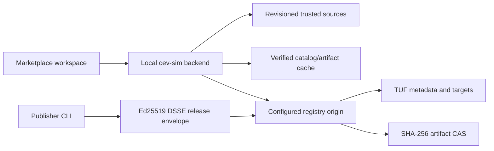

# Integrated Marketplace and Private LAN Registry Roadmap

This document is the implementation authority for the `MKT-*` program. The
program adds an integrated Marketplace workspace to cev-sim and a separately
hosted private-LAN registry. It is not headless PR 13 and does not extend the
`PLG-*`, `ED-*`, or `VIS-*` milestone sequences.

## Status

| Milestone | Implementation | Verification | Merge status |
| --- | --- | --- | --- |
| MKT-01: contracts and runtime baseline | Complete | Local acceptance passed; hosted CI pending | Unmerged |
| MKT-02: shared artifact/archive verification | Not started | Not run | Unmerged |
| MKT-03: registry CAS and atomic storage | Not started | Not run | Unmerged |
| MKT-04: TUF repository and read API | Not started | Not run | Unmerged |
| MKT-05: simulator trust client and cache | Not started | Not run | Unmerged |
| MKT-06: read-only Marketplace workspace | Not started | Not run | Unmerged |
| MKT-07: plans, jobs, transactions, receipts | Not started | Not run | Unmerged |
| MKT-08: plugin lifecycle | Not started | Not run | Unmerged |
| MKT-09: vehicle and run lifecycle | Not started | Not run | Unmerged |
| MKT-10: environment/asset export contracts | Not started | Not run | Unmerged |
| MKT-11: environment/asset import lifecycle | Not started | Not run | Unmerged |
| MKT-12: collections | Not started | Not run | Unmerged |
| MKT-13: publishers, authentication, secure LAN | Not started | Not run | Unmerged |
| MKT-14: LAN discovery, updates, advisories | Not started | Not run | Unmerged |
| MKT-15: scale, recovery, and operations | Not started | Not run | Unmerged |
| MKT-16: candidate acceptance and release | Not started | Not run | Unmerged |

Only a merged change may be marked merged. Verification records actual commands
and evidence; implementation status alone does not satisfy a milestone gate.

## Locked decisions

- The registry is a standalone JavaScript/ESM service. The simulator remains a
  local service and browser code never connects directly to a registry.
- Initial operation is private-LAN with verified offline-cache support.
- SHA-256 identifies immutable artifact bytes. TUF protects catalog metadata,
  release visibility, rollbacks, and key rotation. Publisher releases use
  Ed25519 DSSE envelopes in addition to TUF distribution.
- Development and CI pin Node 22.22.2. The supported repository and staged
  runtime range is `>=22.22.2 <23`. `tuf-js` is pinned to 6.0.0.
- Installation and updates are explicit. Installation never executes plugins,
  grants capabilities, changes a run, or activates content.
- Existing plugin, vehicle, run-bundle, and run-package formats remain
  authoritative. Marketplace is catalog, delivery, and provenance over them.
- Managed runs continue rejecting plugins until their versioned execution
  contract explicitly admits them.
- Marketplace metadata, sources, installed membership, and receipts are
  nonsemantic. They never enter `worldHash`, package hashes, `resolvedHash`,
  `simulationSemanticHash`, `episodeHash`, `trajectoryHash`, or run-package
  identity.
- Releases are immutable `(itemId, releaseVersion)` tuples. SemVer has no
  leading `v` or build metadata. Stable and beta tracks point to exact versions
  and never enter receipts or artifact identity.
- Dependencies are exact release references and exact artifact digests.
  Compatibility is the only place ranges are allowed, and dependencies are
  same-registry only in v1.
- The registry is filesystem-backed and single-writer. Distributed scheduling,
  public accounts, payments, ratings, arbitrary install hooks, OCI, public
  federation, and automatic activation/update are out of scope.

## Architecture and trust boundary

There are three separate decisions:

1. **Schema validity** means bytes parse under the strict marketplace contract.
2. **Verified authenticity** means the correct TUF trust chain and, for a
   release, publisher signature bind those exact bytes.
3. **Permission to install or execute** is a later local policy decision after
   compatibility, rights, capabilities, advisories, and current state are
   evaluated.

Passing an earlier decision never implies a later one. A registry cannot grant
local rights, activate a plugin, or make itself trusted through content it
serves.

Default TUF expirations are 48 hours for timestamp, 14 days for snapshot, 90
days for delegated targets, and 365 days for root. Previously verified cached
releases remain usable offline. Expired metadata cannot resolve or install a
release that was not previously verified.

## Threat model

| Threat | Contract response | Owning milestone |
| --- | --- | --- |
| Malicious registry or compromised publisher | Explicit root fingerprint trust, publisher DSSE, strict schemas, exact digests | MKT-01, MKT-04, MKT-05, MKT-13 |
| Rollback, freeze, or metadata mix-and-match | Monotonic catalog revision and TUF root/timestamp/snapshot/delegation verification | MKT-04, MKT-05 |
| Tampered or substituted artifact | Signed release descriptor plus exact byte size and SHA-256 | MKT-01, MKT-02, MKT-03 |
| Hostile archive | Frozen USTAR profile, streaming limits, traversal/link/header rejection | MKT-02, MKT-10 |
| Backend used as SSRF proxy | Configured-origin allowlist, fixed paths, no cross-origin redirects | MKT-05 |
| Credential disclosure | Separate owner-only store, write-only requests, redacted errors/logs/snapshots | MKT-05, MKT-13, MKT-15 |
| Unsafe preview or description | Bounded raster media only; CommonMark without raw HTML | MKT-03, MKT-06 |
| Crash during admission/install | Staging, atomic rename, journals, idempotent recovery, late receipts | MKT-03, MKT-07 |
| Marketplace provenance changes simulation identity | Separate stores and compatibility vectors over existing hash authorities | MKT-01 and every lifecycle milestone |

## Content and contract model

| Content kind | Artifact contract | Marketplace media type |
| --- | --- | --- |
| `plugin` | `cev-sim.plugin-package@1` | `application/vnd.cev-sim.plugin-package+json` |
| `vehicle` | `cev-sim.vehicle-bundle@1` | `application/vnd.cev-sim.vehicle-bundle+json` |
| `run-template` | `cev-sim.run-bundle@1` | `application/vnd.cev-sim.run-bundle+json` |
| `run-package` | `cev-sim.run-package@1` | `application/vnd.cev-sim.run-package+tar` |
| `environment` | `cev-sim.environment-package@1` | `application/vnd.cev-sim.environment-package+tar` |
| `asset-pack` | `cev-sim.asset-package@1` | `application/vnd.cev-sim.asset-package+tar` |
| `collection` | `cev-sim.marketplace-collection@1` | `application/vnd.cev-sim.marketplace-collection+json` |

Scripts, scenarios, sensors, and behaviors remain inside plugins or run
bundles in v1. They are not standalone marketplace content.

MKT-01 publishes draft-2020-12 schemas and executable strict readers for:

- `cev-sim.marketplace-item@1`
- `cev-sim.marketplace-release@1`
- `cev-sim.marketplace-catalog@1`
- `cev-sim.marketplace-advisory@1`
- `cev-sim.marketplace-collection@1`
- `cev-sim.marketplace-sources@1` (local only)
- `cev-sim.marketplace-installed@1` (local only)
- `cev-sim.marketplace-install-receipt@1` (local only)

Every contract uses `kind` plus numeric `version`. Release SemVer is stored as
`releaseVersion`. Canonical marketplace JSON uses RFC 8785/JCS, UTF-8 without a
BOM or trailing newline. Readers reject duplicate decoded keys, prohibited
prototype keys, malformed UTF-8, unknown fields/enums, unsupported versions,
noncanonical identifiers, malformed hashes, invalid sizes, and excessive
nesting.

The schemas publish these custom string formats: `marketplace-id`,
`release-version`, `sha256`, `uuid-lower`, `canonical-timestamp`,
`target-path`, `source-url`, `absolute-url`, `spdx-expression`,
`plugin-capability`, and `semver-range`. Runtime semantic validation additionally
enforces media/content-kind agreement, unique identities and references,
catalog referential integrity, stable-track release policy, same-registry exact
references, ordered sources, and globally unique receipt references. Schema
validity alone cannot detect duplicate raw JSON keys, verify signatures,
resolve dependency eligibility, or grant permission to install or execute.

The DSSE payload type is
`application/vnd.cev-sim.marketplace-release+json`; its payload is the exact
canonical release bytes. TUF uses its own serialization. Artifact digests hash
delivered artifact bytes and are not aliases for existing semantic/package
hashes.

## Portable archive limits

MKT-02 will generalize the existing strict run-package USTAR implementation;
MKT-10 will activate environment and asset packages. Existing run-package
limits and bytes remain unchanged.

The future environment/asset profile uses a 50 GiB archive ceiling, 100,000
entries, an 8 MiB manifest ceiling, and an individual-entry ceiling of
8,589,934,591 bytes. The earlier 10 GiB entry proposal cannot be represented by
the frozen USTAR 11-digit octal size field and is replaced by that exact USTAR
ceiling. No base-256 or PAX extension is admitted.

## MKT-01 work packages

- [x] WP-01: record roadmap, architecture boundary, threat model, and baseline
  compatibility vectors.
- [x] WP-02: pin runtime/dependencies and align development, CI, installer, and
  staged distribution metadata.
- [x] WP-03: define vocabulary, limits, errors, and primitive validators.
- [x] WP-04: publish nine local schemas and executable validators for eight
  documents.
- [x] WP-05: implement strict byte readers, canonical serialization, hashes,
  and reviewed fixtures.
- [x] WP-06: add the default-off `CEV_SIM_MARKETPLACE_ENABLED` startup seam.
- [x] WP-07: complete local focused/full verification and record the final
  evidence. Hosted CI and merge evidence remain pending on an MKT-01 commit.

The feature flag accepts empty/`0`/`false` as disabled and `1`/`true` as
enabled. Invalid values fail startup. It requires a restart and remains false
by default through MKT-15. In MKT-01 neither state mounts routes, performs
network access, creates marketplace storage, or changes browser workspaces.

## Milestones and gates

### MKT-01 — Program contract and runtime baseline

Freeze schemas, identifiers, media types, compatibility, errors,
canonicalization, nonsemantic provenance, Node 22.22.2 development/CI, the
supported Node 22 range, TUF dependency, and the dormant feature flag.

Gate: positive/negative schema vectors pass under Node 22.22.2; the complete
existing suite passes; existing simulator/world/episode/plugin/vehicle/run
hashes do not change.

### MKT-02 — Shared artifact and archive verification

Generalize the deterministic USTAR reader/writer and bounded staging/hash/path
utilities without changing existing run-package bytes. Add read-only adapters
for plugin packages, vehicles, run bundles, and exact run packages.

Gate: golden run packages remain byte-identical; hostile archives and
multi-gigabyte bounded-memory streams pass focused and full checks.

### MKT-03 — Registry CAS and atomic storage

Add the standalone service/CLI, immutable filesystem CAS, staging,
single-writer locking, revisioned catalog, journal recovery, admission,
verification, and dry-run GC. Bind no listener beyond loopback.

Gate: deterministic concurrent deduplication, crash recovery at every commit
boundary, and immutable release tuples.

### MKT-04 — TUF repository and read API

Initialize offline root plus online delegated/snapshot/timestamp keys; support
root rotation and publish catalog, item, release, and advisory targets. Add
well-known, catalog, item, release, blob, health, and TUF reads with bounded
ranges and strict headers.

Gate: rollback/freeze/mix-and-match/expiry/delegation/registry-ID/key-rotation
tests pass; ranges reconstruct exact blobs; LAN binding remains rejected.

### MKT-05 — Simulator trust client, source store, and cache

Add revisioned sources, separate credentials, server-side TUF verification,
root-fingerprint confirmation, verified caches, fixed-origin requests, offline
policy, and source health.

Gate: credentials never leave the server; arbitrary proxying and changed trust
roots/registry IDs fail; offline and clock-skew behavior is deterministic.

### MKT-06 — Read-only Marketplace workspace

Add Discover, Installed, and Sources to the explicit view-state system with
search/filter/details/trust flow, safe preview proxying, source health, and a
Plugin Library link. Installation controls remain disabled.

Gate: Playwright navigation/trust/search/offline/malformed tests and a11y pass
at the 1280×720 minimum viewport.

### MKT-07 — Installation plans, jobs, transactions, and receipts

Add exact dependency resolution, compatibility evaluation, deterministic
plans, asynchronous jobs/SSE, journaled transactions, installed state,
immutable receipts, quarantine, recovery, cancellation-before-commit, and
content-preserving removal.

Gate: no partial visibility under crash injection; recovery/replay is
idempotent; stale plans, cycles, and blocked dependencies fail before commit.

### MKT-08 — Plugin marketplace lifecycle

Install through the existing plugin CAS/library, cross-check manifest
capabilities/compatibility, show additions, retain runtime grants, support
coexisting versions, and remove membership without eager CAS deletion.

Gate: install never executes source or grants capabilities; existing
browser/headless loading remains unchanged; managed runs still reject plugins.

### MKT-09 — Vehicle, run-template, and exact-run lifecycle

Wire existing vehicle/run-bundle/run-package importers. Embedded vehicle
plugins enter CAS without library membership. Templates become editable local
configs; exact packages remain immutable.

Gate: artifact hashes and exact reproduction remain stable; collision mappings
are deterministic; unsupported backends fail rather than substitute.

### MKT-10 — Environment and asset export contracts

Implement environment/asset package formats, closure traversal, deterministic
streaming export, rights preflight, validators, and publisher inspection.

Gate: unchanged exports are byte-identical; missing dependencies/rights fail
before creation; credentials, local paths, and source authority cannot enter.

### MKT-11 — Environment and asset import lifecycle

Plan and commit deterministic ID reuse/remapping, rewrite transitive refs,
recompute through canonical paths, rebind visual descriptors, invalidate stale
correspondence, enforce local rights, and recover transactions.

Gate: round trips render and remain editable through `CommandBus` and
`SceneProjector`; carried rights cannot grant authority; world identity changes
only with canonical world content.

### MKT-12 — Collections and multi-release plans

Validate/publish/discover collections, expand exact members/dependencies,
deduplicate artifacts, present per-member requirements, commit membership only
after all imports, and preserve independent installs on removal.

Gate: cycles, missing releases, digest mismatch, and cross-registry refs fail;
partial failure installs no collection; reinstalls are idempotent.

### MKT-13 — Publisher identity, authenticated publishing, and secure LAN

Add Ed25519 key generation/DSSE signing, publisher registration/revocation,
hashed scoped tokens, authenticated upload/finalization, TLS and optional mTLS.
Permit non-loopback only with TLS and read authentication; retain an explicit
unsafe-development override.

Gate: signatures bind exact release/artifact bytes; revoked publishers and
wrong scopes fail; tokens are constant-time checked and never logged.

### MKT-14 — LAN discovery, updates, yanks, and advisories

Advertise `_cev-market._tcp`, show discoveries only as untrusted candidates,
detect signed stable/beta updates, install new exact releases, and enforce
signed yanks/advisories/blocks without automatic update or activation.

Gate: discovery never grants trust; advisory state is rollback protected;
updates preserve old receipts and local content.

### MKT-15 — Scale, recovery, observability, and operations

Add resumable ranges, quotas/LRU, staging cleanup, rooted registry GC, audit
logs, redacted diagnostics/metrics, coherent backup/restore, conditional
catalog sharding, and crash/soak tests.

Gate: 10 GiB transfers resume with bounded memory; 10,000-release search stays
responsive; 24-hour soak and restore preserve registry UUID, trust, releases,
and digests without secret/path leakage.

### MKT-16 — Candidate acceptance and release

Enable the workspace by default while retaining the kill switch; publish
operator/creator documentation, production container/deployment example,
end-to-end fixtures, platform/browser matrix, and final evidence.

Gate: a fresh simulator can trust, authenticate, browse, install, restart, and
use every content kind; tampering fails; verified cached content works offline;
rights/remapping and plugin nonexecution remain intact; all legacy identities
and fixed-step behavior remain unchanged.

## MKT-01 evidence ledger

Baseline captured before implementation at `7a463e7` on macOS arm64, Node
22.14.0 and npm 11.4.1:

- Existing focused package/canonicalization/simulation-hash/characterization
  selection passed 37/37.
- Plugin package hash:
  `f9e2255bed1adcdadbe7a3fa9cb75ee6644fc791c07acd9734bd4d43f8ea52d9`.
- Plugin-enabled resolved hash:
  `bec3cb24c73ec6fae65d2377611ad78f0152e83f23543e59fa6a4a7e419a07b8`.
- Plugin-enabled simulation-semantic hash:
  `8fa5b9fa937fa1a6dfc342237e9320ffe84097df3cdfdaea069ad79153ad793c`.
- Plugin-enabled default episode hash:
  `b14dfdfee0b493e4119110f6f172b45959378544a3a10f0cf55fbc25fc9f40bc`.
- Fixed vehicle-bundle hash:
  `e44e29973a958058b1726855fca84c06c444033222dbb29238a72ae9d1a60c7a`.
- Existing run-package golden archive hash:
  `04e463b71fdf65034bb56af55fec58240c4236141a679085609e68ffe5877c7d`.

Final local evidence ran on 2026-09-26 from an uncommitted working tree based
on `7a463e746bcfdb0fc5803eea004ce3767c7d49cf`, macOS 15.6 arm64, Node
22.22.2, npm 10.9.7, and Python 3.12.10:

- Official Node archive checksum verification and `npm ci`: passed; 586
  packages installed and zero vulnerabilities reported by the install audit.
- `npm run test:marketplace`: 18/18 passed.
- `npm run lint`: passed with zero errors and the existing `MapSurface.js`
  `assetEpoch` hook warning.
- `npm test`: 1,731 tests; 1,725 passed, six declared browser/hardware/shared
  memory skips, zero failures.
- `npm run build`: passed.
- `npm run test:parity`: passed for browser, direct headless, CLI, gRPC UDS,
  and Python sources with matching hashes.
- `npm run release:check`: passed for source and staged distribution metadata.
- `npm audit --omit=dev --audit-level=high`: zero vulnerabilities.
- `npm run fixtures:headless`: regenerated
  `characterization.v1.json` with no diff.
- `npm run proto:python` and `npm run lint:python`: passed.
- `python -m pytest -m 'not integration' python/tests`: 82 passed, 15
  deselected; `python -m pytest -m integration python/tests`: 15 passed, 82
  deselected.
- `npm run test:bake-python`: 19/19 passed.
- `npm run dist:headless -- --output artifacts/mkt-01-dist`,
  `npm run release:check -- --dist artifacts/mkt-01-dist`, and
  `npm run dist:verify -- --dist artifacts/mkt-01-dist`: passed. Final package
  hashes were npm `63c1214f8982d8d58bf732e25c515d8480f97512ffa183d49668028cbbdac1a2`,
  wheel `3528279caf381ccd92e73e54b6feb9160f921844fb6e2ea64cdcd3a20a956991`,
  and source distribution
  `d4fa28825790a0ccdc17d9328638c20dfd7970296d502975435b24fca1092e7b`.

Hosted CI has no run or link because this implementation is not committed or
pushed. It remains the verification item required before merge. The hosted,
soak, x64 NVIDIA, and Jetson ARM64 obligations already outstanding from
headless PR 12 remain outstanding and are not MKT-01 completion claims.

## Decision log

### 2026-09-26 — Record MKT-01 contracts and runtime baseline

MKT-01 uses JSON Schema draft 2020-12 plus strict ESM validators. Schema files
are the structural authority; semantic checks cover cross-record uniqueness,
catalog references, stable tracks, media/content-kind agreement, and local
ordering. Exact marketplace serialization uses the existing JCS implementation
without changing any legacy serializer. Development/CI pin Node 22.22.2 while
the supported range permits later Node 22 patch releases only. The marketplace
startup flag remains dormant and defaults off.

### 2026-09-26 — Correct future USTAR per-entry limit

The future environment/asset package per-entry limit is 8,589,934,591 bytes,
the maximum canonical 11-octal-digit USTAR size. The total 50 GiB archive limit
is unchanged. This decision does not alter existing run-package limits or
bytes; implementation belongs to MKT-02 and MKT-10.
