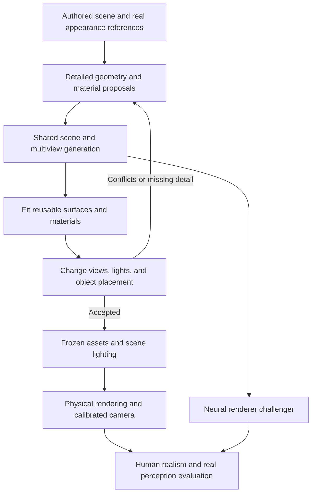

# Making cev-sim look real

Research and recommendation, 2026-09-09. Implementation remains frozen from VIS-15c onward.

Product clarification, 2026-09-09: this investigation supports a comprehensive
simulation tool. Novelty, publication, and formal human/perception studies are
not prerequisites for shipping a useful improvement. The revised
[product action plan](photorealism-action-plan.md) specifies a small comparison
workspace, practical editor additions, conditional PR estimates, and the
viability and costs of existing transformer-based generators.

Read alongside the [methodology recorded before external searches](photorealism-research-methodology.md), [primary-source register](photorealism-sources.md), and [experimental action plan](photorealism-action-plan.md).

## Recommendation

Build toward **a generative baking system that produces a persistent, editable 3D world**. Use whole-scene context to guide the generation of reusable objects, surface detail, and materials; reconcile their appearance across views and lighting conditions; then render the resulting world with physically meaningful lighting. Keep a geometry-conditioned neural renderer as a serious competing approach and, potentially, a final quality enhancement.

This combines the user's two ideas, but changes what the bake is trying to recover. Its product should be the *things that make the image*: surfaces, fine geometry, material properties, and illumination. A finished photograph is useful guidance, but painting it onto a surface cannot reproduce everything that made it look real.

The first deliverable should be one convincing, inspectable scene: walk around it, reverse direction, move a chair, change the light, and return to the starting position. Judge its visual quality before building another large implementation program. This recommendation is an engineering hypothesis supported by component-level evidence; no model bake or new realism benchmark was executed in this investigation.

## Where VIS diverged from the goal

The mismatch is substantive. The current VIS plan establishes reliable visual infrastructure, but its core acceptance does not require a plain scene to become photographically convincing.

| Repository evidence inspected | What it establishes | What it does not establish |
| --- | --- | --- |
| [VIS status and core path](visual-layer-plan.md#status-and-release-verdict) | The core can succeed with owned assets and a model-free captured-appearance bake. | Automatic appearance improvement. |
| [VIS-10b and VIS-11](visual-layer-plan.md#optional-material-generation-track) | Intrinsic material proposals, model provenance, and adapter contracts exist. | A selected real model, convincing generated materials, or an end-to-end quality result. |
| [baking/backends.py](../baking/backends.py) | The shipped loader defaults to the fake backend; the real wrapper requires an injected delegate, and the loader's `real` branch supplies none. | A working production material model simply by setting model IDs and digests. |
| [VisualMaterialFactory.js](../app/3d/environment/visual/VisualMaterialFactory.js) | Captured radiance uses an unlit material; intrinsic materials can use `MeshPhysicalMaterial`. | Good materials, sufficiently detailed geometry, or high-quality global illumination merely from selecting PBR. |
| [Acceptance gates](visual-layer-plan.md#acceptance-gates-and-omitted-tests-now-required) | Calibration, correspondence, identity, persistence, execution, and operational reliability are treated carefully. | A blind photographic-realism benchmark or demonstrated improvement on held-out real perception tasks. |

Those contracts are useful. Calibrated capture, persistent assets, and reproducible artifacts will help almost any successful approach. But making the quality-producing component optional allowed the program to advance without proving the central product outcome. Describing the result as a “photoreal fidelity layer” was ahead of the visual evidence.

There is also a scope distinction: image improvement, material estimation, and generating missing geometric detail are different capabilities. The current six-channel intrinsic adapter addresses a material interface. It is not automatically an implementation of all three.

### What the archived bake actually shows

I inspected the local `bake-42` source image and processed frames 00000 and 00001. They show a simple street, block buildings, a photographic background, and generated facades. The central building's roof/form and window arrangement differ markedly between processed views. The road remains visually simple. These are archived examples, **not a fresh evaluation of the current VIS runtime**.

- [Original frame](../baking/raw/bake-42/samples/00000/render_beauty_bake_view_main.png)
- [Processed frame 00000](../baking/baked/bake-42/00000/processed_building_bake_view_main.png)
- [Processed frame 00001](../baking/baked/bake-42/00001/processed_building_bake_view_main.png)

These are existing local artifacts, not checked-in acceptance fixtures; the
links may be unavailable on another checkout. This research adds no generated
images or model assets to the repository.

The current legacy [process.py](../baking/process.py) sends the fill model an image, a mask, prompts, and sampling settings. It does not pass calibrated depth, normals, or explicit surface correspondence into that call. Asking in the prompt to preserve silhouettes is therefore a soft request. The archived metadata does not fully establish the historical model/runtime settings, so the images alone cannot isolate which setting caused the failure.

The observed failure suggests two separate experiments: improve geometric control and cross-view agreement; independently improve the geometry, lighting, materials, and contextual detail entering the model. Neither finding justifies abandoning the original idea.

## What “real” needs to mean

There are three outcomes to pursue separately:

1. **Human realism:** a normal camera view or walk-through looks photographed, including ordinary, unglamorous details.
2. **World consistency:** surfaces remain the same as the camera, objects, and lights move.
3. **Perception usefulness:** models trained or evaluated with these images behave appropriately on actual target-domain observations.

A gorgeous image can fail the second and third. Conversely, useful synthetic training need not look photographic: domain-randomization research demonstrated transfer using deliberately unrealistic textures. That is a reason to measure both goals, not to lower the visual ambition. [Tobin et al., 2017](https://arxiv.org/abs/1703.06907).

“Fooling recognition models” should mean reducing the artificial visual cues while retaining correct objects, boundaries, and task information. Making a detector confidently misclassify an invented feature is a defect. A domain classifier becoming uncertain is also insufficient evidence by itself.

Realism depends on interacting layers:

| Layer | Examples | What a texture-only bake cannot supply by itself |
| --- | --- | --- |
| Scene structure | Plausible room proportions, object placement, window depth, curb profiles | Missing silhouettes, openings, or actual spatial relationships |
| Geometric detail | Bevels, seams, cables, fabric folds, brick recesses | Correct parallax and occlusion for invented three-dimensional detail |
| Materials | Wood grain, roughness variation, coatings, glass, metal | View- and light-dependent behavior from one fixed RGB value |
| Illumination | Window light, interreflection, contact shadows, local lamps | Correct changed shadows and reflections after an edit |
| Context and history | Worn handles, dust on upward-facing surfaces, traffic wear | Coherent spatial causes if every patch is invented independently |
| Camera | Exposure, optics, sensor noise, motion sampling, color response | A match to the actual camera merely by adding a cinematic filter |

The visual target should include close inspection and ordinary lighting. Excessive grime, shallow depth of field, sharpening, bloom, or dramatic grading can hide shortcomings and make a demo attractive without making the simulated environment more convincing.

## Assessing the approaches fairly

The following judgments concern this project's combination of authored scenes, free camera motion, reusable objects, and sensors. They are engineering assessments, not numerical rankings from a common published benchmark.

| Approach | Main advantage | Main unresolved risk | Best role here |
| --- | --- | --- | --- |
| Sequential scene image baking | Scene-wide photographic context and incremental coverage | Accumulated inconsistency; image changes not explained by geometry | Strong baseline, scene initialization, local completion |
| Independent object baking | Reuse, edits, repeatable runtime assets | Missing scene context; materials may contain lighting | Foundation for the asset library |
| Joint room/object multiview texturing | Connects global appearance with local detail | Consistent RGB is still not necessarily relightable | Backbone of the proposed bake |
| Authored/scanned PBR assets plus physical rendering | Explicit geometry, lighting, and annotations | Asset completeness and automatic authoring remain hard | Mandatory strong baseline and rendering foundation |
| Photogrammetry, NeRF, or Gaussian capture | Actual photographic appearance of existing places | Capture coverage, edits, relighting, metric alignment | Reference scenes and reusable captured content |
| Generative 3D worlds/assets | Can add missing geometry and appearance together | Layout, dimensions, topology, and labels may change | Proposals for new assets or scene detail |
| Camera-stream neural enhancement | High image-quality upside using full-scene context | Hallucination, history dependence, label mismatch | Strongest rival; offline data and possible renderer |
| Relightable neural/physical hybrids | Combines 3D controls with learned appearance | Reconstruction errors and neural identity drift | High-upside research track |
| Direct interactive world models | Rich, dynamic generation | No demonstrated drop-in authoritative simulator contract | Idea/reference generation; longer-term alternative |

### 1. Sequential whole-scene baking: preserve the useful idea

The original process is sensible: render a view, enhance it, project accepted content back, move, and fill new regions. Text2Tex uses depth-conditioned progressive mesh texturing and view selection; Text2Room combines inpainting, estimated depth, and incremental mesh construction. These establish relevant precedents, although their input assumptions differ from cev-sim's known geometry. [Text2Tex](https://daveredrum.github.io/Text2Tex/), [Text2Room](https://lukashoel.github.io/text-to-room/).

Its strongest advantage is context. A model sees how walls, furniture, windows, and light belong together. A good first reference can anchor choices that are otherwise ambiguous. Small extensions can preserve earlier decisions and work efficiently around a traversable route.

The liabilities are structural, not merely model age. Early mistakes become context for later ones. A loop may return to a surface whose two generated versions disagree. A newly exposed back face has no photographic evidence. A generated window or roof feature may no longer correspond to the original depth. Depth tells us where the *original* visible surface was; it cannot make a semantically changed image geometrically correct.

A stronger version should use exact renderer depth/world positions, surface IDs, visibility masks, and existing surface texture during generation. Use LiDAR as a correspondence measurement where appropriate, rather than reducing dense known geometry to a sparse/noisy projection scaffold. In real capture, LiDAR remains valuable for geometry and scale.

Replace distance-only sampling with coverage and disagreement criteria; reserve views for revisiting the start; jointly revise conflicting surfaces; and fit accepted observations to one surface representation. Test a better reference image separately from a better control model. Contemporary FLUX.2 supports multiple reference images, making it a useful challenger for image proposals, but its documentation does not establish calibrated multiview/PBR guarantees. [BFL image-editing documentation](https://docs.bfl.ai/flux_2/flux2_image_editing).

Retain this method for static surroundings, initial scene appearance, and filling gaps. For objects expected to move or be relit, do not treat final shaded RGB as a reusable material.

### 2. Per-object baking: the strongest reusable unit

Generate or recover each object's appearance in its own coordinates, using a set of views that includes its back, underside, and normally occluded regions. Store a mesh and meaningful material channels. A table's scratches should move with the table; its cast shadow should be recomputed in the destination room.

Several research lines address different pieces. Paint3D targets lighting-reduced textures; MVPaint addresses synchronized views and UV completion; FlashTex and DreamMat explicitly address relightable material generation. These capabilities should not be conflated into “all of them generate complete physical materials.” [Paint3D](https://arxiv.org/abs/2312.13913), [MVPaint](https://mvpaint.github.io/), [FlashTex](https://flashtex.github.io/), [DreamMat](https://zzzyuqing.github.io/dreammat.github.io/).

For an executable comparison, prioritize the separate texture-generation paths documented by TRELLIS.2 and Hunyuan3D-2.1, plus Material Anything for recovering/completing materials. They are candidates to test on the same meshes, not a claimed quality ranking. Generating a new mesh must be a separate experiment from repainting an existing one. [TRELLIS.2 code](https://github.com/microsoft/TRELLIS.2), [Hunyuan3D-2.1 code](https://github.com/Tencent-Hunyuan/Hunyuan3D-2.1), [Material Anything code](https://github.com/3DTopia/MaterialAnything).

Object isolation loses useful evidence: room-scale lighting, contact relationships, coherent material families, and signs of shared use. Independent generations can also disagree about scale: grain size, fabric weave, and bevel width are physical quantities. The same broad instruction, “realistic,” does not make them agree.

This is not fundamentally a runtime determinism problem. Different generations may produce different plausible chairs; choosing and freezing one asset produces a stable chair. Cross-view agreement, material correctness, and repeatable inference are separate questions.

### 3. Joint scene and object reasoning: closest to the desired bake

RoomTex creates a global room reference and refines individual objects. RoomPainter integrates multiple room views before repainting individual instances. These are direct precedents for combining the user's two options; that combination alone cannot honestly be described as unprecedented. [RoomTex](https://qwang666.github.io/RoomTex/), [RoomPainter paper](https://arxiv.org/html/2412.16778v1).

SceneTex provides another route: optimize a shared scene texture field rather than accept independently painted views. Its paper explicitly identifies residual shading in generated textures as a limitation. Thus global coherence and relightability need separate tests. [SceneTex paper](https://openaccess.thecvf.com/content/CVPR2024/papers/Chen_SceneTex_High-Quality_Texture_Synthesis_for_Indoor_Scenes_via_Diffusion_Priors_CVPR_2024_paper.pdf).

My recommendation takes this family as the organizing principle, adds explicit material/light separation, and preserves per-object ownership. The scene provides context; it should not permanently bake the current room into every object. Joint generation also needs surface-space reconciliation: a visually consistent panorama alone does not establish consistency under translation.

### 4. Detailed assets and physical rendering: establish a serious baseline

High-quality geometry, real material references, carefully specified lights, and a path tracer are a powerful candidate in their own right. Infinigen Indoors demonstrates procedural indoor construction; Poly Haven supplies scanned PBR materials, models, and HDR environments. Neither eliminates the need to select and assemble appropriate content. [Infinigen](https://infinigen.org/), [Poly Haven](https://polyhaven.com/), [Cycles rendering documentation](https://docs.blender.org/manual/en/2.90/render/cycles/introduction.html).

This baseline tells us whether the limiting factor is the model or the scene it is being asked to repair. Render the same improved scene with the current renderer and an offline reference renderer. If the reference is convincing and the current rendering is not, prioritize light transport and camera behavior. If both are weak, inspect geometry, materials, and scene detail before blaming rendering.

This is also the fallback if generative baking contributes no measured benefit. Compute does not disqualify path tracing here. The open question is whether the generated scene remains convincing after its pixels are produced by this renderer.

### 5. Captured scenes and splats: strong evidence, different starting point

Capturing a real room obtains much of the appearance instead of inventing it. Photogrammetric meshes, NeRFs, and Gaussian splats can be excellent reference worlds. Conventional 3DGS is a reconstruction/rendering method, not a model that transforms a crude scene into realism on its own. [Original 3DGS project](https://repo-sam.inria.fr/fungraph/3d-gaussian-splatting/).

There is useful robotics evidence. SplatSim reports real-world manipulation transfer from Gaussian-rendered simulations; RoboGSim combines reconstructed scenes/objects with a physics simulator and scene composition. These results support the family, but do not prove arbitrary authored-room generation or unrestricted relighting. [SplatSim](https://splatsim.github.io/), [RoboGSim](https://robogsim.github.io/).

Use scans as references, background regions, or object sources when a matching real example exists. Keep the distinction between view-dependent captured appearance and recovered materials explicit. A splat is not inherently unusable for editing; the question is which editing and lighting capabilities its specific representation supports.

### 6. Camera-stream enhancement: a serious competing architecture

Here the simulator continues to produce geometry and controls, while a learned renderer produces the final camera image. Intel's photorealism-enhancement work uses intermediate renderer information, and Cosmos Transfer conditions video generation on structured controls. This can improve the whole image without first recovering every microscopic material property. [Intel project](https://isl-org.github.io/PhotorealismEnhancement/), [Cosmos Transfer2.5](https://research.nvidia.com/labs/cosmos-lab/cosmos-transfer2.5/).

NVIDIA reports 24/30 real-robot successes with its Transfer2.5 augmentation versus 5/30 with its standard-augmentation baseline in a particular test. Its driving table also reports better visual-distribution scores without universally better geometric consistency scores. That is promising, limited evidence for measuring perception and consistency separately; it is not a transferable success rate for cev-sim.

The risks are recognizable: surface detail may depend on camera history, independently generated cameras may disagree, and enhanced pixels can diverge from original labels. A clip-based model may also use future frames. Such a model can create offline training data, but an interactive sensor needs a causal inference path because future actions depend on current observations.

Keep this approach in the experiment. If it visibly outperforms asset baking while meeting held-out identity, sensor, and causal-replay checks, it should become the principal renderer candidate. It must win that decision through evidence rather than be excluded because it is different from the original bake.

### 7. Inverse rendering and neural/physical hybrids

RGB↔X and DiffusionRenderer connect image synthesis with intrinsic material/geometry channels. MatSpray fuses predicted per-view materials into a Gaussian representation. These help bridge a compelling generated image and an editable 3D scene, but prediction remains underconstrained. [RGB↔X](https://zheng95z.github.io/publications/rgbx24.html), [DiffusionRenderer](https://research.nvidia.com/labs/toronto-ai/DiffusionRenderer/), [MatSpray](https://github.com/cgtuebingen/MatSpray).

TRON is a particularly close recent precedent: Gaussian geometry and materials produce physical guidance for a neural renderer. Its June 2026 preprint reports remaining weaknesses in sparse coverage, temporal behavior, object identity, and complex light effects; code was marked “Coming Soon” on the inspected project page. It is an architectural reference and rival, not a verified ready-made dependency. [TRON paper, including limitations](https://arxiv.org/html/2606.11314v1), [project availability](https://research.nvidia.com/labs/sil/projects/tron/).

The key tradeoff is expressiveness versus control. A compact PBR asset may be unable to reproduce a neural teacher's attractive but physically inconsistent details. A neural residual can preserve more visual quality, but may reintroduce the very cross-view errors the bake was meant to remove. Measure the difference between teacher images and the final reusable artifact explicitly.

### 8. Generated worlds and direct world models

World Labs' Marble/Chisel accepts coarse spatial structure and offers persistent-world exports. Its documentation distinguishes simple collider meshes from visual meshes and splats. This is close enough to the desired interaction to deserve a direct comparison, but first-party product documentation does not prove exact dimensions, unchanged semantic labels, or intrinsic material quality. [Chisel](https://docs.worldlabs.ai/marble/create/chisel-tools/chisel-basics), [mesh exports](https://docs.worldlabs.ai/marble/export/mesh).

SceneCraft similarly explores semantic/depth-conditioned scene generation into a NeRF. Use this family when improving the actual 3D content is allowed, while measuring deviations from authored intent. [SceneCraft, NeurIPS 2024](https://proceedings.neurips.cc/paper_files/paper/2024/hash/953d276d037e701fcd97dbb34ebb2394-Abstract-Conference.html).

Direct interactive world models are a more radical alternative. DeepMind's Genie 3 report acknowledges limits in interaction duration, action space, and spatial accuracy. Replacing cev-sim's world dynamics with such a model would change the product and violate its current authoritative-kernel design. Using generated imagery as authoring guidance remains useful. [Genie 3 technical overview](https://deepmind.google/blog/genie-3-a-new-frontier-for-world-models/).

## The proposed system, concretely

For discussion, call this **scene-aware object baking**. The name is descriptive; it is not a claim of a new scientific method.

1. **Keep the authored scene as the constraint.** Preserve dimensions, object identity, transforms, and gameplay/task semantics. Obtain dense render buffers directly from the scene.
2. **Add physical detail where the image requires it.** Asset retrieval, procedural modeling, and generative 3D proposals can supply bevels, recesses, fixtures, and clutter. Separate a material edit from a geometric edit. A painted handle cannot stand in for a handle that must occlude or be grasped.
3. **Establish shared appearance references.** Use real material examples and a coherent scene brief, plus several overlapping views. A good source photo is useful evidence, not a requirement to already possess the exact finished room.
4. **Generate jointly, store locally.** Generate views with shared context, then assign accepted details to object/surface coordinates. Preserve occluded regions and uncertainty rather than treating unobserved texels as validated.
5. **Recover material behavior, not only color.** Fit base color, roughness, metalness, appropriate normals/displacement, and other supported properties. Use known lighting and multiple views. Do not invent six confident channels because an interface asks for them.
6. **Resolve the scene around the objects.** Compute contacts, shadows, interreflection, and reflection from the current arrangement. Maintain instance-specific wear as a separate layer when needed, leaving the reusable base asset intact.
7. **Challenge the result with edits.** Move a light, rotate/remove/reinsert an object, move it to another room, and inspect a previously hidden face. These reveal appearance assigned to the wrong cause.
8. **Freeze the accepted artifact.** Store exact outputs and provenance; render them without rerunning a generative model unless a neural renderer is deliberately selected and separately evaluated.

An offline Blender/Cycles or differentiable-rendering experiment can implement the fitting/reference-rendering part without becoming another simulation kernel. JavaScript still controls state, actions, reset semantics, and time. Integrating a new production renderer would be a later explicit design decision; this report does not silently expand the existing headless roadmap.

### Which details belong where?

| Detail | Persistent owner | Behavior after a scene edit |
| --- | --- | --- |
| Wood grain, dent, engraved text | Object geometry/material | Moves with the object |
| Local instance-specific wear | Instance material/detail layer | Remains with that instance |
| Shadow cast by a chair | Lighting/visibility computation | Changes when chair or light moves |
| Reflection of a window in a table | Material response plus surrounding radiance | Changes with view and surroundings |
| Light stain painted on a wall | Wall material, if it is actually a stain | Stays; unlike illumination from a lamp |
| Dust distribution caused by placement/history | Explicit generated detail/state | Changes only under an authored change of that history |

For camera/LiDAR consistency, visual detail cannot quietly become metric truth. Under the existing repository contract, visual meshes stay out of collision and LiDAR truth. A proposal that changes a meaningful silhouette or obstacle must become a deliberate metric-world edit with corresponding visual rebinding and verification. Small appearance differences still need measured correspondence at the intended distance and resolution. There is no universal “small enough” geometric offset.

## Where research beyond existing systems could live

There is no honest basis here to promise something nobody has considered. The search found substantial overlap even with seemingly distinctive ideas. That narrows the opportunity to a testable contribution.

### Hypothesis A: use scene edits to learn appearance ownership

During baking, generate or render a controlled set of interventions: the same object under different lights, the object translated/rotated, an occluder removed, and the object placed in a second room. Fit a single object material/geometry representation across those conditions. Attribute changes to illumination or scene relations instead of absorbing them into the object texture.

This would be stronger than merely asking whether two adjacent images look alike. A candidate that looks excellent along its baking path but carries a window reflection into a windowless room has failed ownership.

However, multi-light generation is already a research tool: Neural LightRig uses generated lighting variations for intrinsic estimation, while DreamMat conditions material distillation on lighting. RGB↔X's project page even explicitly proposes optimizing scene materials against generated renderings. Those ideas must be credited rather than renamed as novel. [Neural LightRig](https://openaccess.thecvf.com/content/CVPR2025/papers/He_Neural_LightRig_Unlocking_Accurate_Object_Normal_and_Material_Estimation_with_CVPR_2025_paper.pdf), [DreamMat](https://zzzyuqing.github.io/dreammat.github.io/), [RGB↔X](https://zheng95z.github.io/publications/rgbx24.html).

The narrower proposed contribution is **jointly supervising reusable object appearance and scene-dependent effects through controlled object/occluder/light interventions, with authored-world and sensor-alignment constraints**. Its novelty remains unestablished. Its value can be tested by ablating those interventions while keeping models, inputs, and optimization effort matched.

Generated interventions are predictions, not new physical measurements. Several images can agree on an incorrect material. Anchor fitting to known geometry/material exemplars and evaluate under genuinely unseen conditions; don't count self-consistency as physical truth.

### Hypothesis B: spend bake effort where the world disagrees

Choose the next view by unresolved surface coverage, grazing angles, cross-view disagreement, and the consequence of the detail at the target camera resolution. Include loop closures and occlusion boundaries. This could concentrate effort on the features that make a walk-through fail.

Next-best-view selection and confidence-guided material completion already exist; Text2Tex and the newer MatMart are relevant precedents. The experiment is whether a scene-aware disagreement criterion improves held-out quality over fixed-distance and coverage-only sampling, at equal generated-view counts. [Text2Tex](https://daveredrum.github.io/Text2Tex/), [MatMart, CVPR 2026](https://openaccess.thecvf.com/content/CVPR2026/papers/Wu_MatMart_Material_Reconstruction_of_3D_Objects_via_Diffusion_CVPR_2026_paper.pdf).

### Hypothesis C: generate detail from causes shared across the scene

Instead of asking separate objects for arbitrary “realistic imperfections,” specify a small set of scene causes: construction/material family, use patterns, moisture, sun exposure, cleaning, and age. Generate compatible detail fields from those causes, then instantiate them as actual material or geometry changes.

For example, a frequently used doorway should affect the handle, door edge, and nearby floor in related ways. This might produce a stronger sense of a lived-in place than independent texture enhancement. It is a proposed extension of procedural authoring and scene conditioning, not an established algorithm or novelty claim. Test whether shared causes beat equally detailed independent generations in a blind comparison.

Of these, **A is the most valuable research question** because it directly joins realism, editability, and asset reuse. B helps acquire evidence efficiently. C is promising for visual richness after the geometry/material foundation works.

## What to keep from VIS

| Existing work | Reuse in a realism experiment | Additional evidence required |
| --- | --- | --- |
| VIS-06 calibrated, aligned capture | Export beauty, visibility, depth, normals, positions, and IDs | The generator actually follows those controls |
| VIS-07 immutable snapshots and provenance | Reproduce inputs and compare candidates fairly | Real model integration and measured output quality |
| VIS-08 persistent promotion | Publish an accepted bake without losing edits | Visual acceptance before promotion |
| VIS-09 dependency/reuse machinery | Reuse unaffected assets and invalidate scene effects | Object-local ownership is a new research/design need |
| VIS-10a atlas construction | Surface fusion, coverage, deterministic fixed-input artifacts | Conflict-aware quality fitting, not just averaging |
| VIS-10b/11 material interfaces | Carry material proposals and cache exact inference outputs | A compatible real provider with explicit missing channels |
| Asset validation and materialization | Load selected, verified geometry/material resources | Test exporter compatibility and visual fidelity |
| VIS-14/15 camera execution | Render selected assets for observations | Hardware/release evidence and photographic quality remain separate |
| VIS-16a evidence schema | Bind future measurements to exact assets/cameras | Actual correspondence and realism measurements |

Do not assume arbitrary model GLBs load unchanged. The current material profile is restricted; transparency, richer shaders, texture encodings, and extra geometry may need deliberate conversion or a later contract extension. Do not lower research quality to fit that profile prematurely, and do not report unsupported properties as implemented.

## Decision and what would change it

Start with scene-aware object baking on top of detailed geometry and a strong physical-rendering baseline. Compare it with improved sequential baking, independent object materials, and camera-stream neural enhancement. Test captured/generated whole worlds separately when their geometry differs. The [action plan](photorealism-action-plan.md) specifies inputs, outputs, ablations, and decision gates.

Choose a different direction if the evidence warrants it:

- If physical rendering with strong assets already wins, invest in automatic asset/detail authoring before inventing another neural renderer.
- If sequential baking passes loops, edits, and sensor checks while producing better imagery, retain it as the primary method for that content class.
- If neural rendering wins visual quality and passes causal, multiview, identity, and sensor checks, elevate it to the principal renderer candidate.
- If a captured or commercially generated world meets authored-scene constraints, use it where appropriate and focus research on its missing capabilities.
- If a beautiful generated view cannot be transferred into a coherent world, classify it as a concept/reference result. It has not passed the bake objective.

The next investment should buy visible evidence about a room or street section. Operational completion of the existing VIS milestones should follow a demonstrated appearance direction, not substitute for one.
