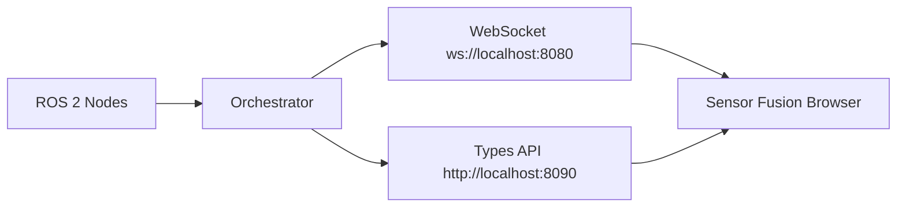

# ROS Integration

sensor-fusion does not talk to ROS directly. It talks to a separate orchestrator process in `/Users/jgrimminck/Coding/py/orchestrator`.



## Run The Orchestrator

Standalone mode, without ROS 2:

```bash
cd /Users/jgrimminck/Coding/py/orchestrator
python -m venv .venv
source .venv/bin/activate
pip install -r requirements.txt
python main.py
```

ROS 2 bridge mode:

```bash
cd /Users/jgrimminck/Coding/py/orchestrator
source .venv/bin/activate
ROS_ENABLED=true python main.py
```

The orchestrator defaults are:

- `WS_HOST=localhost`
- `WS_PORT=8080`
- `API_HOST=localhost`
- `API_PORT=8090`
- `CUSTOM_TYPES_DIR=custom_types`
- `ROS_ENABLED=false`
- `ROS_NODE_NAME=orchestrator_bridge`
- `ROS_DISCOVERY_PERIOD_SEC=1.0`

## sensor-fusion Side

`app/3d/managers/ClientManager.js` does three things during setup:

1. Tries to sync dynamic message definitions from `http://localhost:8090/api/types`.
2. Registers local fallback `.msg` files from `public/messages/`.
3. Creates a `Client` for `ws://localhost:8080`.

`app/client/Client.js` implements the orchestrator protocol, including standard type encoders, dynamic `.msg` schemas, `syncTypesFromServer`, `syncTypesToServer`, `subscribe`, `publish`, `echo`, and `request_all`.

## Message Ownership

The canonical custom message definitions live in the orchestrator repo under its `custom_types/` directory. The files in `public/messages/` are browser fallback copies and should stay synchronized with orchestrator definitions.

Current fallback definitions include:

- `geometry_msgs/Point32`
- `sensor_msgs/PointCloud`
- `sensor_fusion_msgs/AckermannDrive`
- `sensor_fusion_msgs/CarPosition`
- `sensor_fusion_msgs/LaneBounds`
- `sensor_fusion_msgs/Lanes`
- `sensor_fusion_msgs/StopSigns`
- `sensor_fusion_msgs/YieldBoundary`
- `sensor_fusion_msgs/YieldBoundaries`
- `sensor_fusion_msgs/Box`
- `sensor_fusion_msgs/Boxes`
- `sensor_fusion_msgs/imu`
- `sensor_fusion_msgs/CarSize`

## Topic Naming

Browser and orchestrator topic names use ROS-style strings such as `/ackdrive`. Message type names use `package/Message`, for example `sensor_fusion_msgs/AckermannDrive`.

The orchestrator converts ROS 2 names like `package/msg/Message` as needed on its side.

## Current Runtime Usage

The main 3D scene currently consumes `/ackdrive`. When a message arrives, `app/3d/Scene.js` reads:

- `speed` in mph, converted to meters per second.
- `steering_angle` in degrees, converted to radians and applied to the car steering angle.

The scripting ROS units in `app/scripting/units/ROSUnit.js` are placeholders. They do not yet publish or subscribe to live orchestrator topics.

## Troubleshooting

- If type sync fails, sensor-fusion logs a warning and attempts to load fallback `.msg` files from `public/messages/`.
- If `ws://localhost:8080` is unavailable, the 3D scene should still load but live topic updates will not arrive.
- Run the orchestrator in the same ROS 2 environment as the nodes it needs to discover.
- Dockerized ROS 2 discovery on macOS can be unreliable because ROS 2 uses DDS discovery rather than a single fixed TCP port.
