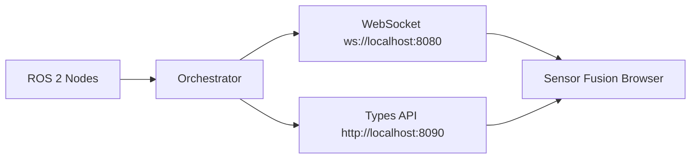

# ROS Integration

cev-sim does not talk to ROS directly. It talks to a separate orchestrator process in [orchestrator](https://github.com/cornellev/orchestrator).


```mermaid
flowchart LR
  ros2Nodes[ROS 2 Nodes] --> externalOrchestrator[Orchestrator]
  externalOrchestrator --> wsTopics["WebSocket ws://localhost:8080"]
  externalOrchestrator --> typesApi["Types API http://localhost:8090"]
  wsTopics --> sensorFusion[Sensor Fusion Browser]
  typesApi --> sensorFusion
```

## Run The Orchestrator

Standalone mode, without ROS 2:

```bash
cd /your/path/to/orchestrator
python -m venv .venv
source .venv/bin/activate
pip install -r requirements.txt
python main.py
```

ROS 2 bridge mode:

```bash
cd /your/path/to/orchestrator
source .venv/bin/activate
ROS_ENABLED=true python main.py
```

The orchestrator defaults are:

- `WS_HOST=localhost`
- `WS_PORT=8080`
- `API_HOST=localhost`
- `API_PORT=8090`
- `CUSTOM_TYPES_DIR=custom_types`
- `ROS_ENABLED=false`
- `ROS_NODE_NAME=orchestrator_bridge`
- `ROS_DISCOVERY_PERIOD_SEC=1.0`

## cev-sim Side

`app/3d/managers/ClientManager.js` does four things during setup:

1. Tries to sync dynamic message definitions from `http://localhost:8090/api/types`.
2. Registers the full autonomy catalog from `app/autonomy/AutonomyContractCatalog.js` and local `.msg` fallbacks from `public/messages/`.
3. Pushes the catalog to the orchestrator types API.
4. Creates a `Client` for `ws://localhost:8080` and tracks orchestrator topic advertisements for run preflight.

`app/client/Client.js` implements the orchestrator protocol, including standard type encoders, dynamic `.msg` schemas, `syncTypesFromServer`, `syncTypesToServer`, `fetchTopicCatalog`, schema introspection helpers, `subscribe`, `publish`, `echo`, and `request_all`.

Before a resolved run is applied, `ClientManager.preflight(resolved)` validates schema registration, catalog hash parity, transport connectivity, and required return topics. See [Autonomy interface contracts](./autonomy-interface-contracts.md).

## Message Ownership

The canonical custom message definitions live in the orchestrator repo under its `custom_types/` directory. The files in `public/messages/` are browser fallback copies and should stay synchronized with orchestrator definitions.

Current fallback definitions include:

- `geometry_msgs/Point32`
- `sensor_msgs/PointCloud`
- `sensor_fusion_msgs/AckermannDrive`
- `sensor_fusion_msgs/CarPosition`
- `sensor_fusion_msgs/LaneBounds`
- `sensor_fusion_msgs/Lanes`
- `sensor_fusion_msgs/StopSigns`
- `sensor_fusion_msgs/YieldBoundary`
- `sensor_fusion_msgs/YieldBoundaries`
- `sensor_fusion_msgs/Box`
- `sensor_fusion_msgs/Boxes`
- `sensor_fusion_msgs/imu`
- `sensor_fusion_msgs/CarSize`

## Topic Naming

Browser and orchestrator topic names use ROS-style strings such as `/ackdrive`. Message type names use `package/Message`, for example `sensor_fusion_msgs/AckermannDrive`.

The orchestrator converts ROS 2 names like `package/msg/Message` as needed on its side.

## Simulation time, frames, and calibration

Deterministic runs publish `/clock` with the integer simulation timestamp (`use_sim_time` on the ROS side). `/tf_static` carries mount and optical extrinsics from the resolved calibration bundle; `/tf` publishes reference `map → odom → base_link` after vehicle motion. Oracle truth odometry (`/oracle/vehicle/odometry`) publishes in the same transform phase before measured sensors. Sensor message headers use capture time; SFLog sample timestamps use actual delivery time.

PointCloud2 points are meters in the declared LiDAR frame (+X forward at azimuth zero). Measured clouds carry `x/y/z/intensity` only. Oracle semantic clouds add `cos_incidence`, `instance_id`, `semantic_id`, and `ray_index` and must never be mixed into candidate-safe measured topics. Camera `Image` and `CameraInfo` headers use the optical measurement frame with identical capture stamps. Supported image encodings: measured `rgba8`; oracle depth `32FC1` (meters), semantic `16UC1`, instance `32SC1`. Distortion uses Brown–Conrady `plumb_bob` applied consistently across RGB (linear) and labels/depth (nearest). Localization sensors publish on `/sensors/imu/data` (SI units, gravity-inclusive acceleration, unavailable orientation), `/sensors/gnss/fix` (WGS84 from manifest datum), and `/sensors/wheel/odometry` (encoder-derived dead reckoning). External modules return perception on `/perception/detections_2d`, `/perception/detections_3d`, `/perception/lanes`, `/perception/semantic` and localization estimates on `/localization/odometry`. The simulator ingests them through the deterministic input queue into `candidate.*` (and `diagnostics.topics.*`), keeps them observational unless `routeDownstream` is enabled, and publishes capture-aligned `visualization.*` overlays for live, Analysis, and Replay scrubbing beside sensors and oracle truth. Recorded runs attach `calibration.json` alongside `run-manifest.json` in SFLog datasets. Sensor diagnostics publish queue depth, drops, capture/encode/transport duration, and missed deadlines after delivery.

## Current Runtime Usage

The main 3D scene currently consumes `/ackdrive`. When a message arrives, `app/3d/Scene.js` reads:

- `speed` in mph, converted to meters per second.
- `steering_angle` in degrees, converted to radians and applied to the car steering angle.

The scripting ROS units in `app/scripting/units/ROSUnit.js` are placeholders. They do not yet publish or subscribe to live orchestrator topics.

## Troubleshooting

- If type sync fails, cev-sim logs a warning and attempts to load fallback `.msg` files from `public/messages/`.
- If `ws://localhost:8080` is unavailable, the 3D scene should still load but live topic updates will not arrive.
- Run the orchestrator in the same ROS 2 environment as the nodes it needs to discover.
- Dockerized ROS 2 discovery on macOS can be unreliable because ROS 2 uses DDS discovery rather than a single fixed TCP port.
