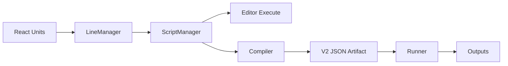

# Scripting Architecture

The scripting system has a live editor graph and a compiled artifact runtime.



## Editor Graph

`Scripting.js` owns a `ScriptManager` instance and renders React unit components. Each visible unit has a matching backend `UnitBlock` instance when it is compileable.

Connections are created visually by `LineManager`. Port metadata is stored in DOM data attributes as `uuid|label|type`. When a valid wire is completed, `Scripting.js` calls `ScriptManager.connectUnits(...)`.

Editor execution pulls data backward through connected blocks by calling `UnitBlock.getInput(...)`, which executes the upstream block and reads its `BlockOutput`.

## Dual Unit Model

Every compileable block needs:

- A React unit component that renders the node UI with matching port labels and types.
- A `UnitBlock` subclass that registers the same ports and implements validation/execution.

If the add menu entry has `class: null`, the node is UI-only and cannot participate in compile/run.

## Registry

Compiled artifacts store block type names, not source code. Every block type must be registered through `BlockRegistry.js` before compile or run.

The built-in path is:

```text
app/scripting/registerBuiltInBlocks.js
```

The user-facing add menu path is:

```text
app/scripting/AddMenu.js
```

Most new blocks need both.

## Compiled Runtime

`Compiler.js` walks backward from program output-role blocks, or from the current head if there are no output-role blocks. It validates reachable nodes, emits frozen node definitions, and records success transitions plus a reverse transition table.

`Runner.js` hydrates registered block classes from the artifact, wires runtime connections, resolves program inputs, evaluates final states, and returns either:

- `status: "success"` with `outputs` and optional `result`.
- `status: "failure"` with a serialized runtime error.

Compiled programs are data-only JSON. They do not contain generated JavaScript or serialized functions.

## UI Events

React units communicate with `Scripting.js` through browser `CustomEvent`s for stored data, dynamic ports, positioning, and deletion. See [UI Events](ui-events.md).
