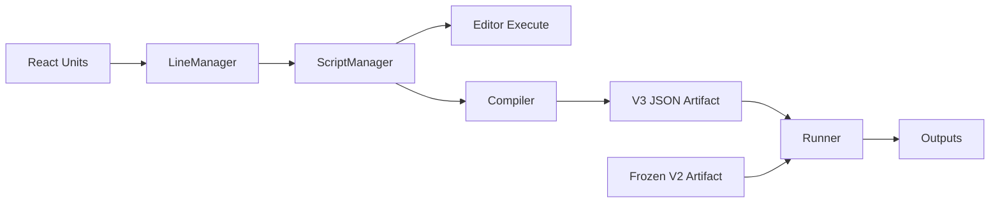

# Scripting Architecture

The scripting system has a live editor graph and a compiled artifact runtime.


```mermaid
flowchart LR
  reactUnits[React Units] --> lineManager[LineManager]
  lineManager --> scriptManager[ScriptManager]
  scriptManager --> editorExecute[Editor Execute]
  scriptManager --> compiler[Compiler]
  compiler --> artifact[V3 JSON Artifact]
  artifact --> runner[Runner]
  frozenV2[Frozen V2 Artifact] --> runner
  runner --> compiledOutputs[Outputs]
```

## Editor Graph

`Scripting.js` owns a `ScriptManager` instance and renders React unit components. Each visible unit has a matching backend `UnitBlock` instance when it is compileable.

Connections are created visually by `LineManager`. Port metadata is stored in DOM data attributes as `uuid|label|type`. When a valid wire is completed, `Scripting.js` calls `ScriptManager.connectUnitsDetailed(...)`. `LineManager` uses `portsCompatible()` on the decoded type strings.

Editor execution pulls data backward through connected blocks by calling `UnitBlock.getInput(...)`, which resolves the upstream `BlockOutput` through `manager.evaluateUnit(uuid)`. `ScriptManager.execute()` and each output-role root in `executeProgram()` also use `evaluateUnit()`. One evaluation frame (`outputMemo` / `evaluating`) is created per `execute()` / `executeProgram()` call, so a shared node runs once per call and a later call always starts a new memo. Editor `ScriptManager.evaluationPolicy` is `{ lazySelectors: true, memoizeExecute: true }`, so `IfBlock`, `WeightedSelectBlock`, and `SignalLatchBlock` skip unused inputs. `SignalDefaultBlock` is already lazy.

## Dual Unit Model

Every compileable block needs:

- A React unit component that renders the node UI with matching port labels and types.
- A `UnitBlock` subclass that registers the same ports and implements validation/execution.

If the catalog entry has `blockClass: null`, the node is UI-only and cannot participate in compile/run.

## Registry

Compiled artifacts store block type names, not source code. Every block type must be registered through `BlockRegistry.js` before compile or run.

The built-in path is:

```text
app/scripting/registerBuiltInBlocks.js
```

The user-facing block inventory path is:

```text
app/scripting/UnitCatalog.js
```

`AddMenu.js` renders the searchable, categorized block library from that catalog.

Most new blocks need both.

## Compiled Runtime

`Compiler.js` walks backward from program output-role blocks, or from the current head if there are no output-role blocks. It validates reachable nodes (unbound `generic` is only an error when reachable), snapshots resolved port types, emits frozen node definitions with `version: 3`, and records success transitions plus a reverse transition table. Artifact ports never contain `generic`.

`Runner.js` hydrates registered block classes from the artifact, overlays frozen `node.ports` onto each unit's `typeMap`, wires runtime connections, resolves program inputs, evaluates final states, and returns either:

- `status: "success"` with `outputs` and optional `result`.
- `status: "failure"` with a serialized runtime error.

Compiled v2 artifacts stay eager for `If`, `WeightedSelect`, and `SignalLatch`. Compiled v3 artifacts use lazy selectors. Frozen ports are authoritative over the current class registration.

Compiled programs are data-only JSON. They do not contain generated JavaScript or serialized functions.

Recompiling to v3 changes script lock hashes, `resolvedHash`, `simulationSemanticHash`, and `episodeHash`. It does not change `worldHash`.

## UI Events

React units communicate with `Scripting.js` through browser `CustomEvent`s for stored data, dynamic ports, positioning, and deletion. See [UI Events](ui-events.md).
