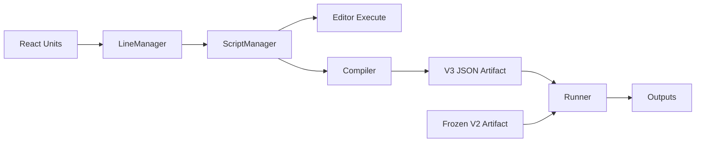

# Scripting Architecture

The scripting system has a live editor graph and a compiled artifact runtime.


```mermaid
flowchart LR
  reactUnits[React Units] --> lineManager[LineManager]
  lineManager --> scriptManager[ScriptManager]
  scriptManager --> editorExecute[Editor Execute]
  scriptManager --> compiler[Compiler]
  compiler --> artifact[V3 JSON Artifact]
  artifact --> runner[Runner]
  frozenV2[Frozen V2 Artifact] --> runner
  runner --> compiledOutputs[Outputs]
```

## Editor Graph

`Scripting.js` owns a `ScriptManager` instance and renders React unit components. Each visible unit has a matching backend `UnitBlock` instance when it is compileable.

Connections are created visually by `LineManager`. Port metadata is stored in DOM data attributes as `uuid|label|type`. When a valid wire is completed, `Scripting.js` calls `ScriptManager.connectUnitsDetailed(...)`. `LineManager` uses `portsCompatible()` on the decoded type strings.

Editor execution pulls data backward through connected blocks by calling `UnitBlock.getInput(...)`, which resolves the upstream `BlockOutput` through `manager.evaluateUnit(uuid)`. `ScriptManager.execute()` and each output-role root in `executeProgram()` also use `evaluateUnit()`. One evaluation frame (`outputMemo` / `evaluating`) is created per `execute()` / `executeProgram()` call, so a shared node runs once per call and a later call always starts a new memo. Editor `ScriptManager.evaluationPolicy` is `{ lazySelectors: true, memoizeExecute: true }`, so `IfBlock`, `WeightedSelectBlock`, and `SignalLatchBlock` skip unused inputs. `AndBlock` and `OrBlock` always short-circuit, including when a compiled artifact is replayed as version 2. `SignalDefaultBlock` is already lazy. Effect blocks run only when reachable via `then` or an identity output; `Sequence` evaluates `first` then `second`. `actor_command` is a concrete value type (`MakeActorCommandBlock` / `SplitActorCommandBlock`); route-controller mappings stay `float64`.

`restoreManagerFromGraph` and editor load use `connectUnitsDetailed`. Missing ports (legacy `written` / `ok` / `staged`) become `manager.restoreErrors`. Compile fails closed until those edges are rewired. `latestValidArtifact` is kept. Unrestored connections stay in the saved graph JSON and are not silently dropped.

## Dual Unit Model

Every compileable block needs:

- A React unit component that renders the node UI with matching port labels and types.
- A `UnitBlock` subclass that registers the same ports and implements validation/execution.

If the catalog entry has `blockClass: null`, the node is UI-only and cannot participate in compile/run.

## Registry

Compiled artifacts store block type names, not source code. Every block type must be registered through `BlockRegistry.js` before compile or run.

The built-in path is:

```text
app/scripting/registerBuiltInBlocks.js
```

The authoritative server-safe inventory and React attachment paths are:

```text
app/scripting/UnitCatalog.meta.js
app/scripting/UnitCatalog.js
```

`registerBuiltInBlocks.js` registers each explicit metadata type. `AddMenu.js` renders placeable
built-in entries after React components are attached by type, then merges the revisioned plugin
catalog. Built-in placeable blocks still need both a backend class and component. Plugin units
use a generic `SettingsForm` unless the package `registerUi` view loads.

Managed plugin runs create a sealed registry per `PluginRunSession`. The
registry starts with the same built-ins, then `PluginLoader` adds only the
exact packages frozen in `resolved.plugins` / `resolved.pluginPackages`.
Editor sessions use an unsealed lock-scoped host: missing packages become
`UnresolvedPluginUnit` placeholders. `graph.pluginLocks` pin `packageHash`;
compiled `pluginRequirements` pin `runtimeHash`. One package per plugin ID per
graph. `ScriptManager`, `VisualScriptRunner`, `BindingRuntime`, nested compiled
programs, repeat programs, and `ScenarioRuntime` all receive the session
registry explicitly. The default registry remains plugin-disabled and is never
mutated by managed preparation.

## Compiled Runtime

`Compiler.js` walks backward from program output-role blocks, or from the current head if there are no output-role blocks. It validates reachable nodes (unbound `generic` is only an error when reachable), snapshots resolved port types, emits frozen node definitions with `version: 3`, and records success transitions plus a reverse transition table. Artifact ports never contain `generic`.

`Runner.js` hydrates registered block classes from the artifact, overlays frozen `node.ports` onto each unit's `typeMap`, wires runtime connections, resolves program inputs, evaluates final states, and returns either:

- `status: "success"` with `outputs` and optional `result`.
- `status: "failure"` with a serialized runtime error.

Before evaluation, editor and compiled execution snapshot every unit's JSON runtime state. Failures restore that snapshot and roll back staged signal writes; successful runs commit both.

Plugin artifacts also carry sorted `pluginRequirements` records containing
`pluginId`, `version`, `runtimeHash`, and the reachable block types. The
compiler merges requirements from nested compiled programs. Resolution and
runner hydration compare those records with the selected session registry, so
missing, stale, undeclared, or unused plugin types fail before evaluation.

Each graph evaluation opens a nested `PluginEffectJournal` frame and snapshots
the session's deterministic RNG streams. Successful evaluation commits
plugin-owned debug, mission, and scenario-flag writes into the graph's
`SignalStore` transaction. Failure discards the effects, restores RNG and unit
runtime state, and returns a structured `PLUGIN_*` error. Reset disposes every
adapter, clears plugin-owned signals and RNG streams, and rebuilds binding and
scenario runners from the immutable artifacts.

Declared plugin systems run in the same `"scripts"` kernel phase after
`BindingRuntime.update`: topic callbacks drain first, then `onStep()` in
priority / plugin-id / system-id order. System hooks use the same journal for
signal writes, `controls.reference` commands, output-topic publishes, and
reset-only `overlay.spawn`. Scenario `submitSiSpeedSteer` still follows scripts
and may overwrite a plugin reference command. Failed hooks roll back only that
hook; the session requires reset.

Compiled v2 artifacts stay eager for `If`, `WeightedSelect`, and `SignalLatch`. Compiled v3 artifacts use lazy selectors. `And`/`Or` short-circuit regardless of artifact version. Frozen ports are authoritative over the current class registration.

Compiled programs are data-only JSON. They do not contain generated JavaScript or serialized functions.

Recompiling to v3 changes script lock hashes, `resolvedHash`, `simulationSemanticHash`, and `episodeHash`. It does not change `worldHash`.

## UI Events

React units communicate with `Scripting.js` through browser `CustomEvent`s for stored data, dynamic ports, positioning, and deletion. See [UI Events](ui-events.md).
