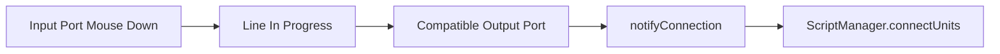

# UI Events

The scripting UI uses browser `CustomEvent`s to coordinate React units, the line manager, and `ScriptManager`.

## Events

- `data-stored`: sent by `storeData(uuid, data)` so `Scripting.js` can call `manager.storeData(uuid, data)`.
- `reregister-unit`: sent by `reregister(uuid)` so dynamic backend ports are recalculated.
- `position-unit`: sent after adding or importing a unit so `Unit` can move to the intended canvas position.
- `delete-unit`: sent by a unit delete action and handled by both `Scripting.js` and `LineManager`.
- `delete-port-connections`: removes wires for specific ports, usually after dynamic output changes.

## Connection Flow



`LineManager` starts wires from input ports and completes them on compatible output ports. When a wire is completed, it passes decoded port metadata back to `Scripting.js`.

## Port Metadata

Ports encode metadata as:

```text
uuid|label|type
```

The parser lives in `LineManager.js`. Avoid using `|` in generated port IDs or labels. `ProgramIO.js` already sanitizes generated port IDs by replacing `|` with `-`.

## Deletion

Deleting a unit should remove backend state and visible wires. Deleting a connection should call `ScriptManager.disconnectUnits(...)`.

Because deletion paths are easy to desynchronize, test graph validity after changing unit deletion, connection deletion, or dynamic port behavior.
