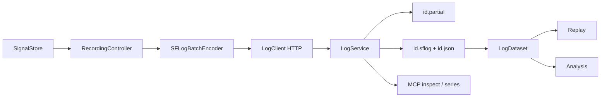
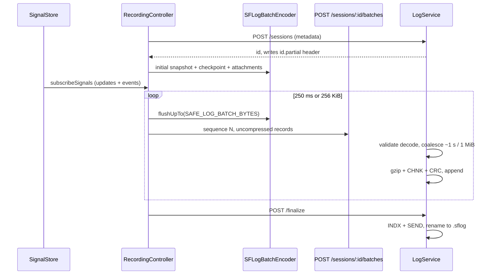

# SFLog

SFLog is cev-sim's native telemetry log: a self-contained little-endian binary that records typed signals, events, checkpoints, and attachments for deterministic replay and analysis. Version 1 (`SFLG`) is the only supported format. RLOG, WPILOG, and CSV import are rejected.

This page is the format and pipeline spec. [Telemetry, Logging, Replay, and Analysis](telemetry-logging.md) covers the live `SignalStore` that feeds it. [Run manifests](run-manifests.md) describes how deterministic runs open and finalize sessions.

## Design goals

- **Self-contained.** A `.sflog` file can be decoded without the JSON sidecar. The sidecar is a catalog cache plus the editable name/tag store.
- **Independently validated chunks.** Each gzip chunk has its own time range, lengths, and CRC32. A truncated tail can be discarded without losing earlier data.
- **Seekable.** Checkpoints store full replayable state. Replay seeks backward from the latest checkpoint at or before the cursor instead of rescanning the whole session.
- **Typed and compact.** A schema record binds a numeric ID to a path and type. Later cycle and checkpoint values carry no type tag.
- **Idempotent upload.** The browser streams uncompressed record batches over HTTP. Sequence numbers make retries safe; the server concatenates, gzip-compresses, and indexes.

The PR 6 headless runner injects a direct `LogService` transport into the same
`RecordingController`. This bypasses HTTP but preserves identical profile
filtering, record encoding, batching, gzip/CRC chunks, checkpoints, index, and
attachments. Atomic runner outputs use `run.sflog` and `run.json`; existing
Replay, Analysis, and MCP readers require no alternate format path.



## On-disk layout

Files live under `server/data/logs/` unless `CEV_SIM_LOGS_DIR` overrides the directory. `LogService` creates the directory on first use.

```text
<id>.sflog     finalized binary (header + gzip chunks + index + SEND locator)
<id>.json      catalog sidecar: metadata, editable name and tags, byte/duration summaries
<id>.partial   active or crash-interrupted recording (header + complete chunks only)
```

IDs are `log-{UTC stamp without colons or hyphens}-{6 random chars}`, for example `log-20260828T191012Z-a1b2c3`. Path segments are URL-encoded and rejected if they contain `/` or `\`, or if the whole id is `.` or `..`.

Sidecar JSON is written atomically (temp file + rename). It is **not** the source of truth for samples. Readers that need samples always scan or index the binary.

### Sidecar vs header metadata

Both copies start from the same session object. After finalize, import, or recovery the sidecar also stores catalog fields that change after the header is written: `status`, `incomplete`, `completedAt`, `durationUs`, `bytes`, `importedAt`, `recoveredAt`, `recoveryError`, `loggingError`, `runResult`.

Editable catalog fields (`name`, `tags`) exist only in the sidecar. Patching them does not rewrite the binary header.

Status values:

| Status | Meaning |
| --- | --- |
| `recording` | Session is open; file is still `.partial` |
| `complete` | Finalized with a valid index |
| `incomplete` | Recovered from `.partial`, or finalize reported dropped samples / upload errors |
| `corrupt` | Recovery could not parse any valid prefix |

## File layout

All multibyte integers and floats are little-endian. The file is:

```text
[header]
[chunk]*
[index footer]     INDX + entries
[locator]          uint64 index offset + ASCII "SEND"  (12 bytes at EOF)
```

### Header

| Offset | Field | Encoding |
| --- | --- | --- |
| 0 | Magic | ASCII `SFLG` |
| 4 | Version | `uint16`, currently `1` |
| 6 | Flags | `uint16`; bit 0 = little-endian, bit 1 = gzip chunks |
| 8 | Metadata length | `uint32` |
| 12 | Metadata | UTF-8 JSON, max 16 MiB |

Current writers always set flags `0x0003` (little-endian + gzip). Readers reject any version other than `1`. Import probes the first bytes and names RLOG, WPILOG, and CSV explicitly so those formats fail with a useful error rather than "not SFLog".

Header metadata written at session create includes:

| Field | Role |
| --- | --- |
| `id`, `name`, `createdAt` | Session identity and wall-clock start |
| `status`, `format`, `version` | `recording` / `sflog` / `1` at create |
| `environmentId` | Environment in use when recording started |
| `profile` | The normalized recording profile |
| `simulator` | Simulation engine snapshot at start |
| `appVersion`, `gitHash` | Build identity |
| `runId`, `manifestId`, `manifestRevision` | Run-manifest session, when present |
| `definitionHash`, `resolvedHash` | Frozen run hashes |
| `provenance` | Optional browser/WebGL/orchestrator identity |
| `tags`, `incomplete` | Catalog defaults |

### Chunks

Each chunk is 36 header bytes plus a gzip payload:

| Offset | Field | Encoding |
| --- | --- | --- |
| 0 | Magic | ASCII `CHNK` |
| 4 | Start time | `uint64` session-relative microseconds |
| 12 | End time | `uint64` session-relative microseconds |
| 20 | Uncompressed length | `uint32` |
| 24 | Compressed length | `uint32` |
| 28 | CRC32 | `uint32` over the **uncompressed** record stream |
| 32 | Reserved | `uint32`, zero in v1 |
| 36 | Payload | gzip (zlib level 6) of concatenated record batches |

CRC32 is the ISO 3309 / PNG polynomial `0xedb88320`, initialized to `0xffffffff`, final-xor `0xffffffff`.

The server flushes a chunk when pending uncompressed bytes reach **1 MiB** or the pending time span reaches **1 second**. Readers reject chunks whose compressed or uncompressed length exceeds **64 MiB**, gzip failures, length mismatches, and CRC mismatches.

The HTTP `/chunks` APIs return the **uncompressed** record stream, not the on-disk gzip framing. Replay and analysis decode those bytes with `decodeRecordStream`.

### Index and locator

Finalized files end with:

| Field | Encoding |
| --- | --- |
| Magic | ASCII `INDX` |
| Entry count | `uint32` |
| Entries | `count` × 25 bytes |

Each index entry is exactly 25 bytes:

| Offset | Field | Encoding |
| --- | --- | --- |
| 0 | Start time | `uint64` |
| 8 | End time | `uint64` |
| 16 | File offset | `uint64` byte offset of the `CHNK` header |
| 24 | Has checkpoint | `uint8`, `1` if the chunk decoded at least one checkpoint |

The last 12 bytes of the file are the locator: little-endian `uint64` index offset, then ASCII `SEND`. Import of a finalized file requires:

1. Locator magic `SEND` and an index offset inside the file.
2. Bytes from that offset to the locator are exactly `8 + entryCount * 25`.
3. `INDX` magic, entry count matching the scanned chunk count, and every entry matching the scanned chunk's start, end, offset, and checkpoint flag.
4. Every chunk gunzips, matches its declared uncompressed length, and passes CRC32.

## Record stream

Chunks contain a concatenation of client batches. Each batch is itself a record stream produced by `SFLogBatchEncoder`. Unsigned integers, schema IDs, cycle numbers, counts, and lengths use unsigned base-128 varints (up to 10 bytes, must fit JavaScript's safe integer range). Signed integers use protobuf-style zigzag: `n >= 0 ? n << 1 : (-n << 1) - 1`.

Strings are `varuint` byte length followed by UTF-8. Nested `sizedBytes` wrap encoded signal values in cycle, checkpoint, and attachment records.

A schema record establishes the type for a numeric ID. Later values of that ID carry no type tag. Unknown record tags are fatal.

| Tag | Kind | Contents |
| --- | --- | --- |
| `0x01` | Schema | ID, type code, path, unit, descriptor JSON |
| `0x02` | Cycle | Timestamp code, cycle number, changed-signal count, ID/value pairs |
| `0x03` | Event | Timestamp, category, name, severity, JSON payload |
| `0x04` | Checkpoint | Timestamp, count, ID/value pairs for replayable state |
| `0x05` | Attachment | Timestamp, name, MIME type, bytes |

### Schema records

```text
uint8  tag = 0x01
varuint schemaId          // assigned from 1 upward, per encoder
uint8  typeCode
string path
string unit               // empty string means no unit
string metadata JSON
```

Schema identity is `path + NUL + normalized type`. Changing a signal's type allocates a **new** ID; the old ID remains valid for earlier samples. Live telemetry also emits `schema/signal-type-changed`. Never reuse a type name with a different meaning.

Metadata JSON fields:

```json
{
  "source": "simulation",
  "category": "vehicles",
  "replayRole": "state",
  "logClass": "core",
  "description": null,
  "metadata": {}
}
```

`replayRole` is `input`, `state`, or `derived` (default `derived`). `logClass` is `core`, `standard`, or `heavy` (default `standard`).

### Cycle records

Updates that share the same `timeUs` and `cycle` are packed into one cycle record:

```text
uint8  tag = 0x02
varuint timestampCode
varuint cycle
varuint count
repeated:
  varuint schemaId
  sizedBytes encodedValue
```

Timestamp codes keep each uploaded batch independently decodable:

- Odd code `timeUs * 2 + 1` is an **absolute** session-relative timestamp.
- Even code `(timeUs - lastCycleTimeUs) * 2` is a **delta** from the previous cycle in this stream.
- The encoder writes an absolute code for the first cycle in a batch, and again whenever time goes backward.
- The decoder starts `lastCycleTimeUs` at `0` and applies the same even/odd rule.

Values are encoded with the schema's type. A cycle that names an unknown schema ID is corrupt.

### Events, checkpoints, and attachments

Events are discrete, not sampled:

```text
uint8  0x03
varuint timeUs
string category
string name
string severity
string payload JSON
```

Checkpoints snapshot every currently known `input` and `state` signal (not `derived`). The recording controller writes one at start (`t = 0`), every **5 seconds** of recording time, and at stop:

```text
uint8  0x04
varuint timeUs
varuint count
repeated:
  varuint schemaId
  sizedBytes encodedValue
```

Attachments are named blobs, typically JSON captured at session start:

```text
uint8  0x05
varuint timeUs
string name
string mime
sizedBytes payload
```

`buildRecordingOptions` always attaches:

| Attachment | Contents |
| --- | --- |
| `signal-catalog.json` | Live `SignalStore` descriptors at start |
| `bindings.json` | Bindings manifest, or `null` |
| `environment.json` | `environment.manifest` signal, or `null` |
| `scripts/<scriptId>.json` | Compiled script artifacts for each bound script |

Deterministic runs additionally attach `run-manifest.json` (the resolved run) and `calibration.json` when a calibration bundle is present. `RunSessionController` appends `run-results.json` immediately before finalize.

`LogDataset` parses those JSON attachments for replay/analysis: `runManifest`, `calibration`, and `runResults`.

## Signal value codecs

`normalizeType` maps aliases before encoding: `bool` → `boolean`, `array[json]` and `message` → `json`. Unknown type names also encode as JSON.

| Type | Code | Encoding |
| --- | --- | --- |
| `json` | `0x00` | UTF-8 JSON (no inner length; the outer `sizedBytes` is the length) |
| `boolean` | `0x01` | `uint8` `0` or `1` |
| `int32`, `int64` | `0x02`, `0x04` | zigzag varint |
| `uint32`, `uint64` | `0x03`, `0x05` | unsigned varint |
| `float32` | `0x06` | IEEE-754 little-endian |
| `float64` | `0x07` | IEEE-754 little-endian |
| `string` | `0x08` | inner length-prefixed UTF-8 |
| `bytes` | `0x09` | raw bytes; length comes only from the outer `sizedBytes` |
| `vec3` | `0x0a` | three `float64` (`x`, `y`, `z`) |
| `pose3` | `0x0b` | six `float64`: position `x,y,z` then Euler `x,y,z`. Decode sets `rotation.order` to `"XYZ"` |
| `float64[]` | `0x0c` | `varuint` length, then that many `float64` |
| `int32[]` | `0x0d` | `varuint` length, then zigzag values |
| `boolean[]` | `0x0e` | `varuint` length, then `uint8` flags |

JSON round-trips two non-JSON values:

- `bigint` → `{ "__sflogBigInt": "<decimal>" }`
- Typed arrays → `{ "__sflogTypedArray": "<constructor name>", "values": [...] }`

`int64` / `uint64` still go through JavaScript numbers after the varint decode, so values outside `Number.MAX_SAFE_INTEGER` are rejected.

## Recording pipeline

The singleton `RecordingController` owns the session across workspace switches. The live Three.js scene stays mounted; leaving Simulation does not stop an active recording.



### Start

1. `POST /api/logs/sessions` creates the id, writes the header into `.partial`, and writes the sidecar.
2. The encoder records start attachments, then every currently enabled signal as an update at `t = 0`, then a checkpoint.
3. A `logging/recording-started` telemetry event is emitted.
4. The controller subscribes to the store (updates and events, not catalog churn) and starts a 250 ms flush timer.

### Capture and sampling

Each store update is rewritten onto the session clock, then filtered by the active profile:

| Sampling | Behavior |
| --- | --- |
| `every-update` | Record every sample |
| `on-change` | Skip when `JSON.stringify` of the value equals the previous recorded value |
| `fixed-rate` | Keep at most one sample per `1e6 / rateHz` microseconds |
| `disabled` | Drop |

Events always record. Checkpoints fire when recording time advances 5 seconds past the last checkpoint.

### Time bases

| `timeBase` | When | Timestamp written |
| --- | --- | --- |
| `wall` | Manual / MCP recordings | `storeTimeUs - recordingTimeOriginUs` (session-relative from start) |
| `simulation` | Run-manifest sessions (`resolvedRun` present) | Simulation microseconds as published |

Stop uses simulation `timeNs / 1000` for run sessions and the same wall offset otherwise.

### Flush, queue, and backpressure

| Limit | Value | Role |
| --- | --- | --- |
| Target flush | 256 KiB | Soft trigger so batches stay well under the HTTP ceiling |
| Safe batch | 8 MiB − 512 KiB | Encoder splits here; a single unsplittable record above this throws |
| Hard HTTP / server batch | 8 MiB | Express raw-body and `appendBatch` reject anything larger |
| Client upload queue | 16 MiB | Outstanding uncompressed batches waiting on HTTP |
| Chunk (on disk) | 64 MiB compressed or uncompressed | Reader safety limit |
| Import | 2 GiB | Streamed native `.sflog` only |

Flush also runs every 250 ms. `flushUpTo` never splits a record; huge camera/LiDAR `bytes` payloads occupy their own batch.

Uploads are serialized on `_uploadChain` and retried at 250 ms, 750 ms, then 2 s. The request headers are:

- `X-SFLog-Sequence` — monotonic from 0
- `X-SFLog-Start-Us` / `X-SFLog-End-Us` — batch time range
- `Content-Type: application/octet-stream`

The server accepts `sequence <= lastSequence` as a duplicate (`duplicate: true`) and otherwise requires exactly `lastSequence + 1`. It **decodes the batch against the session schema map before accepting the sequence number**, so a corrupt payload does not consume the sequence.

If the 16 MiB client queue is full:

- **Replay-safe / required logging** (`haltSimulationOnError`): pause the simulator, set status `error`.
- **Telemetry / optional logging**: drop the batch, increment `droppedSamples`, and call `repeatSchemas()` so the next successful batch re-emits every known schema. Without that, later IDs would be undecodable.

### Stop and finalize

Stop unsubscribes, emits `logging/recording-stopped`, writes a final checkpoint, flushes remaining records, waits for the upload chain, then `POST /sessions/:id/finalize`.

The server flushes any pending chunk, appends `INDX` + locator, renames `.partial` → `.sflog`, and updates the sidecar. Finalize payload may mark `incomplete` when the client dropped samples, had an upload error, or the caller passed `incomplete: true`. Optional run logging treats incomplete finalize as degraded rather than fatal.

## Recording profiles

Profiles are `fusion-log-profile` version 1. The Recording panel persists the active profile under the `logging-profiles-v1` setting. Glob rules run in order; **the last matching rule wins**.

```json
{
  "kind": "fusion-log-profile",
  "version": 1,
  "id": "replay-safe-default",
  "name": "Replay Safe",
  "mode": "replay-safe",
  "rules": [
    { "pattern": "**", "enabled": true, "sampling": "on-change", "rateHz": null },
    { "pattern": "simulation.**", "enabled": true, "sampling": "every-update", "rateHz": null },
    { "pattern": "vehicles.**", "enabled": true, "sampling": "every-update", "rateHz": null },
    { "pattern": "devices.**", "enabled": false, "sampling": "on-change", "rateHz": null }
  ]
}
```

Globs treat `*` as `[^.]*` (one path segment) and `**` as `.*`.

| Mode | Extra lock |
| --- | --- |
| `replay-safe` | Forces every `input` signal, and every `state` signal with `logClass: "core"`, to `enabled` + `every-update`. The UI marks those rules locked. |
| `telemetry` | No locks; any descriptor may be disabled or rate-limited |

Built-in profiles:

| ID | Mode | Notes |
| --- | --- | --- |
| `replay-safe-default` | `replay-safe` | Default for the Recording panel and MCP |
| `telemetry-default` | `telemetry` | Same device-off default, no replay locks |
| `simulation-run-full-sensors` | `replay-safe` | Run-manifest default: devices on, every-update |

## Run-manifest integration

A prepared run calls `_ensureRecording` before the first step. Manifest `logging.policy`:

| Policy | Behavior |
| --- | --- |
| `required` | Session must open; upload/queue failure pauses the sim and fails the run |
| `optional` | Logging starts automatically; storage or finalize failure degrades the run and emits `optional-recording-unavailable` / `optional-recording-finalization-failed` |
| `disabled` | No SFLog session |

The default profile id is `simulation-run-full-sensors`. Run sessions use `timeBase: "simulation"` and stamp metadata with run id, manifest identity, definition/resolved hashes, and browser/WebGL provenance. Headless LiDAR provenance includes the locked CPU/BVH backend selection. GPU runs additionally retain the pooled-renderer diagnostic snapshot, Chromium and sidecar versions, launch arguments and sandbox state, ANGLE/WebGL renderer, GPU/driver identity, required format support, and fixed context count. Final result diagnostics retain the same determinism-scope evidence. Measured and semantic PointCloud2 records use their capture simulation timestamps. Encoded ROS sensor bytes are the same bytes published on the wire; replay reads those samples instead of recapturing on the replay GPU.

Reset finalizes the active result and SFLog, then prepares a replacement run paused at step zero.

### Managed experiment import

Server-owned experiment cases first write artifacts atomically beneath
`<data-dir>/headless-runs/<job-id>/<case-id>/`. Any retained `run.sflog` is then
stream-imported through the shared `LogService`. Import must preserve and match
the worker's `runId` and `resolvedHash` before the catalog `logId` is attached
to the experiment case and published at `fusion://logs/{logId}`. Required-log
import failure makes the case an infrastructure error. Optional import failure
leaves the original artifact URI in the result and adds an artifact warning.
Metric reduction occurs live in the worker, so disabled or sampled logging
does not change built-in, signal, or event metric semantics.

## Recovery and import

`listLogs()` always calls `recoverPartialLogs()` first. For each `.partial` that is not an in-memory active session:

1. Scan complete `CHNK` headers with valid gzip + CRC.
2. Stop at the first truncated, oversized, or corrupt chunk.
3. Truncate the file to the last valid chunk end.
4. Write a fresh `INDX` + `SEND` for that prefix.
5. Rename to `.sflog` and mark the sidecar `incomplete` with `recoveredAt`.

A prefix that cannot be parsed at all marks the sidecar `corrupt` and leaves the partial in place for inspection.

Native import (`POST /api/logs/import`) streams up to 2 GiB, scans as a finalized file (full index validation), assigns a new id, and writes a sidecar. The original header metadata is preserved except `id`, `name`, `importedAt`, `status`, `durationUs`, and `bytes`.

## HTTP API

Mounted at `/api/logs` from `server/App.js`, in front of JSON storage middleware. Batch bodies use `express.raw` with an 8 MiB limit; other JSON routes use a 2 MiB JSON limit.

| Method | Path | Notes |
| --- | --- | --- |
| `GET /` | Catalog from sidecars (after recovery) |
| `POST /sessions` | Create `.partial` + sidecar |
| `POST /sessions/:id/batches` | Uncompressed records; sequence in `X-SFLog-Sequence` |
| `POST /sessions/:id/finalize` | Index, rename, patch metadata |
| `POST /import` | Stream `application/x-sflog`; name from `X-SFLog-Name` |
| `GET /:id/metadata` | Sidecar |
| `GET /:id/index` | Scanned chunks, checkpoints, schemas (cached in memory) |
| `GET /:id/chunks?fromUs=&toUs=` | Concatenated uncompressed records; seek uses the latest checkpoint at or before `fromUs` |
| `GET /:id/chunks/:chunkIndex` | One uncompressed chunk, `application/x-sflog-records` |
| `GET /:id/series?path=&field=&fromUs=&toUs=&maxPoints=` | Numeric series, min/max downsampled to at most 2000 points |
| `GET /:id/snapshot?timeUs=&includeHeavy=` | Checkpoint + later updates; `includeHeavy=false` omits `bytes` and `logClass: heavy` |
| `GET /:id/events?fromUs=&toUs=&limit=` | Events, newest `limit` (max 10000, default 5000) |
| `GET /:id/file` | Raw `.sflog` with HTTP Range |
| `PATCH /:id` | Name and tags only |
| `DELETE /:id` | Binary + partial + sidecar; refused while recording |

Errors return `400` with `{ "error": "<message>" }`.

## Consumers

### LogDataset

`LogDataset.open(id)` loads the index, then either eagerly decodes every chunk (Replay) or stays lazy (Analysis). It sorts updates/events/checkpoints, builds per-path series, and exposes:

- `valueAt(path, timeUs, { interpolate })` — last sample at or before the cursor; linear interpolation for numbers and `pose3` when requested.
- `snapshotAt(timeUs)` — clone the latest checkpoint at or before the cursor, then apply later updates through `timeUs`.
- `eventsNear(timeUs, windowUs)` — default window 1 second.
- JSON attachment helpers for run/calibration/results.

### Replay

Replay owns a **read-only** Three.js scene, distinct from the live simulation scene. Inspectors use `snapshotAt` (exact recorded values). Vehicle meshes call `valueAt(..., { interpolate: true })` so poses move smoothly between samples. Timeline state lives in the shared `TimelineStore` (cursor, duration, play, speed `0.25–4`, loop, selection). Keyboard: Space play/pause, arrows ±1/60 s.

### Analysis

Analysis can bind to live local telemetry, a remote simulator tab, or `log:<id>`. Log sources open the dataset with `eager: false` and fetch snapshots/series over HTTP (`includeHeavy: false` on snapshots). Series are min/max downsampled to roughly two points per graph pixel, capped at 2000.

Remote tabs never record. The simulator tab is authoritative; the `BroadcastChannel("cev-sim-telemetry-v1")` bridge only mirrors catalogs, previews, and requested full-rate paths. Heavy signals are excluded from previews.

## MCP

Headless tools read the backend files directly. Recording start/stop and visual Replay controls publish a storage event that **one** initialized simulator tab executes (`McpLoggingBridge`).

| Tool | Reads / writes |
| --- | --- |
| `log_list`, `log_get` | Sidecar + index/schemas |
| `log_update`, `log_delete` | Sidecar name/tags; delete files |
| `recording_status` | Sidecars with `status: recording` |
| `recording_start` / `recording_stop` | Browser command; optional custom rules |
| `replay_open` / `replay_control` | Browser Replay workspace |
| `replay_inspect` | Exact snapshot + nearby events, path globs |
| `replay_series` | Downsampled series, max 2000 samples |

Resources: `fusion://logs` and `fusion://logs/{logId}`.

## Implementation map

| File | Role |
| --- | --- |
| `app/logging/SFLogCodec.js` | Byte IO, value codecs, batch encoder, `decodeRecordStream` |
| `app/logging/LogLimits.js` | 8 MiB / 256 KiB / safe-batch constants shared by client and server |
| `app/logging/LogProfiles.js` | Built-in profiles, glob matching, replay-safe locks |
| `app/logging/RecordingOptions.js` | Shared attachment + metadata builder for UI, MCP, and runs |
| `app/logging/RecordingController.js` | Transport-injected session lifecycle, sampling, flush, retry, backpressure |
| `app/logging/RecordingPanel.js` | Simulation overlay UI, profile editor, import |
| `app/logging/LogClient.js` | Browser `/api/logs` fetch wrapper |
| `app/logging/LogDataset.js` | Decoded log for Replay/Analysis |
| `app/logging/TimelineStore.js` | Shared Replay/Analysis cursor |
| `app/logging/McpLoggingBridge.js` | Exactly-once MCP start/stop in the simulator tab |
| `server/logging/LogService.js` | Header/chunk/index, recovery, import, series/snapshot |
| `server/routes/logRouter.js` | HTTP routes |
| `server/mcp/loggingTools.js` | MCP tools and `fusion://logs` resources |
| `app/simulation/RunSessionController.js` | Policy-aware run recording and `run-results.json` |
| `server/headless/HeadlessArtifactSink.js` | Direct LogService transport, profile retention, and atomic CLI artifacts |
| `server/headless/HeadlessExperimentService.js` | Managed case queue, shared-log import, cancellation, and stale-result reconciliation |
| `app/replay/ReplayPage.js`, `ReplayScene.js` | Catalog, seek, interpolated poses |
| `app/analysis/AnalysisPage.js` | Lazy log series and snapshots |
| `tests/telemetry-logging.test.js` | Codec round-trips, profiles, backpressure, recovery, import |

## Extending the format

When adding a producer, follow the [telemetry extension checklist](telemetry-logging.md#extension-checklist): stable path, explicit type, unit, source, category, `replayRole`, `logClass`, session-relative timestamps, and round-trip tests for new binary types. Mark camera, LiDAR, point-cloud, and other byte buffers `heavy`.

When changing the **file format**:

1. Bump `SFLOG_VERSION` only for a breaking layout change; v1 readers reject other versions.
2. Add a new record tag rather than overloading an existing one. Unknown tags already fail closed.
3. Keep type codes stable. A path that changes type already allocates a new schema ID.
4. Preserve chunk independence: a batch's first cycle timestamp must remain absolute so `/chunks` and recovery can decode a prefix without earlier batches.
5. Add codec round-trip coverage in `tests/telemetry-logging.test.js` before relying on Replay or Analysis.
