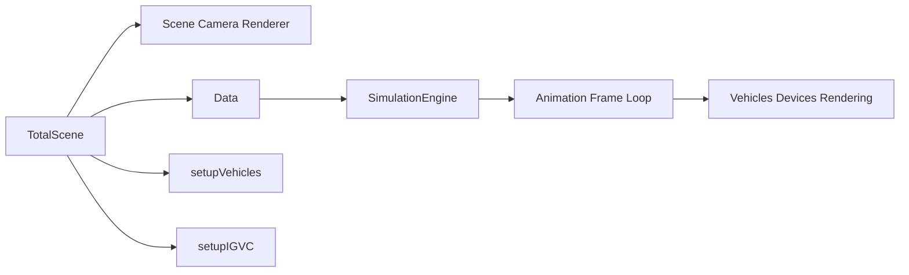

# Simulation

The simulation surface is the Three.js mode rendered by `app/3d/Scene.js`. Press `Escape` in the app and choose the 3D scene from the menu.

## Startup Flow

`TotalScene` creates a `Data` object, assigns the key/mouse managers and Three.js references, configures `SimulationEngine`, sets up vehicles, then calls `setupIGVC`.

Mini scenarios are imported in `app/3d/Scene.js` and can be selected by the `?mini=` query path in code, but that path is currently commented out. The default active scene setup is `setupIGVC`.

## Data Registries

`app/3d/data/Data.js` centralizes shared runtime systems:

- `devices()` for sensors.
- `objects()` for scene objects.
- `vehicles()` for cars and moving agents.
- `city()` for roads and intersections.
- `physics()` for physics integration.
- `simulation()` for the simulation engine.
- `client()` for orchestrator topic integration.

## Simulation Engine

`app/simulation/SimulationEngine.js` handles:

- `play`, `pause`, `stop`, and manual `step`.
- Fixed time step simulation with an accumulator.
- Real-time vs deterministic progression.
- Speed scaling.
- Module toggles for physics, vehicles, sensors, controls, rendering, environment, and scripting.

The bottom simulation menu in `app/3d/overlay/SimulationMenu.js` exposes some of these controls.

## Vehicles And Sensors

Vehicles live under `app/3d/vehicles/`. Sensors live under `app/3d/devices/`. New runtime behavior usually belongs in a vehicle/device class and then gets registered through the appropriate `Data` registry during scene setup.

Current orchestrator control input is handled in `app/3d/Scene.js`: updates on `/ackdrive` are read as `sensor_fusion_msgs/AckermannDrive`, then converted from mph/degrees to m/s/radians before being applied to the main car.

## Scenario Assets

CommonRoad scenarios should be placed under `public/scenarios/` locally. They are loaded through `TrafficScenario.load(...)` with browser paths such as `/scenarios/recorded/NGSIM/Peachtree/USA_Peach-1_1_T-1.xml`.

Downloaded scenario folders should stay out of git.
