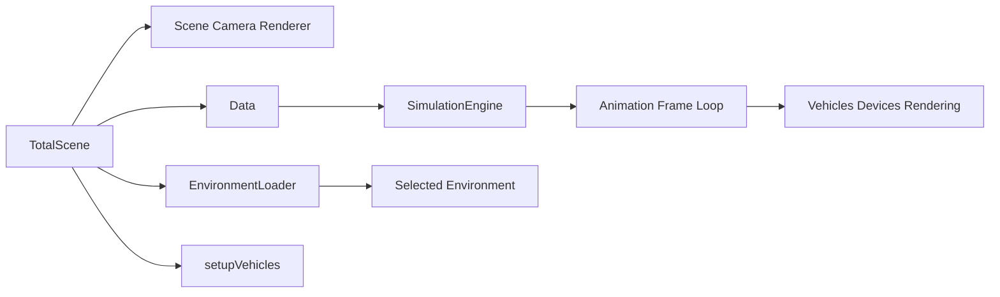

# Simulation

The simulation workspace is the Three.js mode where vehicles, sensors, and physics run. Open it from the app menu (`Escape` → **Simulation**).

For authoring static world content — roads, buildings, props, geographic imports — use the [Environment Editor](environment-editor.md) instead.

## Startup Flow

```mermaid
flowchart LR
  totalScene[TotalScene] --> threeObjects[Scene Camera Renderer]
  totalScene --> dataObject[Data]
  dataObject --> simEngine[SimulationEngine]
  totalScene --> envLoader[EnvironmentLoader]
  envLoader --> selectedEnvironment[Selected Environment]
  totalScene --> setupVehicles[setupVehicles]
  simEngine --> frameLoop[Animation Frame Loop]
  frameLoop --> registries[Vehicles Devices Rendering]
```

`TotalScene` creates a `Data` object, assigns the key/mouse managers and Three.js references, configures `SimulationEngine`, and asks `EnvironmentLoader` to load the shared active environment. The IGVC environment uses `setupIGVC` as its native bootstrap; blank and duplicated environments use their own manifest/template metadata.

The active setup path depends on `mode` (`app/3d/viewState.js`):

- `THREE_D_MODES.SIMULATION` — enables vehicles, sensors, physics, and playback.
- `THREE_D_MODES.ENVIRONMENT` — pauses runtime modules and enables authoring tools, Earth Import, and baking.

Changing between these modes no longer reloads the world: both use the same selected environment and road/intersection meshes. Changing the environment itself performs a clean world reload and resets simulation runtime state.

## Data Registries

`app/3d/data/Data.js` centralizes shared runtime systems:

- `devices()` for sensors.
- `objects()` for scene objects.
- `vehicles()` for cars and moving agents.
- `city()` for roads and intersections.
- `physics()` for physics integration.
- `simulation()` for the simulation engine.
- `client()` for orchestrator topic integration.
- `environment()` for the selected environment container (shared by both 3D modes).
- `earthTilesManager()` / `earthImportController()` for Earth Import (environment mode only).

## Simulation Engine

`app/simulation/SimulationEngine.js` handles:

- `play`, `pause`, `stop`, and manual `step`.
- Fixed time step simulation with an accumulator.
- Real-time vs deterministic progression.
- Speed scaling.
- Module toggles for physics, vehicles, sensors, controls, rendering, environment, and scripting.
- Per-frame `earthTilesManager.update()` while Google 3D Tiles are loaded in environment mode.

The bottom simulation menu in `app/3d/overlay/SimulationMenu.js` exposes some of these controls.

## Vehicles And Sensors

Vehicles live under `app/3d/vehicles/`. Sensors live under `app/3d/devices/`. New runtime behavior usually belongs in a vehicle/device class and then gets registered through the appropriate `Data` registry during scene setup.

### Adding a sensor type

Sensor types are modular definitions rather than conditionals in manifest or editor code. Add a definition with `registerSensorType` in `app/3d/devices/SensorTypeRegistry.js`; the definition owns its label, ID prefix, run and vehicle defaults, normalization, editor fields, output signals, ROS schemas, and display metadata. Then add the Three.js implementations with one `registerSensorRuntime` entry in `app/3d/devices/SensorRuntimeRegistry.js`, providing run-device, vehicle-device, and optional preview factories. The Config page, Vehicle Editor, manifest validation, telemetry signals, runtime construction, and previews consume those registries automatically.

Keep the definition registry platform-neutral because run and vehicle manifests are normalized on both the browser and server. Runtime factories may import Three.js and device classes. Unknown type IDs are preserved for forward compatibility, but validation and runtime creation reject them until both registrations exist.

Managed-run control input uses `/controls/command` (`sensor_fusion_msgs/StampedAckermannDrive`) through `ControlRuntime` at fixed-step boundaries. Unmanaged scene integrations use the same SI stamped endpoint in `app/3d/Scene.js`. There is no live `/ackdrive` handler. Scenario route-follower and script baselines with `controls.authority: reference` close that loop locally; they do not need the topic advertised on the orchestrator.

### Built-in route follower

The scenario `route-follower` controller closes the loop with bicycle Pure Pursuit on the canonical verified route:

- Directed A\* `verification.polyline` algorithm version 5 is the hashed travel-path proof used by the follower, metrics, scripts, and spatial planned-route overlays. The staged search carries incoming edge, direction, and lane across ordered waypoints. A fixed road waypoint can only be satisfied in its selected lane; an opposing lane at the same centerline fraction is a different state and requires a legal detour.
- Traversal records contain physical `fromLaneIndex` / `toLaneIndex` assignments plus lane-center `fromSubnode` / `toSubnode` road-arm boundaries. Intersection connectors are sampled canonically between those subnodes. Same-direction lane changes use eight smoothstep samples and never cross an opposing-flow divider.
- Reverse one-way travel fails with `route.section.illegal-direction`, unreachable fixed lanes with `route.section.lane-unreachable`, exhausted turn-rule paths with `route.section.turn-restricted`, missing connectivity with `route.section.disconnected`, and ambiguous/invalid lane counts with `route.environment.lane-layout-invalid`.
- Version-5 proofs already contain their bounded driving curve, so the follower does not apply the legacy unrestricted whole-polyline fillet. Historical immutable version-3/4 bundles retain their version-scoped compatibility behavior.
- Lookahead scales with speed (minimum ~4 m); commanded speed is limited by previewed path curvature so corners are entered slower than cruise.
- Projection uses a **forward window** around latched progress: overlapping later visits of the same travel path cannot snap progress back to the first pass, and a later rejoin cannot skip a block loop while the vehicle is still on the early visit.
- Authoring maps and scenario diagnostics draw the canonical path. Waypoints snap to physical lane centers while placed or dragged; `anchor.laneMode: "fixed"` preserves that lane during verification, while intersection and explicit centerline anchors remain direction-flexible. Every move invalidates verification.
- The plant only applies these commands when `controls.authority` is `reference`. With `candidate` + `referenceShadow`, the follower still runs for comparison but the vehicle keeps its initial cruise unless an external candidate command arrives — set **Config → Controls → Authority** to **reference** for built-in following.

## Scenario Assets

CommonRoad scenarios should be placed under `public/scenarios/` locally. They are loaded through `TrafficScenario.load(...)` with browser paths such as `/scenarios/recorded/NGSIM/Peachtree/USA_Peach-1_1_T-1.xml`.

Downloaded scenario folders should stay out of git.

## Environment vs Simulation

Both workspaces share `app/3d/Scene.js` and the `Data` object, but they initialize different runtime paths:

| | Simulation | Environment Editor |
|---|------------|-------------------|
| Entry | `Escape` → Simulation | `Escape` → Environment Editor |
| Vehicles/sensors | Enabled (IGVC setup) | Disabled |
| Primary UI | `SimulationChrome` | `EnvironmentEditorChrome` |
| Authoring | Not the focus | `EnvironmentDocument`, map tools, earth import |

See [Environment Editor](environment-editor.md) for editor modes, baking, and the document model.
