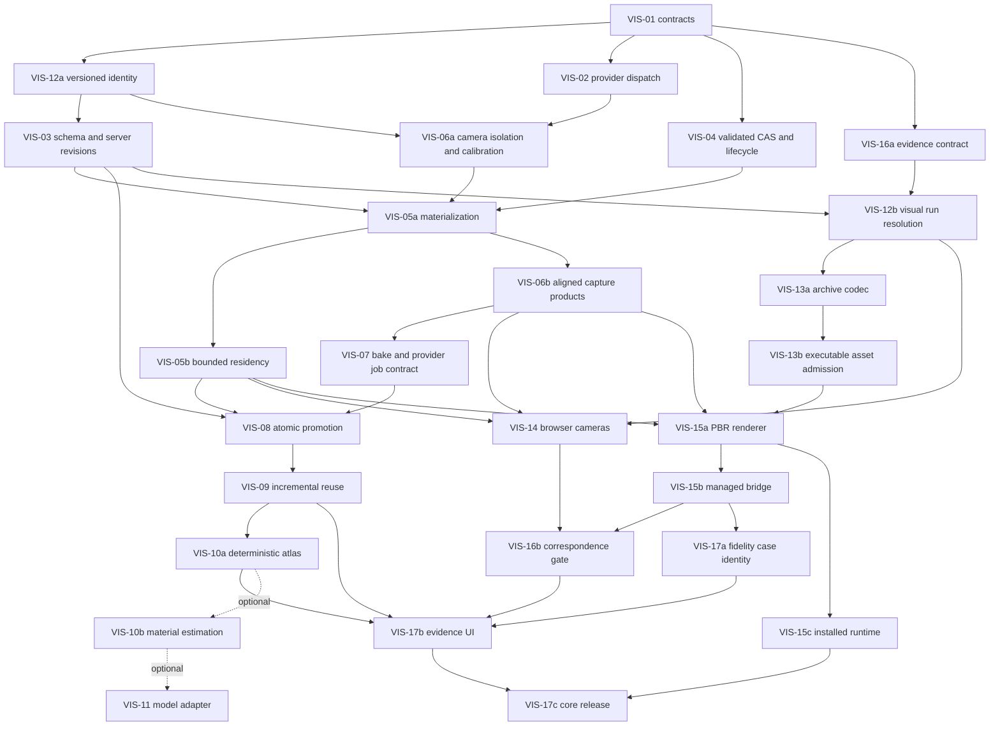

# Visual Layer Implementation Plan

This document is the implementation authority for the `VIS-*` visual-layer
program: contracts, dependency order, independently mergeable PRs, and
acceptance evidence. Requirements below describe work to implement; they do
not assert that the current repository already satisfies them.

This is a separate program from headless PRs 1–12. Their implementation
status and outstanding candidate evidence remain governed by the headless
roadmap. Distributed scheduling, TLS/authentication, native WebGPU, registry
publication, and a second simulation kernel remain outside this program.

Required reading before implementation:

- [Repository guidance](../AGENTS.md)
- [Headless simulation plan](headless-simulation-plan.md)
- [Language-neutral headless contract](../proto/cev_sim/headless/v1/headless.proto)
- [Run manifests and identity](run-manifests.md)
- [Architecture](architecture.md)
- [Environment editor](environment-editor.md)
- [Earth import policy](earth-import.md)

Update this document's progress, acceptance evidence, and decision log when
a VIS, GOOG, or GS PR changes a contract, hash, gate, or milestone status.

## Status and release verdict

- Next milestone: **VIS-14 — browser measured cameras**. VIS-01, VIS-12a,
  VIS-02, VIS-03, VIS-04, VIS-05a, VIS-05b, VIS-06a, VIS-06b, VIS-07,
  VIS-08, VIS-09, VIS-10a, VIS-10b, VIS-11, VIS-12b, VIS-13a, VIS-13b,
  and VIS-16a are implemented.
- Review verdict: **NO-GO for the original ordering and for claiming visual
  runtime support.** The five Blocker findings below require implementation
  and evidence. This revision supplies the corrected handoff; editing the
  plan does not close an implementation finding.
- Core assumption: **Google approval, Google-derived assets, Gaussian
  splatting, and a model service are unavailable.**
- Default implementation/review reasoning level: **Extra High**.
- Last updated: **2026-09-09 — VIS-13b same-host executable asset admission implemented**.
-   VIS-01, VIS-12a, VIS-02, VIS-03, VIS-04, VIS-05a, VIS-05b, VIS-06a,
  VIS-06b, VIS-07, VIS-08, VIS-09, VIS-10a, VIS-10b, VIS-11, VIS-12b,
  VIS-13a, VIS-13b, and VIS-16a acceptance evidence is recorded in the
  progress ledger and decision log. Protocol 1.4 advertises `world-bound@2`.
  Only `canonical-analytic@1` and GPU sensor backend v1 remain runtime-capable.
  `pbr-mesh@1` is resolution-capable for immutable export, integrity-only
  inspection, authoring-store package transfer, and same-host admission, but
  remains unavailable for execution; corrected analytic remains unavailable.
  Configured Unix-socket supervisors advertise `cev-sim.run-package@1`;
  disabled and TCP supervisors do not. Environment
  v3 references may include `accessHash`. Preview materialization is display-only
  and does not enable `pbr-mesh@1`. Advertised
  D06 hardware reports remain required from protected x64/Orin/Thor runners
  before G-SCALE is closed on those stacks. VIS-06b closes F08 and
  G-GBUFFER; VIS-07 closes the G-PROVENANCE config/planning/capture-input
  cases and G-INDEPENDENCE no-model startup. VIS-08 closes G-ATOMIC promotion,
  G-PROVENANCE fixed-input outputs, G-LIFECYCLE promotion, and G-INDEPENDENCE
  bake/reload. VIS-09 closes F13 reuse authorization and G-INCREMENTAL.
  VIS-10a closes captured-radiance G-ATLAS and atlas-path
  G-INCREMENTAL/G-SCALE fusion bounds. VIS-10b closes fixed-proposal
  G-ATLAS/G-PROVENANCE, per-unit proposal invalidation, and intrinsic fusion
  bounds without activating a model or runtime provider. VIS-11 adds the
  opt-in `intrinsic-material-model@1` adapter, `cev-sim.bake-model-output-set@1`,
  and a bounded Python `/bake/v1` job service with a CI-safe fake backend.
  Real inference stays disabled until an operator pins immutable model, revision,
  weights digest, and runtime configuration. The default bake remains
  model-free `captured-appearance@1`.
  VIS-16a closes the schema/tamper/cycle portion of G-CORRESPONDENCE with
  synthetic thresholds. Real correspondence evaluation and managed-runtime
  enforcement remain VIS-16b.
  Later non-capture G-RIGHTS boundaries and remaining F10/F16 work remain open.

The owned/synthetic-asset core must independently deliver author/import →
preview → no-model bake → atomic promotion → reload → portable package →
browser and headless camera capture → validated managed experiment.
Owned GLB/KTX2/PBR input and a declared captured-appearance representation
are sufficient. Learned material estimation, Google ingestion, and splats
may improve appearance, but cannot be prerequisites for this path.

Original VIS numbers remain workstream identifiers. Suffixes below identify
actual PRs; completing one suffix does not complete its entire workstream.
Required entries not marked complete in the progress ledger remain unstarted.

| Workstream | Required core PRs | Optional enrichment |
| --- | --- | --- |
| VIS-01 | Contract, identity, source-policy, and compatibility design | — |
| VIS-02 | Provider dispatch and capability contracts | — |
| VIS-03 | Environment v3 and server revision transactions | — |
| VIS-04 | Validated CAS, quotas, and reference lifecycle | — |
| VIS-05 | VIS-05a materialization; VIS-05b bounded residency | — |
| VIS-06 | VIS-06a camera isolation/calibration; VIS-06b aligned capture products | — |
| VIS-07 | Bake catalog and provider job contract | — |
| VIS-08 | Transactional persistent bake promotion | — |
| VIS-09 | Dependency-based incremental reuse | — |
| VIS-10 | VIS-10a deterministic atlas construction | VIS-10b material estimation/fusion |
| VIS-11 | — | Versioned external model adapter |
| VIS-12 | VIS-12a versioned hash projection; VIS-12b visual run resolution | — |
| VIS-13 | VIS-13a package codec; VIS-13b executable asset admission | — |
| VIS-14 | Browser measured-camera integration | — |
| VIS-15 | VIS-15a renderer; VIS-15b managed execution; VIS-15c installed runtime closure | — |
| VIS-16 | VIS-16a report/admission contract; VIS-16b correspondence evaluation | — |
| VIS-17 | VIS-17a fidelity identity; VIS-17b evidence UI; VIS-17c release evidence | — |

GOOG-01 through GOOG-04 and GS-01 through GS-03 remain unstarted optional
tracks. No dependency edge from either track, VIS-10b, or VIS-11 may enter
the core release gate.

## Audit findings and closure ownership

These findings describe the repository inspected on 2026-09-06. Each row
names the current seam, concrete failure, required correction, and proving
gate. Gate definitions later in this document are normative test
requirements; completed portions are recorded in the acceptance ledger.
VIS-12a supplies F01's implemented identity/compatibility evidence and F06's
version-dispatch evidence. VIS-02 supplies F09's registry/schema portion of
G-CAPABILITY. VIS-03 supplies F05's environment revision CAS and F06's
environment rebind/transaction cases. VIS-04 supplies F11's bounded CAS
validator, F12's storage roots/pins/quotas/no-delete policy, and F15's
ingestion/content/root-pin rights enforcement. Neither F01 nor F06 is fully
closed: selected visual resources still require VIS-12b, and bake-promotion
races are closed by VIS-08 and the VIS-16a corrective maintenance. F09 product completeness remains later VIS work. F11
loader cases are closed by corrected VIS-04/VIS-05a validation; hostile archive
verification for `cev-sim.run-package@1` is closed by VIS-13a. F12 execution-root wiring remains
VIS-13b/VIS-15b. F15 import/bake/package/worker denial remains later VIS/GOOG
work. The other runtime findings retain their owning gates.

| ID / severity | Current behavior and failure mode | Required PR correction and proof |
| --- | --- | --- |
| F01 **Blocker** | [SimulationHashes.js](../app/simulation/kernel/SimulationHashes.js), `projectWorldEnvironmentIdentity`, replaces resolved environment objects but leaves authored/nested scenario environment locks. [StorageService.js](../server/storage/StorageService.js), `resolveRunManifest`, inserts full environment hashes for scenario-backed runs. Refreshing a visual-only lock can change semantic/episode identity; retaining it can reject resolution. `defaultEpisodeIdentity` also hashes the scenario into the reward profile. [RunManifest.js](../app/simulation/RunManifest.js), `computeResolvedRunHash`, strips metadata and rounds numbers; it is not an exact byte digest. | Move versioned identity design to VIS-01 and implementation to early VIS-12a; cover nested locks and profile config hashes. G-HASH proves the full resolution/episode matrix; G-MIGRATION verifies legacy bytes and JS/Python vectors. |
| F02 **Blocker** | [EnvironmentLoader.js](../app/3d/environment/EnvironmentLoader.js) rebuilds the shared scene and restores editor/sky state. [ManifestCamera.js](../app/3d/devices/ManifestCamera.js) passes that scene to [CameraRenderProducts.js](../app/3d/perception/CameraRenderProducts.js), which renders current materials/visibility. Loading VIS-05 visuals there can alter measured analytic RGB before VIS-12 has hashed them. | Put VIS-06a isolation before VIS-05a and enable measured PBR only in VIS-14. G-ISOLATION changes preview assets, sky, visibility, and bake state during a resolved run and proves its captures stay immutable. |
| F03 **Blocker** | [headless.proto](../proto/cev_sim/headless/v1/headless.proto) transports bundle JSON, not asset bytes. [Cli.js](../server/headless/Cli.js) reads JSON; [bundle.py](../python/src/cev_sim/bundle.py) does the same. [HeadlessSupervisor.js](../server/headless/HeadlessSupervisor.js) initializes workers from bundles. An archive exporter alone cannot execute a portable visual run. [build-headless-dist.mjs](../scripts/build-headless-dist.mjs) follows JavaScript imports, not arbitrary renderer pages or decoder assets. | Split VIS-13 into strict packaging and asset admission, and VIS-15c into installed runtime closure. G-PACKAGE and G-INSTALLED execute a package with no checkout, authoring server, or network. |
| F04 **Blocker** | [ManagedHeadlessSession.js](../server/headless/ManagedHeadlessSession.js) rejects cameras/GPU backends, creates a runtime without a renderer, and advances synchronously. The managed branch in [HeadlessSupervisor.js](../server/headless/HeadlessSupervisor.js) lacks the renderer handler used by normal workers. A new renderer alone cannot run VIS-17 experiments. | Split VIS-15b from VIS-15a and make it a dependency of managed correspondence/fidelity gates. G-MANAGED exercises queued cameras, restart, cancellation, and infrastructure errors. |
| F05 **Blocker** | VIS-03 added server compare-and-swap. VIS-16a corrective maintenance added edit-generation acknowledgements, suspension across every save entry point, strict joined-flush failures, explicit-null application, and stale response/receipt rejection. VIS-08 promotion recovery now shares the environment lane, checks exact target revision and complete manifest identity, durably orders journal/root/receipt changes, binds retries, reconciles cancel/commit races, and rejects every failed legacy upload before completion telemetry. | Closed by corrected VIS-03/VIS-08 G-ATOMIC and persistence race regressions. |
| F06 **High** | [WorldDescription.js](../app/simulation/world/WorldDescription.js) hashes `environmentId`; [StorageService.js](../server/storage/StorageService.js) duplication, ID changes, and conflicting imports change IDs. Retaining a visual descriptor unchanged makes `sourceWorldHash` stale. [RunBundle.js](../server/headless/RunBundle.js) accepts the current resolved manifest version, not every historical authored version. A global GPU identity bump can invalidate old analytic selections. | Correct VIS-03 rebind behavior and VIS-12a migration/version dispatch; preserve old provider identities. G-MIGRATION distinguishes rename, duplicate, import, integrity verification, and executable support. |
| F07 **High** | [SensorTypeRegistry.js](../app/3d/devices/SensorTypeRegistry.js) accepts unequal/off-center intrinsics; [ManifestCamera.js](../app/3d/devices/ManifestCamera.js) and [PooledGpuRenderer.js](../server/headless/PooledGpuRenderer.js) construct FOV/aspect projections. [BakeView.js](../app/3d/environment/visualization/BakeView.js) uses a different pixel-center convention. Published calibration can disagree with pixels even when both renderers agree. | Put shared versioned K-to-projection math in VIS-06a. G-CALIBRATION uses independently calculated points, unequal focal lengths, off-center principal points, and rotated mounts. |
| F08 **High** | [BakeView.js](../app/3d/environment/visualization/BakeView.js) hides non-target mask geometry, forces depth visibility, and boosts beauty road materials; these are not aligned samples. [CameraRenderProducts.js](../app/3d/perception/CameraRenderProducts.js) changes materials on scene meshes rather than selecting independent truth twins. Fusion or correspondence can accept occluded/misregistered samples. | Split VIS-06b from legacy calibration/isolation; define separate visual G-buffer and analytic oracle pass families. G-GBUFFER proves occlusion, validity, alpha policy, encoding, and exception-safe restoration. |
| F09 **High** | [HeadlessGpuSensorManager.js](../app/simulation/sensors/HeadlessGpuSensorManager.js) shares `renderScene || lidarGeometry`; its camera implementation produces RGB/CameraInfo rather than every authored oracle product. [SensorTypeRegistry.js](../app/3d/devices/SensorTypeRegistry.js), `normalizeRunSensor`, has a fixed authored field set. [PerceptionTruthIndex.js](../app/autonomy/PerceptionTruthIndex.js) and [EnvironmentRegistry.js](../app/3d/editor/EnvironmentRegistry.js) discover truth from scene metadata. PBR geometry or imported GLTF extras can cross the truth boundary, while unsupported products can disappear. | VIS-02 added provider/profile schemas and explicit validation; remaining product-completeness and selected-visual resolution belong to later VIS/VIS-12b. Separate truth resources and sanitize imported metadata in VIS-05a/VIS-14/VIS-15a. G-CAPABILITY and G-ORACLE prove product completeness and observation isolation. |
| F10 **High** | VIS-07 serializes bake planning inputs and canonicalizes planner order. VIS-08 emits deterministic PNG/GLB captured-radiance artifacts with explicit unlit semantics. VIS-10a emits per-chunk atlas pages with hashed construction policy. VIS-10b adds fixed supplied/inferred intrinsic proposals, per-channel fusion, PBR packing, and durable evidence. VIS-11 pins fake/operator-injected backends, digest-verifies `/bake/v1` transfers, and records model provenance. Remaining F10 work is browser `bakeUpload.js` encoding on the legacy path. | Combine the provider job contract with VIS-07; split deterministic atlas construction (VIS-10a) from optional material estimation (VIS-10b/VIS-11). G-PROVENANCE and G-ATLAS separate fixed-input determinism from GPU/model nondeterminism and test material semantics. |
| F11 **High** | Corrected VIS-04/VIS-05a now require current versioned validation before content or materialization; iteratively bound glTF preflight; apply one extension allowlist to declarations and objects; inspect embedded/digest-backed images and decoded memory before loaders; authorize only loader-created object URLs; sanitize metadata; and propagate decoder failures. VIS-13a adds frozen USTAR verification before any package staging or CAS publication. | GLB/glTF loader boundary closed by G-SECURITY. Hostile USTAR validation is a VIS-13a prerequisite before extraction or package-loader access; CLI/supervisor admission remains VIS-13b. |
| F12 **High** | [StorageService.js](../server/storage/StorageService.js) persists queued experiment bundle sidecars under `headless-run-bundles`; environment/package references are not the whole live set. Worker resets, queued jobs, replay, bake staging, and validation reports also need blobs. Environment-only reference checks allow deletion of required assets or indefinite growth. | Put pins, durable roots, quotas, staging recovery, and a no-unsafe-delete policy in VIS-04; wire execution roots in VIS-13b/VIS-15b. G-LIFECYCLE races deletion against queueing, promotion, restart, reset, and cancellation. |
| F13 **High** | VIS-09 added per-unit dependency keys, typed chunk mutations, and conservative global invalidation. VIS-10a fuses one chunk/page at a time under ledger reservations and rebuilds only dirty atlas chunks. Remaining F13/G-SCALE risk is advertised hardware city-scale reports, not reuse authorization. | VIS-09 G-INCREMENTAL compares complete vs incremental descriptor/access/asset identity. Residency never authorizes reuse. |
| F14 **High** | [ProjectedBuildingTextureManager.js](../app/3d/environment/visualization/ProjectedBuildingTextureManager.js) creates per-projection textures/meshes with culling disabled. [BakeCaptureMemory.js](../app/3d/environment/visualization/BakeCaptureMemory.js) bounds a capture buffer, not aggregate residency. [BakeHarness.js](../app/3d/environment/visualization/BakeHarness.js) performs repeated scene searches. [PooledGpuRenderer.js](../server/headless/PooledGpuRenderer.js) accounts JSON/output bytes and transfers whole scene data in its analytic path. City-scale memory and work can grow with all views/geometry per frame. | Add VIS-05b before camera delivery and require resident asset handles/dynamic deltas in VIS-15a. G-SCALE imposes owned workload, CPU/GPU memory, latency, throughput, and cancellation budgets. |
| F15 **High** | [EarthTilesManager.js](../app/3d/earth/EarthTilesManager.js) uses preview exclusion tags, but those do not enforce lineage after import/bake/package. Putting all denial policy in an optional agreement PR leaves the core without fail-closed enforcement when approval never arrives. | Move generic source-operation denial into VIS-01/VIS-04/VIS-06/VIS-13. GOOG-01 only grants reviewed exceptions. G-RIGHTS tests every boundary using synthetic restricted-source fixtures. |
| F16 **High** | VIS-05a/VIS-07/VIS-08 made the default editor `b` path a self-contained no-model job: no model-server health check, no Spark import, and reload through `VisualLayerMaterializer`. Leftover F16 work is explicit `legacyBake=1` / `start()` health-checks and optional splat construction. | Lazy-load GS, make new persistent no-model jobs self-contained in VIS-05a/VIS-07/VIS-08, and remove VIS-11 → VIS-14. G-INDEPENDENCE runs the complete core with optional services/modules unavailable. |
| F17 **High** | [ExperimentSuite.js](../app/experiments/ExperimentSuite.js), `experimentCaseKey`, lacks fidelity identity; [ExperimentResult.js](../app/experiments/ExperimentResult.js) uses those keys. Proposed reports omit calibration/sample coverage/policy versions. [headless-hardware.yml](../.github/workflows/headless-hardware.yml) is main-only and permits Jetson GPU-unavailable paths; [verify-headless-dist.mjs](../scripts/verify-headless-dist.mjs) and current soak are not PBR release evidence. Cases can collapse, reports become stale, and skipped tests can look like support. | Split VIS-16 into early report contracts and evaluators, and VIS-17 into identity, UI, and release evidence. G-CORRESPONDENCE, G-FIDELITY, and G-RELEASE bind exact inputs and require executed PBR tests on every advertised platform. |

## Normative contracts

### Truth, appearance, and optionality

JavaScript remains the authoritative simulator. Shared kernel/contract
modules must import without Three.js, React, DOM, canvas, browser globals,
RAF, or WebGL. Fixed-step ordering, integer nanosecond time, reset semantics,
controls, scripts, scenarios, assertions, and measured state contracts stay
shared across browser and headless.

[EnvironmentDocument.js](../app/3d/editor/document/EnvironmentDocument.js)
remains metric authoring data. Top-level environment references select
appearance resources and evidence. Visual meshes never enter collision,
routes, CPU/GPU LiDAR truth, object registries, or oracle geometry.

`worldHash` preserves the current
[WorldDescription.js](../app/simulation/world/WorldDescription.js) contract.
It already includes `environmentId`, template/style and domain-source
identity, plus selected texture/tag/mesh metadata. It is not retrospectively
redefined as a geometry-only hash. New visual references, new visual
materials, and evidence must be excluded; removing legacy fields would be a
separate explicit metric-world migration.

The base appearance provider is `pbr-mesh@1`, with a documented restricted
GLB/KTX2 material profile and explicit unlit support for captured radiance.
Google-derived meshes and `hybrid-3dgs@1` are separate providers. They are
never selected by inference, fallback, or filename. The no-model path must
not initialize Spark, fetch Google data, probe/clear a model server, or require
Python baking dependencies.

### Five identities and exact byte integrity

The contracts use the following distinct identities. `renderSceneHash`
means the persisted `renderScene.hash`; `visualLayerHash` means the hash
of the reusable layer description.

| Identity | Included content and intended use | Explicit exclusions or limits |
| --- | --- | --- |
| `worldHash` | Existing normalized world description, including its legacy identifier/style fields; authority for metric truth | New visual/evidence references; no redefinition of historical world bytes |
| `visualLayerHash` | Versioned canonical descriptor: `sourceWorldHash`, provider-compatible chunks, exact asset digests, transforms, bindings, material modes/parameters, and declared baked appearance dependencies | Job timestamps, policy text, model execution logs, quality reports; source/input history that cannot affect rendering |
| `renderSceneHash` | Selected provider ID/version, world/truth binding, selected visual layer/resources, and every static input or versioned rule affecting this provider's pixels | Unselected preview assets, mutable editor scene state, evidence-only metadata |
| `resolvedHash` | Versioned normalized resolved-run content, including selected resources and explicit evidence digests when attached | Existing hashing strips named metadata and rounds finite numbers to six decimals; it does not authenticate every original JSON byte |
| `simulationSemanticHash` | Versioned projection of inputs affecting simulated transitions or requested measured products, including semantic backend selections, calibration and conditional render resources | Full authoring locks after successful validation, evidence, logging/artifact policy, resource budgets, wall pacing, preview-only state |
| `episodeHash` | Semantic hash plus protocol/identity version, reset seed, action repeat, max episode steps, observation/reward profile ID/version/config, and semantic backend selections | Package location, asset admission handles, worker identity, logging, wall time, resource limits |

The table includes the supporting visual-layer identity in addition to the
five run/world identities under audit. It must not be substituted for
`renderSceneHash`: lighting, actors, camera product policy, or renderer rules
can change pixels without changing reusable static assets.

For `renderSceneHash`, enumerate lights, shadows, background/sky/IBL,
environment-map digests, exposure, tone mapping, color spaces, alpha mode,
samplers/filtering, transparency ordering, selected LOD policy, decoder/
transcoder policy, dynamic-actor appearance assets, and any provider defaults.
A fixed implementation default belongs to a versioned provider/config;
mutable defaults are not an identity contract. Dynamic state at a sample is
derived from the episode and is bound separately in capture/evidence records.

Physical GPU/driver/runtime details are replay evidence and capability
constraints. A change in a declared semantic backend/config changes episode
identity; scheduling the same backend on another supported host does not.
If a transcoder format or renderer option materially changes the declared
rendering algorithm, select a versioned semantic config rather than hiding
it as an operational detail.

Add separate SHA-256 digests over exact bundle bytes, each asset, the
canonical package manifest, and the complete archive. Call the exact bundle
digest `bundleBytesHash`. The package manifest records the bundle-byte and
asset digests; its own digest and the enclosing archive digest are external
to that manifest to avoid self-reference. A normalized resolved hash cannot
replace any of these byte-integrity checks.

New numeric contracts must either render their canonicalized numbers or
hash their exact supported representation. Do not round a transform for
hashing and render an unrounded value. Define finite values, negative zero,
integer widths, ordering, duplicate keys, Unicode/path normalization,
unknown fields, and unsupported enum/version handling explicitly. Keep
historical canonicalization functions available for historical bundles.

### Conditional resolution and identity migration

VIS-01 must freeze a version-dispatch design before VIS-12a is implemented.
Use an explicit new semantic identity profile for corrected resolutions.
Do not globally change `SIMULATION_HASH_VERSION` or mutate a historical
bundle during verification. Domain/version changes are intentional identity
changes and need independent golden vectors.

Resolution must first check full authoring locks, including manifest
environment locks, scenario environment locks, scenario definition locks,
script locks, and embedded dependencies. A stale full-document lock still
fails; the resolver does not silently weaken the author's integrity check.
After a valid snapshot is resolved, the new semantic projection must
substitute metric-world identity at every authoring-only environment
reference, including nested scenario definitions/dependency hashes.

Projection must retain actual scenario behavior, scripts, routes, reward
parameters, controls, sensors, and every other semantic dependency. It must
also correct equivalent leakage through default observation/reward profile
config hashes. Stripping a few top-level keys or every key named `hash`
does not meet this contract.

Only enabled cameras selecting a visual provider resolve its assets.
State-only, LiDAR-only, disabled visual cameras, and analytic cameras must
not acquire PBR resources merely because the environment has a visual layer.
The initial supported selection profile uses one render provider per run:
all enabled cameras must agree. Mixed-provider rigs fail explicitly.
Supporting multiple providers later requires a versioned per-camera scene
map and cannot reuse this single-resource contract silently.

The following matrix applies within the new identity profile, after any
required authoring lock is explicitly refreshed. It is not a claim that
legacy hash values can be migrated without change.

| Change | World | Render scene | Resolved | Simulation semantic / episode |
| --- | --- | --- | --- | --- |
| New preview-only visual/evidence reference; state-only or LiDAR-only run | Same | Absent | May change with normalized authoring snapshot | Same |
| Same edit with an enabled analytic camera | Same | Same analytic resource | May change | Same |
| Edit a selected PBR asset, transform, material, lighting rule, or provider | Same | Changes | Changes | Changes |
| Edit only an unselected/disabled camera's new visual selection | Same | Same or absent | Changes if persisted | Same for the new visual selection fields |
| Attach different provenance/correspondence/policy evidence digests, identical selected pixels | Same | Same | Changes | Same |
| Change a stripped timestamp/revision field only | Same | Same | May remain the same by legacy normalization | Same; exact byte digest changes |
| Change resource/logging/wall-pacing settings only | Same | Same | Changes when included in resolved content | Same |
| Change enabled calibration, product policy, semantic backend/config, scenario behavior, or seed | Same unless metric inputs change | Changes only if part of the render resource | Changes when part of resolved inputs | Changes in the appropriate semantic/profile/episode input |
| Change metric geometry or environment ID | Changes | Re-resolved/rebound | Changes | Changes |
| Change execution host/GPU evidence only, same supported backend/config | Same | Same | Changes only if that evidence is attached | Same; replay scope is recorded separately |
| Keep a stale full authoring lock after a visual edit | No successful resolution | No successful resolution | No new bundle | Explicit resolution failure |

Include direct runs and scenario-backed runs, locked and unlocked inputs,
nested dependencies, browser default episode profiles, CLI episodes, and
Python episodes in the matrix. Evidence must be projected out explicitly;
the existing generic metadata stripper does not know new evidence fields.

### Backward compatibility and environment transactions

Treat four operations separately: byte/hash verification, authoring import,
resolution, and executable runtime support. Importing an old authored
manifest through normalization is not proof that an old immutable bundle
can execute. VIS-12a must publish a support table per bundle/resolved/hash/
backend version. Preserve every currently executable analytic bundle.
Older unsupported bundles may remain import-and-re-resolve only, with an
explicit error and a new identity; do not claim historical execution without
a corresponding verifier/runtime.

Retain run-bundle v1 as the immutable JSON envelope and preserve protobuf
field numbers. New operational asset admission fields, if required, are
additive v1 changes with capability negotiation and reproducibly generated
bindings. Unknown required versions, providers, extensions, products, or
asset contracts fail closed. New clients must receive an explicit
unsupported-capability result from old supervisors.

Environment v2 loads without a visual reference. V3 adds top-level visual
and evidence references plus a server-owned revision protocol. A visual
reference is an immutable descriptor digest, not a mutable asset URL.
Schema migration must preserve metric authoring behavior and must not let
an old client silently erase v3 fields or bypass concurrency protection.

A display-name-only rename can retain the visual binding if the recomputed
world hash is unchanged. Duplication, environment-ID changes, and
conflict-renamed imports recompute the world, create a new descriptor bound
to that world, and share only compatible binary blobs. Do not rewrite
original resources. Revalidate entity IDs/transforms; invalidate
correspondence evidence even when all binary assets are reusable.

Replace client wall-clock ordering as the concurrency authority with an
expected server revision. A stale full write or visual promotion returns a
conflict, never a success containing silently retained old data. Define the
legacy-write transition so existing clients either preserve unknown fields
under a safe server operation or receive a migration conflict; absence of an
expected revision cannot remain a v3 bypass.

### Camera selection, scene isolation, and product routing

Provider selection must survive sensor authoring, normalization, validation,
resolution, export/import, and worker capability checks. Extend the fixed
field schema in
[SensorTypeRegistry.js](../app/3d/devices/SensorTypeRegistry.js) explicitly;
do not rely on unknown fields surviving normalization. The selection
contract includes provider ID/version and a supported camera-product
profile. A run cannot request a product its chosen backend cannot deliver.

Use separate scene/resource ownership for:

1. Mutable editor/human preview.
2. Immutable resolved visual appearance for measured RGB.
3. Immutable analytic truth geometry for oracle products and LiDAR.
4. Frozen bake input snapshots with an explicit pass/visibility policy.

Shared helpers may share immutable geometry and cached bytes, but a preview
material, visibility toggle, sky setting, bake overlay, or imported object
must not mutate a measured scene. Freeze provider defaults and static
appearance when preparing the resolved run. Advance dynamic actors from the
same simulation step and transform conventions in both runtimes.

Existing `canonical-analytic@1` output and backend identity stay on a legacy
path. The current browser live-scene renderer and headless analytic raster
path do not establish historical pixel parity. Do not redefine that provider
to promise parity retrospectively or expose newly loaded PBR meshes through
it. Characterize the legacy path; introduce corrected behavior under an
explicit new provider/capture identity.

The initial new-provider capability matrix is:

| Product | Source | Core support rule |
| --- | --- | --- |
| Measured RGB | Selected resolved appearance provider | Required for PBR camera support; no preview scene fallback |
| CameraInfo | The exact calibration used for capture | Required when requested; independent of renderer FOV defaults |
| Oracle depth/semantic/instance | Separate analytic twins | Implement and advertise per backend, or reject the request before run admission |
| Bake visual depth/normal/material/object/world-position/confidence | The same visible appearance samples as bake beauty | Internal bake/evaluation products; never implicitly policy observations |
| Measured LiDAR and optional labeled LiDAR | Dedicated analytic LiDAR geometry contract | Never route through a PBR render scene |
| State sensors/task signals | Existing measured state and task contracts | Preserve the current observation schema and task-signal semantics |

Preserve the measured boundary in
[MeasuredPerceptionObservation.js](../app/simulation/headless/MeasuredPerceptionObservation.js).
Measured policy observations and measured ROS topics must not acquire
oracle tensors, analytic poses, IDs, depth, confidence, bake labels, or
provenance metadata. Preserve the intentional existing task-signal contract;
this work does not remove legitimate task/reward signals. Explicit
diagnostic/oracle products remain separately named and capability gated.

GLTF `extras`/`userData` cannot register truth. Sanitize reserved keys such
as entity/building/perception source IDs, then construct validated
visual-to-truth bindings from the layer descriptor. Audit
[BuildingGenerator.js](../app/3d/city/BuildingGenerator.js),
[ObjectDatabase.js](../app/3d/data/ObjectDatabase.js),
[EnvironmentRegistry.js](../app/3d/editor/EnvironmentRegistry.js), and
[PerceptionTruthIndex.js](../app/autonomy/PerceptionTruthIndex.js) for
registration and traversal of descendants. A tag on only the imported root
is insufficient if a descendant is independently scanned.

Preparation is asynchronous and has a complete asset/calibration readiness
barrier. Missing, stale, invalid, unauthorized, or unsupported assets fail
run preparation; a diagnostic preview may show a degraded state. Capture
awaits scheduled products for the same integer simulation timestamp.
Backpressure must not silently drop a due frame or publish half a sync group.
Context loss, OOM, readback failure, and asset loss are infrastructure errors,
never fabricated Gymnasium truncations or successful partial observations.

### Calibration and G-buffer representation

VIS-06a must define a versioned calibration contract used by bake capture,
browser measured cameras, and headless PBR:

- World coordinates: existing right-handed meters, +Y up, +X forward and
  heading convention. Define mount-to-optical conversion, camera forward,
  rotation order, and dynamic pose sampling; use existing transform helpers
  where their contract applies.
- Image coordinates: origin, row orientation, integer pixel centers,
  width/height, off-center `cx/cy`, unequal `fx/fy`, near/far clipping, and
  K-to-projection equations. Render the authored intrinsics; do not publish
  K while rendering only `verticalFovDeg`.
- Distortion: supported Brown–Conrady coefficient shape/order, forward or
  inverse mapping, border behavior, resampling, and whether each pass is
  distorted. Reject unsupported coefficients/models rather than truncating
  them silently.
- Depth: axial optical depth versus ray range, units, clipping, invalid/no-hit
  encoding and validity mask. Specify RGB transfer function, linear versus
  sRGB buffers, alpha semantics, channel layout, element type, byte order,
  normal frame/sign, material/object ID encoding, and world-position frame.
- Precision/tolerances: declared formats and deterministic numeric rules;
  no non-finite values in canonical metadata. Runtime buffer sentinels must
  be unambiguous and paired with validity.

Beauty and visual G-buffers must describe the same visibility, geometry,
calibration, alpha-test policy, and sample time. A non-target occluder remains
in the depth test for a target mask; it must not become transparent merely
because its label is not requested. Do not force hidden geometry visible for
one pass or apply untracked road-lighting boosts to another.

Analytic oracle buffers are a separate pass family. Their calibration/time
must agree with visual capture, but their geometry can differ; that
difference is precisely what correspondence evaluates. Do not replace
visual materials on visual meshes and call the result analytic truth.
Unknown object/material IDs and unsupported transparent/volumetric behavior
must be explicit. Initial material-profile restrictions must be validated
before capture.

Use immutable pass scenes or exception-safe scoped overrides. Restore
visibility, renderer state, materials, tone mapping, targets, and camera
state after success, cancellation, or render/readback failure. Legacy bake
vectors characterize the old path; known visibility/calibration errors must
not be frozen into the new version merely to keep those vectors unchanged.

### Asset profile, CAS security, and source permissions

VIS-01 defines `cev-sim.visual-layer@1` and asset references containing
`sha256`, `mediaType`, `sizeBytes`, and `role`. VIS-04 stores immutable
bytes under `server/data/visual-assets/sha256/`. Environment/run JSON
contains references, never embedded city-scale binary data.

Before loading an asset, validate both its bytes and its complete resource
graph. Adopt a bounded static-mesh GLB/glTF/KTX2 profile with an explicit
extension/material allowlist. External buffers, images, environment maps,
and visible actor assets must resolve through the verified digest graph.
Unrestricted HTTP, file, relative filesystem, and remote decoder fetches
are forbidden. Embedded data is accepted only within declared decoded-size
budgets. Reject unknown required extensions even if the underlying loader
would only warn. Pin and package trusted decoder/transcoder code.

Validate actual media type, byte length, declared and observed digest,
buffer/accessor bounds, finite transforms, scene-graph depth/node counts,
triangle counts, image dimensions, mip counts, compressed expansion, and
decoded texture/buffer budgets before expensive allocation. Set aggregate
per-job and per-environment decode/memory/time limits as well as per-file
limits. Bound concurrent uploads, decoding, queued reads, and open handles.
The renderer must have no uncontrolled asset-network path.

CAS writes stream to bounded temporary files, hash while writing, and publish
atomically only after validation. Published objects are immutable regular
files; prevent symlink traversal and check/use races in storage roots.
Specify crash durability and directory/record commit order. Range reads must
respect a validated object's size and consistent content. Disk exhaustion,
short writes, digest conflicts, interrupted uploads, and corrupt existing
objects fail explicitly; never trust a filename as proof of its content.

Content deduplication is an optimization, not authorization. Source lineage
and operation policy are attached to uses/descriptors and survive dedup,
repackaging, and derivation. A blob shared with an owned asset does not erase
the restrictions on another derived use.

The core defines fail-closed permissions for display, transient cache,
persistent cache, derivatives, machine interpretation, ML, worker access,
redistribution/export, retention, and attribution. Enforce them at source
import, bake input admission, promotion, package export/import, supervisor
admission, and worker start/recovery. Agreement text, source attestations,
attribution, policy versions, and report digests are evidence; if the selected
pixel content is unchanged they do not change simulation identity.

Authorization is evaluated at execution time as well as export time.
Expired or revoked permissions can make a historical bundle non-executable;
they do not rewrite its hashes or authorize a replacement source. Unknown
required rights/provenance fail closed. Rights records must come from the
configured trusted authoring/operator process, not an arbitrary `owned:
true` field inside an imported asset. Hashes authenticate recorded bytes,
not legal ownership or the actual origin of anonymously relabeled content.
Legal/source ownership and evidence trust remain human responsibilities.

The default Google-derived policy denies sensor use, baking, persistent
offline assets, ML, worker use, and export unless a reviewed grant explicitly
allows the operation. Existing live human preview is governed separately by
applicable terms, attribution, and cache rules. The absence of GOOG-01 must
leave these denials active. A non-exportable label is not export enforcement.

### Reference lifecycle, garbage collection, and quotas

Maintain durable roots for environments, promoted layer descriptors,
retained package imports, queued immutable experiment bundle sidecars,
retained results/replay/baselines, retained bake inputs/output caches, and
correspondence reports that require source assets. Maintain explicit pins
for active workers, all batch reset candidates, decoders, validation jobs,
in-flight bake jobs, promotion transactions, and exports.

Define acquisition/release and recovery for success, cancellation, timeout,
worker/renderer death, supervisor restart, abandoned staging, and result
retention expiry. Queue a run only after its immutable closure is pinned.
Release an active pin only when no worker/readback can still access it.
Promotions acquire new roots before releasing old ones. External exported
archives own their copies; do not assume the store can track every copy
forever.

Automatic garbage collection may be deferred. Until all roots and races are
implemented and tested, deletion of published assets is disabled rather
than guarded only by environment references. Staging cleanup and enforced
storage quotas are mandatory from VIS-04. Later collection uses a reviewed
generation/snapshot protocol, a grace period, active pins, and post-restart
reconciliation; it never races an uncommitted promotion or admitted run.

Limit total stored bytes, per-request bytes, temporary bytes, retained job
outputs, and concurrent work. Policy-driven retention/deletion must account
for legal constraints on preservation versus replay; an owner must resolve
that conflict explicitly. A digest-keyed immutable store is not permission
to retain restricted material indefinitely.

### Portable packages and executable admission

`cev-sim.run-package@1` contains exact `bundle.json` bytes, a canonical
pack manifest, and sorted digest-named asset entries. Use a deterministic
archive profile with fixed entry order, timestamps, permissions, and encoder
settings. VIS-01 fixes the container/profile and numeric limits before the
codec PR. Include every transitive asset required by the resolved scene.
Reject missing, extra/unlisted, duplicate, or conflicting entries.

Byte reproducibility is defined for the same exact bundle bytes and asset
bytes. Existing exporters insert `exportedAt`; two independently exported
bundles with the same `resolvedHash` need not have identical bytes. Preserve
received legacy bundle bytes. A new deterministic export profile may omit
volatile export fields when its versioned envelope contract permits it; do
not silently rewrite an imported bundle to achieve reproducibility.

Archive verification rejects absolute/parent paths, encoded traversal,
noncanonical separators, case/normalization collisions, symlinks, hardlinks,
device/sparse entries, duplicate names, unsupported compression, unbounded
expansion, excessive entry counts, and malformed/trailing content outside
the specified profile. Stream verification/extraction under byte, time, and
inode quotas. Never extract directly into a trusted CAS namespace.

The same-host operational flow is:

1. CLI import, or the Python local package helper, stages the package in the
   configured supervisor-owned inbox using a temporary name and atomic
   publication. A caller-supplied arbitrary filesystem path is not a worker
   asset capability.
2. Supervisor admission independently verifies the package, its source
   permissions, exact bundle bytes, full asset closure, supported provider,
   and resource limits. It registers a digest-addressed read-only asset
   view, with an opaque admission handle and durable/pinned lifecycle.
3. The operational request binds that admission to the exact bundle-byte
   digest. The immutable JSON bundle remains unchanged; asset roots, inbox
   paths, handles, and scheduling details do not enter episode identity.
4. Worker and renderer receive only scoped, read-only access to admitted
   digests. Missing/stale admissions fail before stepping. Batch resets,
   queued jobs, renderer restarts, and replay retain the required pins.
5. Cancellation, failure, expiry, and supervisor restart release or reconcile
   temporary state without deleting retained immutable run dependencies.

Freeze the additive wire/API representation in VIS-01 and implement both
ends in VIS-13b. `RunBundle.canonical_json` remains canonical UTF-8 JSON;
it is never an archive transport. Remote asset distribution is out of scope.
Python must expose local staging/admission plus ordinary bundle use, with
clear errors for unavailable package support on a supervisor.

CLI work belongs in [Cli.js](../server/headless/Cli.js),
[SupervisorRunner.js](../server/headless/SupervisorRunner.js), and
[SupervisorValidation.js](../server/headless/SupervisorValidation.js);
[bin/cev-sim.js](../bin/cev-sim.js) is a launcher. Define inspect, validate,
run, and replay behavior for package inputs and JSON-only inputs. Preserve
current JSON-only commands and explicitly address replay's current
configuration restriction instead of assuming it can reach the supervisor.

Installed delivery must include the renderer page/runtime, shared helpers,
decoder JavaScript/WASM, worker files, and license notices. Update
[build-headless-dist.mjs](../scripts/build-headless-dist.mjs) and
[verify-headless-dist.mjs](../scripts/verify-headless-dist.mjs) explicitly;
the current import scan, dependency allowlist, and 10 MiB package ceiling do
not establish that closure. Preserve the small runtime package boundary:
scene/model data travels in run packages or separately verified runtime
artifacts, not a bundled Next/React authoring application.

### Bake snapshots, provenance, and atomic promotion

A bake starts from an immutable source snapshot: world, current visual input
if used, geometry/material/lighting state, all asset digests, ordered views,
calibration, sample times/dynamic actor policy, pass policy, seed derivation,
chunk coverage, algorithm versions, and requested output roles. Freeze the
source server revision and a unique bake generation for concurrency, while
keeping wall times and job IDs out of content-derived asset ordering.

The complete view/path configuration must round-trip through plain data:
positions, rotations, intrinsics, masks, planner options, ordering/tie-breaks,
sampling grids, clipping/visibility rules, and seed keys. Canonicalize entity
and candidate traversal before planning. Hash the actual captured input
buffers as well as the intended capture recipe; do not assume a GPU recapture
is byte-identical merely because its recipe is unchanged.

Combine the versioned provider job contract with VIS-07. It records provider
ID/version, model/weights digest and revision when applicable, prompt/config,
effective runtime options, seed, input digests, output digests, encoder/
decoder versions, runtime stack, nondeterminism scope, and cache policy.
Resolve defaults before hashing the job recipe. Environment variables must
not change steps, resize rules, or guidance without appearing in effective
provenance. Missing model capabilities fail before capture for jobs that
explicitly require them.

Separate immutable input/output manifests from mutable job status and logs.
Define terminal states for completed, failed, cancelled, and superseded jobs.
An optional diagnostic raw capture is not a successful model response.
Require successful output roles individually; `allSettled` completion or an
HTTP request returning false is not proof that an artifact exists.

Promotion is one server transaction after all required CAS objects and
descriptor dependencies have been verified:

1. Confirm expected server revision, source world/snapshot binding, active
   bake generation, permissions, and complete output closure.
2. Atomically patch only the intended visual/evidence references, producing
   a new server revision and durable root set.
3. Return a committed result with the actual revision/layer digest, or an
   explicit conflict/failure. Publish UI success only from that result.

An editor mutation, second bake, environment switch, cancellation, failed
upload, disk-full event, or late model response must not publish stale work.
Suspending autosave can reduce conflicts but is not the transaction.
Queued and unload writes need the same revision discipline; resume/adopt
only an acknowledged server revision. A conflicting bake may remain an
unpromoted immutable result for review/retry; it cannot rewrite concurrent
metric edits.

The no-model path persists captured appearance with an explicit unlit/
captured-radiance mode. Captured beauty includes lighting; treating it as
intrinsic base color and lighting it again is incorrect. Intrinsic base
color/normal/roughness/metalness/emissive/AO estimates require a separate
material-estimation contract with assumptions, unknown/confidence masks,
declared defaults, and evidence. A single beauty image does not uniquely
determine all those properties.

Determinism promises have separate scopes:

- Canonical planning/metadata and CPU atlas/fusion on a declared pinned stack
  are byte-stable for identical fixed input bytes.
- Same-stack GPU capture repeatability is measured with explicit renderer,
  decoder, format, and hardware evidence.
- Model generation may be nondeterministic. Record and cache exact output
  bytes; identical cached outputs must lead to identical final artifacts.
- Cross-GPU capture is evaluated by calibrated correspondence/tolerances,
  not a universal RGB byte-equality promise.

### Incremental reuse and city-scale execution

Separate whole-layer `sourceWorldHash` binding from per-chunk input keys.
A chunk key includes its canonical local truth/visual dependencies, input
asset and capture digests, material/light dependencies, calibration/view
policy, sampling seeds, atlas algorithm/version, and output mode. After a
metric edit, a new layer descriptor binds the new world while unaffected
compatible blobs can be reused.

[ChunkIndex.js](../app/3d/editor/chunks/ChunkIndex.js) already invalidates old
and new assignments on moves. Extend that into an auditable dependency graph;
do not treat [ChunkManager.js](../app/3d/editor/chunks/ChunkManager.js)
visibility/loading as semantic dirty state. Insertions, deletions, moves,
occluders, shadow casters, material changes, and entity-ID changes each have
explicit invalidation rules. Global sky/IBL or unbounded shadow/visibility
dependencies require global invalidation unless a conservative bound is
proved. Immediate neighbors alone are not a general solution.

Per-chunk stable atlas allocation must make a full rebuild and an incremental
rebuild converge to the same artifacts for the same final inputs. If an
algorithm packs charts globally, document its wider invalidation dependency.
A no-op preserves `visualLayerHash` and writes zero new content; a world
change can require a new layer descriptor even when some blobs are reused.

City-scale delivery requires bounded residency before cameras are enabled.
One 1920×1080 RGBA8 view occupies 8,294,400 bytes; 1,000 views occupy about
7.7 GiB before depth, normals, image decoding, GPU copies, or geometry.
The current per-buffer capture limit does not bound this workload.

Stream chunk data and capture/fusion work with bounded queues. Reuse parsed
immutable scenes, textures, programs, targets, and decoded assets by digest;
transfer dynamic actor deltas rather than whole city JSON each frame.
Use spatial indices for view/entity and sample/triangle queries. Cache
accounting includes CPU encoded/decoded bytes, geometry/BVH, staging,
readback, transcoder buffers, GPU textures/mips/targets, and all concurrent
environments. Dispose resources on switch, eviction, cancellation, and
renderer death, with reference-safe sharing and no cross-run contamination.

LOD selection is a deterministic, hashed camera/provider policy. Residency
is operational: if a required LOD cannot be loaded within limits, fail or
apply documented backpressure; never silently lower fidelity, drop objects,
or alter scene identity to meet a resource budget.

The performance owner must commit a numeric workload/budget profile before
VIS-05b is accepted: AOI/chunk counts, triangles, texture resolution/decoded
bytes, views/passes, camera resolution/rate, environment concurrency,
CPU/GPU memory ceilings, cold/warm preparation latency, capture p95 latency,
throughput, bake completion time, and cancellation/recovery latency. Report
actual measurements on each target stack. A small fixture passing is not
evidence of city-scale feasibility.

### Correspondence, experiment identity, and evidence

VIS-16a defines report schemas and admission behavior before execution
integration; VIS-16b implements evaluation after both renderers exist.
Reports bind the following immutable evaluation inputs:

- World, visual-layer, render-scene, provider/config, and calibration hashes.
- Asset closure, capture recipe, sampled poses/path, dynamic state or
  reproducible action tape, simulation times, seed, and coverage/AOI.
- Metric implementation/version, sample-selection policy, threshold profile,
  distance bands, confidence/validity policy, and aggregation rules.
- Captured input/output digests, tool/build provenance, declared runtime/
  GPU/driver/decoder stack, and the report's own exact artifact digest.

Do not bind a report to the full resolved hash of a bundle that includes
that report: that creates a hash cycle. Define a dedicated evaluation-input
digest over the relevant semantic/capture inputs; attach the report as
evidence afterward. This changes full resolved identity without changing
the simulation semantics of identical requested products.

Measure visual-versus-analytic depth residuals by distance, silhouette and
reprojection error, semantic/instance alignment, missing coverage, and
photometric differences. Define denominators, no-hit handling, low-confidence
coverage, minimum samples, near/far bands, and worst-region limits so blank
images or tiny handpicked coverage cannot pass an average score. PSNR/SSIM
alone do not prove geometric correctness or useful sensor output.

Admission verifies report integrity, matching inputs, eligible validator
provenance, threshold/profile compatibility, required coverage, and current
source rights. An imported boolean `passed` is not authority. The accepted
validator/evidence trust model is a human-owned decision; either recompute
locally with the supported validator or use explicitly trusted report
provenance. A hash proves integrity, not an honest evaluation.

Require the gate before managed photoreal queue admission and recheck
applicability at worker start/recovery. Validation/diagnostic capture must
be able to generate a report without already having one; it is a bounded,
explicit mode that cannot publish an accepted managed experiment result.
Browser preview may show degraded/unvalidated content, with its status.
Normal managed runs cannot bypass the gate through that preview mode.

Multi-fidelity experiments need two identities:

- A unique versioned case key including the selected fidelity/render scene,
  so variants do not collapse in maps, queues, result IDs, or comparisons.
- A pairing key over the common world, normalized scenario behavior, seed,
  action source/controller configuration, scripts, calibration, task/reward
  and other semantic inputs, excluding only the declared fidelity dimension.

Changing a controller, script, camera calibration, reward, or source world
does not constitute a matched fidelity pair. Do not pair by scenario and
manifest IDs alone. For closed-loop policies, the matched input is the
policy/version/config/seed; actions may legitimately diverge with different
images. Use a recorded action tape when the comparison requires identical
actions or trajectory. Record which experiment type is being evaluated.

Update suite normalization/expansion, exclusions, limits, result schemas,
baseline lookup, queue persistence/recovery, and comparison UI together with
the case-key version. Bound the fully expanded matrix, report missing or
incompatible pairs, and preserve legacy result lookup through explicit
migration/version dispatch. Record world/render/visual/resolved/semantic/
episode, package and exact bundle-byte identities plus model, calibration,
backend, correspondence, and actual runtime evidence in results.

## Dependency and PR organization

The original linear ordering is superseded. In particular:

- Split VIS-12 so projection/migration lands before environment visuals.
- Move VIS-06a isolation/calibration before VIS-05a materialization.
- Put revisions in VIS-03 before VIS-08; client timestamps are insufficient.
- Combine the provider job schema formerly deferred to VIS-11 with VIS-07.
- Split VIS-10 deterministic construction from optional material estimation;
  remove the VIS-11 dependency from VIS-14 and the core release.
- Split VIS-13 archive creation from CLI/Python/supervisor admission.
- Split VIS-15 renderer, managed bridge, and installed distribution closure.
- Split VIS-16 contract from evaluation to prevent evidence bootstrap cycles.
- Split VIS-17 fidelity identity, evidence UI, and release acceptance.

This graph shows the changed critical paths. The dependency list for each
PR below is authoritative and includes supporting dependencies omitted from
the diagram for readability.



### Independent merge rules

Each PR must declare its exact schema/API/version surface, dependencies,
tests, migration behavior, and feature activation condition. A PR is
independently mergeable only after its listed predecessors are merged and
its own gate passes; it cannot require a simultaneous unpublished sibling.
Code staged behind an unavailable capability can merge after unit/contract
tests, but cannot advertise runtime support or count as release acceptance.

Reject unknown/unfinished provider selections. Keep old defaults operational.
Do not expose half a schema that normalization drops, a package flag without
an executable admission path, or a bake success action before transactions
exist. Mocks prove contract behavior; they do not prove hardware support.
Hardware evidence may be recorded later for a disabled implementation, but
activation and VIS-17c require the real candidate evidence.

Existing file links in the PR descriptions name inspected seams. New module
paths are explicitly marked planned and must not be mistaken for existing
implementations. Add focused tests as their corresponding implementation
lands; test names in gates are requirements, not commands claimed to exist.

### VIS-01 — Contracts, identity design, and baseline

**Depends on:** none.

Add `app/simulation/visual/VisualLayer.js` and `docs/visual-layer.md`. Freeze
visual resources, canonical ordering/
numbers, material/extension support, source policy, provider selection,
product routing, versioned identity dispatch, migration support, archive
profile, operational admission shape, and exact byte-digest boundaries.
Define descriptor/evidence separation and the one-provider-per-run profile.
Add `tests/visual-layer.test.js` with small owned/synthetic golden
fixtures.

Record legacy world, analytic render, bundle, backend, and episode vectors
before refactoring. Resolve D01–D03 and D05's baseline trust/denial contract;
record actual chosen version numbers and wire fields. Record D04's runtime
delivery constraints here; its final packaging choice is due in VIS-15c.
Update architecture/run-manifest guidance in this PR when those contracts
are adopted. Do not expose a new runtime capability.

**Merge gate:** G-HASH contract vectors, G-MIGRATION baseline, G-RIGHTS default
denials, and kernel-safe imports. Legacy world and action-tape outputs have
zero unexplained delta.

### VIS-12a — Versioned semantic projection and compatibility

**Depends on:** VIS-01.

Implement version dispatch and corrected projections in
[SimulationHashes.js](../app/simulation/kernel/SimulationHashes.js),
[RunManifest.js](../app/simulation/RunManifest.js),
[StorageService.js](../server/storage/StorageService.js) resolution dispatch,
[RunBundle.js](../server/headless/RunBundle.js), and
[bundle.py](../python/src/cev_sim/bundle.py). Include nested scenario locks,
dependency hashes and default observation/reward profile configuration.
Retain legacy verification algorithms; do not normalize before verifying
received immutable data. Define exact byte hashes separately.

**Merge gate:** G-HASH with real resolution/default-episode paths and
G-MIGRATION JS/Python golden vectors. Currently supported bundles remain
executable and byte-identical; historical versions outside the supported
execution table have an explicit import/re-resolve path.

### VIS-02 — Provider dispatch and complete capability validation

**Depends on:** VIS-01, VIS-12a.

Add planned `app/simulation/render/RenderSceneProviderRegistry.js`.
Refactor [RenderScene.js](../app/simulation/render/RenderScene.js) through
explicit provider ID/version dispatch. Preserve `canonical-analytic@1`
resource bytes and existing
[GpuSensorBackend.js](../app/simulation/sensors/GpuSensorBackend.js)
identities; add distinct semantic configs for new rendering behavior.
Extend authored selection/product schemas in
[SensorTypeRegistry.js](../app/3d/devices/SensorTypeRegistry.js) and
[RunManifest.js](../app/simulation/RunManifest.js).

**Merge gate:** G-CAPABILITY registry/schema tests cover duplicate/unknown
providers, versions, products and mixed-provider rigs. New providers stay
unavailable until a runtime implements them. No silent analytic fallback.

### VIS-03 — Environment v3 and server revisions

**Depends on:** VIS-01, VIS-12a.

Extend [Environment.js](../app/3d/environment/Environment.js),
[EnvironmentManifestPolicy.js](../app/3d/environment/EnvironmentManifestPolicy.js),
[EnvironmentLoader.js](../app/3d/environment/EnvironmentLoader.js),
[EnvironmentPersistence.js](../app/3d/environment/EnvironmentPersistence.js),
[storageRouter.js](../server/routes/storageRouter.js), and
[StorageService.js](../server/storage/StorageService.js) with top-level
references and expected-server-revision writes. Reject conflicts explicitly.
Protect queued/unload autosaves and old-client writes; rebind duplicates,
ID renames, and conflict imports to their new world.

**Merge gate:** G-MIGRATION environment cases and the authoring portion of
G-ATOMIC. Store/load v3 references without materializing them into measured
scenes. No new metric fields or world-hash change.

### VIS-04 — Validated CAS, quotas, and lifecycle

**Depends on:** VIS-01. **Status:** implemented.

Implement digest storage/service routes and planned
`app/3d/environment/visual/VisualAssetClient.js`. Validate the bounded
asset graph, source-operation policy, paths, media, exact bytes, decoded
limits, and atomic publication. Add root/pin APIs, quota accounting and
staging recovery. Published deletion remains disabled until complete live
reference proof exists. Wire additional durable references when the owning
feature lands.

**Merge gate:** G-SECURITY, G-LIFECYCLE storage cases, G-RIGHTS ingestion, and
fault-injected disk-full/interrupted-write tests. No loader or API can bypass
validation through an alternative URL/path. No automatic GC is required.

### VIS-06a — Measured-scene isolation and calibrated projection

**Depends on:** VIS-01, VIS-02, VIS-12a. **Status:** implemented.

Establish scene ownership and a planned shared
`app/3d/environment/visual/VisualCapturePipeline.js` calibration core.
Characterize [BakeView.js](../app/3d/environment/visualization/BakeView.js),
[ManifestCamera.js](../app/3d/devices/ManifestCamera.js),
[CameraRenderProducts.js](../app/3d/perception/CameraRenderProducts.js), and
[PooledGpuRenderer.js](../server/headless/PooledGpuRenderer.js).
Add versioned K-to-projection/frame math and immutable capture inputs;
preserve legacy paths and explicitly prevent new preview objects from
entering them. Implemented as strict
`cev-sim.visual-camera-calibration@1`, immutable
`cev-sim.visual-capture-input@1`, and owned generation-stamped capture scene
roles. Corrected browser, bake, and headless adapters are explicit opt-ins;
provider/backend activation remains later work.

**Merge gate:** G-ISOLATION and G-CALIBRATION independent geometric vectors.
Shared math imports headlessly; no Google/model/splat dependency. This PR
must land before any new scene materialization is enabled.

### VIS-05a — Validated browser materialization and optional isolation

**Depends on:** VIS-02, VIS-03, VIS-04, VIS-06a.

Add planned
`app/3d/environment/visual/VisualLayerMaterializer.js` with restricted
GLB/KTX2 loading and digest-only dependency resolution. Freeze
`cev-sim.visual-layer-access@1` so preview fetches are source-bound and cannot
be laundered through digest-only URLs. Integrate preview loading after metric
rebuilding in
[EnvironmentLoader.js](../app/3d/environment/EnvironmentLoader.js).
Sanitize metadata, validate truth bindings, and dispose partial/superseded
loads in [Scene.js](../app/3d/Scene.js). Make Spark/splat setup lazy and
unnecessary for all core initialization paths.

**Merge gate:** G-SECURITY loader cases, G-ISOLATION, G-ORACLE registration,
and G-INDEPENDENCE preview cases. Missing/invalid assets show an explicit
preview error without affecting metric truth; measured PBR remains disabled.

### VIS-05b — Bounded residency and scale prototype

**Depends on:** VIS-05a.

Introduce reference-safe parsed asset/texture caches, bounded asynchronous
decode/loading, deterministic LOD policy, chunk residency, memory accounting,
and complete GPU disposal. Replace unbounded projection retention and
repeated whole-scene lookups where required for the declared workload.
Include the interactions with
[ProjectedBuildingTextureManager.js](../app/3d/environment/visualization/ProjectedBuildingTextureManager.js),
[BakeCaptureMemory.js](../app/3d/environment/visualization/BakeCaptureMemory.js),
[ChunkManager.js](../app/3d/editor/chunks/ChunkManager.js), and bake planning.

**Merge gate:** G-SCALE with D06's committed numeric profile, plus eviction,
switch, cancellation, and multi-environment isolation tests. Early results
must establish feasibility before camera integration; final hardware
measurements are repeated in VIS-17c.

### VIS-06b — Aligned visual G-buffers and analytic product separation

**Depends on:** VIS-05a, VIS-06a.

Extend the shared capture pipeline with beauty, visual axial depth, normal,
object/material ID, world position, validity/confidence and explicit analytic
oracle pass inputs. Fix target-mask occlusion and inconsistent visibility;
remove untracked lighting adjustments from the new capture version.
Specify alpha/transparency limitations and output encodings.

**Merge gate:** G-GBUFFER, G-CALIBRATION and source-policy capture cases from
G-RIGHTS. Inject render/readback exceptions and verify complete restoration.
Keep old bake/vector behavior in the named legacy path.

### VIS-07 — Bake catalog, snapshot, and provider job schema

**Depends on:** VIS-03, VIS-04, VIS-06b.

Add planned `app/3d/environment/visual/BakeRunCatalog.js`; make
[BakeRunConfig.js](../app/3d/environment/visualization/BakeRunConfig.js)
strictly serializable with all view/path/pass/provider options. Update
[BakeHarness.js](../app/3d/environment/visualization/BakeHarness.js),
[BakePath.js](../app/3d/environment/visualization/BakePath.js), and
[BuildingRegionPlanner.js](../app/3d/environment/visualization/BuildingRegionPlanner.js)
to freeze inputs and canonicalize planning. Include the provider request/
response contract and mock registry here, instead of deferring it to VIS-11.
New no-model jobs must not contact a model server.

**Merge gate:** G-PROVENANCE config/planning/capture-input cases and
G-INDEPENDENCE no-model startup. Requested unavailable providers fail before
capture; mutable status cannot alter immutable job input/output identity.

### VIS-08 — Atomic persistent bake promotion

**Depends on:** VIS-03, VIS-04, VIS-05b, VIS-06b, VIS-07.

Add planned `app/3d/environment/visual/BakeArtifactWriter.js`; integrate
[bakeUpload.js](../app/3d/environment/visualization/bakeUpload.js),
[ProjectedBuildingTextureManager.js](../app/3d/environment/visualization/ProjectedBuildingTextureManager.js),
[BakeHarness.js](../app/3d/environment/visualization/BakeHarness.js), and
server revision/root transactions. Persist no-model captured appearance with
explicit unlit semantics. Verify every output before a generation-checked
reference patch; eliminate false success and stale model fallback.

**Merge gate:** G-ATOMIC, G-PROVENANCE fixed-input outputs, G-LIFECYCLE
promotion, and G-INDEPENDENCE bake/reload. Successful bake → reload requires
neither rebaking nor a running model server.

### VIS-09 — Dependency-based incremental reuse

**Depends on:** VIS-05b, VIS-07, VIS-08.

Extend [ChunkIndex.js](../app/3d/editor/chunks/ChunkIndex.js),
[ChunkManager.js](../app/3d/editor/chunks/ChunkManager.js),
[bakeBuildingSync.js](../app/3d/editor/map/bakeBuildingSync.js), document
mutation adapters, [BakePath.js](../app/3d/environment/visualization/BakePath.js),
and [BuildingRegionPlanner.js](../app/3d/environment/visualization/BuildingRegionPlanner.js)
with per-chunk dependency keys, conservative invalidation, and reuse
evidence. Separate residency from semantic dirtiness.

**Merge gate:** G-INCREMENTAL and bounded capture/fusion memory from G-SCALE.
No-op output is stable; complete and incremental bakes of the same final
input agree. Global dependency edits deliberately invalidate broad coverage.

### VIS-10a — Deterministic atlas construction

**Depends on:** VIS-06b, VIS-07, VIS-08, VIS-09.

Implement stable per-chunk UV charts, input-to-texel mapping, deterministic
tie-breaks, fixed-input fusion, and versioned chart/output metadata.
Support declared captured/unlit appearance and supplied intrinsic PBR
channels without inferring missing physical properties. Preserve confidence,
validity, holes and declared defaults. A projected-texture compatibility
mode remains explicit rather than masquerading as intrinsic base color.

**Merge gate:** G-ATLAS and G-INCREMENTAL full-versus-incremental equivalence.
Fixed captured inputs on the declared CPU stack produce exact repeatable
artifacts, including encoder bytes. No model service is required.

### VIS-16a — Evidence schema and admission contract

**Depends on:** VIS-01.

Define planned `app/validation/VisualCorrespondence.js` report contracts,
evaluation-input digests, eligibility/trust rules, coverage and threshold
profiles, and diagnostic-versus-managed admission modes. Bind actual
calibration, capture samples, assets, provider and metric versions without
depending on a report-containing bundle's resolved hash.

**Merge gate:** G-CORRESPONDENCE schema/tamper/cycle tests with synthetic
reports. Required decisions D07/D08 are recorded. There is no claim that a
schema-only report validates a real visual layer.

### VIS-12b — Conditional visual run resolution

**Depends on:** VIS-02, VIS-03, VIS-04, VIS-12a, VIS-16a. **Status:** implemented.

Extend [RunManifest.js](../app/simulation/RunManifest.js),
[StorageService.js](../server/storage/StorageService.js),
[RunBundle.js](../server/headless/RunBundle.js), and
[HeadlessEpisode.js](../app/simulation/headless/HeadlessEpisode.js) to resolve
only selected visual cameras, bind the full rendering recipe/asset closure,
and attach evidence separately. Validate the chosen product/provider
profile; state/LiDAR/analytic runs do not acquire visual assets.

**Merge gate:** G-HASH with owned fixture assets, G-MIGRATION,
G-CAPABILITY, G-RIGHTS resolution, and JS/Python bundle parity. Resolved PBR
can be exported for inspection while execution fails explicitly on runtimes
that do not yet support its capability.

### VIS-13a — Deterministic archive codec and verification

**Depends on:** VIS-04, VIS-12b. **Status:** implemented.

Add planned `server/headless/VisualAssetPack.js`; implement deterministic
export and strict streaming verification/import in
[StorageService.js](../server/storage/StorageService.js). Preserve exact
bundle bytes, verify closed asset graphs and operation policy, and reject
hostile/noncanonical archive entries before CAS publication.

**Merge gate:** G-PACKAGE codec/golden cases, G-SECURITY archive corpus and
G-RIGHTS export/import. A package is verified data at this stage; do not
advertise a CLI execution flag before VIS-13b.

### VIS-13b — CLI, Python, and supervisor asset admission

**Depends on:** VIS-04, VIS-12b, VIS-13a. **Status:** implemented.

Implement the operational admission contract through
[Cli.js](../server/headless/Cli.js),
[SupervisorRunner.js](../server/headless/SupervisorRunner.js),
[SupervisorValidation.js](../server/headless/SupervisorValidation.js),
[HeadlessSupervisor.js](../server/headless/HeadlessSupervisor.js),
[HeadlessWorker.js](../server/headless/HeadlessWorker.js),
[bundle.py](../python/src/cev_sim/bundle.py), and the Python client.
Add negotiated protobuf fields/methods if required by VIS-01's design,
preserving field numbers and regenerating bindings.

Wire exact bundle-to-package admission binding, read-only digest access,
queued/batch/reset pins, cleanup, and inspect/validate/run/replay behavior.
Static package import can succeed independently of a renderer; execution
still requires its advertised capability.

**Merge gate:** G-PACKAGE operational paths, G-LIFECYCLE execution pins,
G-MIGRATION protocol compatibility, Python bundle/client tests, and CLI
tests with a fake renderer. Unsupported PBR execution fails at preflight;
all legacy JSON-only flows remain operational.

### VIS-14 — Browser measured cameras

**Depends on:** VIS-05b, VIS-06b, VIS-12b.

Integrate the resolved provider into
[ManifestCamera.js](../app/3d/devices/ManifestCamera.js),
[CameraRenderProducts.js](../app/3d/perception/CameraRenderProducts.js), and
[SimulationEngine.js](../app/simulation/SimulationEngine.js). Await complete
asset preparation and scheduled readbacks; route RGB and explicit analytic
products to their respective scenes. Show provider/readiness/degraded
status without changing measured topic payloads.

**Merge gate:** G-ISOLATION, G-CALIBRATION, G-CAPABILITY, G-ORACLE and
G-INDEPENDENCE browser captures. Same resolved inputs survive preview edits;
a newly resolved visual edit changes only the intended products/identities.
There is no dependency on material estimation or external models.

### VIS-15a — Headless PBR renderer and sensor routing

**Depends on:** VIS-05b, VIS-06b, VIS-12b, VIS-13b.

Add a dedicated Chromium page/runtime using the shared Three.js materializer
and capture helpers. Dispatch providers in
[PooledGpuRenderer.js](../server/headless/PooledGpuRenderer.js) while leaving
the legacy analytic renderer/identity intact. Cache immutable parsed asset
handles and send dynamic deltas. Route cameras and LiDAR separately in
[HeadlessGpuSensorManager.js](../app/simulation/sensors/HeadlessGpuSensorManager.js).
Add explicit product/config capabilities in
[GpuSensorBackend.js](../app/simulation/sensors/GpuSensorBackend.js).

**Merge gate:** G-CAPABILITY, G-CALIBRATION, G-ORACLE, G-SCALE renderer
accounting and mock lifecycle tests everywhere; executed same-stack GPU
fixtures for any stack enabled by this PR. Unsupported stacks remain
unadvertised. G-RELEASE records final multi-platform evidence.

### VIS-15b — Managed GPU execution and recovery

**Depends on:** VIS-13b, VIS-15a, VIS-16a.

Extend [ManagedHeadlessSession.js](../server/headless/ManagedHeadlessSession.js)
validation/runtime construction and asynchronous fixed-step execution.
Wire renderer handlers through
[HeadlessSupervisor.js](../server/headless/HeadlessSupervisor.js) and
[HeadlessWorker.js](../server/headless/HeadlessWorker.js). Update
[HeadlessExperimentService.js](../server/headless/HeadlessExperimentService.js)
and [HeadlessExperimentQueue.js](../server/headless/HeadlessExperimentQueue.js)
admission/recovery with immutable asset pins and report-policy checks.

**Merge gate:** G-MANAGED and G-LIFECYCLE with queued runs, reset/cancel,
supervisor/renderer restart, OOM/context loss and artifact failure. Mock
validators test wiring; public managed PBR remains gated until VIS-16b
provides accepted report evaluation.

### VIS-15c — Installed renderer/decoder closure

**Depends on:** VIS-13b, VIS-15a.

Update [build-headless-dist.mjs](../scripts/build-headless-dist.mjs),
[verify-headless-dist.mjs](../scripts/verify-headless-dist.mjs), runtime
artifact manifests/installers and licenses. Package the actual renderer
entrypoint/static files and decoder JS/WASM without the authoring UI.
Resolve D04's package-size/runtime-artifact delivery decision.

**Merge gate:** G-INSTALLED on a fresh prefix with no repository/server/
network fallback. Inspect, validate, run and replay an owned package through
CLI and Python; corruption/missing runtime artifacts fail before stepping.
Keep the existing small-package and JSON-only smoke checks.

### VIS-16b — Correspondence evaluation and enforcement

**Depends on:** VIS-14, VIS-15b, VIS-16a.

Implement planned `app/validation/CorrespondenceMetrics.js`, deterministic
sample/evaluation tooling and validation CLI. Generate eligible evidence
from both runtimes, enforce coverage/geometric/photometric thresholds, and
activate report checks at managed admission and recovery.

**Merge gate:** G-CORRESPONDENCE adversarial fixtures and cross-runtime
captures. Good reports pass, stale/forged/under-covered reports fail, and
diagnostic capture cannot publish an accepted experiment. Cross-GPU
thresholds require actual measurements, not a renamed byte-equality gate.

### VIS-17a — Fidelity case identity and pairing

**Depends on:** VIS-12b, VIS-15b, VIS-16a.

Version [ExperimentSuite.js](../app/experiments/ExperimentSuite.js) matrix
expansion/case keys and [ExperimentResult.js](../app/experiments/ExperimentResult.js)
result/baseline keys. Update
[HeadlessExperimentService.js](../server/headless/HeadlessExperimentService.js)
and storage/queue consumers with distinct case and pairing identities,
matrix limits, immutable bundle selection, and legacy lookup behavior.

**Merge gate:** G-FIDELITY including persistence/recovery and mismatched-pair
rejection. Contract tests may use fixtures; executing managed visual cases
requires VIS-16b's real gate.

### VIS-17b — Evidence UI and end-to-end authoring workflow

**Depends on:** VIS-08, VIS-09, VIS-10a, VIS-16b, VIS-17a.

Expose bake generations, failures/conflicts, stale bindings, dirty/reused
chunks, correspondence coverage, matched fidelity pairs, capability status,
and exact provenance in environment/experiment UI and result logs. Complete
`docs/visual-layer.md`, [run-manifests.md](run-manifests.md),
[environment-editor.md](environment-editor.md), and
[architecture.md](architecture.md). Status must reflect committed data,
not merely completed asynchronous requests.

**Merge gate:** G-ATOMIC UI races, G-FIDELITY comparisons and the owned
author → bake → reload → package → validated experiment workflow. UI
Playwright tests prove errors and unsupported states are visible. This PR
does not claim platform support on the strength of UI tests.

### VIS-17c — Candidate release evidence

**Depends on:** VIS-15c, VIS-17b.

Run the full acceptance matrix on the exact candidate commit and installed
artifacts. Extend candidate hardware and bounded soak workflows with PBR
tests, multi-environment asset residency, restart/fault cases and evidence
artifacts. Keep the completed headless implementation and its separately
pending acceptance obligations accurately represented.

**Merge/release gate:** All required gates below pass with owned/synthetic
fixtures, no optional-track services, and no unresolved release-blocking
human decisions. G-RELEASE requires executed PBR coverage on every advertised
platform. A skipped/unavailable GPU job cannot close this gate.

## Optional material-generation track

These PRs are independent enrichment work after the no-model core contracts.
Their absence must not disable importing owned PBR assets, atlas construction,
browser/headless cameras, packaging, or managed experiments.

### VIS-10b — Intrinsic material estimation and multi-view proposals

**Depends on:** VIS-06b, VIS-07, VIS-10a.

**Implemented 2026-09-08.** `cev-sim.bake-material-proposal-set@1` binds
recipe, snapshot, plan, request, and response hashes plus strict supplied or
inferred source provenance and exact per-unit/channel output digests.
`cev-sim.bake-construction@2` fixes the six intrinsic channel meanings,
rendering defaults, typed little-endian Float32/Uint8 buffers, and an ordered
per-channel `sourcePriority` whose normalized default is
`["supplied", "inferred"]`. Contribution v2, atlas-manifest v2, and
artifact-set v3 dispatch preserve all previous-version reads and hashes.
Proposal evidence is stored at
`bake-material-proposals/sha256/<hash>.json`, bound into the artifact and
promotion receipt, and excluded from visual/world/semantic/episode identity.
The default persistent bake remains construction v1
`captured-radiance-unlit`; no model, Python, editor UI, run-manifest/protobuf,
or runtime capability was added.

Define physically meaningful material proposal channels, units/ranges,
illumination/decomposition assumptions, confidence and unknown-texel policy.
Fuse supplied/model proposals into base color, normal, roughness, metalness,
emissive and occlusion only where supported by the declared algorithm.
Distinguish inferred properties from directly supplied intrinsic materials
and captured radiance. Record algorithm/model versions and exact output
digests; defaults must be visible in metadata.

**Merge gate:** G-ATLAS/G-PROVENANCE with fixed proposal fixtures, overlapping
views, holes, conflicting observations and a relighting scene proving no
double lighting. No external model is needed to test the fusion contract.

### VIS-11 — Versioned external model adapter

**Depends on:** VIS-07, VIS-10b.

Adapt [BakeRoundTrip.js](../app/3d/environment/visualization/BakeRoundTrip.js),
[bake_server.py](../baking/bake_server.py), and
[process.py](../baking/process.py) to the already frozen provider job schema.
Pin model/weights revision or immutable digests and record actual
prompt/config/seed/resize/steps/guidance/runtime options. Explicitly declare
GPU/model nondeterminism; replay fixed cached outputs through VIS-10a/10b.
Bound uploads, polling, processing and cancellation. Provider failures,
malformed channels and late responses cannot promote stale/raw fallback.

**Merge gate:** Always-run mock provider tests, Python schema/integration
tests, failure/cancel/retry tests and identical-cache-output artifact tests
from G-PROVENANCE/G-ATOMIC. A real model quality claim needs its own measured
evidence; a mock result does not establish that quality.

## Optional Google track

Generic denials and source lineage are core work. GOOG-01 can enable only
operations expressly allowed by reviewed applicable terms; it is not needed
to reject restricted inputs. Under this roadmap's baseline assumption,
expanded Google permissions are unavailable and the following capabilities
remain disabled.

Legal review uses the applicable agreement and current
[Map Tiles API policies](https://developers.google.com/maps/documentation/tile/policies)
and [Maps Platform terms](https://cloud.google.com/maps-platform/terms).
These references are review inputs, not authorization for derivatives,
machine perception, ML, persistent offline use, or redistribution.
Review applicability again before enabling a grant. All automated tests use
synthetic tiles/lineage; no live-Google CI or committed Google content/keys.

### GOOG-01 — Reviewed agreement capability profile

**Depends on:** VIS-01, VIS-04 and a recorded human legal/source-owner grant.

Encode allowed operations, scope/AOI, approved recipients/runtime uses,
retention, attribution, effective/expiry dates and agreement evidence.
Default/absent/unknown/expired profiles deny restricted operations. Do not
infer machine or derivative rights from display permission.

**Merge gate:** G-RIGHTS tests missing, partial, expired and revoked grants
at all ingestion/promotion/package/admission boundaries. Policy/evidence
changes do not change episode identity for unchanged permitted pixels.

### GOOG-02 — Live human-visible tiles

**Depends on:** GOOG-01, VIS-05a, VIS-06b.

Extend [EarthTilesManager.js](../app/3d/earth/EarthTilesManager.js) and Earth
Import only for the operations allowed by its reviewed profile. Maintain
complete required attribution and cache-header behavior. Keep the live
preview outside bake and sensor scenes and outside package closure unless
each operation is separately granted.

**Merge gate:** Synthetic tile traversal/attribution/cache tests plus
G-ISOLATION and G-RIGHTS capture/export denial. A preview permission cannot
activate GOOG-03/04 or a measured camera provider.

### GOOG-03 — Licensed bounded ingestion

**Depends on:** GOOG-01, VIS-04, VIS-05b, VIS-13b, VIS-16b.

Require explicit rights for each persistent cache/derivative/machine/worker
operation used. Snapshot only the authorized AOI/LOD; preserve lineage and
attribution; rebase ECEF/WGS84 into the local metric frame, clip to approved
bounds, and validate chunk transforms/units and correspondence.
`google-photoreal-mesh@1` remains a visual-only provider.

No redistribution grant means package export is rejected, including
indirect/transitive exports of derived content. An approved internal
transport must be modeled as its own permitted operation and recipient
scope; a decorative internal/non-exportable label is insufficient.

**Merge gate:** Synthetic georegistration/closure/retention fixtures,
G-RIGHTS at export/import/worker recovery and G-CORRESPONDENCE. No supported
Google-derived execution is advertised without the required grant evidence.

### GOOG-04 — Licensed Google-derived processing

**Depends on:** GOOG-03, VIS-10b, VIS-11 when a model is used.

Permit material decomposition, registration, semantics, ML processing or
3DGS conversion only when the applicable profile expressly grants each
operation. Preserve source restrictions through every derivative and
deduplicated blob use. A splat output also requires the corresponding GS
codec/runtime capabilities.

**Merge gate:** G-RIGHTS derived-lineage/transitive-export/expiry tests,
G-PROVENANCE model evidence and G-CORRESPONDENCE for final outputs. Resolve
retention/revocation responsibilities before enabling processing.

## Optional Gaussian-splatting track

Core setup must succeed without importing or allocating Spark or splat
resources. Enabling a splat provider is an explicit capability selection
with its own codec, assets, memory policy and evidence.

### GS-01 — Canonical chunked splat assets

**Depends on:** VIS-01, VIS-04, VIS-07.

Define a versioned codec for finite splat attributes, deterministic ordering,
chunk transforms and provider metadata. Persist outputs from
[SplatAccumulator.js](../app/3d/environment/visualization/SplatAccumulator.js)
without timestamp/random ordering. Account decoded/GPU size, validate
bounds, and dispose owned GPU resources rather than only removing meshes.

**Merge gate:** Golden codec/tamper/order tests, G-PROVENANCE fixed-input
replay, G-SECURITY decoded limits and G-LIFECYCLE disposal. Core tests pass
with the splat dependency unavailable.

### GS-02 — Browser hybrid compositor

**Depends on:** GS-01, VIS-05b, VIS-06b, VIS-14.

Add explicit `hybrid-3dgs@1` near-field PBR/static far-field splat
composition. Define shared depth/occlusion, alpha/order, appearance bindings,
static/dynamic boundaries, deterministic LOD and coverage. Collision,
LiDAR and oracle products remain analytic.

**Merge gate:** Synthetic occlusion/motion/boundary fixtures,
G-CALIBRATION, G-ORACLE and G-SCALE. Missing splat capability/assets cause
explicit failure, not fallback to mesh or incomplete RGB.

### GS-03 — Headless splat capability and evidence

**Depends on:** GS-02, VIS-13b, VIS-15c, VIS-16b.

Add an opt-in headless runtime capability, executable package closure,
resource accounting and correspondence profiles. Share browser/headless
calibration and declare same-stack versus cross-GPU comparison scope.

**Merge gate:** G-INSTALLED, G-CAPABILITY, G-CORRESPONDENCE and executed
hardware fixtures on every advertised splat stack. No cross-GPU byte-equality
claim and no dependency from this gate into VIS-17c.

## Acceptance gates and omitted tests now required

The VIS-01 contract portions, VIS-12a identity/compatibility portions of
G-HASH and G-MIGRATION, the VIS-02 registry/schema portion of G-CAPABILITY,
the VIS-06b G-GBUFFER cases, the VIS-07 G-PROVENANCE
config/planning/capture-input plus G-INDEPENDENCE no-model-startup cases,
the VIS-08 G-ATOMIC / G-LIFECYCLE promotion cases, and the VIS-09
G-INCREMENTAL cases have passed with the evidence below. Remaining gate portions are **pending**. The original plan's high-level gates did not prove
these failure cases. Every implementation PR must link its
executed evidence; a document change, a mock, an unsupported-path success
or a skipped test does not close a runtime gate.

| Gate | Required proving tests/evidence |
| --- | --- |
| **G-HASH** | Real resolver → bundle verifier → browser/default, CLI and Python episode identity tests for the complete hash matrix. Include visual-only edits with stale and refreshed top-level/nested scenario locks; scenario definition and reward-profile hashes; disabled/unselected providers; evidence/logging/resource changes; actual pixel/calibration/backend changes; numeric precision aliases and exact-byte tampering. Preserve legacy golden vectors under version dispatch. |
| **G-MIGRATION** | V2 environment load and v3 round-trip; display rename, duplicate, ID change and conflicting import rebind; old-client writes cannot erase references; unknown versions rejected. Verify legacy bundles in received form before import; distinguish verification from execution; preserve current analytic backend selections. JS/Python vectors and old/new supervisor capability negotiation must agree. |
| **G-ISOLATION** | During one resolved run, change preview sky/exposure, materials, visibility, active environment, bake overlays and visual assets. Measured scene resources and images remain unchanged. Re-resolve deliberately and prove only selected PBR identity/output changes. World hashes, triangle/registry counts, collision and LiDAR truth do not change from adding visuals. |
| **G-CALIBRATION** | Project known points/planes with independent expected math, unequal fx/fy, off-center cx/cy, odd/even image sizes, nontrivial mount/world rotations, near/far clipping, distortion and readback orientation. Match CameraInfo to actual pixels. Test axial depth versus range and invalid values; two renderers agreeing with each other is insufficient without the external geometric oracle. |
| **G-GBUFFER** | Foreground occluder over a target building, hidden/overlapping objects, allowed alpha-cutout silhouettes, background/no-hit pixels, and material/object bindings. Assert beauty and visual passes sample the same surfaces; analytic passes use truth twins. Check channel layout, byte order, normal/position frames and validity. Inject renderer/readback errors and cancellation to prove state restoration. |
| **G-CAPABILITY** | Table-driven provider × version × backend × product tests at authoring validation, bundle validation, supervisor admission and worker preparation. Reject unknown required extensions, unsupported oracle products, mixed-provider cameras, missing assets/decoders and old supervisors. Every requested supported product appears exactly as contracted; no silent skip/substitution. |
| **G-ORACLE** | Import meshes carrying fake building/perception IDs, nested extras and misleading names; registry/collision/LiDAR membership remains unchanged. Assert measured Gym/ROS observation keys, buffers and shared-memory products exclude oracle/G-buffer values. Requested oracle outputs are truth-backed and explicitly typed or rejected before capture; existing state/task signals remain intact. |
| **G-PROVENANCE** | Complete config → manifest → config equivalence including view/path fields and effective provider options. Reorder scene insertion/candidate iteration and expect identical planned inputs. Reuse fixed captured buffers and cached model outputs to get identical artifact bytes. Record runtime/encoder/model revisions; unavailable provider, resize/config mismatch, bad output role and late response fail explicitly. |
| **G-ATOMIC** | Two simultaneous bakes; metric/MCP edits during capture; queued, resumed and unload autosave; cancel/restart/environment switch; rejected/false upload results; digest mismatch, disk full, crash before/after publication and stale generation. Assert no partial successful layer, no lost edit, no incorrect revision adoption, durable old/new root ordering and exactly one committed promotion result. |
| **G-ATLAS** | Known UV charts with seams, overlap, holes, low confidence and conflicting views. Fixed input bytes yield identical atlas/metadata/encoder bytes on the pinned CPU stack. Captured appearance stays unlit; a diffuse plane rendered under two lights detects double-lighting. Unsupported/inferred channels stay explicit. Full/incremental chart allocation converges. |
| **G-INCREMENTAL** | No-op, insertion, deletion, cross-chunk movement, changed material, distant occluder/shadow caster, global sky/IBL, algorithm/seed/calibration change and reload. Compare artifact digests with a complete rebuild of the same final world. Show exact reused/invalidated dependency sets; residency changes alone do not invalidate semantic inputs. |
| **G-SECURITY** | Synthetic malicious GLB/glTF/KTX2 and archive corpus: external network/file URIs, unsupported required extensions, metadata injection, malformed accessors, non-finite transforms, deep graphs, oversized images/mips/triangles, expansion bombs, path/case/Unicode collisions, duplicate/unlisted entries, symlink/hardlink/sparse/device entries and corrupt/truncated content. Verify bounded rejection before forbidden reads/writes or expensive allocation; exercise CAS check/use races and range handling. |
| **G-LIFECYCLE** | Race deletion/cleanup against promotion, package import/export, queued immutable sidecars, active captures, batch resets, replay and retained baselines. Kill worker/renderer/supervisor, restart with durable queue state, exhaust quota and abandon staging. Prove required blobs stay pinned, orphan staging is reclaimed safely, no reference bypass exists and published bytes cannot mutate under readers. |
| **G-PACKAGE** | Deterministic archive bytes for identical exact inputs, exact legacy bundle preservation, full transitive closure and evidence/rights binding. Run CLI inspect/validate/run/replay and Python local admission with a fake renderer plus real renderer at integration. Reject mismatched bundle/admission handles, missing assets, denied export, corruption and unsupported supervisors; retain JSON-only compatibility. |
| **G-INSTALLED** | Build/install runtime and Python artifacts into a clean prefix, stage an owned run package, disable access to the repository, authoring server and external network, then inspect/validate/capture/run/replay. Exercise decoder JS/WASM, renderer page and worker paths. Record runtime artifact/package digests; missing/corrupt components fail preflight. Include real GPU execution on supported release stacks. |
| **G-MANAGED** | Persist a PBR experiment in the server queue, restart the supervisor/service, execute with scheduled async captures and matching reports, and compare step ordering/reset with the shared kernel. Cover concurrent cases, cancel, readback/context loss/OOM and artifact-sink failure. No fake truncation, partial successful observation, falsely passed result, orphan worker or leaked pin is allowed. |
| **G-SCALE** | D06's fixed owned city workload on declared hardware: cold/warm load, bounded bake/fusion, per-camera p95 latency/rate, multi-environment throughput, peak CPU/GPU/temporary memory and cancellation/recovery. Count active resources across eviction/switch/restart. Verify no per-frame whole-city transfer, unbounded view retention, quadratic lookup bottleneck or silent LOD/object reduction. |
| **G-RIGHTS** | Synthetic owned, unknown, restricted-Google and derived-source records with missing/partial/expired/revoked grants. Deny unauthorized source import, bake, promotion, transitive package export/import, admission and worker recovery, including dedup and cached-result paths. Require trusted evidence input and attribution/retention behavior. Same permitted pixels with changed evidence retain semantic/episode hashes. |
| **G-INDEPENDENCE** | Full owned author/import → preview → no-model bake → promote → reload → package → browser/headless → validated managed experiment with Google access/approval absent, Spark import unavailable and Python/model service stopped. Assert no optional initialization/network requests; optional selections fail preflight rather than falling back. |
| **G-CORRESPONDENCE** | Known-good geometry, shifted/rotated/scaled layers, biased depth, wrong intrinsics, blank/low-coverage outputs, occlusion errors and bad far-field alignment. Reject stale/wrong world/render/provider/calibration/sample/threshold versions, tampered or ineligible reports, and average-score coverage gaming. Attach evidence without a hash cycle; diagnostic mode cannot bypass managed admission or restart checks. |
| **G-FIDELITY** | Expand multiple fidelities with distinct case/result/queue keys and one appropriate pairing key; validate all expanded limits. Reject mismatched world/controller/script/calibration/task inputs, distinguish closed-loop policy comparisons from action-tape comparisons, detect missing pairs and preserve old result lookup. Persist/reload/restart comparisons without key collapse. |
| **G-RELEASE** | Exact candidate commit and installed artifact digests, all core gates, recorded zero-unexplained-delta characterization, owned end-to-end workflow, actual supported GPU captures, calibration/correspondence reports, bounded PBR soak, multi-environment isolation and fault recovery. Evidence contains executed/skipped test counts; no skipped GPU test or generic host-validation success counts as PBR support. |

### Verification commands and evidence format

Run focused suites first. Every roadmap implementation PR must run:

```text
npm run lint
npm test
```

Add and run the relevant headless, parity, protocol, CLI, shared-memory,
Python, UI, package and GPU tests when their milestone introduces behavior.
Use existing scripts where applicable:

```text
npm run test:headless
npm run test:parity
npm run test:supervisor
npm run test:cli
npm run test:gpu-sensors
npm run test:shared-memory
npm run test:python
npm run lint:python
npm run proto:python
npm run test:ui
npm run dist:headless
npm run dist:verify
npm run test:soak:quick
```

These existing commands do not substitute for adding the missing VIS cases.
Run model integration tests only for VIS-11/affected optional work; core
verification must not require that service. Run protocol generation/checks
when the wire schema changes; never hand-edit generated bindings.

Changes to kernel, world, vehicle, sensors, control, scripts, scenarios,
rewards or physics must be compared with
[action-tape.v1.json](../tests/fixtures/headless/action-tape.v1.json) and
[characterization.v1.json](../tests/fixtures/headless/characterization.v1.json).
Use `npm run fixtures:headless` for that comparison when behavior changes;
review every delta as a simulator-contract change. Do not regenerate/accept
fixtures mechanically or regenerate them for a documentation-only revision.

For every hardware/release report, record candidate Git SHA, dirty-state
status, installed runtime/Python/decoder artifact digests, exact bundle and
package hashes, world/render/visual/calibration/backend identities,
correspondence input/report/threshold hashes, hardware/driver/runtime stack,
commands and test names, counts including skips, workload, timings, peak
memory, repetitions/soak duration, failures and artifact links. Same-stack
RGB repeatability covers reset, cold prepare, cache eviction and reload, not
only repeated draws of a resident frame.

Extend
[headless-hardware.yml](../.github/workflows/headless-hardware.yml) so a
reviewed candidate commit can be tested before support is enabled; the
existing main-only condition cannot be the sole pre-merge evidence source.
Preserve appropriate self-hosted runner access controls. Extend
[headless-nightly.yml](../.github/workflows/headless-nightly.yml) and the soak
fixtures with PBR assets and actual camera captures.

For a release claiming both x64 NVIDIA and Jetson ARM64 PBR support, both
must execute the PBR hardware gates successfully. The current Jetson
GPU-unavailable path proves an unsupported result, not rendered-sensor
acceptance. A narrower supported-platform release requires an explicit
product/runtime owner decision, updated capability advertising, and updated
documentation; it cannot silently mark the original two-platform gate done.

## Human-owned decisions

The repository owner is the interim accountable owner for D01–D03 and D05's
baseline decisions, as directed for VIS-01. Source-specific legal grants still
require the applicable source owner. Other rows must name an accountable
person and commit their decision/evidence before the specified gate.

| ID | Accountable role | Decision required | Due before |
| --- | --- | --- | --- |
| **D01** | Repository owner (interim); simulation + Python/protocol implementers | **Implemented in VIS-12a:** manifest v11, `world-bound@2`, semantic/episode v2, protocol 1.3; preserve bundle v1 and current analytic execution. Nested lock/profile and JS/Python byte/episode vectors pass. | Scoped G-HASH/G-MIGRATION evidence recorded below; VIS-12b retains selected-visual cases |
| **D02** | Repository owner (interim); rendering + perception implementers | **Implemented through VIS-12b:** provider ID/version registry, `measured-rgba-analytic-oracle@1` product profile, new-camera `canonical-analytic@1` defaults, strict camera product/profile validation, the versioned calibrated-capture core, and a separate resolution-support bit. `pbr-mesh@1` is resolvable but not executable; `canonical-analytic@2` remains unavailable. | Contract, calibration, and selected-resolution evidence recorded; VIS-14/VIS-15 retain provider/backend activation |
| **D03** | Repository owner (interim); storage + protocol implementers | **Resolved for VIS-01; storage implemented in VIS-04:** deterministic uncompressed USTAR and fixed limits; separate exact byte digests; same-host opaque admission handles; additive protocol 1.4 fields/RPCs; durable acquire-before-release roots and pins. VIS-04 stores immutable bytes, source-bound uses, quotas, staging recovery, and internal roots/pins. Protocol 1.4 and package admission remain VIS-13. | VIS-04 storage evidence recorded; VIS-13 retains package/admission |
| **D04** | Runtime packaging/release owner | Delivery of renderer/decoder runtime assets, dependency/license closure, package size ceiling or separately verified runtime artifact choice, and offline installation expectations. No scene/model data in the runtime tarball. | VIS-15c; constraints recorded in VIS-01 |
| **D05** | Repository owner (interim baseline); applicable legal/source owner for grants | **Resolved baseline; ingestion enforced in VIS-04:** only the configured local operator registry is trusted; permissions intersect through ancestry; unknown/revoked/expired sources and ungranted Google-derived operations fail closed. VIS-04 loads the operator file with no mutation API and re-evaluates grants at upload, content access, and root/pin acquisition. | VIS-04 ingestion evidence recorded; every GOOG activation still needs its source owner |
| **D06** | Performance + deployment owners | Numeric city workload and CPU/GPU/storage/decode budgets, camera rate/latency, concurrency, bake duration and recovery thresholds per supported hardware stack. Decide the advertised capacity from measurements. | VIS-05b; rerun for VIS-15a and VIS-17c |
| **D07** | Repository owner (interim); perception validation + experiment owners | **Resolved for VIS-16a contracts:** versioned profiles carry required metrics, sample/coverage minimums, non-overlapping distance bands, comparison operators, worst-region limits, and confidence/no-hit denominators. Only synthetic boundary profiles are present. No production threshold profile is approved until VIS-16b records real matched-fidelity evidence. | Synthetic schema decision recorded; production values remain a VIS-16b gate |
| **D08** | Repository owner (interim); validation + runtime owners | **Resolved for VIS-16a trust policy:** only exact report bytes recomputed through a trusted local runtime boundary can become managed evidence. Imported/self-attested reports are diagnostic. Profile approval and local-validation records are trusted context outside report JSON; current asset-validation, rights, and capability checks remain mandatory. VIS-16b must refresh applicability at queue, worker start, and recovery. | Contract policy recorded; runtime enforcement remains VIS-16b |
| **D09** | Product + runtime/hardware owners | Supported release platforms and precision/replay guarantees, candidate workflow/runner access, soak duration, and actual x64/Jetson evidence. Any narrower support claim needs explicit sign-off. | Any PBR capability activation; VIS-17c release |

Default denials, preserved world semantics, explicit errors, immutable
workers, and no oracle leakage are already locked. Human choices may select
formats, thresholds and support scope; they may not replace those
requirements with silent fallback or unsupported claims.

## Progress and acceptance ledger

VIS-01, VIS-12a, VIS-02, VIS-03, VIS-04, VIS-05a, VIS-05b, VIS-06a, VIS-06b,
VIS-07, VIS-08, VIS-09, VIS-10a, VIS-10b, VIS-11, VIS-12b, VIS-13a,
VIS-13b, and VIS-16a are complete in the working tree;
all other required core PRs remain **not started**. VIS-12a landed at commit
`e4f756a`. Its accountable owner remains the repository owner under D01.

- [x] VIS-01 — contract helpers, docs, additive protocol declarations, owned
  fixtures, identity expectations, and legacy compatibility vectors. Runtime
  remained protocol 1.2 at that milestone, with no visual provider activation.
  Local acceptance evidence: 32/32 focused contract and characterization
  tests passed; `npm run lint` completed with zero errors and two pre-existing
  warnings; `npm test` passed 654/656 with two declared hardware GPU skips;
  Python lint passed and Python tests passed 45/45; generated protobuf
  bindings passed the drift check. The committed action-tape characterization
  had no delta.
- [x] VIS-12a — manifest v11 / `world-bound@2`, semantic/episode v2,
  protocol 1.3 negotiation, full lock validation before projection, shared
  integrity/import and executable admission, and strict exact-byte ingestion.
  The [support table](visual-layer.md#identity-projection-and-compatibility)
  distinguishes legacy v10 execution from older authored/immutable imports.
  New v11 identity changes are intentional; analytic scene/backend identities
  and frozen v10 bytes/hashes remain unchanged.
  Local acceptance evidence:
  - [Identity tests](../tests/visual-identity.test.js) and
    [CLI tests](../tests/headless-cli.test.js): 16/16 passed, without skips.
    Covers real direct/scenario resolution, distinct top-level/nested
    environment locks, refreshed visual/evidence edits, script/binding locks,
    browser default profiles, direct/supervisor reset and managed execution,
    strict JSON and byte authentication, and verification before import.
  - [Legacy fixtures](../tests/fixtures/visual-layer/legacy-bundles.v1.json)
    were captured before changing defaults. The analytic bundle's byte digest
    matches the committed VIS-01 baseline. Separate
    [v11 vectors](../tests/fixtures/visual-layer/world-bound-state.v2.json)
    record the intentional new semantic/episode hashes. Python tests compare
    received/canonical bytes and supervisor episode hashes against both sets.
  - `npm run lint`: zero errors, two pre-existing warnings. `npm test`:
    666/668 passed, with only two declared hardware GPU skips.
    `npm run test:python`: 56/56 passed; `npm run lint:python` and
    `npm run proto:python` passed. The generated binding change is a docstring;
    protobuf field numbers and `EpisodeSpec` are unchanged.
  - `npm run test:parity`: state-only and CPU-LiDAR browser/direct/CLI/UDS/
    Python comparisons passed. `npm run test:shared-memory`: 3/3 passed.
    `npm run test:soak:quick` and `npm run benchmark:headless:quick` passed
    using protocol 1.3. These local quick runs do not replace release soak or
    hardware acceptance.
  - `npm run fixtures:headless`: no characterization delta. Its helper now
    explicitly selects the frozen v10 manifest version so the original tape
    remains an independent legacy simulator-contract baseline. Kernel-safe
    import checks pass in the full suite.
  Selected PBR and disabled visual-selection relationships have contract-only
  coverage; provider dispatch is implemented in VIS-02, while real selected-asset
  G-HASH evidence belongs to VIS-12b. Environment v3 rebind/transaction
  G-MIGRATION cases are implemented in VIS-03. Full F01/F06 closure and later
  visual/hardware gates remain open.
- [x] VIS-02 — kernel-safe `RenderSceneProviderRegistry` keyed by exact provider
  ID and positive integer version. `canonical-analytic@1` is runtime-available;
  `canonical-analytic@2` and `pbr-mesh@1` are known but unavailable, with no
  analytic fallback. New cameras author
  `canonical-analytic@1` / `measured-rgba-analytic-oracle@1`; absent `render`
  blocks remain valid as the legacy analytic alias during resolution only.
  Explicit selections must match the persisted render-scene provider.
  GPU backend v1 identity, capability advertisement, selection, and config hash
  are unchanged; GPU backend v2 is exported as an unavailable semantic
  declaration and rejected at runtime. Manifest v11, protocol 1.3, generated
  bindings, and VIS-12a identity projection are unchanged.
  Local acceptance evidence:
  - [Provider dispatch tests](../tests/render-scene-provider.test.js),
    [identity tests](../tests/visual-identity.test.js),
    [sensor registry](../tests/sensor-type-registry.test.js),
    [run manifests](../tests/run-manifest.test.js), and
    [visual-layer contracts](../tests/visual-layer.test.js) cover malformed and
    duplicate declarations, unknown IDs/versions, unavailable providers, mixed
    enabled cameras, disabled-camera exclusion, legacy absence preservation,
    explicit round-trip, strict product booleans, unknown products, bundle
    match/mismatch, byte-first integrity, calibration/import/export, and
    disabled-versus-enabled identity.
  - Explicit-camera v11 vectors are recorded in
    [explicit-camera.v2.json](../tests/fixtures/visual-layer/explicit-camera.v2.json)
    without replacing legacy v10 or VIS-12a
    [world-bound-state.v2.json](../tests/fixtures/visual-layer/world-bound-state.v2.json)
    vectors. Built-in default cameras keep the existing analytic scene provider
    identity while changing resolved/semantic/episode hashes because enabled
    render selections are already semantic.
  - Only `canonical-analytic@1` and GPU backend v1
    (`cdbfea7d5698356687ca5820a6d54c932a815f199eb8a2b405b94fbe8183a5c1`) remain
    runtime-capable.
  - Focused provider, identity, sensor-registry, run-manifest, and visual-layer
    suites passed 46/46 with no skips. `npm run lint` completed with zero errors
    and two pre-existing warnings. `npm test` passed 679/681 with two declared
    hardware GPU skips. `npm run test:headless` passed 87/87.
    `npm run test:gpu-sensors` passed 8/10 with the same two hardware skips.
    `npm run test:python` passed 56/56. `npm run fixtures:headless` produced no
    characterization delta.
- [x] VIS-03 — environment schema v3 with server-owned `revision`,
  `visualLayer: null | { descriptorHash }`, and
  `evidence: null | { reportHash }`. v2 files load as revision 0 without
  injecting those keys; the first guarded save writes v3 revision 1 and omits
  `clientRevision`. `PUT /environments/:id` requires
  `{ manifest, expectedRevision }`. Rename, duplicate, ID change, and delete
  require the same revision token. Missing or stale revisions return HTTP 409
  with `ENVIRONMENT_REVISION_CONFLICT` and `currentRevision`. Unguarded full
  writes return 400 `ENVIRONMENT_UNGUARDED_WRITE`. Catalog entries and MCP
  summaries include `revision`.
  Visual references stay storage-only: `EnvironmentLoader` copies them onto
  environment state and does not create meshes, materials, registry entries,
  LiDAR geometry, or measured-camera resources. `worldHash` is unchanged.
  An internal immutable descriptor store at
  `server/data/visual-layer-descriptors/sha256/<hash>.json` accepts canonical
  `cev-sim.visual-layer@1` JSON, verifies with `assertVisualLayer` /
  `hashVisualLayer`, writes JCS bytes once, and never overwrites a digest.
  Duplicate, environment-ID change, and conflicting import rebind the
  descriptor to the destination `sourceWorldHash`, reuse asset digests, and
  clear evidence; display-name rename retains both references when the world
  hash is unchanged. Missing, corrupt, or incompatible descriptors fail before
  any environment mutation. Conflicting imports rebind only when the
  referenced descriptor is already in the local store. Per-ID write locks
  serialize mutations; ID changes journal destination publish then source
  removal. `JsonFileStore` publishes its cache only after the atomic rename.
  `EnvironmentPersistence` tracks the last acknowledged server revision, keeps
  one request in flight, queues the latest draft, advances revision only from
  a successful response, joins hide/unload flushes onto that queue, and
  exposes a conflict instead of applying a remote document over a dirty draft.
  Local acceptance evidence:
  - [Environment v3](../tests/environment-v3.test.js),
    [persistence](../tests/environment-persistence.test.js),
    [storage](../tests/storage-service.test.js),
    [MCP](../tests/mcp-tools.test.js),
    [identity](../tests/visual-identity.test.js), and
    [visual-layer](../tests/visual-layer.test.js) cover v2→v3 migration,
    reference isolation from `worldHash`, malformed versions/hashes, CAS 409,
    stale rename/delete/ID-change, unguarded writes, disk-failure cache
    isolation, queued/hide/unload/suspend persistence, display rename retain,
    duplicate/ID/import rebind, missing-descriptor failure, and journal
    recovery.
  - Focused environment, storage, MCP, loader, and visual-identity suites
    passed 69/69 with no skips. `npm run lint` completed with zero errors
    and two pre-existing warnings. `npm test` passed 698/700 with two
    declared hardware GPU skips. `npm run test:headless` passed 87/87.
    `npm run fixtures:headless` produced no characterization delta.
  - PBR rendering, selected-visual run resolution, bake promotion, public CAS
    routes, quotas, and package admission remain inactive.
- [x] VIS-04 — source-aware immutable visual-asset CAS at
  `server/data/visual-assets/sha256/<digest>` with source-bound
  `cev-sim.visual-asset-use@1` records, validation evidence, durable staging,
  quota reservations, roots, pins, and recovery journals. Publication order is
  bounded stream → exact size/hash → validation → file/directory fsync →
  exclusive publish → metadata/use publish → staging cleanup. Regular files
  only; verified handles for range reads; explicit corruption, disk-full, and
  short-write errors. Published deletion is disabled.
  The contract adds reusable asset-reference validators,
  `application/octet-stream` / `buffer` for digest-addressed glTF buffers, and
  JCS-hashed use records. Identical bytes under different provenance produce
  distinct use hashes. Source-use and validation evidence stay outside
  `visualLayerHash`, semantic hashes, and episode hashes.
  Preflight rejects HTTP/file/blob/relative/absolute URIs, animation, skins,
  morph targets, alpha blending, unknown required extensions, and all glTF
  `extras`. External resources resolve only through supplied dependency-use
  `sha256:<digest>` mappings. The pinned Khronos `gltf-validator@2.0.0-dev.3.10`
  runs in a time/memory-bounded worker whose resource callback sees only the
  verified dependency table. In-repo PNG/JPEG/KTX2 inspectors enforce the
  reviewed Basis/UASTC profile and expansion budgets.
  Trusted grants load from operator-controlled
  `cev-sim.visual-source-registry@1` JSON with no mutation API. Missing,
  unknown, expired, revoked, or incomplete grants fail closed. Upload creation
  and finalization require `persistent-cache`, `machine-interpretation`, and
  `retention`; content access re-evaluates `display`; root/pin acquisition
  re-evaluates requested operations over dependency-use ancestry. Asset
  metadata cannot self-attest ownership; evaluation uses the server clock.
  Internal `acquire/replace/releaseRoot` uses generation compare-and-swap and
  acquire-new-before-release-old journaling. Internal `acquire/renew/releasePin`
  uses opaque handles, leases, idempotent release, and startup reconciliation.
  Tests use synthetic owners; environment promotion, bake, package, queue,
  worker, replay, and report owners remain later milestones.
  Browser API is `VisualAssetClient` at `/api/storage/visual-assets`. Streaming
  content routes mount before the shared JSON parser, require exact
  `Content-Length`, and support validated single ranges, digest ETags, and
  `416`. Digest-only content URLs, filesystem paths, root/pin mutation, and
  published deletion are not exposed. Constructor/environment configuration may
  lower limits but cannot exceed the frozen ceilings.
  Local acceptance evidence:
  - [security](../tests/visual-asset-security.test.js),
    [lifecycle](../tests/visual-asset-lifecycle.test.js),
    [rights](../tests/visual-asset-rights.test.js),
    [API](../tests/visual-asset-api.test.js),
    [visual-layer](../tests/visual-layer.test.js),
    [identity](../tests/visual-identity.test.js),
    [environment v3](../tests/environment-v3.test.js),
    [persistence](../tests/environment-persistence.test.js), and
    [storage](../tests/storage-service.test.js) cover G-SECURITY URI/media/graph
    attacks, G-LIFECYCLE quota/dedup/cancel/recovery/root/pin races, G-RIGHTS
    owned/unknown/Google-derived/expired/revoked/ancestral/deduplicated/forged
    records, parser ordering, and unchanged visual/semantic/episode hashes.
  - Focused visual-asset, visual-layer, environment, and storage suites passed
    69/69 with no skips. `npm run lint` completed with zero errors and two
    pre-existing warnings. `npm test` passed 713/715 with two declared
    hardware GPU skips. `npm run test:headless` passed 87/87.
    `npm run fixtures:headless` produced no characterization delta.
  - Protocol remains 1.3. Admission profiles stay empty. PBR providers stay
    unavailable. Automatic GC and later owner wiring stay inactive. VIS-06a is
    next.
- [x] VIS-05a — validated browser preview materialization for owned GLB/glTF
  and PNG/JPEG/KTX2, plus immutable `cev-sim.visual-layer-access@1` sidecars.
  Access documents are JCS-hashed, stored at
  `visual-layer-access/sha256/<accessHash>.json`, and must cover every
  descriptor asset exactly once with matching use digest/media/size/role and
  closed glTF dependency mappings. Environment v3 references are
  `{ descriptorHash, accessHash }`. Legacy descriptor-only references remain
  readable and non-materializable. Older clients preserve an existing
  `accessHash` when rewriting the same descriptor; descriptor replacement
  without a matching access hash is rejected. Rename retains both hashes;
  duplicate, ID change, and conflicting import rebind the descriptor and
  create a corresponding sidecar with unchanged use selections.
  `accessHash` stays outside `visualLayerHash`, `worldHash`, simulation-semantic
  identity, and episode identity; it may change normalized authoring/resolved
  identity. `POST /api/storage/visual-layers` and
  `GET /api/storage/visual-layers/:descriptorHash/access/:accessHash` re-evaluate
  `display` rights and never expose digest-only asset URLs or filesystem paths.
  `VisualLayerMaterializer` fetches assets only through selected use hashes,
  rejects non-digest glTF URIs before a request, uses the pinned `/vendor/basis/`
  transcoder, materializes only each instance's primary `assetUri`, requires a
  unique NFC material-name bijection, replaces embedded materials with
  descriptor-driven `MeshPhysicalMaterial` or unlit `MeshBasicMaterial`, applies
  matrices without extra rounding, and commits a detached group only after
  every instance succeeds. Preview objects overwrite imported `userData`, are
  non-selectable, and are excluded from registry, perception, collision, LiDAR,
  and measured camera scans. `truthEntityId` remains in the materializer binding
  table. Generation tokens and `AbortController` cancel stale work; failed or
  superseded loads dispose staged resources once and leave an empty preview.
  `EnvironmentLoader.apply()` is async: metric rebuild/register first, then
  preview. Visual failures preserve the metric scene and expose
  `idle/loading/ready/error` with retry. Spark/`SplatAccumulator` initialize
  only when an explicitly started bake selects the splat path.
  `pbr-mesh@1`, corrected GPU backend v2, measured PBR cameras, package
  admission, and VIS-05b residency/LOD/caches remain unavailable. Full VIS-06a
  calibration math remains next; this PR used a preview/measured-scene
  ownership boundary rather than claiming that calibration milestone.
  Local acceptance evidence:
  - [visual-layer](../tests/visual-layer.test.js),
    [access](../tests/visual-layer-access.test.js),
    [materializer](../tests/visual-layer-materializer.test.js),
    [isolation](../tests/visual-preview-isolation.test.js),
    [independence](../tests/visual-preview-independence.test.js),
    [environment v3](../tests/environment-v3.test.js),
    [identity](../tests/visual-identity.test.js), and
    [asset API/rights](../tests/visual-asset-api.test.js) cover canonical access
    hashes, coverage/mismatch/dependency/corruption cases, old-client
    preservation, rename/rebind/import, source-policy dedup, synthetic
    GLB/buffer/PNG/JPEG/KTX2 preview, URI/material/decoder/rights failures,
    supersession/teardown/retry, G-ORACLE/G-ISOLATION preview markers, and
    G-INDEPENDENCE Spark-lazy startup.
  - Focused visual-layer/access/materializer/isolation/independence suites
    passed 28/28 with no skips. Related environment, identity, and asset suites
    passed 35/35. `npm run lint` completed with zero errors and two
    pre-existing warnings. `npm test` passed 732/734 with two declared
    hardware GPU skips. `npm run test:headless` passed 87/87.
    `npm run build` succeeded. `npm run fixtures:headless` produced no
    characterization delta.
- [x] VIS-06a — Measured-scene isolation and calibrated projection
  (2026-09-07). Added the headless-safe calibration/capture core, exact
  asymmetric K projection, REP-103/intrinsic-XYZ pose snapshots, top-left row
  normalization, strict five/eight-coefficient Brown-Conrady mapping with
  validity, zero-plus-validity axial depth, and owned
  `measured-appearance`/`analytic-truth`/`bake-snapshot` scene handles.
  `BakeView`, `ManifestCamera`/`CameraRenderProducts`, bake projection
  consumers, and `PooledGpuRenderer` have an explicit
  `calibrated-projection@1` path. `legacy-fov@1`, manifests, hashes,
  `canonical-analytic@1`, GPU backend v1, and capability advertisement are
  unchanged; corrected providers/backends stay unavailable. Independent
  vectors and the real browser isolation gate pass. See the VIS-06a decision
  log for exact evidence. VIS-06b is next.
- [x] VIS-05b — Bounded residency and NVIDIA scale prototype (2026-09-06).
  Hashed `cev-sim.visual-lod-policy@1` freezes `[0, 80, 200]` m bands for every
  D06 profile; memory pressure cannot coarsen LOD. Identity hashes are
  unchanged. Renderer-scoped caches, 100/120 m residency, 128-chunk cap,
  bake ledgers/spatial index, access verification metadata, and AGX host
  roles are implemented. Software G-SCALE cases and the hosted quick
  `cev-sim.visual-scale-report@1` run locally. Advertised x64/Orin/Thor
  hardware reports remain required from protected runners before G-SCALE is
  closed on those stacks; F14 stays open. `pbr-mesh@1` stays disabled.
  See the VIS-05b decision-log entry for local counts.
- [x] VIS-06b — Aligned capture products (2026-09-07). Added the internal
  `cev-sim.visual-capture-pass-set@1`, canonical descriptor catalogs and
  bindings, source-use rights preflight, aligned visual G-buffer proxies, and
  distinct analytic-truth products. The corrected BakeView and camera entry
  points are opt-in and atomic; legacy capture remains unchanged. Real WebGL2
  G-GBUFFER coverage and fault/rights contract tests pass. See the VIS-06b
  decision-log entry for exact evidence. VIS-07 is next.
- [x] VIS-07 — Bake catalog, snapshot, and provider job contract (2026-09-07).
  Added in-memory `cev-sim.bake-run-config@1` / snapshot / plan / provider
  request/response / job-status contracts, strict JCS hashes, integer-index
  sampling, UTF-8 planner canonicalization, detached `bake-snapshot` scenes,
  VIS-06b aligned capture into `captured-appearance@1`, and explicit provider
  dispatch with no network. Legacy `start()` and capability advertisement
  remain unchanged. See the VIS-07 decision-log entry for exact evidence.
- [x] VIS-08 — Atomic persistent bake promotion (2026-09-08). Converted the
  VIS-07 in-memory no-model bake into a deterministic, reloadable visual layer:
  environment-scoped generation reservation and source pins, `BakeArtifactWriter`
  PNG/GLB projected captured-radiance assets, fail-fast `VisualAssetClient`
  uploads, and a journaled commit that atomically promotes descriptor/access
  references. Editor `b` is this path; legacy model baking remains only through
  explicit `legacyBake=1` / `createLegacyCompatibleBakeRunConfig`. See the VIS-08
  decision-log entry for exact evidence. VIS-09 is next.
- [x] VIS-09 — Dependency-based incremental reuse (2026-09-08). Added
  `cev-sim.bake-reuse-manifest@1` / `cev-sim.bake-reuse-report@1`, per-unit
  frustum dependency keys, typed chunk mutations separate from residency,
  incremental capture/streaming, and promotion no-op/promote with
  `detachStaleVisual`. Complete and incremental bakes of the same final world
  agree on descriptor, access, stable IDs, and asset/use hashes. See the
  VIS-09 decision-log entry for exact evidence. VIS-10a is next.
- [x] VIS-10a — Deterministic atlas construction (2026-09-08). Added bake-contract
  v2 with a hashed `construction` policy defaulting new persistent jobs to
  `chunk-atlas@1`, `cev-sim.bake-atlas-manifest@1` metadata, compact contribution
  codecs, artifact-set/reuse-manifest v2, Three-independent chart packing and
  fusion, and a durable bake-reuse root replaced transactionally with the visual
  root. Projected captured-radiance remains an explicit compatibility mode. See
  the VIS-10a decision-log entry for exact evidence. VIS-16a followed.
- [x] VIS-16a — Strict `cev-sim.visual-evaluation-input@1`,
  `cev-sim.visual-correspondence-report@1`, and
  `cev-sim.visual-threshold-profile@1` normalization, exact JSON/JCS hashes,
  complete camera/AOI/distance-band metric cells, synthetic threshold vectors,
  and diagnostic/managed contract admission. Managed checks ignore submitted
  pass flags and require exact report bytes, an approved production-profile
  registry, current rights/capability decisions, and matching local-validation
  trust outside report JSON. No production profile, evaluator endpoint,
  provider/backend activation, or managed-runtime integration was added.
  Corrective maintenance closes the reviewed VIS-03 persistence races,
  VIS-04/VIS-05a hostile GLB loader gaps, VIS-06a production-adapter browser
  evidence gap, and VIS-08 recovery/success-reporting gaps. Hostile USTAR
  validation remains VIS-13a; real correspondence remains VIS-16b. See the
  VIS-16a decision-log entry for exact acceptance evidence. VIS-12b is next.
- [x] VIS-12b — optional `cev-sim.pbr-render-recipe@1` authoring,
  exact `cev-sim.visual-asset-closure@1` and `pbr-mesh@1` render resources,
  source-bound `cev-sim.visual-run-evidence@1`, conditional CAS/rights
  resolution, and integrity-only bundle inspection. Full locks fail before
  visual I/O. Browser, CLI execution, supervisor admission, worker preparation,
  and Python execution reject PBR without fallback; provider-aware headless
  defaults require the already-declared GPU backend v2. See the VIS-12b
  decision-log entry for the exact acceptance record.
- [x] VIS-13a — deterministic `cev-sim.run-package@1` USTAR codec, hostile
  archive verification, streaming authoring-store export/import, and audited
  lifecycle corrections. Exact bundle bytes are preserved;
  `packageManifestHash` and `archiveHash` stay external to the manifest.
  Export re-evaluates `export` rights and holds an export pin through stream
  completion. Import is journaled so package roots and run manifests reconcile
  after late faults or restart. See the VIS-13a decision-log entry for the
  exact acceptance record and correction list.
- [x] VIS-13b — protocol 1.4 same-host package admission, durable rights-bound
  records and batch pins, environment-scoped digest readers, exact-byte worker
  handoff, CLI package inspect/validate/run/replay, and Python package/admission
  APIs. Admission is advertised only by configured Unix-socket supervisors;
  TCP and disabled supervisors reject it. PBR packages can be admitted but
  still fail capability preflight before worker creation. See the VIS-13b
  decision-log entry for the exact acceptance record.
- [ ] VIS-14
- [ ] VIS-15a
- [ ] VIS-15b
- [ ] VIS-15c
- [ ] VIS-16b
- [ ] VIS-17a
- [ ] VIS-17b
- [ ] VIS-17c

Optional work after the completed VIS-11 adapter milestone remains
**not started** except for the completed VIS-10b/VIS-11 items below:

- [x] VIS-10b — strict proposal evidence, per-channel fusion, intrinsic PBR
  atlas outputs, incremental proposal keys, durable promotion receipts, and
  fixed-fixture relighting evidence. Model execution remains VIS-11.
- [x] VIS-11 — opt-in `intrinsic-material-model@1` adapter, model-output-set
  transport, pinned fake/operator-injected backends, and bounded `/bake/v1`
  jobs. No real-model quality claim.
- [ ] GOOG-01
- [ ] GOOG-02
- [ ] GOOG-03
- [ ] GOOG-04
- [ ] GS-01
- [ ] GS-02
- [ ] GS-03

For each PR completion, add the commit/PR, schema versions, gate result links,
fixture delta review, migration decision, feature activation status, actual
owner and remaining hardware/release obligations. Close an audit finding
only when all of its mapped gates have passed. No Blocker finding is closed
by this plan revision.

## Codex/Sol reasoning guidance

- Default to Extra High for VIS implementation and review.
- Use Ultra, when available, for VIS-01, VIS-10, VIS-12, VIS-13 and VIS-15
  and their integration reviews. If unavailable, use Extra High and bounded
  sessions.
- Use High only for mechanical work after design is fixed, including
  generated bindings, documentation, isolated option plumbing and fixture
  migration.
- Start a fresh context for each actual PR, including suffixed PRs, and
  provide its exact dependencies and gate. Do not ask one implementation
  context to build the entire program.

## Decision log

### 2026-09-06 — Record the VIS program

The initial plan recorded 17 VIS workstreams and optional Google/splat
tracks. Headless numbered PRs 1–12 remained implemented, with their
candidate evidence governed separately. This program did not introduce a
headless PR 13.

### 2026-09-06 — Incorporate the adversarial repository audit

Record five Blocker and twelve High findings (F01–F17). Supersede the initial
PR ordering with versioned hash projection before visual resolution, camera
isolation before materialization, server revisions before promotion,
complete package admission, and an explicit managed GPU bridge.

Retain the 17 workstream identifiers while splitting them into 25 required
core PRs and two optional material-generation PRs; Google and GS retain
their seven optional PRs. Move the provider job contract into VIS-07,
separate deterministic atlas construction from inferred materials, and
remove external models/Google/splats from the owned-asset core dependency
path.

Add exact byte integrity alongside normalized hashes; explicit legacy
verification/execution migration; bounded asset validation, lifecycle,
residency and source policy; calibrated visual/truth separation; atomic bake
promotion; non-circular correspondence evidence; fidelity case/pairing
identity; and candidate-specific installed/hardware/soak acceptance.

All implementation milestones and acceptance gates remain pending.
Unresolved version/format/threshold/trust/platform choices have accountable
roles and deadlines in D01–D09. This revision changes the implementation
handoff only; it changes no runtime, protobuf field, existing hash,
characterization fixture, or headless milestone status.

### 2026-09-06 — Implement VIS-01 contracts and compatibility baseline

Add the kernel-safe `cev-sim.visual-layer@1` contract with separate authoring
normalization and immutable validation, exact RFC 8785/JCS hashing, closed
digest graphs, affine transforms, static surface-material restrictions, and a
pure trusted-registry source-policy evaluator. Freeze manifest v11,
`world-bound@2`, semantic/episode v2, `canonical-analytic@2`, `pbr-mesh@1`,
GPU sensor backend v2, and protocol 1.3/1.4 activation assignments without
enabling them.

Select deterministic uncompressed USTAR for `cev-sim.run-package@1`, record
hard archive/asset/graph limits, exact bundle/manifest/archive digest
boundaries, same-host opaque admission, durable roots/pins, and offline
runtime closure constraints. Add future protobuf v1 fields 12/13 on
capabilities, field 5 on `RunBundle`, and package admit/release RPC messages;
regenerate Python bindings. The runtime still advertises protocol 1.2, leaves
the new capability fields empty, and has no admission handler.

Record owned visual-layer, identity-matrix, legacy world/analytic scene/
resolved/semantic/backend/episode, and exact canonical-bundle-byte vectors.
Focused contract, manifest, world, hash, and action-tape characterization
tests pass 32/32 with no fixture delta. The full JavaScript suite passes
654/656 with only two declared hardware GPU skips; Python passes 45/45,
lint has no errors, and generated protobuf bindings have no drift.
D01–D03 and D05's baseline are owned
interimly by the repository owner. D04 records offline closure constraints;
VIS-15c still owns its final packaging choice. VIS-12a is the next milestone;
F01/F15 and all runtime findings remain open until their implementation gates
pass.

### 2026-09-06 — Implement VIS-12a versioned identity and compatibility

Activate new resolutions as manifest v11 with the exact selector
`{ id: "world-bound", version: 2 }`; dispatch semantic and episode hashes to
v2 while retaining `SIMULATION_HASH_VERSION = 1` and trajectory hashing.
The new episode domain intentionally starts new trajectory chains. Frozen
v10 documents retain their legacy hashes, original bytes, analytic resources,
backend identities, and supported execution paths. Older immutable documents
use only the existing applicable import algorithm and require re-resolution
for execution. Verification never performs authoring migration.

Validate the original manifest environment lock before scenario selection,
then validate nested environment, scenario definition, script, and binding
locks against their full authoring snapshots. Reuse a checked environment
snapshot when the scenario references the same resource. Publish a validated
JSON snapshot before projecting a clone: normalized authoring-only undefined
properties are elided at publication, while received immutable documents are
never repaired. Project only known environment/evidence locations, recompute
scenario semantic dependencies, and share those rules with browser default
observation/reward profiles. Standalone scenario hashing remains legacy.

Keep the existing six-decimal metric/normalized-hash contracts. Add strict
UTF-8, duplicate-key, finite-number, Unicode, and safe-counter validation at
byte-ingestion boundaries. Retain exact received bytes and their optional
externally authenticated digest separately from the hashed document. v10
wire serialization remains legacy; v11 uses JCS. Python preserves source and
canonical wire bytes/digests and delegates semantic verification to JavaScript.

Advertise protocol 1.3 and `world-bound@2`, require identity support before
spawning v11 workers, and carry the selected identity through preparation,
reset, managed execution, and artifact-directory hashing. Python discovers
with its existing 1.2 minimum and negotiates the supported protocol; v10 stays
usable with 1.2 supervisors. Local CLI, parity, soak, and benchmark callers
use the shared protocol constant. Asset-admission profiles remain empty.

The scoped G-HASH/G-MIGRATION evidence above passes. No existing golden or
action-tape characterization value changed. This independently mergeable
working-tree change enables identity compatibility only. VIS-03, VIS-12b,
VIS-13, VIS-15, and VIS-17 retain their unimplemented environment,
selected-visual, packaging, rendering, and hardware obligations.

### 2026-09-06 — Implement VIS-02 provider dispatch and capability validation

Replace VIS-12a's temporary explicit-render guards with a kernel-safe registry
keyed by exact provider ID and positive integer version. Register
`canonical-analytic@1` as available and `canonical-analytic@2` / `pbr-mesh@1`
as known but unavailable. Unknown ID, unknown version, and known-but-unavailable
errors are distinct; explicit selections never fall back to analytic.

New cameras author `canonical-analytic@1` with
`measured-rgba-analytic-oracle@1`. Absent `render` blocks on pre-VIS-02
manifests, including v11 inputs, remain valid and alias to the legacy analytic
provider only during resolution. Render selection survives normalization,
duplication, raw JSON, calibration bundles, import, and export. Provider-profile
rules apply to `rgb`, `cameraInfo`, `depth`, `semantic`, and `instance`;
detection, lane, traffic-control, and diagnostic products stay separately
routed. Malformed profiles, non-boolean flags, unknown products, unsupported
rendered products, and mixed enabled-camera providers are rejected. Disabled
cameras are ignored for compatibility aggregation.

Structurally valid unavailable selections may be stored. Resolution, render-scene
creation, bundle execution verification, and headless preparation reject them.
Enabled-camera selection is passed into render-scene creation and compared with
`renderScene.description.provider` during bundle verification. Byte-first
integrity and exact received v10/v11 documents are unchanged.

GPU backend v1 constants, capability advertisement, selection, and configuration
hash stay locked. GPU backend v2 is a separate unavailable semantic declaration
for later provider/product routing and is rejected by runtime capability
validation. Manifest version, protocol schema, generated bindings, and identity
projection are unchanged.

Add explicit-camera v11 vectors in
[explicit-camera.v2.json](../tests/fixtures/visual-layer/explicit-camera.v2.json)
without replacing legacy v10 or VIS-12a goldens:

- `renderSceneHash` `6e828677f59fdae0d5f9b29c6de049486df54b2e8177b1ee0b3cbe9dff17a311`
- `resolvedHash` `81d55d940ca8b58d7183e22980cd704853e07898d7bac0d8448ad83f73206128`
- `simulationSemanticHash` `a36789c0bb5e3896e82f18b45f1ef7e6b3161bad4491e7a04723e35ce618ad78`
- `browserEpisodeHash` `c9314189c80e5cba3168b5a87c9c14ceb49afde0c933c944623105ed54ee88a2`
- `headlessEpisodeHash` `a81f1a6d131a8b6b4b62505ae049d48f76d25fb97649d00783109de31ce9d60d`

Only `canonical-analytic@1` and GPU backend v1 remain runtime-capable. PBR
materialization, corrected analytic rendering, visual-asset packaging, and GPU
backend v2 activation remain later VIS work. VIS-04 was next after this
milestone.

### 2026-09-06 — Implement VIS-03 environment v3 and server revisions

Add environment schema v3 with server-owned `revision` and optional
`visualLayer` / `evidence` hash references. v2 documents present as revision 0
without injecting those keys; the first guarded save writes v3 revision 1 and
drops `clientRevision` as a concurrency authority. `worldHash` continues to
hash only the metric world description.

Replace unguarded environment PUT with `{ manifest, expectedRevision }`.
Rename, duplicate, ID change, and delete require the same token. Stale or
missing revisions return HTTP 409 `ENVIRONMENT_REVISION_CONFLICT` with
`currentRevision`; unguarded bodies return 400 `ENVIRONMENT_UNGUARDED_WRITE`.
Catalog and MCP summaries publish `revision`.

Store canonical `cev-sim.visual-layer@1` descriptors under
`server/data/visual-layer-descriptors/sha256/<hash>.json` as an internal
immutable JSON CAS. Binary assets, public routes, quotas, pins, and GC remained
VIS-04 at this milestone. Duplicate, ID change, and conflicting import rebind the descriptor to
the destination world, reuse asset digests, and clear evidence. Display-name
rename retains references when the world hash is unchanged. Missing or
incompatible descriptors fail before mutation. Environment writes use per-ID
locks and a recoverable ID-change journal. `JsonFileStore` publishes cache
only after the atomic rename.

Rework `EnvironmentPersistence` to one in-flight guarded save, a latest-draft
queue, hide/unload keepalive on that queue, an asynchronous suspend barrier,
and an explicit conflict when a remote update arrives over a dirty draft.
Loader copies references into environment state without materializing measured
resources. `JsonFileStore` publishes cache only after rename; headless queue
removals mutate inside the same write chain so cancel/drain cannot observe a
stale revision. PBR rendering, selected-visual resolution, bake promotion, and
package admission stay inactive.

### 2026-09-06 — Implement VIS-04 validated CAS, quotas, and lifecycle

Add a source-aware immutable visual-asset store with digest bytes, JCS-hashed
`cev-sim.visual-asset-use@1` records, validation evidence, durable staging,
quota reservations, roots, pins, and recovery journals. Publication is bounded
stream → exact size/hash → validation → fsync → exclusive publish → metadata →
staging cleanup. Regular-file and symlink checks, verified range handles, and
explicit corruption/disk-full/short-write errors apply. Published deletion stays
disabled.

Extend the visual contract with reusable asset-reference validators,
`application/octet-stream` / `buffer`, and source-bound use hashing so identical
bytes under different provenance remain distinct. Keep source-use and validation
evidence outside visual, semantic, and episode hashes.

Validate GLB/glTF/PNG/JPEG/KTX2 before publication with URI policy, graph
limits, material restrictions, and the pinned Khronos validator in a bounded
worker. Permit external resources only as supplied `sha256:<digest>`
dependency-use mappings. Load `cev-sim.visual-source-registry@1` from an
operator file with no mutation API and fail closed. Re-evaluate upload, display,
and root/pin operations over dependency-use ancestry.

Expose `VisualAssetClient` and streaming `/api/storage/visual-assets` routes
mounted before the JSON parser. Do not expose digest-only content URLs,
filesystem paths, root/pin mutation, or published deletion. Internal root/pin
APIs are tested with synthetic owners; later milestones wire real owners.
Protocol remains 1.3. Admission profiles stay empty. PBR providers stay
unavailable. Automatic GC is out of scope. VIS-06a is next.

Local acceptance: focused visual-asset/environment/storage suites 69/69;
`npm run lint` 0 errors / 2 pre-existing warnings; `npm test` 713/715 with two
hardware GPU skips; `npm run test:headless` 87/87; `npm run fixtures:headless`
produced no characterization delta.

### 2026-09-06 — Implement VIS-05a validated browser materialization

Add immutable `cev-sim.visual-layer-access@1` as a source-bound sidecar of
selected use hashes. Canonicalize assets by UTF-8 digest order, hash exact JCS
bytes, and store under `visual-layer-access/sha256/<accessHash>.json`. The
sidecar must cover every descriptor asset exactly once with matching
digest/media/size/role and closed glTF dependency-use mappings. Environment v3
references become `{ descriptorHash, accessHash }`. Legacy descriptor-only
references remain readable and non-materializable. Older clients preserve an
existing access hash when rewriting the same descriptor; descriptor replacement
without a matching access hash is rejected. Rename retains both hashes;
duplicate, ID change, and conflicting import rebind the descriptor and create a
corresponding sidecar with unchanged use selections. `accessHash` stays outside
`visualLayerHash`, `worldHash`, simulation-semantic identity, and episode
identity.

`VisualLayerMaterializer` verifies hashes, truth bindings, closure, and
`display` rights, fetches only selected uses, rejects non-digest glTF URIs
before a request, uses the pinned `/vendor/basis/` transcoder, materializes
only primary `assetUri` values, requires unique NFC material-name bijection,
replaces embedded materials with descriptor-driven physical or unlit materials,
applies matrices without extra rounding, and commits a detached group only
after every instance succeeds. Preview objects overwrite imported `userData`
and are excluded from registry, perception, collision, LiDAR, and measured
cameras. Failed or superseded loads dispose staged resources once and leave an
empty preview. `EnvironmentLoader.apply()` is async: metric first, then
preview. Spark/splat construction is lazy. `pbr-mesh@1` stays unavailable.
VIS-06a calibration remains next; this PR used a preview/measured-scene
ownership boundary rather than that calibration milestone. VIS-05b retains
residency, caches, LOD, and scale budgets.

Local acceptance: focused visual-layer/access/materializer/isolation/
independence suites 28/28; related environment/identity/asset suites 35/35;
`npm run lint` 0 errors / 2 pre-existing warnings; `npm test` 732/734 with two
hardware GPU skips; `npm run test:headless` 87/87; `npm run build` succeeded;
`npm run fixtures:headless` produced no characterization delta.

### 2026-09-06 — Implement VIS-05b bounded residency and NVIDIA scale prototype

Replace eager whole-layer preview loading and unbounded bake overlays with
reference-counted caches, deterministic LOD/chunk streaming, aggregate memory
limits, bounded work queues, and indexed bake queries.

Commit D06 advertised profiles `nvidia-x64-consumer-v1`, `jetson-agx-orin-v1`,
and `jetson-agx-thor-v1` with the numeric workload, ceiling, and latency
targets in `VisualScaleProfile.js`. Orin support means Jetson AGX Orin
32/64 GB; Orin NX/Nano remain unsupported. Hardware profiles hash the same
`cev-sim.visual-lod-policy@1` and may not select a coarser LOD under memory
pressure. Hardware budgets, cache state, prefetching, and eviction stay
operational and out of `worldHash` / `visualLayerHash` / episode identity.

Host roles `jetson-agx-orin` and `jetson-agx-thor` validate architecture,
`/proc/device-tree/model`, unified-memory minima, JetPack/L4T, power mode,
device permissions, configured Chromium, and production hardware WebGL2.
Generic `cev-sim-jetson-arm64` remains the CPU/capability-negative lane and
cannot establish VIS-05b. Hosted CI runs `benchmark:visual-scale:quick`.
Protected runners `cev-sim-gpu-x64`, `cev-sim-jetson-orin-arm64`, and
`cev-sim-jetson-thor-arm64` own the advertised reports; machine-specific
reports are artifacts, not commits.

Measured PBR cameras and `pbr-mesh@1` remain disabled. VIS-06a is next.
G-SCALE on advertised stacks remains open until the three hardware reports
exist.

Local acceptance: focused cache/residency/bake/host/access/LOD suites plus
`npm run benchmark:visual-scale:quick`. `npm run lint` completed with 0 errors
and 2 pre-existing warnings. `npm test` passed 748/750 with two declared
hardware GPU skips. `npm run test:headless` passed 87/87. `npm run build`
succeeded. `npm run fixtures:headless` produced no characterization delta.
This workstation is not an x64 NVIDIA, AGX Orin, or AGX Thor runner, so those
hardware reports are not recorded here.

### 2026-09-07 — Implement VIS-06a measured-scene isolation and calibrated projection

Add Three/DOM-free `VisualCapturePipeline.js` with strict
`cev-sim.visual-camera-calibration@1` and immutable
`cev-sim.visual-capture-input@1`. Freeze top-left integer pixel centers,
authored unequal/off-center K, exact asymmetric frustum equations,
column-major OpenGL/Three matrices, REP-103 camera-link/optical conversion,
intrinsic XYZ rotations, and non-negative integer-nanosecond capture poses.
Capture inputs freeze calibration, projection, view/world pose, scene role,
scene generation, optional description hash, and timestamp before submission.

Accept only `none`, five-coefficient Brown-Conrady, and eight-coefficient
rational Brown-Conrady in the corrected contract. Reject non-finite values,
wrong lengths/models, singular rational denominators, and non-convergent
inverse mapping. Corrected inverse warps return zero outside the source plus a
shared Uint8 validity mask; RGB is bilinear while depth/labels are nearest.
Axial optical depth is zero-plus-validity and remains distinct from off-axis
ray range. Move legacy distortion implementations into the shared module and
re-export their historical names from `CameraRenderProducts.js`.

Introduce owned capture handles with `measured-appearance`, `analytic-truth`,
and `bake-snapshot` roles. Corrected display/preview capture is rejected and
deliberate recreation increments generation. Add explicit corrected adapters
to `BakeView`, `ManifestCamera`/`CameraRenderProducts`, bake
projection/unprojection consumers, and `PooledGpuRenderer`. Corrected Three
cameras receive the shared matrix; Chromium receives the immutable
view-projection input and returns top-left rows. Default legacy FOV,
framebuffer orientation, request shapes, bake/vector behavior, provider
selection, manifests, calibration bundles, hashes, protocol, and capability
advertisements are unchanged.

Independent committed geometric vectors cover unequal focal lengths,
off-center principal points, odd/even dimensions, clipping, translated/rotated
poses, and readback orientation. The focused calibration/isolation/bake/
perception/GPU run passed 79/81 with only the two declared hardware GPU skips;
the calibration suite passed 11/11. A real Chromium WebGL2 isolation case
passed 1/1 while preview assets, sky/exposure, materials, visibility, active
environment, and bake overlays changed around an in-flight owned capture.
`npm run lint` completed with zero errors and two pre-existing warnings.
`npm test` passed 759/761 with the two declared hardware skips.
`npm run test:headless` passed 87/87. `npm run build` succeeded.
`npm run fixtures:headless` produced no characterization delta.

No G-buffer, resolved-provider materialization, PBR execution, package
admission, VIS-14/VIS-15 routing, Google, model-service, splat, protobuf, or
Python change is included. `canonical-analytic@2`, `pbr-mesh@1`, and GPU
backend v2 remain unavailable. VIS-06b is next.

### 2026-09-07 — Implement VIS-06b aligned capture products

Extend the Three/DOM-free capture core with strict
`cev-sim.visual-capture-pass-set@1` visual-appearance and analytic-oracle
families. Each family carries its own VIS-06a input; calibration, pose,
timestamp, distortion, and top-left orientation must agree while scene roles
remain distinct. Visual bindings name verified descriptor renderables and
material slots. UTF-8-sorted object/material catalogs reserve zero for
unknown/unbound surfaces and assign `1..N`; truth bindings explicitly carry
semantic and instance IDs. Numeric serialization is little-endian. Invalid and
no-hit samples are zero with validity zero.

Add `AlignedCaptureProducts.js` beside the shared contract. It builds
exception-safe proxy scenes that share read-only geometry and approved alpha
textures, renders every visible surface for depth testing, and never derives
identity from names, `extras`, or `userData`. Primitive geometric normals are
reported in simulator world coordinates without normal maps or view-facing
flips. OPAQUE/MASK alpha inputs are shared exactly with beauty; unsupported
blend/transmission/volume/line/point/sprite/skin/morph/custom content fails
before rendering. Frontmost object IDs drive target masks. Analytic products
come only from a distinct `analytic-truth` handle.

Corrected measured capture revalidates `display` and
`machine-interpretation`; corrected bake capture also requests `derivatives`.
Rights denial, allocation/render/readback failure, cancellation, and context
loss return no partial result, restore renderer/camera/scene/material state,
and dispose temporary targets and proxy materials. `BakeView` and
`CameraRenderProducts` expose new asynchronous `captureAlignedProducts()`
entry points. Existing `capturePasses()`, `captureFrame()`, and legacy camera
RGB/depth/semantic/instance paths are unchanged until their owning milestones.

F08 and G-GBUFFER are closed. This closes only the capture-boundary portion of
G-RIGHTS. Persistent bake-job adoption belongs to VIS-07, and browser/headless
provider routing belongs to VIS-14/VIS-15. Manifests, protobuf, hashes,
provider identities, advertised capabilities, Python, Google, model-service,
and splat behavior are unchanged. `canonical-analytic@1` and GPU backend v1
remain the only runtime path; `canonical-analytic@2`, `pbr-mesh@1`, and GPU
backend v2 remain unavailable. VIS-07 is next.

Local acceptance: focused capture/calibration/bake/perception/visual-layer
suites passed 59/59 with no skips. The raw-product and actual Three-adapter
Chromium WebGL2 G-GBUFFER gates passed 2/2. `npm run lint` completed with zero
errors and two pre-existing warnings. `npm test` passed 767/769 with the two
declared hardware GPU skips.
`npm run test:headless` passed 87/87. `npm run build` succeeded.
`npm run fixtures:headless` produced no characterization delta.

### 2026-09-07 — Implement VIS-07 bake catalog, snapshot, and provider jobs

Add a Three/DOM-free in-memory `BakeRunCatalog` for `cev-sim.bake-run-config@1`,
`cev-sim.bake-source-snapshot@1`, `cev-sim.bake-capture-plan@1`,
`cev-sim.bake-provider-request@1`, `cev-sim.bake-provider-response@1`, and
`cev-sim.bake-job-status@1`. Separate `recipeHash`, `snapshotHash`, `planHash`,
`requestHash`, and `responseHash` from mutable job IDs, timestamps, progress,
logs, and failures. Strict normalize/assert/hash helpers reject unknown fields,
non-finite values, invalid rotations, duplicate IDs, and unsupported versions.

`BakeRunConfig` is now a plain JSON document. Pixel-affecting view poses,
calibration, clipping/distortion, pass products, masks, planner options,
integer-index sampling, ordering, seed keys, output roles, provider selection,
effective provider options, and cache policy enter `recipeHash`. Operational
host, timeout, debug, and raw-capture retention do not. New jobs default to
local `captured-appearance@1`; `roundTrip.useModel` remains only through
`createLegacyCompatibleBakeRunConfig` for the editor `b` key. Path samples use
integer indices with explicit endpoints and hold-start zero-length segments.
Planner candidates are UTF-8-sorted by entity ID before projection, dedup,
active selection, and pass generation.

`BakeHarness` prepares, freezes a detached `bake-snapshot` owned scene,
resolves the capture plan, captures VIS-06b aligned products, hashes exact
typed-array buffers into a provider request, validates the response, and
enters a terminal state. The snapshot clones transforms, materials, visibility,
and lighting, shares geometry/textures only through read-only leases, and never
wraps the live preview root. Environment switches, replacement bakes, and
cancellation abort in-flight work; late responses must match generation and
`requestHash`. The production registry exposes only `captured-appearance@1`:
local, no model capability, no `fetch`, identity outputs. Unavailable providers
fail before snapshot capture with no fallback. CAS persistence, atlas fusion,
and Python/model adapters remain VIS-08 / VIS-10a / VIS-11.

This closes the G-PROVENANCE config/planning/capture-input cases and
G-INDEPENDENCE no-model startup. F10 remains open for browser image encoding,
unpinned Python model options, and VIS-10a atlas consolidation; unlit
captured appearance is now explicit on the no-model path. F16 remains open
for explicit legacy `start()` health-checks. No editor catalog UI is added.
Protocol 1.3, advertised capabilities, Python, `BakeRoundTrip.js`, bake
upload, `pbr-mesh@1`, and GPU backend v2 are unchanged.

Local acceptance: focused bake and independence suites passed 57/57 with no
skips. Catalog/job-contract coverage includes manifest round-trip, stable JCS
hashes, planner/path determinism, snapshot immutability, capture-buffer
`requestHash` changes, status mutability, provider preflight, response
validation, cancelled/superseded late responses, and zero network on no-model
jobs. `npm run lint` completed with zero errors and two pre-existing warnings.
`npm test` passed 782/784 with the two declared hardware GPU skips.
`npm run test:headless` passed 87/87. `npm run build` succeeded.
`npm run fixtures:headless` produced no characterization delta.

### 2026-09-08 — Implement VIS-08 atomic persistent bake promotion

Convert the VIS-07 in-memory catalog into a reloadable visual layer without a
model service. The server reserves an environment-scoped bake generation, pins
the current visual closure, and issues trusted generated-output source IDs from
`CEV_SIM_BAKE_OUTPUT_SOURCE_IDS`. `BakeHarness.runPersistentPromotion()` flushes
acknowledged autosaves, captures aligned `beauty` / `world-position` /
`validity` products, and `BakeArtifactWriter` re-hashes retained buffers before
emitting one centered GLB and masked RGBA8 PNG per sample. PNG uses filter 0
and stored DEFLATE; GLB uses stable JSON order, 4-byte padding, and
`KHR_materials_unlit` MASK materials. Descriptor materials are
`unlit-captured-radiance` and are not re-lit or sRGB-converted at preview.
Uploads are fail-fast exact-result checks; partial bytes remain unreferenced.

Commit revalidates revision, world/snapshot binding, generation, VIS-07 hashes,
output bytes, descriptor/access closure, trusted lineage, and current rights
under the environment write lock. The recovery journal acquires a temporary
new-output root, publishes the environment revision, replaces the durable
visual root, then releases the temporary root and input pin. Pre-publication
crashes roll back; post-publication crashes complete by comparing the
environment's referenced descriptor. Retrying a committed generation returns the
same receipt. Visual correspondence evidence is cleared when the layer
changes. Environment schema v3, run manifests, protobuf, world/episode hashes,
and advertised renderer capabilities are unchanged. `pbr-mesh@1` and GPU
backend v2 stay unavailable. Atlas consolidation remains VIS-10a.

This closes G-ATOMIC promotion, G-PROVENANCE fixed-input outputs,
G-LIFECYCLE promotion, and G-INDEPENDENCE bake/reload. F05's bake false-success
path is closed; persistence queue races remain. F10 remains open for legacy
browser encoding, unpinned Python models, and VIS-10a. F16 remains open for
explicit legacy `start()`. VIS-09 is next.

Local acceptance: focused bake/promotion/persistence/materializer suites
passed 114/114. `npm run lint` completed with zero errors and two pre-existing
warnings. `npm test` passed 799/801 with the two declared hardware GPU skips.
`npm run test:headless` passed 87/87. `npm run build` succeeded.
`npm run fixtures:headless` produced no characterization delta. `npm run test:ui`
was skipped at operator request in this session.

### 2026-09-08 — Implement VIS-09 dependency-based incremental reuse

Add immutable `cev-sim.bake-reuse-manifest@1` authorization and
`cev-sim.bake-reuse-report@1` audit evidence. Per-unit dependency keys hash
frustum-local entities, calibration, path/sample policy, seeds, algorithms,
writer, output roles, intersecting chunks, and capture assets.
`sourceWorldHash` rebinds the descriptor and never enters those keys.
Residency (`loaded` / `prefetch` / `eviction`) and diagnostic dirty flags
cannot authorize reuse. Global sky/IBL, unbounded shadows, unassigned objects,
and lighting invalidate every unit. Distant frustum occluders stay local.

Stable unit IDs are `capture-unit:<pathId>:<sampleIndex>:<viewId>`. Generated
material/instance/chunk IDs are `bake-<sha256(unitId, contentDigest, kind)>`.
The first trusted VIS-09 bake without a published manifest does a conservative
full rebuild and prunes leftover `bake-*` records. Incremental and complete
bakes of the same final world agree on descriptor hash, access hash, stable
IDs, asset digests, and use hashes; `artifactHash` / request / response may
differ when fewer units are captured. Promotion `mode: "noop"` writes the
report hash and no revision; `mode: "promote"` stores the manifest pointer on
`visualLayer` and the recovery journal. Metric edits that change `worldHash`
require `detachStaleVisual: true` or fail closed. Captured-appearance
advertises `supportsBoundedStreaming`; incremental jobs fail capability
validation without it.

This closes F13 and G-INCREMENTAL, plus bake-path bounded-ledger cases from
G-SCALE. Hardware G-SCALE reports remain required from protected runners.
F10 remains open for legacy browser encoding, unpinned Python models, and
VIS-10a atlas consolidation. F16 remains open for explicit legacy `start()`.
Protocol 1.3, advertised capabilities, Python, `pbr-mesh@1`, and GPU backend
v2 are unchanged. VIS-10a is next.

Local acceptance: focused bake/reuse/promotion/chunk/persistence/independence
suites passed 69/69 with no skips. Coverage includes reuse-manifest unknown-field
rejection, G-INCREMENTAL no-op/insertion/deletion/material/move/occluder/shadow
/sky/seed/calibration/world-rebind/legacy rebuild, bounded streaming cancel,
provider streaming capability, promotion no-op/tamper/`detachStaleVisual`/journal
pointer, and VIS-08 commits without reuse documents. `npm run lint` completed
with zero errors and two pre-existing warnings. `npm test` passed 812/814 with
the two declared hardware GPU skips. `npm run test:headless` passed 87/87.
`npm run build` succeeded. `npm run fixtures:headless` produced no
characterization delta. `npm run benchmark:visual-scale:quick` passed with the
hosted `hardware-telemetry` skip. `npm run test:ui` was not run.

### 2026-09-08 — Implement VIS-10a deterministic atlas construction

Replace the new persistent bake path's per-view projected assets with
deterministic per-chunk texture atlases. Bake-run-config v2 carries a hashed
`cev-sim.bake-construction@1` policy: default output mode `chunk-atlas@1`,
appearance `captured-radiance-unlit` or explicitly supplied intrinsic-PBR
channels, stable chart UVs, confidence/camera-distance fusion, encoder
revision, 512×512 pages, 2-pixel gutters, 16 texels/meter, eight pages/chunk,
60° normal seams, and fail-closed overflow. Version-1 configs keep implicit
projected captured-radiance and reject a construction field.
`projected-captured-radiance@1` remains only as an explicit compatibility mode.

Capture requires beauty, world position, geometric normal, confidence, and
validity. A Three-independent atlas core clips triangles at chunk boundaries,
splits charts at material/UV/non-manifold/seam edges, and packs with
deterministic first-fit. Valid world samples map through a bounded spatial
index; competing observations sort by quantized confidence, camera-facing
score, distance, UTF-8 unit ID, then source-pixel index. Unobserved texels
stay alpha-zero beside a separate confidence/validity map.
`cev-sim.visual-layer@1` is unchanged: atlas metadata and confidence maps are
existing buffer/texture assets referenced through `appearanceDependencies`.
Intrinsic channels must be declared with units, encoding, masks, and defaults;
VIS-10a never infers missing physical properties.

Artifact-set and reuse-manifest v2 identify chunk/page outputs, bind the
atlas-manifest digest, and store sparse contribution assets plus per-chunk
chart/output hashes. v1 documents stay readable; a v1 reuse candidate forces
one conservative v2 rebuild. Incremental jobs convert captures to contribution
blobs immediately, reuse unchanged contributions by digest, and rebuild only
dirty chunks. Promotion pins contribution uses on a durable
`environment:<id>:bake-reuse` root and replaces it after the visual root so
failed, cancelled, or stale promotions cannot leak authority or drop the
previous reusable state. IDs derive from canonical chunk/page/chart/mode and
content hashes. Determinism is fixed input bytes on Node 22.14, not cross-GPU
recapture equality.

This closes G-ATLAS and atlas-path G-INCREMENTAL full-versus-incremental
equivalence, plus bounded fusion reservations from G-SCALE. F10 remains
partially open for legacy `bakeUpload.js` encoding, unpinned Python model
options, and VIS-10b. F16 remains open for explicit legacy `start()`.
Protocol 1.3, advertised capabilities, Python, run manifests, protobuf,
`pbr-mesh@1`, and GPU backend v2 are unchanged. VIS-16a followed; VIS-12b is next.

Local acceptance: focused atlas/incremental/promotion/catalog/artifact/chunk/persistence/independence suites passed 82/82 with no skips. Coverage includes bake-contract v1/v2 dispatch, unknown-field rejection, contribution tamper detection and golden hashes, G-ATLAS seams/missing UVs/chunk clipping/holes/fusion order/overflow/unlit-vs-Lambert/shuffled inputs, G-INCREMENTAL no-op/insert/delete/material/move/sky/v1-migration/dirty-chunk contribution reuse, fusion ceiling, and bake-reuse root replacement/cancel/journal recovery. `npm run lint` completed with zero errors and two pre-existing warnings. `npm test` passed 825/827 with the two declared hardware GPU skips. `npm run test:headless` passed 87/87. `npm run build` succeeded. `npm run fixtures:headless` produced no characterization delta. `npm run benchmark:visual-scale:quick` passed with the hosted `hardware-telemetry` skip. `npm run test:ui` was not run.

### 2026-09-08 — Implement VIS-10b intrinsic material proposals

Add strict `cev-sim.bake-material-proposal-set@1` normalization, canonical
hashing, and validation for supplied and inferred sources. Evidence binds the
completed recipe/snapshot/plan/request/response hashes; source records bind
algorithm, provider, model, weights, nondeterminism, and source-use provenance;
per-unit outputs bind exact little-endian Float32 values/confidence and Uint8
known masks. Invalid dimensions, masks, ranges, non-finite values, non-unit
normals, unknown fields, missing channels, and digest or job-binding tampering
fail before intrinsic output can be uploaded.

Freeze `cev-sim.bake-construction@2` with base-color, tangent normal, glTF
roughness, metalness, emissive, and occlusion semantics and rendering defaults.
Each channel orders supplied/inferred priority independently; the default is
supplied first. Fusion then orders combined capture/proposal confidence,
camera-facing score, distance, UTF-8 source and unit IDs, and source pixel.
Defaults retain zero known masks and confidence. Contribution v2 binds the
affected proposal-unit digest, allowing one proposal-unit change to invalidate
only that unit and its chunks. Atlas-manifest v2 records runtime,
confidence/mask digests and supported/defaulted/unknown counts. Artifact-set v3
binds the complete proposal-set hash. All previous construction, contribution,
atlas, artifact, reuse, and visual-layer versions keep their existing dispatch,
bytes, and hashes.

Emit deterministic base-color, tangent-normal, glTF metallic-roughness,
emissive, and occlusion PNGs plus confidence and known-mask PNGs per logical
channel. Intrinsic descriptor materials use the five correct PBR texture slots;
captured beauty is never read for intrinsic output. Proposal provenance is
stored separately under `bake-material-proposals/sha256`, reverified with
contribution and atlas closure at promotion, and returned in the durable
receipt. It is excluded from the unchanged environment schema,
`visualLayerHash`, world, semantic, episode, run-manifest, protobuf, and
correspondence identities. Proposal, contribution, and multi-channel fusion
allocations fail through the bake ledger. The default persistent bake remains
`captured-radiance-unlit`; no model/Python execution, raw-output cache, editor
UI, provider capability, `pbr-mesh@1`, or GPU backend v2 is activated. Those
quality/runtime obligations remain VIS-11 and later runtime milestones.

Local acceptance: focused VIS-10b/atlas/incremental/reuse/promotion suites
passed 30/30 with no skips; the wider bake matrix passed after its loopback
case was rerun outside the filesystem/network sandbox. `npm run lint` completed
with zero errors and two pre-existing warnings. `npm test` passed 853/855 with
the two declared hardware GPU skips. `npm run test:headless` passed 87/87.
`npm run build` succeeded. `npm run fixtures:headless` produced no
characterization delta. `npm run benchmark:visual-scale:quick` passed with the
hosted `hardware-telemetry` skip. The focused Chromium relighting test passed
1/1, proving one light response for intrinsic diffuse and no light response for
the captured-radiance control.

### 2026-09-08 — Implement VIS-16a evidence contracts and corrective maintenance

Add pure-ES-module contracts for versioned visual evaluation inputs,
correspondence reports, and threshold profiles. Strict parsing rejects duplicate
JSON keys, unknown fields, unsupported versions, unsafe counts, non-finite
values, and hash/body mismatches. Evaluation identity binds the visual and
simulation inputs, exact camera calibration, capture policy, ordered poses and
integer times, expected capture artifacts, AOI, distance bands, dynamic state,
action tape, seeds, and metric-policy versions without creating a report hash
cycle. Reports bind exact input/output artifact digests and validator, build,
runtime, GPU, driver, and decoder provenance. Their exact byte digest remains
outside the report body.

Admission recomputes integrity, applicability, validator/build eligibility,
profile compatibility, coverage, thresholds, rights, and capabilities without
trusting a submitted pass flag. Diagnostic reports may be generated after
asset-validation, rights, and capability checks but cannot become managed experiment results.
Managed admission requires an externally approved production profile and an
exact trusted local-validation record; neither can be self-attested in report
JSON. Only synthetic boundary fixtures ship in VIS-16a. D07 and D08 name the
repository owner as interim owner. Real matched-fidelity evaluation, production
threshold approval, queue/start/recovery enforcement, and evidence UI remain
VIS-16b and VIS-17 work.

Corrective maintenance makes VIS-03 autosave acknowledgements generation-aware,
blocks all save entry points during suspension, preserves joined strict-flush
failures, applies explicit null references, and rejects stale environment
responses and receipts. VIS-04 validation evidence is version 2 and performs
bounded extension, graph, accessor, buffer, embedded-image, digest-image, and
decoded-memory checks before image decoding or `GLTFLoader`; stale or missing
evidence is revalidated from immutable CAS bytes. Loader-owned object URLs are
explicit and texture/decoder failures propagate. VIS-13a now verifies
`cev-sim.run-package@1` USTAR archives before authoring-store import; CLI,
Python, and supervisor admission were deferred to VIS-13b.

VIS-08 promotion recovery now shares the environment transaction lane with
reads and writes, requires the intended revision and complete manifest identity,
retains ambiguous journals and protective roots, and durably orders journal,
environment, root, and receipt changes. Idempotent retries bind the original
commit request, cancellation reconciles a winning commit, legacy uploads require
every fulfilled `true` result, and preview reload failures retain the committed
receipt. VIS-06a browser evidence now imports the production capture pipeline
and camera adapter, mutates an isolated preview during capture, and verifies
unequal focal lengths, off-center principal points, rotated mounts, and stable
measured/analytic output. Measured PBR, GPU backend v2, protocol changes, package
admission, and new capabilities remain unavailable.

Local acceptance: the focused correspondence, persistence, hostile-asset,
materializer/cache, promotion, and bake-result suites passed 47/47. `npm run lint`
completed with zero errors and two pre-existing warnings. `npm test` passed
845/847 with the two declared hardware GPU skips. `npm run test:headless` passed
87/87. The production isolation Playwright case passed 1/1, and the aligned
G-buffer cases passed 2/2 with one software-rendered case assigned a 60-second
test budget. The Playwright web server build succeeded. No simulator behavior
changed, so the committed action-tape characterization was not refreshed.

### 2026-09-08 — Implement VIS-11 versioned external intrinsic-material adapter

Add opt-in `intrinsic-material-model@1` that converts VIS-07 aligned captures
into VIS-10b's six intrinsic channels. Preserve
`cev-sim.bake-provider-request@1`, `bake-provider-response@1`, and
`bake-material-proposal-set@1`. Introduce transport-only
`cev-sim.bake-model-output-set@1` for per-sample/view digests of base color,
tangent-space normal, roughness, metalness, emissive, occlusion, confidence,
and known-mask buffers. Provider-response outputs remain verified acknowledgements
of captured inputs. Model pixels belong to the model-output set and the
generated proposal set.

Provider options are recipe-hashed and require pinned model, algorithm, and
weights identity plus prompts, resize policy, inference steps/guidance/precision,
and expected nondeterminism scope. Endpoint, timeout, polling, queue, and
cache limits stay operational. Adapter v1 requires a common source resolution;
any model resize is declared, recorded as `effectiveDimensions`, and restored
to source resolution. The default `captured-appearance@1` path remains
model-free and performs no network or model probing. The registry lists
`intrinsic-material-model@1` lazily and probes it only when selected.

The Python `/bake/v1` service uses one worker pool, bounded queue/storage/
upload/processing, digest-verified transfers, idempotent request-hash retries,
and cooperative cancellation. Raw outputs cache atomically by exact
`requestHash` only for `reuse-request`; every cache read is rehashed.
Corruption, publication failure, cancellation, and partial output are terminal.
`process.py` FLUX/image-fill remains legacy-only and non-promotable; hard-coded
remote and unpinned production defaults are removed. The fake backend is the CI
default. An operator-injected real backend refuses startup without immutable
model revision, weights digest, and algorithm identity, and still has no
bundled delegate.

Callers may supply proposals or consume model-generated proposals, never both.
External-model jobs capture fully so `requestHash` is exact. Cached inference
can skip model execution; artifact reuse still compares proposal-unit digests.
There is no beauty-to-PBR fallback. Headless proto, run-bundle identity, render
providers, camera backends, and simulation hashes are unchanged. No real-model
quality claim is made.

Local acceptance: focused VIS-11 Node tests passed 8/8; shared fixture, proposal, and catalog suites that load the adapter passed. `npm run lint` completed with zero errors and two pre-existing warnings. `npm test` passed 861/863 with the two declared hardware GPU skips. `npm run lint:python` passed. `npm run test:bake-python` passed 18/18 without Torch or model weights, covering schema/hash parity, fake inference, upload/queue bounds, digest verification, cancellation, idempotency, atomic cache publication, corrupted cache, incomplete backend output, and `/bake/v1` HTTP transfers. `npm run test:python` passed 56/56. `npm run build` succeeded. `npm run fixtures:headless` produced no characterization delta. No real-model quality claim is made.

### 2026-09-09 — Implement VIS-12b conditional visual run resolution

Add optional `manifest.renderRecipe` as strict
`cev-sim.pbr-render-recipe@1`. Normalization expands selected PBR recipes to
black/opaque background, white unit ambient, linear-sRGB working and sRGB
output, exposure 1, and disabled environment map, shadows, tone mapping,
antialiasing, and dithering. It also freezes alpha, sampler, ordering, culling,
depth, precision/readback, decoder/transcoder, and `[0, 80, 200]` LOD policy.
Actor appearance defaults to versioned analytic primitives; source-bound actor
asset/material overrides and visual-to-actor transforms are explicit and must
name a resolved actor. Older-client updates preserve an existing recipe when
the field is omitted; explicit `null` resets it. Analytic manifests remain
field-absent, and saves, duplication, resolution, and import/export preserve
explicit recipes.

Separate provider resolution support from runtime availability.
`pbr-mesh@1` can now resolve, export, and pass integrity-only inspection, while
it and GPU backend v2 remain unavailable for execution. Corrected analytic also
remains unavailable. Resolution first validates original/effective environment,
scenario, script, binding, and embedded locks. Only an enabled PBR camera then
loads the selected environment descriptor and access sidecar, verifies their
world/truth bindings, and walks every layer, LOD, buffer, texture, baked
appearance, actor, and environment-map use. CAS bytes and declared sizes are
rehash-verified; the source registry re-evaluates both `display` and
`machine-interpretation` through each use's ancestry. Non-PBR, disabled-PBR,
state-only, and LiDAR-only runs do no visual-store work.

Persist exact `resolved.visualLayer`, provider-dispatched
`resolved.renderScene`, and matching dependency hashes. The render scene binds
the world, visual layer, product profile, normalized pixel recipe, full
content-deduplicated asset closure, actor appearance/transforms, and a separate
analytic truth resource. Access sidecars, complete source-bound use records,
permission decisions, source IDs, and obligations live under exact
`cev-sim.visual-run-evidence@1`. An optional correspondence digest is copied
only as `unverified-reference`; it neither claims validation nor enters an
evaluation-input cycle. Access/use/report changes can change `resolvedHash`
without changing render, world, simulation-semantic, or episode identity when
pixel/behavior meaning is unchanged.

PBR recipe, closure, render, and evidence hashes use strict exact JCS and reject
duplicate keys, invalid Unicode, non-finite values, negative zero, unsupported
versions, noncanonical ordering, and inner-resource tampering even if an outer
hash is recomputed. Existing analytic/world/resolved algorithms and bundle v1,
manifest v11, `world-bound@2`, protocol 1.3, and generated protobuf remain
unchanged. CLI inspection is integrity-only and states that offline inspection
does not prove present rights, local bytes, or correspondence validity.
Browser session replacement and shared preparation reject PBR before environment
or sensor setup. CLI run, direct headless, supervisor, and worker preparation
retain executable verification. JavaScript and Python select GPU backend v2 for
PBR and reject missing, unavailable, or explicit v1 capability without
substitution. Python preserves exact received bytes and carries only additive
metadata; JavaScript remains the semantic verifier. JSON import installs no
asset bytes and fails explicitly when local visual dependencies are absent.

Owned fixture acceptance covers a static glTF mesh with external buffer and
texture dependencies, multiple LODs, an actor override, and an environment map.
Direct and scenario-backed resolution, stale/refreshed nested locks, precise
transforms/settings, material/asset/actor/lighting/calibration/product/backend/
seed/scenario changes, disabled selection, source ancestry and revocation,
shared bytes with distinct uses, corrupt CAS, incomplete graphs, evidence-only
changes, import behavior, and early execution rejection pass. Focused Node
VIS-12b plus run-session tests passed 20/20; the wider focused identity,
manifest, rights, visual-layer, and provider matrix passed 55/55. Focused Python
bundle/client tests passed 24/24.

`npm run lint` completed with zero errors and two pre-existing warnings.
`npm test` passed 873/875 with only the two declared hardware GPU skips.
`npm run test:headless` passed 87/87, `npm run test:supervisor` passed 17/17,
and `npm run test:cli` passed 14/14. `npm run test:parity` passed state-only and
CPU-LiDAR browser/direct/CLI/UDS/Python comparisons. `npm run lint:python`,
`npm run test:python` (58/58), `npm run proto:python`, and `npm run build`
passed. `npm run fixtures:headless` reproduced the committed characterization
exactly; the action-tape and characterization SHA-256 values remain
`1ba8c8c40e1560ac044f4ca5384065ab83c93529d65b5672fee8dc5ed42a5ced`
and `60dc0bd2b02a9ec768f833070ce4d8d2047f5383838f09ea3f130dd31552dd6f`.
No PBR renderer, asset package/admission/pins, managed correspondence
enforcement, model/Google/splat integration, runtime soak, or hardware gate was
implemented or claimed. Those gates remain VIS-13 and later work.

### 2026-09-08 — Implement VIS-13a deterministic archive codec and verification

Add `server/headless/VisualAssetPack.js` with a dependency-free frozen USTAR
encoder/verifier for `cev-sim.run-package@1`. Canonical `manifest.json` is
exact JCS without a trailing newline:

`{ kind: "cev-sim.run-package", version: 1, bundle: { sha256, sizeBytes }, assets: [{ sha256, mediaType, sizeBytes, role }] }`

`packageManifestHash` and `archiveHash` remain external. Archives emit
`manifest.json`, the exact received `bundle.json` bytes, and
`assets/sha256/<digest>` in UTF-8 digest order. The asset list is the
render-scene closure cross-checked against source-use evidence; missing,
extra, duplicate, conflicting, or unreferenced assets are rejected. Legacy
and pretty bundle bytes are preserved and verified without rewriting.

The USTAR profile is byte-for-byte: regular files, mode `0644`, zero
UID/GID/mtime, empty owner/group names, canonical octal numeric fields, zero
padding, two terminal zero blocks, and no trailing data. Hostile verification
rejects malformed checksums, alternate/PAX/GNU headers, compression,
absolute/parent/encoded traversal, backslashes, case/Unicode collisions,
links, devices, sparse entries, oversized entries, excessive counts,
truncation, non-zero padding, and expansion attempts before CAS publication.
Entries stream into generated names under an untrusted staging directory with
archive, entry, temporary-byte, inode, concurrency, and verification-time
limits. The VIS-13b prerequisite audit replaced production archive buffering
with `createRunPackageStream`: bytes are counted when pulled, oversized chunks
and stalled reads fail promptly, only bounded manifest/bundle bytes remain in
memory, and verified assets are represented by staged paths. The bounded
`encodeRunPackage` helper remains only for golden and unit-test use.

`StorageService.exportRunPackage` resolves or accepts exact bundle bytes,
re-evaluates current `export` rights, holds an export pin, and streams the
deterministic archive. `verifyRunPackage` is read-only archive, bundle,
closure, rights, and asset validation. `importRunPackage` fully verifies,
publishes source-bound uses through `VisualAssetStore` in dependency order,
stores descriptor/access documents, acquires a retained `run-package:` root,
and then delegates to existing bundle import. Import requires current
`persistent-cache`, `machine-interpretation`, and `retention`. A durable import
journal reconciles the authoring document and package root after late failure
or restart; immutable unreferenced CAS bytes may remain under the no-delete
policy. Internally-created temporary roots are removed, staging/recovery is
serialized, filesystem errors are normalized, zero verifier concurrency is
rejected, released export-pin handles are no longer returned, and concurrent
stream-close paths await the same durable pin-release cleanup.

At the original VIS-13a milestone, protocol remained 1.3,
`asset_admission_profiles` stayed empty, and no CLI
`--package` flag, Python package helper, supervisor inbox, worker access, or
admission handle was introduced. `pbr-mesh@1` execution, GPU backend v2,
automatic GC, Google assets, and splats remain unavailable.

Frozen golden identities for the synthetic codec fixture
[run-package.canonical.v1.json](../tests/fixtures/visual-layer/run-package.canonical.v1.json):

- empty-package `packageManifestHash` `de1c7b8e19c4d25c61928540a23db7a6445f119fb2ab77a1f4691138bb86f9d6`
- empty-package `archiveHash` `9024900b814ed868cbcd3b4bc3afaf11a42819d6ad63b7a0428f385f4439cad0`
- one-buffer-package `packageManifestHash` `c0679c3c0558643b81a0640caabaf5c356ed990e07c69b4bebed62d2d88c274f`
- one-buffer-package `archiveHash` `04e463b71fdf65034bb56af55fec58240c4236141a679085609e68ffe5877c7d`

Local acceptance: focused package codec and storage suites passed 11/11.
The combined package, hostile-archive, rights, lifecycle, and VIS-12b
suites passed 32/32. `npm run lint` completed with zero errors and two
pre-existing warnings. `npm test` passed 884/886 with only the two declared
hardware GPU skips. `npm run test:headless` passed 87/87.
`npm run fixtures:headless` reproduced the committed characterization
exactly; the action-tape and characterization SHA-256 values remain
`1ba8c8c40e1560ac044f4ca5384065ab83c93529d65b5672fee8dc5ed42a5ced`
and `60dc0bd2b02a9ec768f833070ce4d8d2047f5383838f09ea3f130dd31552dd6f`.
No CLI `--package` flag, Python helper, supervisor inbox, worker access,
admission handle, protocol 1.4, or PBR runtime support was added by that
milestone. The following VIS-13b entry closes the admission omissions; PBR
runtime support remains unavailable.

### 2026-09-09 — Implement VIS-13b same-host executable asset admission

Activate the VIS-01-reserved protocol 1.4 admission contract without changing
protobuf field numbers or RPCs. Configured Unix-socket supervisors advertise
`cev-sim.run-package@1`; TCP and disabled supervisors return unsupported
capability before staging. Unix defaults derive a private inbox, asset store,
and source registry from the socket path, with a one-hour unused TTL and the
frozen VIS-13a ceilings.

`VisualAssetAdmissionManager` atomically claims a lowercase 32-hex staging ID,
accepts only a no-follow regular single-link inbox file, and removes the inbox
artifact after every completed attempt. Admission verifies the requested
archive hash, frozen USTAR contract, exact bundle bytes, asset closure and
static validation, provider/profile, and current source rights for `display`,
`machine-interpretation`, `persistent-cache`, `retention`, and `worker-access`.
It publishes a read-only digest store and durable record containing the package
identities, closure/use hashes, expiry, release state, and pins, then returns an
opaque handle plus the exact archived bundle digest.

`CreateBatch` independently binds the handle, exact archived
`bundle_bytes_hash`, and canonical wire `canonical_json`; the canonical wire
digest is intentionally not compared with the exact archived-byte digest. One
pin is acquired per unique admission before worker creation and survives reset,
preparation, replay, and worker restart. Failed creation and batch close release
pins. Early client release is idempotent and defers deletion while readers are
active. Startup reconciles records, roots, abandoned inbox files, and stale
pins, then rechecks rights and exact bytes on recovery. Workers receive exact
bundle bytes and rerun `verifyRunBundleBytes`; their environment-scoped digest
reader checks closure membership and bounded ranges without exposing inbox,
CAS, or filesystem paths. Structurally valid PBR packages may be admitted, but
PBR execution still fails capability preflight before a worker is created.

The CLI now has mutually exclusive `--package`/`--bundle` inputs. Package
inspection is strict and offline, reporting hashes/assets while marking current
rights and runtime support unevaluated. Package validate/run/replay require
`--config` and automatically stage, admit, close batches, and release handles;
bundle replay remains direct unless `--config` selects the supervisor path.
Admission capability is checked before staging and failed attempts defensively
unlink their staged name. Replay preserves tape expectations and
`actionTapeHash`. Python adds
`LoadedRunPackage`, strict streaming `load_run_package`, context-managed
`AssetAdmission`, `SupervisorClient(..., package_inbox=None)`, atomic `0600`
inbox staging with fsync/rename, admission-aware `create_batch`, and best-effort
shutdown release. Existing JSON and Gymnasium/SB3 bundle workflows are
unchanged.

Local acceptance evidence:

- Focused package codec/storage/admission suites passed 20/20, including the
  VIS-13a streaming, limit, deadline, cleanup, race, concurrency, journal, and
  unchanged-golden regressions. Focused Python bundle/client suites passed
  26/26.
- `npm run lint` passed with zero errors. `npm test` passed 894/896 with only
  the two declared hardware GPU skips. `npm run test:headless` passed 88/88,
  `npm run test:supervisor` passed 17/17, and `npm run test:cli` passed 15/15.
- `npm run test:parity` passed state-only and CPU-LiDAR
  browser/direct/CLI/Unix-socket/Python comparisons. Python lint passed and
  `npm run test:python` passed 60/60. `npm run proto:python` reproduced the
  generated bindings; `npm run build` and `npm run release:check` passed.
- `npm run fixtures:headless` reproduced the committed characterization
  exactly; the action-tape and characterization SHA-256 values remain
  `1ba8c8c40e1560ac044f4ca5384065ab83c93529d65b5672fee8dc5ed42a5ced`
  and `60dc0bd2b02a9ec768f833070ce4d8d2047f5383838f09ea3f130dd31552dd6f`.

No remote/TCP distribution, managed experiment-queue admission, PBR renderer,
installed renderer closure, Google asset, splat, registry publication, TLS, or
authentication support was added or claimed. This protocol 1.4 activation is a
VIS workstream change, not a headless PR 13.
