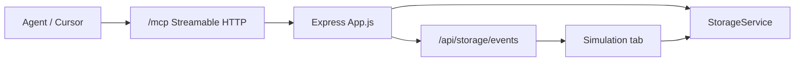

# Architecture and schemas

## Authority hierarchy

When docs and code disagree, prefer this order:

1. **Source constants / normalizers** — document `kind` / `version` in app modules
2. **`docs/`** — contributor guide ([docs/README.md](../../../docs/README.md))
3. **MCP tool descriptions** in `server/mcp/*.js` (often ahead for scenarios/experiments)
4. **Tests** under `tests/`
5. **README / install.sh** — onboarding only (may say **ev-sim**)

## Naming drift

| Name | Where | Treat as |
|------|-------|----------|
| **cev-sim** | `package.json`, MCP server, document kinds | Canonical |
| **ev-sim** | README, install.sh, GitHub | Clone/install alias |
| **sensor-fusion** | Local folder / some function names | Workspace path only |

MCP server id and plugin name: **`cev-sim`**. Do not configure aliases like
`user-ev-sim` in this skill.

## Document kinds (ground truth)

| Kind | Version constant | Source |
|------|------------------|--------|
| `cev-sim.visual-script.editor-document` | 1 | `app/scripting/EditorDocument.js` |
| `cev-sim.visual-script.program` | 2 | `app/scripting/runtime/Artifact.js` |
| `cev-sim.script-bindings` | 2 (legacy 1) | `app/scripting/bindings/BindingDocument.js` |
| `cev-sim.run-manifest` | 2 (legacy 1) | `app/simulation/RunManifest.js` |
| `cev-sim.run-bundle` | 1 | `app/simulation/RunManifest.js` |
| `cev-sim.scenario` | 1 | `app/scenarios/ScenarioDocument.js` |
| `cev-sim.scenario-catalog` | 1 | `app/scenarios/ScenarioDocument.js` |
| `cev-sim.route` | (schema field) | `app/scenarios/route/Route.js` |
| `cev-sim.vehicle` | 1 | `app/vehicles/VehicleManifest.js` |
| `cev-sim.vehicle-bundle` | 1 | `app/vehicles/VehicleManifest.js` |
| `cev-sim.experiment-suite` | 1 | `app/experiments/ExperimentSuite.js` |
| `cev-sim.experiment-result` | 1 | `app/experiments/ExperimentResult.js` |
| `cev-sim.experiment-baseline` | 1 | `app/experiments/BaselineComparison.js` |

Environment documents are authored via the editor model
(`app/3d/editor/document/EnvironmentDocument.js`) and stored as environment
JSON catalogs — prefer loading via storage/MCP rather than inventing shapes.

## Key entry points

| Layer | Path |
|-------|------|
| Browser root | `app/page.js` |
| Server / MCP mount | `server/App.js` → `/mcp` |
| MCP factory | `server/mcp/createMcpRouter.js` |
| Storage | `server/storage/StorageService.js` |
| Simulation loop | `app/simulation/SimulationEngine.js` |
| 3D scene | `app/3d/Scene.js` |
| Experiment bridge | `app/experiments/McpExperimentBridge.js` |
| Logging bridge | `app/logging/McpLoggingBridge.js` |

## Architecture sketch

## Known gaps (caution)

- `docs/README.md` project map under-lists Config, Scenarios, Experiments,
  Vehicle Editor, Replay, Analysis.
- Scenarios / Experiments lack dedicated user `docs/*.md` pages.
- Bake Python workflow is mostly code-only under `baking/`.
- IGVC mini scenarios may be documented but disabled in `Scene.js`.
- CI runs lint + `npm test`; Playwright (`test:ui`) is local-only.
- Duplicate IGVC rules: `rules.md` vs `docs/igvc/competition-rules.md`.

## Deep docs (link, do not copy)

- [docs/autonomy-platform-gap-analysis.md](../../../docs/autonomy-platform-gap-analysis.md) — full AV stack gaps, dataflow-first action plan (agent canonical)
- [docs/architecture.md](../../../docs/architecture.md)
- [docs/simulation.md](../../../docs/simulation.md)
- [docs/run-manifests.md](../../../docs/run-manifests.md)
- [docs/scripting/artifact-schema-v2.md](../../../docs/scripting/artifact-schema-v2.md)
- [docs/mcp.md](../../../docs/mcp.md)
- [docs/development.md](../../../docs/development.md)
